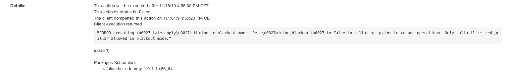

- Feature Name: CaaSP nodes operation locking
- Start Date: 2019-10-28
- RFC PR: TBD-change filename

# Summary
[summary]: #summary

This RFC describes the special handling that Salt _and_ Uyuni/SUSE Manager must implement to manage CaaS Platform nodes registered to Uyuni/SUSE Manager.

# Motivation
[motivation]: #motivation

<!-- - Why are we doing this?
- What use cases does it support?
- What is the expected outcome?

Describe the problem you are trying to solve, and its constraints, without coupling them too closely to the solution you have in mind. If this RFC is not accepted, the motivation can be used to develop alternative solutions. -->

Any node of a CaaS Platform cluster can be registered to Uyuni/SUSE Manager.
Registering a CaaS Platform node to Uyuni/SUSE Manager brings the following notable advantages:

- The user can see the patch level status of the CaaS Platform nodes (at the packages level, not at the container level)
- The user can perform configuration management operations using Salt from Uyuni/SUSE Manager
- The user can assign a different set of channels (with channel staging and/or CLM filters) to different clusters and manually control from Uyuni/SUSE Manager which version of CaaS Platform gets automatically installed in its CaaSP clusters.

As soon as the node is registered to Uyuni/SUSE Manager, the user can issue Salt commands or Uyuni/SUSE Manager actions. Some of those operations may render the cluster temporarily or permanently unusable.

This RFC will describe a way to protect the user from issuing those operations while still guaranteeing the benefits described above.

# Detailed design
[design]: #detailed-design

<!-- This is the bulk of the RFC. Explain the design in enough detail for somebody familiar with the product to understand, and for somebody familiar with the internals to implement.

This section should cover architecture aspects and the rationale behind disruptive technical decisions (when applicable), as well as corner-cases and warnings. Whenever the new feature creates new user interactions, this section should include examples of how the feature will be used. -->

## Terminology

In this RFC, we will use:

* CaaS Platform node: any node that comprises the cluster, either a control plane node or a worker node
* Bootstrap/registration in the Uyuni/SUSE Manager context: registering a node to Uyuni/SUSE Manager via [the documented methods<sup>1</sup>](https://opensource.suse.com/doc-susemanager/suse-manager/client-configuration/registration-overview.html)
* Operation: refers to any Salt command issued on a minion or any action issued on a system by Uyuni/SUSE Manager.

## Assumptions

We assume that:
* The user has already created an activation key and associated it with the onboarding. The activation key is needed to let CaaS Platform nodes consume the repositories managed by Uyuni/SUSE Manager. A nice side effect is that `skuba-update` will automatically patch the cluster with the latest patches available.
* The user is registering the CaaS Platform nodes as Salt clients. The registration of every CaaS Platform node to Uyuni/SUSE Manager is already completed by the user using the aforementioned methods

## Technical description of the problem

This section will describe the forbidden operations (Salt commands and Uyuni/SUSE Manager actions) that need special care when issued targeting a CaaS Platform node registered to Uyuni/SUSE Manager.

### The forbidden list

#### Patch operation

[`skuba-update`](https://documentation.suse.com/suse-caasp/4/single-html/caasp-admin/#_base_os_updates) is a `systemd` timer that is running locally on each CaaSP cluster node. Its objective is to _automatically_ [patch and notify to `kured` that a system is requiring a reboot](https://github.com/SUSE/skuba/blob/master/skuba-update/skuba_update/skuba_update.py#L301-L305).
It relies on the patches that are in the system repositories, provided by Uyuni/SUSE Manager after the registration.

Salt _and_ Uyuni/SUSE Manager does not need to interact with patching in any way. Otherwise, a patched node requiring reboot will not be rebooted and will not be shown in `kubectl get nodes` result.
To avoid the case where a user manually triggers the installation of a patch:

* Salt must not `pkg.install` a patch against a CaaS Platform node registered to Uyuni/SUSE Manager (if the patch is marked as interactive)
* Uyuni/SUSE Manager must not schedule the following actions related to patching and rebooting against a registered CaaS Platform node:

    * Apply a patch (if the patch is marked as interactive)
    * Mark a system to automatically install patches
    * Perform an SP migration

#### Reboot operation

Rebooting a system must be issued by dealing with the [`kured`](https://documentation.suse.com/suse-caasp/4/single-html/caasp-admin/#_base_os_updates) daemon. Otherwise, a temporary breakage in the deployed workloads will be experienced.

To avoid the case where a user manually triggers a reboot:

* Salt must not `system.reboot` a CaaS Platform node registered to Uyuni/SUSE Manager
* Uyuni/SUSE Manager must not schedule the following actions related to rebooting against a registered CaaS Platform node:

    * Reboot a node
    * Issue any power management action via Cobbler

#### Forbidden packages related operations

All CaaS Platform nodes satisfy the `patterns-caasp-Node-x.y`<sup>2</sup> pattern. At the time of writing, the pattern is satisfied with the following packages:

- `caasp-config`
- `cri-o`
- `kubernetes-client`
- `kubernetes-kubeadm`
- `kubernetes-kubelet`
- `patterns-base-basesystem`
- `skuba-update`
- `supportutils-plugin-suse-caasp`

The pattern must not be broken **by Salt commands _or_ Uyuni/SUSE Manager actions** that are related to the following operations:

* Installing a package if it breaks or conflicts the `patterns-caasp-Node-x.y`
* Removing a package if it breaks or conflicts or is one of the packages related with the `patterns-caasp-Node-x.y`
* Upgrading a package if it breaks or conflicts or is one of the packages related with the `patterns-caasp-Node-x.y`

A package that is not included in the pattern but needs special case is `kernel`: an install or upgrade or patch requires a reboot. Each of the previous operations on a `kernel` package will result in the same problem described in the previous section. For this reason, `kernel` must be considered a forbidden package as well.

## Description of the current implementation

In the past section, we have defined forbidden list of items.
Let's illustrate how the current implementation works related to the forbidden list. We will illustrate Salt first and Uyuni/SUSE Manager later.

### Salt

The following sections will describe how plain Salt handles the forbidden list operations and the countermeasures to avoid breaking a CaaS Platform node.

#### Patch operation

A patch operation is issued with `pkg.install`.

#### Reboot operation

A reboot operation is issued by using `system.reboot`.

#### Forbidden packages related operations

All packages related operation are available via `pkg.install`, `pkg.upgrade`, and `pkg.remove`.

### Uyuni/SUSE Manager

Let's describe how Uyuni/SUSE Manager implements each of the items in the forbidden list at the time of writing and possible ways to avoid issuing a forbidden action.

#### Patch operation

##### Apply a patch (if the patch is marked as interactive)

A patch apply is scheduled using Salt `state.apply` with the [patch install state](https://github.com/uyuni-project/uyuni/blob/master/susemanager-utils/susemanager-sls/salt/packages/patchinstall.sls).

##### Mark a system to automatically install patches

Automatic patch installation is implemented at the Uyuni/SUSE Manager level by automatically apply a patch whenever it is available. This action is equivalent to the previous one.

##### Perform an SP migration

An SP migration is scheduled using Salt `state.apply` with the [distupgrade state](https://github.com/uyuni-project/uyuni/blob/master/susemanager-utils/susemanager-sls/salt/distupgrade/init.sls).

#### Reboot operation

##### Reboot a node

A reboot action is scheduled using Salt `system.reboot`.

##### Issue any power management action via Cobbler

All the power management actions are scheduled via [Cobbler commands](https://cobbler.github.io/manuals/2.8.0/3/1/3_-_Systems.html)

#### Forbidden packages related operations

##### Package install and upgrade

A package install and upgrade is scheduled using Salt `state.apply` with the [pkginstall state](https://github.com/uyuni-project/uyuni/blob/master/susemanager-utils/susemanager-sls/salt/packages/pkginstall.sls).

As a special case when issuing a package upgrade, a package installation from API is scheduled using Salt `state.apply` with the [pkginstall state](https://github.com/uyuni-project/uyuni/blob/master/susemanager-utils/susemanager-sls/salt/packages/pkginstall.sls).
While it is not possible to install a non-installed package on the target system from the UI, is it possible to upgrade an already installed package by requesting an installation of it from the API. Example:
```
ec2-user@ip-172-31-8-0:~> rpm -qa | grep -i bzip2
bzip2-1.0.6-29.2.x86_64

spacecmd {SSM:0}> system_installpackage 172.31.8.0 bzip2
172.31.8.0:
bzip2-1.0.6-30.8.1.x86_64

Start Time: 20191108T11:05:04

Install these packages [y/N]:
```

##### Package removal

A package removal is scheduled using Salt `state.apply` with the [pkgremove state](https://github.com/uyuni-project/uyuni/blob/master/susemanager-utils/susemanager-sls/salt/packages/pkgremove.sls).

## Design

We will illustrate a way to avoid the forbidden list at a Salt level _and_ the Uyuni/SUSE Manager level.

### Documentation

The forbidden list described in this RFC will be part of the [Uyuni/SUSE Manager documentation](https://github.com/SUSE/doc-susemanager/pull/882/files).

### Identify a CaaS Platform node

A CaaS Platform node will be identified upon registration. During this process:

1. The node will return the package list to Uyuni/SUSE Manager
2. Uyuni/SUSE Manager checks if the `patterns-caasp-Node-.*`<sup>2</sup> pattern is installed

A pillar is generated to store, internally to Uyuni/SUSE Manager, that the minion is a CaaS Platform node.

### Operation locking

It is clear that we need to find a way to lock the system at the Salt level _and_ the Uyuni/SUSE Manager level.
Salt is at the base of the operational stack: a locking mechanism will be implemented first at this level.

### Step 1: operations blocking at Salt level

By default, every node that is a CaaS Platform node is not allowed to perform Salt commands.
This is achieved by issuing a [minion blackout](https://docs.saltstack.com/en/latest/topics/blackout/) upon registration to Uyuni/SUSE Manager.

Blackout works by blocking every command targeting the minion, except for a whitelist of functions allowed during the blackout. To enable or disable a blackout, a `saltutil.refresh_pillar` has to be issued on the minion.

The allowed list of Salt commands should at least contain `test.ping` and `test.echo`, but must not contain `state.apply`. Why? Whitelisting `state.apply` for getting the package list needed for checking the patch level also allows the forbidden actions described above that make use of `state.apply`.

This means that a CaaS Platform node will not be able to:

- Check and display the patch level of the CaaS Platform node
- Apply Salt states
- Issue any other Salt operation that is not in the forbidden list

until the blackout is disabled.

If the user issues a Salt command during blackout, Salt will output the following error:

```
ERROR executing \u0027state.apply\u0027: Minion in blackout mode. Set \u0027minion_blackout\u0027 to False in pillar or grains to resume operations. Only saltutil.refresh_pillar allowed in blackout mode."
```

At the Uyuni/SUSE Manager level, the action will still be scheduled but it will fail when picked up by salt, showing the failed action in the action log:

.

#### Disable minion blackout

A Salt formula that disables the blackout (changes the pillar and issues a pillar refresh) will be provided as part of the solution.
This formula can be used when the user needs to issue any Salt command or Uyuni/SUSE Manager action and when troubleshooting as well.

The workflow for the user that needs to issue any action on the CaaS Platform node from Uyuni/SUSE Manager is then modified to:

1. Temporarily disable minion blackout from Uyuni/SUSE Manager using a Salt formula
2. Execute the action on the CaaS Platform node via plain Salt or Uyuni/SUSE Manager
3. Enable minion blackout via Salt formula

The risk of breaking the cluster by issuing any forbidden operation is still present while the blackout is disabled.

### Step 2: selective blackout

The idea is that the minion will always be in blackout mode but [minion blackout will be modified to allow a list of arguments for the functions](https://github.com/saltstack/salt/blob/c157cb752a6843e58826588110bcd3c67ef8bc86/salt/minion.py#L1625-L1638). In our specific case, Salt blackout will have the granularity of allowing certain arguments for functions:

```
minion_blackout_whitelist:
- state.apply:
  - packages.profileupdate
  - channels.disablelocalrepos
  - channels
  - hardware.profileupdate
  - ...
- test.ping
- pillar.get
- mgractionchains.resume
 ```

In this way, we can allow certain Salt states specific to Uyuni/SUSE Manager actions that are not in the forbidden list and exclude the forbidden list operations.
This solution does not offer the possibility to specify an allowed set of packages to allow the operations.

From a Salt point of view, the solution will still be blocking `pkg.*` related commands.
From the Uyuni/SUSE Manager point of view, allowing certain states enables to:

- Check and display the patch level of the CaaS Platform node
- Apply Salt states
- Issue any other Salt operation that is not in the forbidden list

The patch can be upstreamed to Salt.

The workflow for the user is then unchanged from the "usual" operation (before this RFC): issue any action (that is not forbidden) on the CaaS Platform node. The Salt formula to disable the blackout can only be used for troubleshooting.

If a user schedules a forbidden action (not allowed on the `minion_blackout_whitelist`) the error message will be the same as the one described in the previous section.

## Future work

### Reboot action

When scheduling a system reboot action from Uyuni/SUSE Manager, if the targeted minion is a CaaS Platform node, the action should be changed.
We can make use of `kured` by simply changing the action to just `touch /var/run/reboot-required`.

The related action are in `ActionChainManager#scheduleRebootAction`, `ActionChainManager#scheduleRebootActions`, and the XMLRPC action `SystemHandler#scheduleReboot`.

### Package locking at `zypper` level

Package locking of the forbidden packages is not an option: in that case, `skuba-update` is not able to patch the forbidden packages.

While still maintaining minions in the blackout, the idea is to coordinate with the CaaS Platform team and:

1. Package lock at the `zypper` level all the forbidden packages upon registration of a CaaS Platform node to Uyuni/SUSE Manager
2. Modify `skuba-update` to release the package locks
3. Unchanged `skuba-update` business
4. `skuba-update` restores the package locks that were removed

In this way, all forbidden packages operations can be allowed at the Salt level _and_ the Uyuni/SUSE Manager level: every operation that deals with the forbidden package will fail.

There has been a discussion with the CaaS Platform team and the package locks were ultimately rejected during CaaS Platform design because package locks should be owned by the user, not by the system.

# Drawbacks
[drawbacks]: #drawbacks

<!-- Why should we **not** do this?

  * obscure corner cases
  * will it impact performance?
  * what other parts of the product will be affected?
  * will the solution be hard to maintain in the future? -->

The user can still break its cluster in any way - but with this RFC we are at least offering a way to protect the user and the cluster.
No messages will be displayed in the UI of Uyuni/SUSE Manager until the final fail of the forbidden action scheduled.

# Alternatives
[alternatives]: #alternatives

<!-- - What other designs/options have been considered?
- What is the impact of not doing this? -->

### Disallow forbidden actions at both levels

As an alternative to "Package locking at `zypper` level", we can consider adding another level of granularity: filter operations depending on the packages involved (e.g. forbid install of a package when the package is `kubernetes-kubeadm`).
The idea is that:

* At the Salt level: when the user tries to issue a command (e.g. `pkg.upgrade`) involving a forbidden package, the command will fail.
* At the Uyuni/SUSE Manager level, every [package-related operation](https://github.com/uyuni-project/uyuni/blob/master/susemanager-utils/susemanager-sls/salt/packages/) (eventually issued with a `state.apply`) will be checking if the operation involves a forbidden package. In that case, the action will not be scheduled.

To gather the list of forbidden packages, Salt and Uyuni/SUSE Manager must query the `zypper` dependencies of the `patterns-caasp-Node-x.y` at every package-related operation.

Compared to "Package locking at `zypper` level", this solution requires implementation at two different levels and hence considered less favorable.

### Forbid the actions at the Uyuni/SUSE Manager level

As an alternative to selective minion blackout, the idea is that Uyuni/SUSE Manager must not offer the possibility to schedule the forbidden actions in the UI and the API when targeting a CaaS Platform node. As a not complete list:

- Patch apply:
  - Must be hidden from the UI and the corresponding action must not be scheduled: `/systems/details/ErrataList.do`, `/systems/ssm/ListErrata`, `ErrataManager#applyErrata`
  - The corresponding action must fail if scheduled via XMLRPC: [`SystemHandler#scheduleApplyErrata`]
- Mark a system to automatically install patches:
  - The checkbox for "Automatic application of relevant patches" must be hidden in the system details (`systems/details/Edit.do`, `/systems/ssm/misc`) and the corresponding property must not be set
  - The API call to enable auto-updates must fail (`SystemHandler#setDetails`)
- Issue any power management action via Cobbler:
  - The "Power Management" page must be hidden (`/systems/details/kickstart/PowerManagement.do`, `/systems/ssm/provisioning/PowerManagementOperations`)) and the corresponding action must not be scheduled
  - Cobbler must fail when scheduling a power management action [to achieve this result, the IPMI module can be disabled at the Uyuni/SUSE Manager level upon bootstrap of CaaS Platform nodes]
- Perform an SP migration:
  - The SP migration page must be hidden (`/systems/details/SPMigration.do`) and the corresponding action must not be scheduled
- Package upgrade:
  - Must be hidden from the UI and the corresponding action must not be scheduled: code paths `/systems/details/packages/UpgradableList`, `systems/ssm/PackageUpgrade`, `ActionChainManager#schedulePackageUpgrade`, `ActionChainManager#schedulePackageUpgrades`
  - The corresponding action must fail if scheduled via XMLRPC: [`SystemHandler#schedulePackageInstall`]
- Package removal:
  - Must be hidden from the UI and the corresponding action must not be scheduled: `/systems/details/packages/RemoveConfirm`, `/systems/ssm/PackageRemove`, `ActionChainManager#schedulePackageRemoval`, `ActionChainManager#schedulePackageRemoval`
  - The corresponding action must fail if scheduled via XMLRPC: `SystemHandler#schedulePackageRemove`

The change described brings notable advantages:

* Usability: forbidden action cannot be issued from the UI, compared to the previous iteration where those actions were scheduled and subsequently fail
* Performance: the forbidden actions will not be scheduled and picked up by Salt to fail as in the previous iteration, but rather will not be scheduled and not pollute the Salt bus with useless information

However, the solution is considered very invasive and, compared to minion blackout, less simple to implement and straightforward. Additionally, for every new forbidden action, a development must be introduced (compared to just selective allow the action). Additionally, this solution only covers Uyuni/SUSE Manager and not plain Salt. For these reasons, selective blackout was preferred.

## UI warnings

As an alternative to minion blackout, Uyuni/SUSE Manager can just display warning messages in the UI before issuing the forbidden actions.

The action will still be completed (if the user completes the workflow), even if it is going to break the cluster.

This approach has two notable disadvantages:

- The warnings cannot be issued in the Uyuni/SUSE Manager API
- The UI will not be shown when issuing plain Salt commands

UI warnings do not guarantee a streamlined user experience, as different warnings are depending on the access method used to perform those operations. For these reasons, minion blackout was preferred.

## CaaS Platform module in Salt

As an alternative to selective blackout, Uyuni/SUSE Manage should use a different function name to invoke package actions on a CaaS Platform node rather than relying on `state.apply`.
In fact, as the Salt whitelisting algorithm filters by the function name, the white list would be:

- `test.ping`
- `caasp.info_installed`: returns the installed packages on the node
- other functions that Uyuni/SUSE Manager needs to achieve all other actions

All other functions are in blackout mode.

This solution needs:
- Modifications in Uyuni/SUSE Manager [SaltServerActionService](https://github.com/uyuni-project/uyuni/blob/master/java/code/src/com/suse/manager/webui/services/SaltServerActionService.java): if the targeted minion is a CaaS Platform node, switch the corresponding Salt command to use the `caasp.*` Salt module
- Implementation (and upstream) of a Salt module that lives under the `caasp.*` namespace

Selective blackout is considered easier to implement and does not constitute a DRY anti-pattern: the `caasp.*` module will just contain a copy of package handling functions from other Salt modules. For this reason, selective blackout was preferred.

## Salt modules whitelisting

[Module whitelisting](https://docs.saltstack.com/en/latest/ref/configuration/minion.html#whitelist-modules) is an alternative to minion blackout. It works by blocking all the Salt modules except the ones whitelisted. It can be useful to globally allow a module, e.g. `modules.state`.
Compared to minion blackout, it has a disadvantage of requiring a `salt-minion` restart when the configuration changes. For this reason, minion blackout was preferred.

## Minion blackout restore

As an alternative to minion blackout manual restore, an automatic way of restoring the minion blackout was considered as:

- As a hook after every operation issued by the user
- In a timely fashion (e.g. after 10 minutes)

As these options are automatic and might interrupt the workflow of the user, we decided to stick with the manual and explicit way to restore a blackout.

# Limitations

The following items are considered outside of the scope of this RFC:

* Educate the final user in dealing with a CaaS Platform cluster
* The patch level of the workloads is called "[container staging](https://confluence.suse.com/display/~dmacvicar/Container+Staging+Breakout)"
* The user can craft a Salt state that executes one of the forbidden operations and break the cluster
* Automatic registration for CaaS Platform nodes: at the time of writing, registering a CaaS Platform node to Uyuni/SUSE Manager has to be manually performed by the user.
* When selective blackout is implemented, a user can upgrade any forbidden package by calling `state.apply packages.pkginstall`. But `packages.pkginstall` is a Uyuni/SUSE Manager internal state file and it should not be used by users.
* A CaaS Platform node running kGraft (kernel patches gets installed without a reboot).
* There are potential other operations that can be issued: in this RFC we are targeting the most obvious operations to forbid.

# Unresolved questions
[unresolved]: #unresolved-questions

- Docker/Kiwi build hosts: is it not tested by CaaS Platform QA to have Docker or Kiwi installed on a CaaS Platform node. It is a non-desirable situation. For the time being, let's consider it as a forbidden operation.
- All the described locks are available if the registered system is a CaaS Platform node: what happens for plain Kubernetes cluster nodes that do not have the `patterns-caasp-Node` pattern installed?

<hr />

<sup>1</sup> As a not complete list:
* Bootstrap script
* UI: Systems > Bootstrapping
* `bootstrap` XMLRPC call
* Not usual but still possible and hackier: mass bootstrap via salt-ssh and a user-generated roster file

<sup>2</sup> The pattern is a moving target: `patterns-caasp-Node-x.y` -> `patterns-caasp-Node-x.y-x.(y+1)` -> `patterns-caasp-Node-x.y+1`. The dependency mechanism implemented by the `patterns-caasp-Node-x.y` package:

* Allows patch release updates
* Prevents major version updates
* Prevents minor version updates

### Appendix: current implementation and possible countermeasures

In reference to "Description of the current implementation", are there any possible countermeasures we can use to avoid incurring in the forbidden list either via plain Salt or via Uyuni/SUSE Manager?

In this section we are going to illustrate that is not possible to apply any countermeasures using the current implementation, neither in plain nor in Uyuni/SUSE Manager.

#### Salt

##### Patch operation

Salt does not offer the granularity to restrict `pkg.install` against a known set of packages or patch, nor offers the possibility of checking if a patch is marked as interactive.

##### Reboot operation

Salt cannot deny the execution of `system.*` commands.

##### Forbidden packages related operations

Salt does not offer the granularity to restrict `pkg.install`, `pkg.upgrade`, `pkg.remove` against a known set of packages.

#### Uyuni/SUSE Manager

##### Patch operation

###### Apply a patch (if the patch is marked as interactive)

There is no way to check if a patch is marked as interactive nor restrict the execution of the state based on a set of known packages in the current implementation.

###### Perform an SP migration

There is no way to restrict the scheduling of this action based on the target system in the current implementation.

##### Reboot a node

There is no way to restrict the scheduling of this action based on the target system in the current implementation.

###### Issue any power management action via Cobbler

There is no way to restrict the scheduling of this action based on the target system in the current implementation.

##### Package install and upgrade

There is no way to restrict the scheduling of this action against a known set of packages or checking if a pattern will break after the action in the current implementation.

##### Package removal

There is no way to restrict the scheduling of this action against a known set of packages or checking if a pattern will break after the action in the current implementation.
