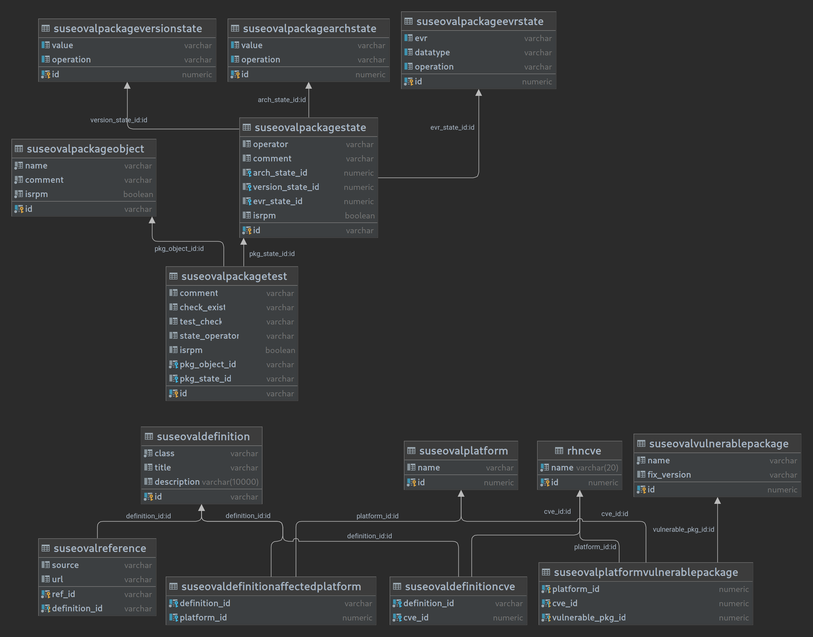

- Feature Name: CVE Auditing with OVAL
- Start Date: 2023-06-10

# Summary

Use OVAL data in addition to channels to conduct more accurate CVE audits.

# Motivation

Uyuni's current CVE auditing algorithm solely depends on channels data, which can lead to false system evaluations. To
illustrate this, consider the scenario where you audit a system that has a vulnerability that hasn't been patched yet.
In such cases, Uyuni would provide an incorrect assessment, indicating that the system is 'Not affected' or 'Patched',
despite it being vulnerable to the unpatched vulnerability.

The incorrect evaluation is due to the absence of vulnerability data. Channels only offer patch data for packages that
have been patched. The algorithm verifies the installed packages on the system based on this information. This puts us
at risk of receiving a false system evaluation if a package does not have a patch yet.

# Detailed design

## OVAL Data Storage and Processing

The diagram below shows the oval module, its components and where it would be placed in Uyuni's architecture. In the
following sections I will explain in more details the responsibility of each component, in addition, to the integration
points with Uyuni.


### OVAL Parser

The oval parser is responsible mainly for the translation of oval files from XML to a more usable POJO representation.
We can extend the parser responsibility to catch and report errors, but since the oval files come from trusted sources,
it won't be necessary.

As OVAL files are structured in XML, we don't need to write the parser from scratch and can use an existing XML parsing
library. The decision of choosing the XML parsing library is being tracked
in https://github.com/uyuni-project/uyuni/issues/7108.

Given that Java is a statically typed language, oval types need to be defined before they can be used. While this adds
some overhead when getting started with implementation, because the oval standard defines an enormous number of types,
we can use a XML-to-POJO generator tool that generates Java classes from XML schemas .e.g **xjc**. The quality of the
generated code might not be of the quality that we want but it should provide a good starting point from which we can
continue and improve.

It's crucial to state that the OVAL files we aim to consume don't make use of all features in the OVAL specification. As
such, the parser's role is confined to supporting the subset of features employed within those files. Nevertheless, the
unsupported features should be documented to prevent confusion.


#### OVAL Extensions Support

The primary objective of the OVAL parser is to parse openSUSE and other Linux-based distributions OVAL files. This
requires that we add support to the Linux OVAL extension. We can take it a step further and offer an abstraction that
can be used to implement other extensions. This should, for example, facilitate the integration with Android[^5] and
Windows[^6] clients when they become supported in Uyuni.

#### Security Guarantees

There is a vast array of potential attacks that can be triggered when processing XML files from untrusted sources, such
as XEE (XML External Entity) attacks, XML Bombs, and XSS/CDATA Injection. Fortunately, the XML data we need is sourced
exclusively from official distribution providers. For instance, we can get Debian OVAL data from the
trusted https://www.debian.org/security/oval/.

Moreover, it's worth noting that all the servers we rely on for OVAL data consumption should run on HTTPS. This crucial
security measure effectively prevent a range of attacks, including Man-in-the-Middle attacks, which could otherwise
enable threat actors to intercept unsecured HTTP requests and inject their own malicious content.

While we can guarantee the security of the OVAL sources that come pre-configured, we also understand that users might
want to tinker with these settings. This flexibility is particularly important if OVAL providers ever change their URLs.
Additionally, it allows users to host OVAL data on a proxy server that aligns with their specific security measures.
However, if users do decide to reconfigure the OVAL sources, the onus is on them to ensure the security of the servers
they rely on.

### OVAL Downloader

The OVAL Downloader is responsible for finding OVAL documents online, downloading them, and caching them for easy
access. However, since the relevant OVAL data is saved in PostgreSQL, it is possible for the downloader to skip caching
the OVAL files or remove them once they are stored in the database. This approach would reduce the amount of storage
needed.

Each of the supported distributions host an online server that has all the OVAL data they produce organized in XML
files; it's called an OVAL repository. To guarantee the integrity and consistency of the data, we need to depend on the
OVAL provided by the official maintainer of the distribution.

Certain OVAL repositories offer both compressed and uncompressed versions of the OVAL data. To speed up things, it is
better to download the compressed version decompress it on the local server.

For better flexibility, the OVAL sources should be configurable, enabling users to incorporate their own URLs or
sources. For example, instead of downloading OVAL data of SUSE from the official provider
at: https://ftp.suse.com/pub/projects/security/oval, users could host their own server that acts as a proxy between the
official repository and their Uyuni server. Configurations will be deployed on the Uyuni server in a user-friendly
format to allow users to edit it.

#### OVAL Synchronization

Maintaining up-to-date OVAL data is essential for accurate CVE audits, that's why we need to periodically synchronize
them. Depending on how many distinct operating systems users' systems use and the size of OVAL files, synchronization
could take some time. Running the synchronization **once a day** seems like a good default since we can't predict the
scale users will operate on.

In the best case, all of the systems will be using the same operating system .e.g. openSUSE Leap 15.4, in that case
synchronization will take only a few seconds. And in the worst case, systems' will be using 22 different operating
systems and thus synchronization could take up to ~30 minutes.

Needless to say we won't be synchronizing OVALs for all supported operating systems; we only need to synchronize the
operating systems used by registered clients.

In certain scenarios, syncing OVALs may be redundant if the OVAL didn't change since last sync. Some OVAL repositories
include a manifest file containing hashes of all OVAL files. By comparing these hashes with the synced OVAL hashes,
synchronization can be selectively performed only when hashes are different. In cases where a manifest file is absent,
we can scarp the HTML of the OVAL repository server and look for any clues to decide whether we need to resync or not.

### OVAL DAO

The OVAL DAO provides a unified interface of all the operations that can be applied on the OVAL data. It is the only way
to query or modify the OVAL data from the database.

As a starter, the DAO will provide the following methods:

```java
public class OVALCachingFactory extends HibernateFactory {
    public static void savePlatformsVulnerablePackages(OvalRootType rootType) {
    }

    public static List<VulnerablePackage> getVulnerablePackagesByProductAndCve(String productCpe, String cve) {
    }

    public static boolean checkOVALAvailability(String cpe) {
    }
}
```

### Database Storage of OVAL

Once the OVAL file is parsed, the next step is to store it in a database. A relational database, such as PostgreSQL,
seems like an obvious choice given that it is the default database used by Uyuni.

#### Database Schema

The database employs a straightforward schema consisting of three new tables. Notably, there is no need to create a CVE
table, as we will use the existing `rhnCVE` table integrated into Uyuni. Here's the purpose of each of these tables:

1. **suseOVALVulnerablePackage**: This table represents a single vulnerable package along with its corresponding fix
   version. For a system to be considered safe, any installed vulnerable package must have a version equal to or higher
   than the `fix_version`.
2. **suseOVALPlatform**: A CVE can impact different sets of vulnerable packages depending on the operating system or
   platform. This table is used to store the `cpe` for vulnerable operating systems or platforms to prevent redundant
   data.
3. **suseOVALPlatformVulnerablePackage**: This table acts as the glue that connects all the tables within the schema.
   With this table, we can take any CVE provided by the user, retrieve the 'cpe' of the system to scan, and obtain a
   list of vulnerable packages associated with that CVE. Then, we can accurately evaluate the vulnerability status of
   systems by comparing the versions of installed packages against the list of vulnerable packages.

It's worth noting that the diagram does not explicitly depict the addition of a `cpe` column to the `rhnServer` table.
This modification is necessary to enable the matching of vulnerable platforms from the `suseOVALPlatform` table
against actual systems.

Uyuni already contains tables to store package names and EVRs, they're called respectively `rhnPackageName`
and `rhnPackageEVR`. One possible optimization would be to create foreign keys for `name` and `fix_version`
inside `suseOVALVulnerablePacakge` instead of hard coding their values. While the optimization results in
a reduced redundancy and increased storage efficiency, it does introduce potential performance implications.
An experiment should be made to decide whether the optimization is worth it or not.



## System CVE Analysis

### New CVE Auditing Algorithm

An obvious approach to overcome the false negatives in Uyuni's current CVE auditing algorithm is by leveraging
vulnerability and patch OVAL definitions of the distributions, but as it turns out only openSUSE and Red Hat provide
both vulnerability and patch OVAL definitions, thus, an alternative approach is required. The alternative algorithm uses
a combination of **OVAL vulnerability definitions + channels**. With the OVAL vulnerability definitions, we can
accurately assest whether a system is affected or not by a certain vulnerability. And with channels, we can further
determine the availability of a patch for the system.

In Uyuni an audit operation yields an object of type PatchStatus. The PatchStatus type is an enum with four different
values:

- AFFECTED_PATCH_INAPPLICABLE — *Affected, patch available in unassigned channel*
- AFFECTED_PATCH_APPLICABLE — *Affected, patch available in assigned channel*
- NOT_AFFECTED — *Not Affected*
- PATCHED — *Patched*
- AFFECTED_PATCH_INAPPLICABLE_SUCCESSOR_PRODUCT — *Affected, patch available in a Product Migration target*

With OVAL, It is possible to determine 3 additional patch status, while the rest the same:
- AFFECTED_PATCH_UNAVAILABLE — *Affected, patches are not released for the CVE.*
- AFFECTED_PATCH_UNAVAILABLE_IN_UYUNI — *Affected, patches were released for the CVE but we can't find them in any of the relevant channels.*
- AFFECTED_PARTIAL_PATCH_APPLICABLE — *Affected, only partial patches are available for the CVE*

> [!NOTE]  
> While `AFFECTED_FULL_PATCH_APPLICABLE` would be more accurate than `AFFECTED_PATCH_APPLICABLE`, retaining the existing
> name
> preserves backward compatibility for users who may have scripts reliant this patch status

The structural differences between OVAL provided by different distributions is significant. These are some of the
differences that distinguish the OVAL of one Linux distribution from the others:

- Debian's definitions describe one package at the time. If a CVE affects multiple packages then it's described by
  multiple definitions.
- RedHat uses vulnerability definitions to describe unpatched packages and patch definitions to describe patched
  packages.
- SUSE enterprise OVAL describes multiple products per OVAL file.

To overcome these differences, we need to decouple ourselves from these structural differences, and convert the OVAL to
a uniformed data structure as soon as possible from which we can base the CVE auditing algorithm on.

The algorithm will operate on vulnerable packages extracted from OVAL definitions. The extraction operation will be
performed as soon as the OVAL is parsed and then the result will be written to the database. Then when auditing, the
algorithm will execute an SQL query that will evaluates when systems have a vulnerable package and whether the package
have the patched version. If the system is vulnerable then It will also try to find a patch in channels.

This means identifying the packages that exposed the product to the CVE. If none of the vulnerable packages is present
on the system then the system is not affected, and if one of the packages is present then it needs to have a version
equal or above the fix version for the system to be considered patched. If the system has a package with a version below
the fix version then the whole system is considered affected.

#### Extraction of Vulnerable Packages

The uniformed data structure I propose is called `ProductVulnerablePackages`. An extraction process yields a list
of `ProductVulnerablePackages`. The data structure could be modeled as a simple class that consists of these fields:

- `productCpe` -- This field describe an affected product/operating system
- `cve` -- This one describes the CVE to which the product is affected.
- `List<VulnerablePackage>` -- These are the list of packages that made `productCpe` vulnerable to the `cve`.

The structural differences will be encapsulated in the vulnerable package extractors. Multiple implementations of the
extractor will be created for each of the OVAL sources.

The extraction operation could yield a lot of objects to be inserted in the database thus it's really critical to
optimize for performance. Using plain SQL, stored procedures and batch processing techniques yielded good enough
results (~12 seconds for a ~60 MB OVAL file). Knowing that OVAL syncing would run once a day, the performance seems
acceptable.

### Integration with Uyuni

Due to the lack of OVAL vulnerability definitions for certain Linux distributions supported by Uyuni, we are currently
unable to rely solely on the new code. Consequently, when we receive an audit request for a system that doesn't have
OVAL data in the database, we have to fallback to using the old code. This also means that we cannot get rid of the old
CVE auditing code

During the audit process, the backend generates a list of `CVEAuditServer` objects. Each `CVEAuditServer` object
contains information about the system being audited, including its patch status. Additionally, it could provide details
about any potential patches that can be applied to protect the system.

In order to facilitate the migration process and eliminate the dependence on the channels-based algorithm, which is now
considered legacy, we need to decouple it from the rest of the codebase. This will ensure easier migration when other
distributions start producing vulnerability OVAL definitions. To accomplish this, we can follow these steps:

1. Replace all calls to `CVEAuditManager` with `CVEAuditManagerOVAL`.
2. Modify the `CVEAuditManagerOVAL#listSystemsByPatchStatus` method to fallback
   to `CVEAuditManager#listSystemsByPatchStatus` when OVAL auditing is not possible for a system (due to OVAL not being
   synced or not supported by the system's OS).
3. In the future, when all distributions are supported for OVAL-based CVE auditing, we can safely
   remove `CVEAuditManager` and its corresponding test class.

It's worth noting that `CVEAuditManager` also includes methods for managing the CVE channels .i.e. channels that will
scanned for patches. For now, we can create equivalent methods in `CVEAuditManagerOVAL` and redirect them to their
counterparts in `CVEAuditManager`. However, in the future, when `CVEAuditManager` is no longer needed, we can either
move these methods entirely to `CVEAuditManagerOVAL` or create a separate class for them.


#### Image Auditing

Image auditing is quite similar to system auditing

#### Patch Status Computation

### Performance Metrics

The following metrics are based on the current implementation. They serve to identify potential bottlenecks and area for
optimization. They will be continuously updated alongside implementation.

#### The Writing of OVAL data to Database

The writing of the OVAL data extracted from a ~320 MB OVAL file (one of the largest ones to parse) took around 6
minutes.

#### Performing CVE Audits

The operation of auditing 3 systems against a single CVE finishes usually in ~0.5 second. One are of optimization is to
optimize how we retrieve patch information. Currently, in order to obtain relevant patch information, we execute
the `cve_audit_queries#list_systems_by_patch_status` query. However, this query retrieves a significant amount of
irrelevant data. To address this issue, we can develop an additional query that specifically retrieves the data we are
interested in.

## API Access

# Drawbacks

# Alternatives

# Unresolved questions

### How to assign a CPE to an Image (Kiwi and Docker) automatically?

> [!NOTE]  
> We could try to derive CPEs from assigned channels

### How to distinguish QA from released patches in non-openSUSE distributions?

> [!IMPORTANT]  
> The issue remains unresolved, though it's considered a low-priority.

In the Open SUSE OVAL files, patches in QA have `(in QA)` at the end of their title, while released patches don't. This
pattern doesn't occur in the other distributions OVAL files As far as I know, it is impossible to distinguish QA from
Released for Linux distributions other than Open SUSE.

### Can we depend on OVALRepo to provide us with OVAL definitions?

> [!NOTE]  
> To ensure the integrity and currency of the data we rely on, we have chosen to exclusively depend on data provided by
> the distribution maintainers. While we can guarantee the integrity of data sourced from OVALRepo, as it is supplied by
> CISecurity, we cannot guarantee its currency. At the time of writing, the last time OVALRepo was updated was 5 months
> ago. This implies that, at best, we would be conducting CVE auditing based on data that is 5 months old, which in
> security terms not acceptable.

openSUSE[^12] and Red Hat[^11] are the only distributions that provide both vulnerability and patch OVAL definitions in
their official website. The other distributions they either provide one of the definitions or neither. The official OVAL
repository "OVALRepo"[^10] was created to collect OVAL definitions contributed by the community. This repository
provides vulnerability and patch definitions for Ubuntu, CentOS, Red hat, Oracle Linux and Debian. However, since the
definitions are contributed by the community and not a product of an automatic pipeline, it's probably not up to date.

If we exclude the usage of OvalRepo as a source of OVAL data, then the distributions that we can audit correctly will be
limited to the ones
that provide vulnerabilities OVAL definitions. That is, openSUSE, Red Hat, Ubuntu and Debian. Also, we need an algorithm
that can derive patch data from channels rather than from OVAL.

The table below shows that only 6 distributions provide both vulnerability and patch style definitions *(assuming
OvalRepo will be used)* while the others only provide one or neither of them.

| Linux Distribution       | Patch-style OVAL   | Vulnerability-style OVAL |
|--------------------------|:-------------------|--------------------------|
| SUSE & openSUSE Products | ✅︎                 | ✅︎                       |
| Ubuntu                   | ✅︎ (From OvalRepo) | ✅︎                       |
| Debian                   | ✅︎ (From OvalRepo) | ✅︎                       |
| AlmaLinux                | ✅︎                 | ❌                        |
| Oracle Linux             | ✅︎                 | ✅︎ (From OvalRepo)       |
| CentOS                   | ✅︎                 | ✅︎ (From OvalRepo)       |
| Red Hat Enterprise Linux | ✅︎                 | ✅︎                       |
| Rocky Linux              | ✅︎                 | ❌                        |
| Alibaba Cloud Linux      | ❌                  | ❌                        |
| Amazon Linux             | ❌                  | ❌                        |

# References

[^1]: [Storing a Tree Structure in a Relational Database | Baeldung on Computer Science](https://www.baeldung.com/cs/storing-tree-in-rdb)
[^2]: [Uyuni Documentation (uyuni-project.org)](https://www.uyuni-project.org/uyuni-docs/en/uyuni/index.html)
[^3]: [OVAL Specifications (oval-community-guidelines.readthedocs.io)](https://oval-community-guidelines.readthedocs.io/en/latest/specifications.html)
[^4]: [Don Vosburg's Excellent Talk – Control your Linux world with Uyuni](https://www.youtube.com/watch?v=zU48fBjXby8)
[^5]: [Uyuni Community Hours 28.11.2022 – Android Salt Minion by Oscar Barios](https://youtu.be/yZwTIYitVvs?t=424)
[^6]: [[GSoC\] Windows client support – uyuni-project/uyuni#1937](https://github.com/uyuni-project/uyuni/issues/1937)
[^7]: [OVAL Data Repository 5.10](https://oval.mitre.org/rep-data/5.10/org.mitre.oval/index.html)
[^8]: [Amazon Linux support: OVAL scan – wazuh/wazuh#8370](https://github.com/wazuh/wazuh/issues/8370)
[^9]: [Amazon Linux OVAL Fetcher – goval-dictionary/amazon.go](https://github.com/vulsio/goval-dictionary/blob/master/fetcher/amazon/amazon.go)
[^10]: [OVAL Repository – CISecurity/OVALRepo](https://github.com/CISecurity/OVALRepo/tree/master/repository/definitions)
[^11]: [Red Hat OVAL](https://access.redhat.com/security/data/oval/v2/)
[^12]: [SUSE OVAL](https://www.suse.com/support/security/oval/)