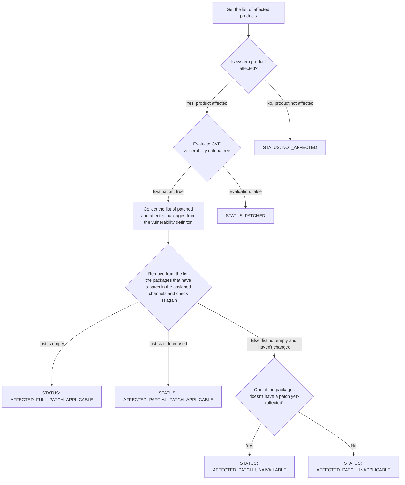

- Feature Name: CVE Auditing with OVAL
- Start Date: 2023-06-10

# Summary
Use OVAL data in addition to channels to conduct more accurate CVE audits.

# Motivation

Uyuni's current CVE auditing algorithm solely depends on channels data, which can lead to false system evaluations. To illustrate this, consider the scenario where you audit a system that has a vulnerability that hasn't been patched yet. In such cases, Uyuni would provide an incorrect assessment, indicating that the system is 'Not affected' or 'Patched', despite it being vulnerable to the unpatched vulnerability.

The incorrect evaluation is due to the absence of vulnerability data. Channels only offer patch data for packages that have been patched. The algorithm verifies the installed packages on the system based on this information. This puts us at risk of receiving a false system evaluation if a package does not have a patch yet.

# Detailed design

## OVAL Data Storage and Processing

The diagram below shows the oval module, its components and where it would be placed in Uyuni's architecture. In the following sections I will explain in more details the responsibility of each component, in addition, to the integration points with Uyuni.


### OVAL Parser

The oval parser is responsible mainly for the translation of oval files from XML to a more usable POJO representation. We can extend the parser responsibility to catch and report errors, but since the oval files come from trusted sources, it won't be necessary.

As OVAL files are structured in XML, we don't need to write the parser from scratch and can use an existing XML parsing library. The decision of choosing the XML parsing library is being tracked in https://github.com/uyuni-project/uyuni/issues/7108.

Given that Java is a statically typed language, oval types need to be defined before they can be used. While this adds some overhead when getting started with implementation, because the oval standard defines an enormous number of types, we can use a XML-to-POJO generator tool that generates Java classes from XML schemas .e.g **xjc**. The quality of the generated code might not be of the quality that we want but it should provide a good starting point from which we can continue and improve.

It's crucial to state that the Linux OVAL files don't use all of the features defined in the OVAL specification. So, the parser is only required to support the subset of features used in the Linux OVAL files. Nevertheless, the unsupported features should be documented to prevent confusion.


#### OVAL Extensions Support

The primary objective of the OVAL parser is to parse openSUSE and other Linux-based distributions OVAL files. This requires that we add support to the Linux OVAL extension. We can take it a step further and offer an abstraction that can be used to implement other extensions. This should, for example, facilitate the integration with Android[^5] and Windows[^6] clients when they become supported in Uyuni.

### OVAL Downloader

The OVAL Downloader is responsible for finding OVAL documents online, downloading them, and caching them for easy access. However, since the relevant OVAL data is saved in PostgreSQL, it is possible for the downloader to skip caching the OVAL files or remove them once they are stored in the database. This approach would reduce the amount of storage needed.

OVAL data comes from several sources – OvalRepo, OpenSUSE OVAL repository and other Linux distributions repositories – which means that the OVAL Downloader needs to be robust in the presence of errors. It is essential also that the component is designed with comprehensive error messaging to provide instant alerts in case an OVAL source is moved or the server is down.

### OVAL DAO

The OVAL DAO provides a unified interface of all the operations that can be applied on the OVAL data. It is the only way to query or modify the OVAL data from the database.

This component will enable us to do two main things that would otherwise be extremely difficult to implement:

- Testing OVAL data before doing the integration with Uyuni
- Creating mock DAOs for testing

As a starter, the DAO will provide the following methods:

```java
public class OVALCachingFactory extends HibernateFactory {
  public static void saveDefinition(OVALDefinition definition, List<String> affectedPlatforms, List<ReferenceType> references) {}
  public static List<OVALPlatform> getPlatformsAffectedByCve(String cve) {}
  public static Optional<OVALDefinition> lookupVulnerabilityDefinitionByCve(String cve) {}
}
```

### Database Storage for OVAL Documents

Once the OVAL file is parsed, the next step is to store it in a database. A relational database, such as PostgreSQL, seems like an obvious choice given that it is the default database used by Uyuni.

In Uyuni, multiple database-access patterns are being used. Skimming over the codebase, it appears that the newer parts of the code is using JPA Criteria API and Annotation-based Named queries. For that reason, the same patterns will be used to query OVAL data.

#### Database Schema

*Note: The table and attributes names are not final*


#### Storing Criteria Tree

The *CriteriaType* defines the structure of a logical statement that combines other logical statements. This construct is used to combine references to OVAL Tests, OVAL Definitions, and other *CriteriaTypes* into one logical statement[^3].  Because *CriteriaType* can reference multiple *CriteriaTypes*, it is by definition a tree. This is a problem because relational databases are not so great at storing trees.

Relational databases are fantastic at storing tabular data, where some data relates to other data. However, when the relationship points back to the same table a.k.a Trees, it gets complicated.

Luckily, There are multiple patterns used to store trees in a relational database[^1]:

- **JSON Blob**

  The easiest way to achieve this is to forgo the relational database and store the structure in a JSON blob. This lets us ignore the complexity of reading and writing across many records and just store everything as a single record. We would then do any parsing and updating in our application code instead of our database.

- **JSON**

  The JSON type is similar to JSON Blob. The most remarkable difference is that it preserve data indentation and format.

- **Storing Parent Keys**

  One way to achieve this is to store on every node the ID of its immediate parent. Nodes that don’t have a parent would then store *NULL*, and nodes with a parent can store a reference to that parent.

- **Closure Tables**

  We can use one other mechanism to store the graph separately from the nodes in what’s known as a Closure Table. This parallel table will store every ancestor for every node, including the distance between the node and its ancestor.

Keep in mind that given our use case, the only operations to perform on the criteria tree is to read or write to the database. Knowing that, the JSON solution seems sufficient.

## System CVE Analysis

### New CVE Auditing Algorithm

An obvious approach to overcome the incorrectness in Uyuni's current cve auditing algorithm is by leveraging vulnerability and patch OVAL definitions of the distributions, but as it turns out only openSUSE and Red Hat provide both vulnerability and patch OVAL definitions, thus, an alternative approach is required. The alternative algorithm uses a combination of **OVAL vulnerability definitions + channels**. With the OVAL vulnerability definitions, we can accurately assest whether a system is affected or not by a certain vulnerability. And with channels, we can further determine the availability of a patch for the system.

In Uyuni an audit operation yields an object of type PatchStatus. The PatchStatus type is an enum with four different values:

- AFFECTED_PATCH_INAPPLICABLE  — *Affected, patch available in unassigned channel*
- AFFECTED_PATCH_APPLICABLE — *Affected, patch available in assigned channel*
- NOT_AFFECTED — *Not Affected*
- PATCHED — *Patched*
- AFFECTED_PATCH_INAPPLICABLE_SUCCESSOR_PRODUCT — *Affected, patch available in a Product Migration target*

With the new algorithm, It is possible to determine two additional patch status namely *AFFECTED_PATCH_UNAVAILABLE* and *AFFECTED_PARTIAL_PATCH_APPLICABLE*. The former indicates that no patch is currently available for the CVE, regardless of the assigned channels, while the latter indicate the a patch is available but won't solve all the issues, meaning the system will still be vulnerable to the Cve, even after applying the patch but safer. The introduction of this new status requires that we rename the other status to better reflect their meaning. The following are the new values of the PatchStatus enum:

- AFFECTED_PATCH_UNAVAILABLE
- AFFECTED_FULL_PATCH_APPLICABLE
- AFFECTED_PARTIAL_PATCH_APPLICABLE
- AFFECTED_PATCH_INAPPLICABLE
- NOT_AFFECTED
- PATCHED
- AFFECTED_PATCH_INAPPLICABLE_SUCCESSOR_PRODUCT


 #### Checking if System Product is Affected

In this step, we need to figure out if the operating system/product the system is based on is affected by the CVE. If the operating system is not affected then the system is also not affected. Therefore, we can stop the algorithm there and return NOT_AFFECTED. A straightforward implementation would be to store the affected products in the database and map each affected product to an OVAL definition. This way we can query affected products by definition id or cve since each OVAL definition is mapped to a CVE.

The evaluation of this check we can be sure whether the system is affected by the CVE, it just lowers the scope of search in the next steps. 

#### Vulnerability Criteria Tree Evaluation

The evaluation of the vulnerability criteria tree would precisely indicate if the system is in a vulnerable state or not. If the system is vulnerable, then we need to read channels data to further check the availability of a patch in the assigned channels.

This step would start by fetching the criteria tree from the database and mapping it to a Java object. Then call a method that would recursively evaluate the tests that are referenced in the Criterion nodes (through the `test_ref` attribute). 

The aim is to  evaluate `rpminfo_test` and `dpkginfo_test` types, which are basically tests for checking the existence of certain RPM or DPKG packages (with specific versions sometimes) on systems.

#### Extraction of Vulnerable Packages

In order to decide whether a full or partial patch is needed we need to assign for each pair of (product, CVE) a list of vulnerable packages. This means identifying the packages that exposed the product to the CVE. If none of the vulnerable packages is present on the system then the system is not affected, and if one of the packages is present then it needs to have a version equal or above the fix version for the system to be considered patched. If the system has a package with a version below the fix version then the whole system is considered affected.

This operation is fairly fast but it yields too much data to be written to the database. For example, from a 280 MB OVAL file I extracted 2,000,000 data items that would be inserted to the database. The insertion process took very long, around ~1 hour in time. This is clearly bad in terms of both speed and space allocation. An alternative solution would be to run the extraction code every time an audit is performed. Since it usually takes less than 1 second, I think it's acceptable

### Integration with Uyuni

In this section, I explain the integration points of the developed algorithm.

The goal of an audit operation from the backend perspective is to compute and return a `List<CVEAuditServer>`. The `CVEAuditServer`class is a Java class representing a record with data about a single system containing that system's patch status regarding a certain CVE identifier as well as sets of relevant channels and erratas.

#### Patch Status Computation

### Performance Metrics

The following metrics are based on the current implementation. They serve to identify potential bottlenecks and area for optimization. They will be continuously updated alongside  implementation.

#### The Writing of OVAL data to Database

The writing of the OVAL data extracted from a ~280 MB OVAL file (one of the largest ones to parse) took around 10 minutes (with Hibernate)

- Definitions: 13660 (The writing of definitions will result in the writing of affected products, references, and mentioned cves)
- Objects: 9657
- States: 19036
- Tests: 67547

#### Performing CVE Audits

The operation of auditing a system against a single CVE finishes usually under 1 second, but for some reason (probably Hibernate dirty checking), when auditing against multiple CVEs the later audits take longer and longer. One area of optimization would be to read package tests all at once before performing the audit. OVAL tests for SUSE allocate around 24MB so it shouldn't be a problem to cache it.


## API Access

# Drawbacks

# Alternatives

# Unresolved questions

### How to distinguish QA from released patches in non-openSUSE distributions?

In the Open SUSE OVAL files, patches in QA have `(in QA)` at the end of their title, while released patches don't. This pattern doesn't occur in the other distributions OVAL files As far as I know, it is impossible to distinguish QA from Released for Linux distributions other than Open SUSE.

### Can we depend on OVALRepo to provide us with OVAL definitions?

openSUSE[^12] and Red Hat[^11] are the only distributions that provide both vulnerability and patch OVAL definitions in their official website. The other distributions they either provide one of the definitions or neither. The official OVAL repository "OVALRepo"[^10] was created to collect OVAL definitions contributed by the community. This repository provides vulnerability and patch definitions for Ubuntu, CentOS, Red hat, Oracle Linux and Debian. However, since the definitions are contributed by the community and not a product of an automatic pipeline, it's probably not up to date.

If we exclude the usage of OvalRepo as a source of OVAL data, then the distributions that we can audit correctly will be limited to the ones
that provide vulnerabilities OVAL definitions. That is, openSUSE, Red Hat, Ubuntu and Debian. Also, we need an algorithm that can derive patch data from channels rather than from OVAL.

The table below shows that only 6 distributions provide both vulnerability and patch style definitions *(assuming OvalRepo will be used)* while the others only provide one or neither of them.

| Linux Distribution       | Patch-style OVAL  | Vulnerability-style OVAL |
|--------------------------| :---------------- | ------------------------ |
| SUSE & openSUSE Products | ✅︎                 | ✅︎                        |
| Ubuntu                   | ✅︎ (From OvalRepo) | ✅︎                        |
| Debian                   | ✅︎ (From OvalRepo) | ✅︎                        |
| AlmaLinux                | ✅︎                 | ❌                        |
| Oracle Linux             | ✅︎                 | ✅︎ (From OvalRepo)        |
| CentOS                   | ✅︎                 | ✅︎ (From OvalRepo)        |
| Red Hat Enterprise Linux | ✅︎                 | ✅︎                        |
| Rocky Linux              | ✅︎                 | ❌                        |
| Alibaba Cloud Linux      | ❌                 | ❌                        |
| Amazon Linux             | ❌                 | ❌                        |

# References

[^1]: [Storing a Tree Structure in a Relational Database | Baeldung on Computer Science](https://www.baeldung.com/cs/storing-tree-in-rdb)
[^2]: [Uyuni Documentation (uyuni-project.org)](https://www.uyuni-project.org/uyuni-docs/en/uyuni/index.html)
[^3]: [OVAL Specifications (oval-community-guidelines.readthedocs.io)](https://oval-community-guidelines.readthedocs.io/en/latest/specifications.html)
[^4]: [Don Vosburg's Excellent Talk – Control your Linux world with Uyuni](https://www.youtube.com/watch?v=zU48fBjXby8)
[^5]: [Uyuni Community Hours 28.11.2022 – Android Salt Minion by Oscar Barios](https://youtu.be/yZwTIYitVvs?t=424)
[^6]: [[GSoC\] Windows client support – uyuni-project/uyuni#1937](https://github.com/uyuni-project/uyuni/issues/1937)
[^7]: [OVAL Data Repository 5.10](https://oval.mitre.org/rep-data/5.10/org.mitre.oval/index.html)
[^8]: [Amazon Linux support: OVAL scan – wazuh/wazuh#8370](https://github.com/wazuh/wazuh/issues/8370)
[^9]: [Amazon Linux OVAL Fetcher – goval-dictionary/amazon.go](https://github.com/vulsio/goval-dictionary/blob/master/fetcher/amazon/amazon.go)
[^10]: [OVAL Repository – CISecurity/OVALRepo](https://github.com/CISecurity/OVALRepo/tree/master/repository/definitions)
[^11]: [Red Hat OVAL](https://access.redhat.com/security/data/oval/v2/)
[^12]: [SUSE OVAL](https://www.suse.com/support/security/oval/)