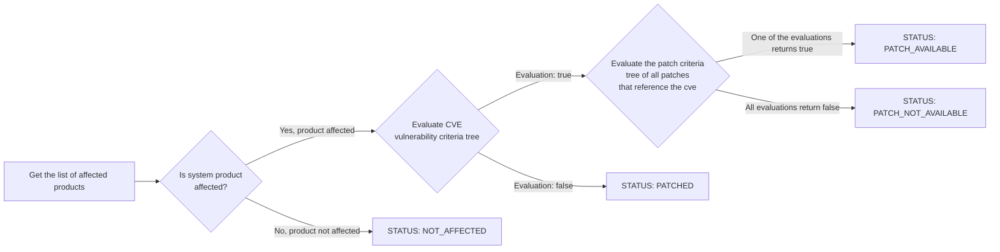

- Feature Name: CVE Auditing with OVAL
- Start Date: 2023-06-10

# Summary
Use OVAL *(Open Vulnerability and Assessment Language)* data instead of channels data to conduct CVE auditing.

# Motivation

Uyuni's current CVE auditing algorithm solely depends on channels data, which can lead to false system evaluations. To illustrate this, consider the scenario where you audit a system that has a vulnerability that hasn't been patched yet. In such cases, Uyuni would provide an incorrect assessment, indicating that the system is 'Not affected', despite it being vulnerable to the unpatched vulnerability.

The incorrect evaluation is due to the absence of vulnerability data. Channels only offer patch data for packages that have been patched. The algorithm verifies the installed packages on the system based on this information. This puts us at risk of receiving a false system evaluation if a package does not have a patch yet.

# Detailed design

The diagram below shows the oval module, its components and where it would be placed in Uyuni's architecture. In the following sections I will explain in more details the responsibility of each component, in addition, to the integration points with Uyuni.

|                           |
| :----------------------------------------------------------: |
| ***Figure 1. High-level architecture diagram of the proposed solution*** |

### OVAL Parser

The oval parser is responsible mainly for the translation of oval files from XML to a more usable POJO representation. We can extend the parser responsibility to catch and report errors, but since the oval files come from trusted sources, it won't be necessary.

As OVAL files are structured in XML, we don't need to write the parser from scratch and can use an existing XML parsing library. The decision of choosing the XML parsing library is being tracked in https://github.com/uyuni-project/uyuni/issues/7108.

Given that Java is a statically typed language, oval types need to be defined before they can be used. While this adds some overhead when getting started with implementation, because the oval standard defines an enormous number of types, we can use a XML-to-POJO generator tool that generates Java classes from XML schemas .e.g **xjc**. The quality of the generated code might not be of the quality that we want but it should provide a good starting point from which we can continue and improve.

It's crucial to state that the Linux OVAL files don't use all of the features defined in the OVAL specification. So, the parser is only required to support the subset of features used in the Linux OVAL files. Nevertheless, the unsupported features should be documented to prevent confusion.

|                           |
| :----------------------------------------------------------: |
| ***Figure 2. A simplified class diagram of the parser component.*** |

#### OVAL Extensions Support

The primary objective of the OVAL parser is to parse openSUSE and other Linux-based distributions OVAL files. This requires that we add support to the Linux OVAL extension. We can take it a step further and offer an abstraction that can be used to implement other extensions. This should, for example, facilitate the integration with Android[^5] and Windows[^6] clients when they become supported in Uyuni.

### OVAL Downloader

The OVAL Downloader is responsible for finding OVAL documents online, downloading them, and caching them for easy access. However, since the relevant OVAL data is saved in PostgreSQL, it is possible for the downloader to skip caching the OVAL files or remove them once they are stored in the database. This approach would reduce the amount of storage needed.

OVAL data comes from several  sources – OvalRepo, OpenSUSE OVAL repository and other Linux distributions repositories – which means that the OVAL Downloader needs to be robust in the presence of errors. It is essential also that the component is designed with comprehensive error messaging to provide instant alerts in case an OVAL source is moved or the server is down.

### OVAL DAO

The OVAL DAO provides a unified interface of all the operations that can be applied on the OVAL data. It is the only way to query or modify the OVAL data from the Uyuni database. Because there are at least two different patterns for accessing the database *(XML Named queries and JPA Criteria API)* within Uyuni codebase, I thought using a DAO would be a good idea in case I changed my mind about which data-access pattern to use later.

This component will allow me to do two main things that would otherwise be extremely difficult to implement:

- Testing OVAL data before doing the integration with Uyuni
- Creating mock DAOs for testing

As a starter, the DAO will provide the following methods:

```java
public interface OvalDAO {
    List<Product> getAffectedProducts(String cve);
    CVEPatchStatus getCVEPatchStatus(String cve);
    boolean isProductAffected(Product product, String cve);
    void storeOvalData(OvalRoot root);
    Optional<CVSS> getCVSS(String cveIdentifier);
}
```

### Database Storage for OVAL Documents

Once the OVAL document is parsed, the next step is to store it in a database. A relational database, such as PostgreSQL, seems like an obvious choice given that it is the default database used by Uyuni.

In Uyuni, multiple database-access patterns are being used. Skimming over the codebase, it appears that the newer parts of the code is using JPA Criteria API and annotation-based named queries. For that reason, the same patterns will be used to query OVAL data.

#### Storing Criteria Tree

The *CriteriaType* defines the structure of a logical statement that combines other logical statements. This construct is used to combine references to OVAL Tests, OVAL Definitions, and other *CriteriaTypes* into one logical statement[^3].  Because *CriteriaType* can reference multiple *CriteriaTypes*, it is by definition a tree. This is a problem because relational databases are not so great at storing trees.

Relational databases are fantastic at storing tabular data, where some data relates to other data. However, when the relationship points back to the same table a.k.a Trees, it gets complicated.

Luckily, There are multiple patterns used to store trees in a relational database[^1]:

- **JSON Blob**

  The easiest way to achieve this is to forgo the relational database and store the structure in a JSON blob. This lets us ignore the complexity of reading and writing across many records and just store everything as a single record. We would then do any parsing and updating in our application code instead of our database.

- **Storing Parent Keys**

  One way to achieve this is to store on every node the ID of its immediate parent. Nodes that don’t have a parent would then store *NULL*, and nodes with a parent can store a reference to that parent.

- **Closure Tables**

  We can use one other mechanism to store the graph separately from the nodes in what’s known as a Closure Table. This parallel table will store every ancestor for every node, including the distance between the node and its ancestor.

Keep in mind that given our use case, the only operations to perform on the criteria tree is to read or write to the database. Knowing that, the JSON solution seems sufficient.

## Integration with Uyuni

### Distinguishing QA from Released patches

In the Open SUSE OVAL files, patches in QA have `(in QA)` at the end of their title, while released patches don't. This pattern doesn't occur in the other distributions OVAL files As far as I know, it is impossible to distinguish QA from Released for Linux distributions other than Open SUSE.

### OVAL-based CVE Auditing Algorithm

CVE auditing is the process of determining if a given system is vulnerable to a certain CVE. Furthermore, it could involve determining whether a patch for the CVE was made available or not. In Uyuni the result of an audit operation is an object of type PatchStatus. The PatchStatus type is an enum with four different values:

- AFFECTED_PATCH_INAPPLICABLE  — *Affected, patch available in unassigned channel*
- AFFECTED_PATCH_APPLICABLE — *Affected, patch available in assigned channel*
- NOT_AFFECTED — *Not Affected*
- PATCHED — *Patched*
- AFFECTED_PATCH_INAPPLICABLE_SUCCESSOR_PRODUCT — *Affected, patch available in a Product Migration target*

It is possible to determine a new status using OVAL data, namely *AFFECTED_PATCH_UNAVAILABLE*, which indicates that no patch is available for the CVE, regardless of the assigned channels. The introduction of this new status requires that the *AFFECTED_PATCH_INAPPLICABLE* and *AFFECTED_PATCH_APPLICABLE* enums be renamed to more accurately reflect their meaning. The following are the new values of the PatchStatus enum:

- AFFECTED_PATCH_UNAVAILABLE
- *AFFECTED_PATCH_AVAILABLE*
- *AFFECTED_PATCH_AVAILABLE_IN_OTHER_CHANNELS*
- *NOT_AFFECTED*
- *PATCHED*
- AFFECTED_PATCH_INAPPLICABLE_SUCCESSOR_PRODUCT



The algorithm assumes the existence of both vulnerability and patch style OVAL definitions. Any lack or inconsistency in the OVAL data will probably result in an incorrect evaluation.

### Auditing Linux Distributions other than openSUSE and Red Hat

openSUSE and Red Hat are the only distributions that provide both vulnerability and patch OVAL definitions in their official website. The other distributions they either provide one of the definitions or neither. The official OVAL repository "OVALRepo"[^10] was created to collect OVAL definitions contributed by the community. This repository provides vulnerability and patch definitions for Ubuntu, CentOS, Red hat, Oracle Linux and Debian. However, since the definitions are contributed by the community and not a product of an automatic pipeline, it's probably not up to date.

If we exclude the usage of OvalRepo as a source of OVAL data,
then the distributions that we can audit correctly will be limited to the ones
that provide vulnerabilities OVAL definitions.
That is, openSUSE, Red Hat, Ubuntu and Debian.
Also, we need an additional algorithm that can derive patch data from channels rather than from OVAL.

The table below shows that only 6 distributions provide both vulnerability and patch style definitions *(assuming OvalRepo will be used)* while the others only provide one or neither of them.

| Linux Distribution       | Patch-style OVAL  | Vulnerability-style OVAL |
| ------------------------ | :---------------- | ------------------------ |
| Open SUSE Products       | ✅︎                 | ✅︎                        |
| Ubuntu                   | ✅︎ (From OvalRepo) | ✅︎                        |
| Debian                   | ✅︎ (From OvalRepo) | ✅︎                        |
| AlmaLinux                | ✅︎                 | ❌                        |
| Oracle Linux             | ✅︎                 | ✅︎ (From OvalRepo)        |
| CentOS                   | ✅︎                 | ✅︎ (From OvalRepo)        |
| Red Hat Enterprise Linux | ✅︎                 | ✅︎                        |
| Rocky Linux              | ✅︎                 | ❌                        |
| Alibaba Cloud Linux      | ❌                 | ❌                        |
| Amazon Linux             | ❌                 | ❌                        |

# Drawbacks

# Alternatives

# Unresolved questions

- How to distinguish QA from released patches in non-openSUSE distributions?
- Can we depend on OVALRepo to provide us with OVAL definitions?

# References

[^1]: [Storing a Tree Structure in a Relational Database | Baeldung on Computer Science](https://www.baeldung.com/cs/storing-tree-in-rdb)
[^2]: [Uyuni Documentation (uyuni-project.org)](https://www.uyuni-project.org/uyuni-docs/en/uyuni/index.html)
[^3]: [OVAL Specifications (oval-community-guidelines.readthedocs.io)](https://oval-community-guidelines.readthedocs.io/en/latest/specifications.html)
[^4]: [Don Vosburg's Excellent Talk – Control your Linux world with Uyuni](https://www.youtube.com/watch?v=zU48fBjXby8)
[^5]: [Uyuni Community Hours 28.11.2022 – Android Salt Minion by Oscar Barios](https://youtu.be/yZwTIYitVvs?t=424)
[^6]: [[GSoC\] Windows client support – uyuni-project/uyuni#1937](https://github.com/uyuni-project/uyuni/issues/1937)
[^7]: [OVAL Data Repository 5.10](https://oval.mitre.org/rep-data/5.10/org.mitre.oval/index.html)
[^8]: [Amazon Linux support: OVAL scan – wazuh/wazuh#8370](https://github.com/wazuh/wazuh/issues/8370)
[^9]: [Amazon Linux OVAL Fetcher – goval-dictionary/amazon.go](https://github.com/vulsio/goval-dictionary/blob/master/fetcher/amazon/amazon.go)
[^10]: [OVAL Repository – CISecurity/OVALRepo](https://github.com/CISecurity/OVALRepo/tree/master/repository/definitions)