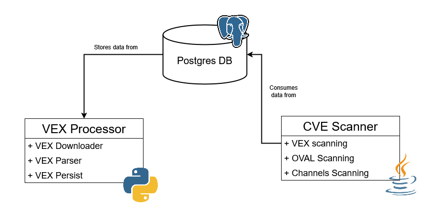

- Feature Name: CVE auditing with VEX
- Start Date: 2025-02-19

# Summary
[summary]: #summary

Use VEX in addition to existing implementation to increment CVE auditing accuracy. 

# Motivation
[motivation]: #motivation

Nowadays, Uyuni used **OVAL** to perform CVE auditing [^3]. OVAL (*Open Vulnerability and Assessment Language*) is a standarized, XML-based languaje to describe, evaluate and report the security state of computer systems. OVAL is maintained by MITRE and used by SCAP (*Security Content Automation Protocol*).

However, many companies like Red Hat are adopting **VEX** (*Vulnerability Exploitability eXchange*) [^2], a profile in **CSAF** (*Common Security Advisory Framework*) that improves OVAL, allowing to detect if a vulnerability is exploitable in an specific context. While OVAL just assesses whether a vulnerability is present in a product, VEX can actually determine if due to configurations or mitigations is actually a threat.

Due to this, a research has been requested to integrate VEX  in Uyuni [^1]. With this project the ojective is replacing OVAL to enhance scanner accuracy using VEX to filter out false positives and provide extra information. This project aims to polish CVE auditing and keep Uyuni up to date with market standards.

---

# Detailed design
[design]: #detailed-design

The implementation for VEX will follow a similar structure as existing OVAL one [^2]. Here is a diagram to ilustrate the modules structure:



Mainly we will have two main objectives: **VEX data processing/storing** and **CVE analysis**.

## VEX Data Storage and Processing

The VEX proccessor will be written in **Python3**. The main purpose of these modules is to **download**, **parse** and **persist** VEX data, it will be called periodically (using a cron job) or before performing a manual audit, to ensure CVE information is up-to-date.

### VEX Parser

VEX files are JSON-based files, however, there are mainly 3 different formats:

- **CSAF**, maintained by OASIS. Supports rich metadata, including product information, vulnerabilities, and remediation guidance.
- **CycloneDX**, is maintained by OWASP. Focuses on simplicity and interoperability. (Can be JSON or XML-based)
- **OpenVEX**, designed specifically for simplicity and ease of use. It is maintained by the OpenVEX community.

Due to this variety of formats, before using the data is important to normalize it.

The following utils are used:

1. **InputHandler**:
    - Detects the format of the input document
    - Will be done detecting specific fields like `"bomFormat"` for CycloneDX

2. **SchemaValidator**:
    - Validates the document against the respective schema
    - Can use [jsonschema](https://pypi.org/project/jsonschema/) for JSON validation.
    - Use [lxml](https://lxml.de/) or [xmlschema](https://pypi.org/project/xmlschema/) for XSD validation. For CycloneDX XML-based files (not priority).
    - Example for JSON:

```python
from jsonschema import validate, ValidationError

def validate_json(document, schema):
    try:
        validate(instance=document, schema=schema)
        return True
    except ValidationError as e:
        print(f"Validation error: {e.message}")
        return False
```

To parse a template class **VEXParser** is used as father class for each specific parser class:

    - Parse the document into a normalized internal representation
    - Python classes will be used for each VEX format
    - CSAF format will be the priority as SUSE publishes VEX files in this format
    - Example:

```python
class VexStatement:
    def __init__(self, product_id, vulnerability_id, status, timestamp=None):
        self.product_id = product_id
        self.vulnerability_id = vulnerability_id
        self.status = status  # e.g., "not affected", "affected", "fixed"
        self.timestamp = timestamp

    def __repr__(self):
        return f"VexStatement(product_id={self.product_id}, vulnerability_id={self.vulnerability_id}, status={self.status})"
```

> [!IMPORTANT]
> CSAF and CycloneDX may include more than one product for each statement, so cardinality should be taken into consideration. It should not be a problen in OpenVEX as it relates only one product to each vuln.

### DB Storage

As said, VEX data contains different fields (for example *status*) so a new table is needed to store and query this data:

- Since VEX and OVAL have a **different fields**, keeping both types of info in the same tables will enforce the addition of an *data_type* attribute to distinguish each entry. This leads to **unasigned attributes** for each entry.
- Keeping isolated VEX and OVAL data eases an hypothetical full migration to VEX.

However RHN table for CVE and OVAL tables for products and packages are reused.

For the implementation, the Python3 library [psycopg2](https://pypi.org/project/psycopg2/) is the ooption to interact with the Postgres database. This is not only the most mature and stable PostgreSQL adapter, but highly optimized for performance. Furthermore it was already used by Spacewalk.

#### DB Schema

##### Existing tables

The following tables will be reused as they hold common information:

- `rhnCVE`: Contains detected CVEs.

- `suseOVALPlatform`: Contains platform info.

- `suseOVALPackage`: Contains package info.

##### New tables

To hold VEX data a new table is required:

- `suseVEXAnnotations`: Relates CVE's with platform, package and status.

To be used by the downloading module:

- `suseVEXHash`: Stores VEX file hashes.

##### Diagram


### VEX Downloader

Retrieve VEX documents online. Is responsible finding, downloading and caching the files, like was done for OVAL [^2].

Each vendor holds its own CVE repo so downloader needs to be adapted for each repo.

To avoid memory issues, **data will be processed in stream**. It means that as soon as a file is downloaded, parsing process is invoked to normmalize the information and check whether is relevant to be stored in the DB. In CVE repositories, some CVE are kept for retrocompatibility in spite of containing just the CVE name and description but no product or platform identifier. Is important to get rid of those files not to spend time parsing them.

#### Synchronization

To ensure accuracy is crucial to keep VEX data up-to-date, so data have to be synchronized periodically. The time ammount needed for performing this opperation will deppend on how many operating systems are being used. If only SUSE systems are being used it would be useless downloading RedHat advisories.

Anyway syncronizing VEX data **once a day** on low workload hours may be a good default, but it will be possible for the user to change it.

In certain cases, downloading all data can be redundant as it did not change since last sync. For that reason, many repositories include an index file that contains hashes for VEX files. Comparing those hashes with *suseVEXHas* before downloadings will improve efficiency.

#### Performance

By the time, downloadinng just for SUSE advisories, it takes 4-5 hours to download the whole repo in a limited resources server. This time is way too much specially if many vendors need to be downloaded.

To enhance performance:

- **Blacklist legacy CVEs**: As mentioned previously, CVEs that doesn't contain relevant information and are only kept for backward compatibility can be skipped. To detect this files the lack of *product_tree* section is relevant, and when detected, in suseVEXHash will be marked by the *status* field.
- **Skip old CVEs**: Old CVEs from before 2010's describe vulns for old systems and versions that aren't used that often. Furthermore, the legacy files are more frequent between those years because of the lack of standards to public advisories.
- **Threading** 

## CVE enhanced analysis

For the time being, OVAL was able to detect vulnerable packages being used for a specific CPE. With VEX it will be possible to filter out all those non-exploitable vulnerabilities due to specific configurations.

The auditing proccess will check managed systems product IDs, and look for them in VEX data. As soon as a package is detected, is written in the database. Depending on the affectedness status some metadata will or will not be present (for instance, the `justification` field if a product is not affected).

VEX provides just four statuses [^3] in opposition to the many statuses being used by Uyuni:

- `NOT AFFECTED` – No remediation is required regarding this vulnerability.
- `AFFECTED` – Actions are recommended to remediate or address this vulnerability.
- `FIXED` – These product versions contain a fix for the vulnerability.
- `UNDER INVESTIGATION` – It is not yet known whether these product versions are affected by the vulnerability. An update will be provided in a later release.

> [!NOTE]
> As said on VEX definition:
> If a status is **AFFECTED**, the VEX document **must have an action statement** that tells the product user what to do.
> If the status is **NOT AFFECTED**, then a VEX document **must have an impact statement** to further explain details.

If no VEX data is available, the system will fallback to previous OVAL-based system (and consequently if was the case to channels).

## API Access

To provide integration with Spacecmd and  WebUI, there will be 2 API interfaces:

### JSON  API

The JSON API will be used by WebUI and will remain very similar. It will only include extra fields for VEX data like justification. In addition, a warning will be displayed in case OVAL/channels were used for auditing instead of VEX.

### XML-RPC API

TODO

# Drawbacks
[drawbacks]: #drawbacks

# Alternatives
[alternatives]: #alternatives

# Unresolved questions
[unresolved]: #unresolved-questions

## Is identifier in VEX files enough for identifying packages?
[package-id-uq]: #package-id-uq

By the time the parsing module stores package with the identifier used in VEX files as id. Regarding to the implementation of the fix version recommendation functionality in scanner, will be enough to idenntify the recommended package?

```json
{
    "category": "product_version",
    "name": "nodejs10",
    "product": {
        "name": "nodejs10",
        "product_id": "nodejs10",
        "product_identification_helper": {
        "cpe": "cpe:2.3:a:nodejs:node.js:*:*:*:*:-:*:*:*"
        }
    }
},
```
> nodejs10 definition in *product_tree* section of the file

> [!NOTE]
> CPE is not included for every single package but only for some.

```json
"known_affected": [
          "SUSE Enterprise Storage 6:nodejs10",
          "SUSE Enterprise Storage 7:nodejs10",
          "SUSE Enterprise Storage 7:nodejs12",
          "SUSE Enterprise Storage 7:nodejs14"
        ],
"recommended": [
    "SUSE Liberty Linux 8:nodejs-18.9.1-1.module+el8.7.0+16806+4109802b",
    "SUSE Liberty Linux 8:nodejs-devel-18.9.1-1.module+el8.7.0+16806+4109802b",
    "SUSE Liberty Linux 8:nodejs-docs-18.9.1-1.module+el8.7.0+16806+4109802b",
```
> nodejs10 and other packages mentioned in *vulnerability* section of the file

## Should be taken into consideration data from the legacy system (OVAL) if VEX is available?

It is possible to display VEX information on top, but keep OVAL below with a warning message to let the user decide if he wants to consider it.

# References
[references]: #references

[^1]: [issue 9606](https://github.com/uyuni-project/uyuni/issues/9606)
[^2]: [The Future of Red Hat Security Data](https://www.redhat.com/en/blog/future-red-hat-security-data)
[^3]: [CVE Auditing with OVAL](https://urldefense.com/v3/__https://github.com/uyuni-project/uyuni-rfc/pull/80__;!!D9dNQwwGXtA!X5VPAqQnoak6vx4dsUErkpGohMhPg4gLYeBXbT5Ith8UQwCd2TNWkXtTAG786GipiVEsxTxTc3W2xmM$)
[^4]: [VEX use cases](https://www.cisa.gov/sites/default/files/publications/VEX_Use_Cases_Aprill2022.pdf)
[^5]: [Database schema](https://drawsql.app/teams/caliphal/diagrams/vex-database-schema)