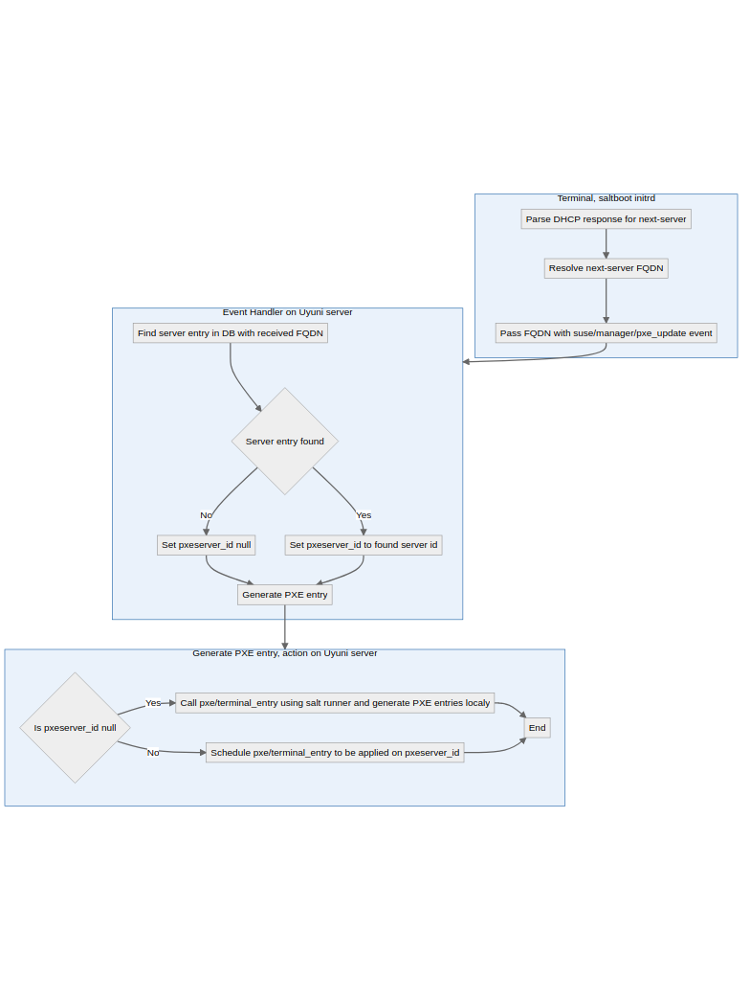

- Feature Name: Retail info storage
- Start Date: 2020-12-01
- RFC PR: (leave this empty)

# Summary
[summary]: #summary

After deploying Retail (saltboot) client, also known as terminal, PXE entry for this client is generated on Branch server. These entries are not backed by information available on SUSE Manager/Uyuni and are difficult to recreate. This RFC is addressing this concern.

# Motivation
[motivation]: #motivation

When terminal is booting up, it receives some important information from branch server using kernel command line. In case of first boot, when there is no custom PXE entry for the terminal, these are just information about branch and other custom values. However in case of second and next boot, terminal also receive information about where it should look for salt configuration and also root partition.
If these information are missing, terminal will consider the boot as first boot and will generate new minion id and salt keys and register as a new client to the server.


This is sometimes wanted behaviour, for example when terminal is physically moved from one branch to other branch.
But this also complicates migration of Uyuni/SUSE Manager to newer versions by installing new branch server as there are more files to backup and restore. If there is some unexpected hardware failure on branch server side, it is difficult to recreate these PXE entries for registered terminals and users are facing a task to reregister deployed terminals.


To be able to recreate PXE entries, it is needed to store some additional details about terminals, make them available for the branch server minion and have a state or other mechanism which will recreate them. Idea is that after replacing branch server for any reason, user is able to apply a state or schedule an action and recreate the PXE entries for all connected terminals.

By PXE entries are meant both PXE configuration files commonly named `01-mac_address_dash_separated` and GRUB configuration for UEFI commonly named `01:mac_address_colon_separated.grub2.cfg`.

Later in the text I introduced term `pxe server`. This is usually branch server proxy, however design should be flexible enough to allow any salt client to become pxe server, particularly in branchless scenarios with e.g. peripheral hub servers instead of branch server proxy.

# Detailed design
[design]: #detailed-design


## Workflow description

On each boot (first boot and all next boots) terminal sends an event `suse/manager/pxe_update` together with following data:

```
salt_device: $dev_by_id_path
root: $dev_by_id_path
boot_image: $boot_image_name
terminal_kernel_parameters: $hwtype_based_parameters
```

These data are then, together with data about branch (provided on kernel command line), used to create PXE and GRUB entries like:

```
LABEL netboot
        kernel POS_Image_JeOS7-7.0.0/POS_Image_JeOS7.x86_64-7.0.0-5.3.18-24.37-default.kernel
        append initrd=POS_Image_JeOS7-7.0.0/POS_Image_JeOS7.x86_64-7.0.0.initrd.xz  panic=60 ramdisk_size=710000 ramdisk_blocksize=4096 vga=0x317 splash=silent  USE_FQDN_MINION_ID=1 MINION_ID_PREFIX=branch1 root=/dev/disk/by-path/pci-0000:04:00.0-part3 salt_device=/dev/disk/by-path/pci-0000:04:00.0-part3
```

and

```
menuentry netboot {
        linuxefi ${prefix}/POS_Image_JeOS7-7.0.0/POS_Image_JeOS7.x86_64-7.0.0-5.3.18-24.37-default.kernel panic=60 ramdisk_size=710000 ramdisk_blocksize=4096 vga=0x317 splash=silent  USE_FQDN_MINION_ID=1 MINION_ID_PREFIX=branch1 root=/dev/disk/by-path/pci-0000:04:00.0-part3 salt_device=/dev/disk/by-path/pci-0000:04:00.0-part3
        initrdefi ${prefix}/POS_Image_JeOS7-7.0.0/POS_Image_JeOS7.x86_64-7.0.0.initrd.xz
}
```

The data send in the `pxe_update` event are not stored anywhere on the Uyuni/SUSE Manager and upon receiving the event, salt reactor applies `pxe/terminal_entry` state on the branch server which will create the PXE entry for given terminal.


To be able to recreate PXE entries at later time, it is clear that the data send in the `pxe_update` event should be stored somewhere on the Uyuni/SUSE Manager and be accessible to branch servers.


## Storage of the data

In this RFC we propose to create new database table `suseRetailMinionInfo` which will reference `suseMinionInfo`. This table will contain at least entries for `root_device`, `salt_device`, `boot_image` and `terminal_kernel_parameters`.

```
CREATE TABLE suseRetailMinionInfo
(
    server_id           NUMERIC NOT NULL
                            CONSTRAINT suse_retail_minion_info_sid_fk
                                REFERENCES suseMinionInfo (server_id)
                                ON DELETE CASCADE,
    pxeserver_id        NUMERIC
                            CONSTRAINT suse_retail_pxeserver_info_sid_fk
                                REFERENCES suseMinionInfo (server_id)
                                ON DELETE SET NULL,
    mac_address         VARCHAR(17),
    root_device         VARCHAR(36),
    salt_device         VARCHAR(36),
    boot_image          VARCHAR(256),
    kernel_parameters   VARCHAR(512)
)
```

To prevent storing long `root_device` and `salt_device` we propose to **change saltboot use from dev-by-path to dev-by-uuid** and sending only UUIDs of used devices.


`boot_image` points to part of built retail PXE OS image. Data about images are currently not available in database itself and are only available in generated pillar data. Information from pillar addressed by `boot_image` is then used in generated PXE entry to correctly set what initrd and kernel should be served to the terminal during PXE boot.

`kernel_parameters` are taken from HWTYPE group given terminal is member of or from defaults passed on kernel command line. It is sent in event, because pxe server, where PXE entries are to be generated, does not have access to pillars from saltboot formula of HWTYPE group.

`pxeserver_id` column references PXE server (usually branch server) which provides PXE/UEFI booting data (including UEFI HTTP boot if configured).

Column `mac_address` specify MAC address of the terminal. Similar column is also present in `rhnServerNetInterface` table, however that information is populated only after hardware refresh is scheduled, which is done only after successful deployment. Whereas pxe entries needs to be available before full deployment because of cases when kernel version of inird is different to kernel version in image and terminal requires reboot to correct kernel version.

Another option is that event handler creates the correct entry in `rhnServerNetInterface` table.

### Detecting pxeserver_id

In scenarios where terminals are connected to the branch server proxy, `pxeserver_id` is currently assumed to be branch server proxy and can be looked up in database by event handler. However architectures where proxy server is not involved such detection will not work (for example Hub scenarios where peripheral server is used instead of proxy server).

We propose to solve this by **adapting saltboot to send FQDN of `next-server`**, that means server which provided initrd and kernel during PXE boot. This can be obtained by parsing DHCP response for `next-server` field. DHCP response is stored and available in dracut environment where saltboot is operating. Mandatory requirement in this case would be that **reverse lookup of IP address must be correctly configured** as `next-server` fields is IP address.

Alternative is to use DNS service to lookup `tftp` CNAME, this is discussed in alternatives below.

When the FQDN of `next-server` is not in the Uyuni database, such is the case when terminal is connected directly to the Uyuni, then `pxeserver_id` would be set to `null`.

This is related to the [Hub Retail extension](https://github.com/uyuni-project/uyuni-rfc/pull/45) discussion about how should Retail architecture look like in Hub environment.

## Storing data in database

As data are provided within salt event, implementing new event handler `SaltbootPxeUpdateEvent` with accompanying `SaltbootPxeUpdateMessageAction` should be sufficient.

Event handler should also schedule generation of new PXE entry.

## Exposing PXE entries to users

In current implementation, consumer of the `pxe_update` event data is `pxe/terminal_entry` state which is part of PXE formula.

Keeping the final action in salt space, there is a need to provide pillar data to the state:

  * by supplying directly to state when scheduling pxe generating action.
  * by exposing database data to salt pillar system.

Exposing PXE data is not hard requirement but may have some benefit like enabling user to manually apply `pxe/terminal_entry` or similar state to (re)generate pxe entries. This option can save resources by making UI/XML-RPC API changes non-essential.

Keeping data hidden in database has a positive side by not cluttering pillar space with rarely used data.
To allow user to manually trigger PXE entries regeneration it is needed to develop UI or XMLRPC API endpoint, proposed below.

Using these data `pxe/terminal_entry` state would need to be adapted to look for pillar data in correct places and also to support generating single pxe entry or all pxe entries depending on the values passed to the state.

## Generating PXE entries

Update to routine is needed to support terminals connected directly to Uyuni server. Mainly calling `pxe/terminal_entry` state using salt runner or other means locally on Uyuni.

Complete routine should look like:



## Updating PXE entries

Moving terminal between pxe servers happen. This means event handler needs to be aware of this possibility and adapt `pxeserver_id` field as needed.
  
Removal of the PXE server (branch server) system profile would set `pxeserver_id` to `null`. To update the entry terminal will need to be rebooted under new PXE server or user would need to manually update using API call.

## API for manipulating and (re)generation of PXE entries

Proposed API namespace `saltboot` as these entries related to saltbooted images.

### API to modify PXE entries

API should be implemented and it should be possible:

* change pxeserver_id (use case when pxe server was changed - e.g. new machine registered as a replacement)
* change kernel options for the terminals

`saltboot.modifyPXEentries(sessionKey, [server_id1, server_id2, ...], { key: value})` where `key` is one of `pxeserver_id`, `kernel_parameters`, `boot_image`, `mac_address`

### API to trigger regeneration of PXE entries

API should be implemented and it should be possible to:

* (re)generate all PXE entries for given pxe server (use case when pxe server was replaced, e.g. after hardware failure)
* (re)generate single PXE entry for given pxe server and terminal (use case when changing the kernel option of the terminal, e.g. for debugging purposes)

`saltboot.generatePXEentry(sessionKey, server_id)`

`saltboot.generatePXEentries(sessionKey, pxeserver_id)`

### API to show/list entries

API is recommended to be implemented for sake of complete API based access and it should be possible to:

* list PXE entries for given pxeserver id
* show PXE entries for given server id

`saltboot.listPXEentries(sessionKey, pxeserver_id)` -> list of `server_id` with pxe entry for given `pxeserver_id`

`saltboot.getPXEentry(sessionKey, server_id)` -> dictionary of stored values for given `server_id`

### API to remove PXE entries

It is up to discussion as the entry should be automatically removed when terminal server is removed from Uyuni/SUSE Manager.

# Drawbacks
[drawbacks]: #drawbacks

Why should we **not** do this?

  * obscure corner cases
  
    Currently unknown
  
  * will it impact performance?
  
    Multiple terminals booting at the same time - current state is handled solely by salt, proposed solution adds communication with database - increasing latency and some load on database
  
  * what other parts of the product will be affected?
  
    There should be no affect to other parts of product
  
  * will the solution be hard to maintain in the future?
  
    As is the case even now, the code is split across different projects and github repositories. Saltboot code in [uyuni-retail/saltboot-formula](https://github.com/uyuni-project/retail/tree/master/saltboot-formula), `pxe/terminal_entry` state in [salt-formulas/pxe-formula](https://github.com/SUSE/salt-formulas/tree/master/pxe-formula) next adding java event handler adds third repository. However code itself is not complex and this code split can be mitigated either by moving parts closer together (like [integrating saltboot to uyuni](https://github.com/SUSE/spacewalk/issues/10777)) or good code commenting.
  

# Alternatives
[alternatives]: #alternatives

- Automatic detection of partition where salt configuration is stored

  Draft PR [is here](https://github.com/uyuni-project/retail/pull/71). This removes the need to reregister terminal in case of lost PXE entry. However this does not preserve terminal-specific kernel command line options and always boot default initrd and kernel.

- TPM as storage for salt configuration

  Trusted Platform Module is required to be available on every hardware certified to run MS Windows 10, essentially every new hardware. It can be used as a secure storage for salt keys and minion id instead of storing it on hard drive. This would solve the same problem as automatic detection of salt configuration with the same drawbacks. This would also need some more time for research and packaging ensuring tpm2-tss is available in saltboot initrd.

- Storage of pillar data in pillar files instead of database

  This would allow to reuse of current external pillar mechanism, but suffer from the same issues like existing implementation - maintaining consistency of data and others. (See [overall issue](https://github.com/SUSE/spacewalk/issues/10679))

- Detection of `pxeserver_id` can also be done similarly as `salt` CNAME is being resolved by saltboot. That means adding `tftp` CNAME as hard requirement for DNS resolution. It is already documented to do so, however it wasn't used for anything and given number of users use their DNS servers instead of retail provided one this can introduce a regression in users scenarios.

- Exposing pillar data using postgres external pillar:

  ```
  postgres:
    db: susemanager
    host: localhost
    pass: spacewalk
    port: 5432
    user: spacewalk

  ext_pillar:
    - postgres:
        'retail_terminals':
          query: "SELECT S.name, root_device, salt_device, boot_image, kernel_parameters,mac_address FROM
                  (SELECT * FROM suseRetailMinionInfo as RMI, rhnServer as S WHERE RMI.pxeserver_id = S.id AND S.name LIKE %s) AS I JOIN rhnServer AS S ON I.server_id = S.id"
          as_list: False
          depth: 1
  ```
  Not considering this as this should be part of [spacewalk#10679](https://github.com/SUSE/spacewalk/issues/10679).


# Unresolved questions
[unresolved]: #unresolved-questions

- Is presented detection of `pxeserver_id` acceptable?

- `pxeserver_id` when terminal is not connected to the proxy, but directly to the Uyuni/SUSE Manager is `null` and has a functional meaning. However the same state can be achieved by removing branch server server entry. How big problem is it?

- UI for pxe generation. Is it needed, or is XMLRPC API enough?

- Do we need to export pillar data? If so, what mechanism to use to export pillar data?
