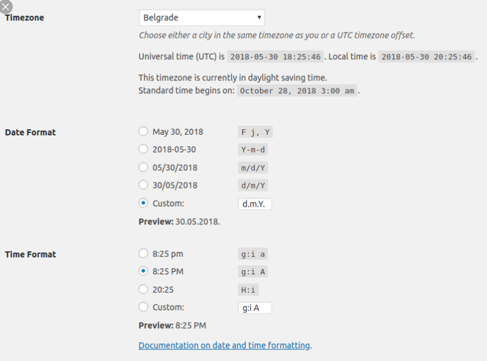
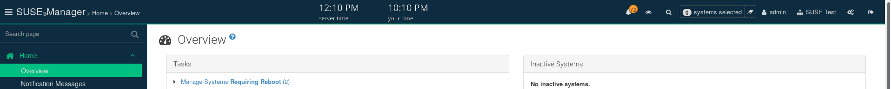

- Feature Name: timezones
- Start Date: 2019-09-16
- RFC PR: 

# Summary
[summary]: #summary

Timezones can be a big problem when managing an application like Uyuni that can be deployed and accessed from anywhere in the world. 
If we don’t have some rules on how to display and handle dates, this can become quite a big mess to manage. 


# Motivation
[motivation]: #motivation

The goal of this RFC is to define those rules and serve as a reference for the future.

These rules should define a consistent way of display dates on the UI and make this information as clear as possible for the user.

The user should be able to easily understand in which timezone a date is displayed and aware if there is any difference from the timezone
he is accessing from.

# Glossary
[glossary]: #glossary

When talking about uyuni there are 3 different Timezones contexts that are important to understand and distinguish:

* *Server timezone:* the configured timezone in the server where uyuni is deployed 

* *User preferences timezone:* the defined timezone on the user preferences settings. Here we should be able to choose the timezone, date format (yyyyddmm) and the time format (12/24 hours).

* *Client browser timezone:* the browser/pc timezone where the client is accessing from. This timezone shouldn’t affect any displayed date, but the user should be aware of it.


# Detailed design
[design]: #detailed-design

There are 3 topics that we need to have in consideration here:

## Display of dates

The display of dates should always take in consideration the 3 user preferences settings: timezone, date-format and time-format.

**For example:** '2019-09-10 13:00:00 **CEST**'

At the moment only the setting timezone is implemented. The property date-format and time-format could be added on a second iteration, 
but the code should be prepared to easily support them.

Example:



Ideally, these dates should be formatted server side using the already existing java methods:

```java
LocalizationService.getInstance().formatCustomDate(date)
```

For the new stack (spark+react) if you want to convert a JSON to use the correct format, use the following GSON date adapter `UserLocalizationDateAdapter` 
that will convert your class dates to the user defined format.

The previous gson adapter 'ECMAScriptDateAdapter' that converts dates to UTC should be avoided.

## Manipulation of dates on the browser

Since the browser Date implementation doesn't support timezones, if we ever need to do any date manipulation more than displaying a date
 we should never use the object Date() directly but the `moment-timezone` library.

This will require a refactor to the component react component `DateTimePicker` to properly manage timezones using the library `moment-timezone`
instead of manually calculating the diff between the user preference and browser timezone.

## Create awareness to the user regarding the used timezones

The user should always be aware in which timezone his account is configured and from where he is accessing from.

To create context to the user regarding timezones, 2 clocks should be added to the top. One with the user configured timezone and
the other one with the browser timezone. 




# Drawbacks
[drawbacks]: #drawbacks

- Making sure that all the legacy stack respect the 3 user preference properties timezone, date-format and time-format.
It might not be trivial.
- The use of the native browser Date implementation is forbidden, since it only supports the browser timezone.

# Alternatives
[alternatives]: #alternatives

## Using the browser timezone to display all the dates.

Although some of the new features of Uyuni use this timezone, it's wrong. It was not the way of doing things in spacewalk, 
it creates confusion and increases the change of errors, specially when not showing timezone information at all.


