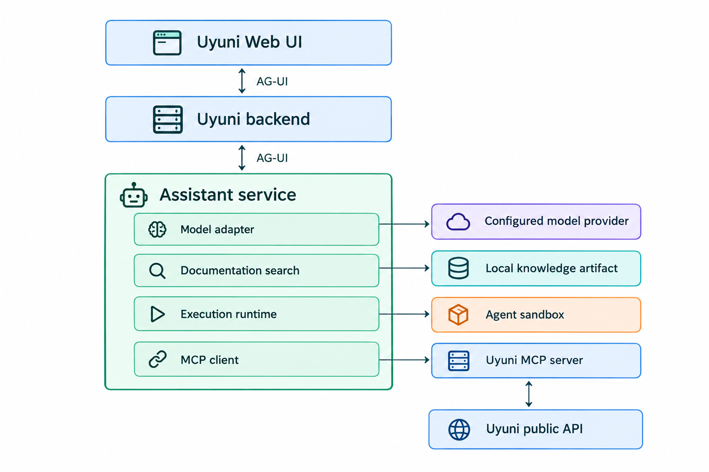

- Feature Name: AI Assistant
- Start Date: 2026-09-15

# Summary
[summary]: #summary

This RFC defines an AI assistant integrated into the Uyuni Web UI to provide conversational access to product knowledge and functionality.
The solution combines documentation retrieval, application context, and operations through the Uyuni MCP server.
It supports customer-selected model providers, including locally hosted models, and preserves Uyuni's existing authentication and authorization rules.

# Motivation
[motivation]: #motivation

Currently, users interact with Uyuni through the Web UI or public API and consult documentation separately.
Both interfaces require users to translate their intended task into the corresponding product features and operations.

This proposal introduces a conversational interface through which users can describe what they want to accomplish.
The assistant uses product documentation and application data to explain the available options, collect missing information, and carry out the agreed operations.
Its scope follows Uyuni's functionality rather than a fixed set of use cases or the tools currently available in the MCP server.

The assistant addresses three related needs:

1. **Product knowledge:** Explain features and procedures using documentation appropriate to the installed release.
2. **Application context:** Relate a request to the user's current work and information available in Uyuni.
3. **Task execution:** Translate an agreed task into authorized product operations, with confirmation where required and visible results.

This interface complements the existing Web UI and API.
Users retain control over product changes, and the same access rules apply regardless of how an operation is requested.

Deployments have different connectivity, privacy, and infrastructure requirements.
The assistant therefore supports external and local models without requiring a particular provider or making AI services a dependency of normal Uyuni operation.

# Detailed design
[design]: #detailed-design

## Overview

The solution consists of an assistant service, a Web UI integration, a documentation index, the Uyuni MCP server, and an agent sandbox.
The assistant service coordinates model requests and external capabilities; the Uyuni backend remains responsible for identity, permissions, and business rules.

Requests and user interactions pass through the backend to the assistant using the [Agent User Interaction Protocol (AG-UI)](https://docs.ag-ui.com/).
Messages, tool activity, presentation data, interrupts, and run status return through the same protocol.

The design is based on six components:

1. **User interface:** Collects requests, supplies page context, and renders AG-UI events.
2. **Model adapter:** Provides a common interface to supported model providers.
3. **Knowledge retriever:** Finds relevant passages in versioned product documentation.
4. **MCP integration:** Provides access to Uyuni data and operations.
5. **Orchestrator:** Manages conversation state, tool execution, user input, and workflows.
6. **Execution runtime:** Stores large tool results and runs shell commands on them in an isolated workspace.

The implementation language, model SDK, search engine, and workflow library remain implementation choices.
The following sections describe the complete feature; delivery increments are outlined under Implementation.

## User interface

The assistant is available in a persistent panel within the Web UI, independent of the main page content.
It remains available during SPA navigation and restores the conversation from the backend after a full-page navigation or refresh.
Users can inspect sources, intermediate results, and proposed operations without leaving the page.

Assistant messages support sanitized GitHub-Flavored Markdown without executable HTML or scripts.
Links are restricted to supported destinations.

**Page context** identifies the resources and filters relevant to the current view.
Examples include the current route URI path, the ID of a system displayed on the page, selected resources, and active list filters.
The frontend supplies these references explicitly rather than sending the page contents to the model.

For example, a user can ask the assistant to prepare an operation on resources selected in the Web UI:

1. The assistant resolves the selection and retrieves the information needed for the request.
2. It explains the options and requests missing parameters.
3. The user reviews the operation, targets, and expected effect.
4. After confirmation, the assistant executes it and displays the result.

### Presentation components

The frontend supports defined **presentation types**, including text, citations, tables, charts, comparison cards, forms, and operation previews.
Each type has a validated schema and maps to a React component in the Web UI.
The assistant sends presentation data through AG-UI Custom events; it does not generate executable frontend code.
Unsupported types have text fallbacks.

Form submissions and selections return through the authenticated backend.
The MCP server exposes product data and operations; AG-UI connects the results to frontend components.

## Conversation handling

The Uyuni backend exposes an authenticated AG-UI endpoint and forwards requests with the user, organization, product version, and locale.
Existing session and CSRF protections apply.

AG-UI provides the event contract between the frontend and the assistant.
Threads represent conversations, runs represent individual requests, and messages represent rendered content.
Standard lifecycle, text, tool, activity, state, and error events are used directly; Uyuni components use Custom events.

AG-UI does not provide storage.
Uyuni stores the conversation and completed events needed to restore a thread.
Reconnecting to a thread does not submit the same run again.

Conversation content follows the configured retention policy and can be cleared by the user.
Clearing a conversation does not remove Uyuni Actions or their history.

Cancellation stops further model and tool calls where possible, but does not reverse completed operations or cancel scheduled Uyuni work.

## Model adapter

The **model adapter** handles messages, streaming, tool requests, structured output, cancellation, errors, and usage reporting while the assistant retains control of tool execution.
Administrators configure provider endpoints and credentials, including locally hosted models.

Model independence is defined by a tested capability contract rather than API syntax alone.
Each supported configuration declares its capabilities and limits for streaming, tool calling, structured output, context, cancellation, and errors.

## Documentation and retrieval

The knowledge sources include:

- Official Uyuni/MLM documentation.
- Release notes for the corresponding product version.

A **knowledge artifact** contains the documentation passages and indexes used to answer product questions.
The documentation build creates this artifact and installs it alongside the assistant.

The build uses resolved documentation output to preserve includes, attributes, and product-specific content.
This avoids mixing products or indexing HTML and PDF copies of the same material.
Documents are divided along section boundaries while preserving procedures, warnings, code examples, and source references.

The artifact contains:

- **Source metadata:** Product, compatible releases, locale, and source revision.
- **Passages:** Text, titles, stable identifiers, and page anchors.
- **Indexes:** Full-text data and semantic search vectors.
- **Build metadata:** Artifact format, chunking configuration, source digests, and embedding pipeline.
- **Integrity information:** Data used to validate the artifact during installation.

The embedding metadata identifies the immutable model revision, tokenizer, instructions, pooling, normalization, dimensions, distance metric, input limit, and export format.
Disconnected installations include the compatible query encoder or install it as an explicit dependency.
An incompatible encoder is not substituted silently.

Before publishing, the build validates source identifiers, citation targets, release and locale metadata, embedding compatibility, and retrieval smoke tests.

### Retrieval

Retrieval combines full-text and semantic search.
Full-text search covers exact terms such as configuration names and error messages; semantic search covers different wording.
Product and release are filtered before lexical and semantic rankings are fused.

Retrieval distinguishes the language of the question, the language of the source, and the language of the answer.
When a translation is unavailable, the assistant can retrieve a canonical-language source for the same compatible release and identify that fallback while answering in the user's language.
Cross-language retrieval and same-language retrieval are evaluated separately.

Query embeddings use the model and preprocessing recorded in the artifact.
If they are unavailable, retrieval reports the limitation and falls back to full-text search.

The search engine and whether it runs within the assistant or separately remain open, based on quality, resource use, licensing, and integration support.
Reranking and generated passage context are optional improvements, subject to comparison with the simpler retrieval baseline.
Matching passages can be expanded with their heading hierarchy and adjacent procedure content to preserve prerequisites and warnings.

### Citations

Retrieved passages carry source identifiers that the service resolves into citations.
Citations link to the material used in the answer in local or online documentation, such as a section in the product documentation or a paragraph in the release notes for the relevant version.

## Uyuni MCP integration

The [Uyuni MCP server](https://github.com/uyuni-project/mcp-server-uyuni) is currently a preview release and is intended to continuously grow together with the AI assistant as its toolset component.

The MCP server exposes Uyuni functionality through the public API.
Tools and supporting API functionality are added as required by the assistant's workflows.
Product business rules remain in Uyuni, independent of the model and the MCP client.

Tool results use structured data with stable resource identifiers, pagination, summaries, operation references, and explicit errors.
Tools define output schemas where applicable, filter or aggregate large results, and report result limits or incomplete coverage.

The assistant maintains a reviewed **tool registry** defining the tools it can execute.
Entries include schemas, access mode, limits, timeouts, and retry rules.
The tools available to the model are the intersection of the MCP server's advertised tools, the requesting user's access, and this registry.

Missing capabilities are introduced in the MCP server and, where necessary, the public API.

### Tool catalog

The complete registry is not sent to the model on every request.
Tools are organized by product domain and described using Web UI and documentation terms.
The assistant uses page context and the request to search the permitted catalog and supplies a limited set of matching definitions.
Common workflows can define fixed tool bundles as a deterministic fallback.
When the initial set is insufficient, the model can search the catalog through a read-only `search_tools` capability.

The Uyuni server deployment also exposes the MCP server at `/mcp` for external clients.
These clients use the MCP server's existing authentication mechanisms, including OAuth.
OAuth credentials for `/mcp` are issued for that resource and are not forwarded to the Uyuni public API.
Conversation state and Uyuni-specific presentation behavior remain in the assistant and frontend.

## Authentication and permissions

Product operations use the identity and permissions of the logged-in Uyuni user.

The backend delegates access using short-lived credentials bound to the user, acting service, intended recipient, and permitted scope.
The delegation mechanism defines expiration, renewal, and the maximum delay after logout, account disablement, or permission changes before further execution is rejected.

A new internal authentication mechanism carries the Web UI user's identity to the assistant and MCP server without a separate MCP login.
It is distinct from authentication used by external MCP clients; its protocol remains an implementation decision.
Browser session cookies and external MCP access tokens are not forwarded as downstream Uyuni API credentials.

Uyuni's existing RBAC controls access to product operations.
The assistant validates requested tools against its registry and can restrict, but not extend, the user's access.

## Product operations

The MCP server uses elicitation to request confirmation or missing tool input.

The assistant maps an MCP elicitation to an AG-UI interrupt.
The frontend renders the corresponding component and returns the response through an AG-UI resume request, after which the assistant continues the MCP call.

Confirmation displays the operation, concrete targets, parameters, and expected effect.
The MCP server binds the elicitation to the requesting user and original tool arguments.
Execution uses those arguments; changes require another confirmation.

A tool requiring confirmation is not executed when the client cannot complete elicitation.
Missing input that cannot be elicited is returned as an explicit error.

The assistant executes product operations through the MCP server and Uyuni public API.
The Uyuni backend ultimately enforces permissions and business rules.

Results identify completed and scheduled work, partial success, and failures.
Where an operation creates a Uyuni Action, the result includes its identifier and a link to its details.
After a write timeout, the assistant checks the corresponding Action where available instead of automatically repeating the request; otherwise it reports an unknown result.

Conversation, assistant run, and Uyuni Action state are separate.
Recoverable operations require a reliable correlation between the run or tool call and the resulting Action.

The storage and restart-recovery mechanisms remain open, including whether existing Uyuni Actions provide sufficient information.

## Orchestration and workflows

The **orchestrator** coordinates model requests, retrieval, tools, and conversation state.
The basic agent loop consists of:

1. Assemble the user request, conversation context, and relevant documentation.
2. Select relevant tools from the catalog and send their definitions to the model.
3. Validate requested tool calls and obtain confirmation where required.
4. Execute the calls and return their results to the model.
5. Continue until the model produces an answer or a configured limit is reached.

The orchestrator retains the context, tool results, and pending user interactions needed for the current conversation.
Execution limits cover iterations, elapsed time, result size, and model usage.
Conversation restoration does not resume interrupted operations; persistent checkpoints and restart recovery remain open.

When MCP requires user input, the current AG-UI run finishes with an interrupt outcome.
The response starts a new run on the same thread and references the resolved interrupt.

Specialized agents can handle parts of a request when separate context or tool sets are useful.
They can use the same model and remain subject to the same authorization and elicitation.
A workflow library may implement this coordination without determining the choice of model or retrieval engine.

### Agent sandbox

An **execution runtime** provides an isolated workspace for processing tool results and generating files.
Small results go to the model; larger textual or structured results become read-only files accompanied by a preview and reference.
Sandbox output follows the same rule.

Examples include:

- Save several supplied datasets as CSV files, extract columns with CSV-aware command-line tools, and use Unix tools such as `sort` and `uniq` to produce a summary.
- Save two supplied Salt states as files and use `diff` to identify their textual differences.

The model can execute shell expressions inside the sandbox.
It can use `jq` to select records, pipe them through `sort`, and return the first results with `head`, or use control flow and temporary files for multi-step processing.

The runtime is separate from MCP.
Product queries and changes use MCP tools; sandbox commands operate only on files made available for the request.
The sandbox has no host filesystem access or Uyuni credentials, and network access is disabled by default.

The sandbox contains only required data-processing tools, such as `jq`, `grep`, `sort`, `uniq`, `head`, and `diff`.
Limits cover runtime, CPU, memory, storage, processes, files, and output.
The sandbox is the containment boundary for model-generated shell expressions.
Workspaces are isolated between users and requests, and temporary files are removed after use.

Workspace files follow the requesting user's access and retention rules, and derived files retain source information.
If a large result cannot be written to the workspace, the assistant returns a bounded result marked as incomplete.
Unrestricted host shell access and autonomous background administration remain outside this proposal.

## Deployment and administration

The assistant and MCP integration are optional components managed through Uyuni's deployment tooling.
Administrators configure access, providers, retention, resource limits, and write-tool availability.

The assistant runs separately from the main backend with resource limits and no direct host-management privileges.
Its failure does not prevent normal Uyuni operation.

Disconnected installations use local inference, retrieval models, documentation artifacts, and citation targets.
External embedding and reranking services follow the same privacy and network rules as external chat providers.

## Logging and evaluation

### Request tracing

Each assistant request has a trace connecting its retrieval queries, model calls, tool calls, and result.
Tool events record name, status, duration, and resulting Uyuni Action ID; trace identifiers propagate through AG-UI and downstream calls.
Metrics cover response and tool latency, failures, resource use, and reported token usage.
Logs exclude credentials and raw conversation or tool-result content by default.

### Reference dataset

A versioned reference dataset defines the inputs and expected behavior for each scenario.
Documentation cases include the product release, question, relevant source sections, required facts, and cases where the assistant should request clarification or report missing information.
Workflow cases include the initial product state, user permissions, allowed operations, confirmation requirements, and expected outcome.

The dataset covers single and multi-turn cases from documentation, QE scenarios, and reproducible defects; customer conversations are not added automatically.
A held-out dataset is kept separate from the cases used to tune prompts, retrieval, and tool descriptions.
Related questions are grouped when splitting datasets to reduce leakage.

### Retrieval and answer quality

Retrieval is evaluated without the chat model first.
Tests measure relevant-section recall within the result limit and the rank of the first relevant passage.

Answer evaluation checks factual correctness, required facts, release applicability, and citation support.
Automated checks validate citation identifiers and source versions; human reviewers use the same rubric across providers.
Model-based scoring can assist but is not the sole acceptance criterion.

The same questions compare full-text, hybrid, and reranked retrieval.
Cases also cover missing or conflicting sources, cross-language fallback, unavailable embeddings, and evidence in adjacent sections.

### Tool and workflow evaluation

Contract tests use controlled MCP responses to exercise tool selection, argument validation, confirmation, and error handling.
End-to-end tests reset a disposable Uyuni environment for each trial and compare product state, Actions, generated files, and calculated values with the expected outcome rather than requiring one tool-call sequence.

AG-UI contract tests cover lifecycle and message ordering, Custom presentation events, cancellation, thread restoration, and interrupt/resume flows for both confirmation and missing input.

Tool-catalog evaluation measures whether the required tool appears in the candidates and how many unrelated tools are included, separately from the model's final selection.
Cases use product terms, natural-language synonyms, and page context.

Scenarios include unauthorized resources, expired sessions, changed confirmation parameters, duplicate requests, paginated results, and timeouts after a write may have been accepted.
Artifact tests cover inline and spill thresholds, failed persistence, expiration, derived-file provenance, and recursively oversized command output.
Sandbox tests cover unavailable tools, attempts to access another workspace, network and credential isolation, resource limits, cleanup, and output-file handling.
Adversarial cases place misleading instructions in documentation passages, tool results, product fields, and supplied files.
They verify that such content cannot expand the available tools, change authorization, access another user's artifacts, or fabricate citations.

### Comparisons and regression testing

Evaluation runs record the model and settings, prompt revision, knowledge artifact, and tool versions.
Model-dependent scenarios are repeated to measure success rates.
Authorization and execution-policy tests require consistent enforcement regardless of answer quality.

QE and feature maintainers define acceptance thresholds before a supported configuration is released.
Changes run against the same reference dataset and compare quality, latency, tokens, and resources with the previous configuration and a simpler baseline.

Users can flag an unhelpful answer and optionally explain the problem.
Reviewed, sanitized reports can become regression cases.

## Implementation

The target design can be delivered in five increments:

1. Documentation chat, model configuration, retrieval, citations, and conversation handling.
2. Page context and read-only product tools, together with MCP authentication and structured results.
3. Product operations with MCP elicitation and explicit outcome handling.
4. Additional presentation types and multi-step workflows.
5. Agent sandboxing with shell-based data processing in a secure, restricted runtime.

Each increment includes the authentication, privacy controls, and evaluation needed for its functionality.
The sequence does not limit the final product to the tools available in an earlier increment.

# Drawbacks
[drawbacks]: #drawbacks

The solution adds development and maintenance across Uyuni, the MCP server, documentation builds, and deployment tooling.
Release engineering must coordinate component and knowledge-artifact delivery, while QE maintains coverage across models, product releases, and deployment configurations.
Model providers and APIs also evolve independently of Uyuni releases.

Local models require additional hardware resources, while external providers introduce cost and data-handling requirements.
Supporting both increases configuration and evaluation work.

AG-UI adds an external protocol dependency between the assistant and frontend.
Uyuni-specific presentation events and persistence behavior still require implementation and maintenance.

Sandbox support differs across host, Podman, and Kubernetes deployments.
The selected runtime requires additional supervision and resource controls and can add startup and orchestration costs.

# Alternatives
[alternatives]: #alternatives

## External MCP clients

Users can connect another assistant to the Uyuni MCP server.
This remains a valid option but does not provide integrated page context, product presentation components, or a consistent user experience.

## Backend integration

Running orchestration within the Uyuni backend simplifies deployment and identity propagation.
A separate service is preferred to isolate model dependencies, resource use, and failures.

## Vendor runtime

A complete agent runtime can reduce implementation effort but may impose provider, subscription, or deployment constraints.
Such a runtime can be used if it preserves the interfaces and execution controls defined here.

## Custom frontend protocol

A custom event protocol could be limited to Uyuni's immediate needs.
AG-UI is preferred because it already defines conversation, run, message, tool, activity, error, and interrupt events while allowing Uyuni-specific presentation events.
Persistence, authorization, and React component schemas remain Uyuni responsibilities.

## Dedicated search service

A separate search service provides independent resource management but adds a component to deploy and maintain.
An embedded engine simplifies deployment but shares the assistant's resources.
The choice remains open pending evaluation of the documentation workload.

# Unresolved questions
[unresolved]: #unresolved-questions

- Which model providers and local hardware configurations should be supported?
- Which search engine and embedding model meet the quality, resource, and redistribution requirements?
- Should search run within the assistant service or in a separate service?
- What delegation protocol should connect the Uyuni session to the MCP server?
- Which workflows should drive the first MCP tool and API extensions?
- Which workflows, if any, require persistent checkpoints and recovery after a service restart?
- Which sandbox runtime and command set meet the isolation, packaging, and data-processing requirements?
