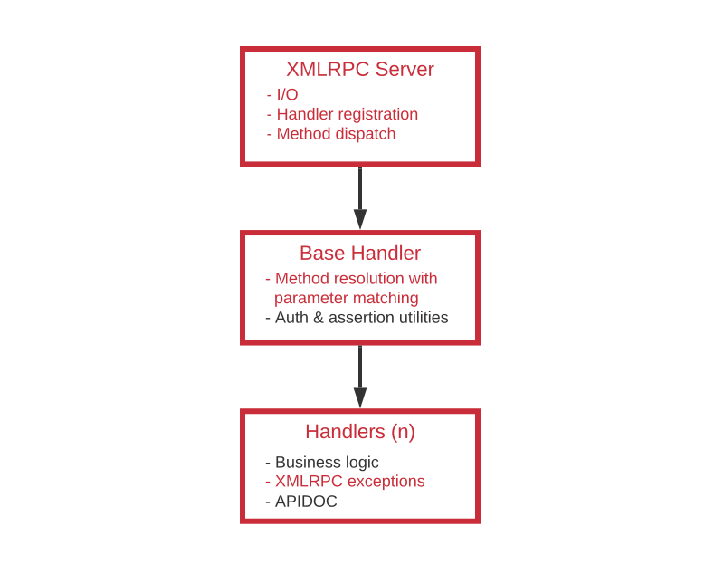
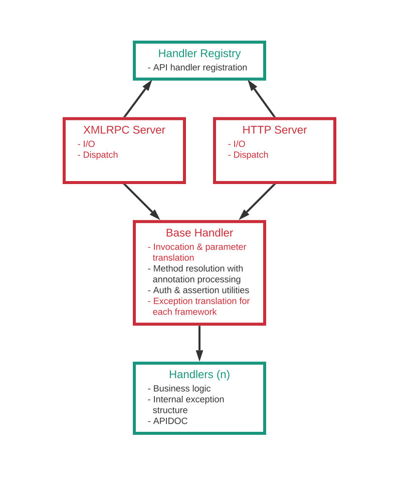

- Feature Name: HTTP API
- Start Date: 2022-02-08

# Summary

Provide an HTTP API exposing the existing methods via plain JSON, in addition to the XMLRPC protocol.


# Motivation

Reports suggest that SUSE Manager is seeing more use in automated scenarios, where it is a part of a bigger system and driven via its APIs - possibly but not necessarily a CI system.

The XMLRPC protocol has a very low barrier of entry for some use cases, notably Python programs, but as of recent years the industry has favored REST and, in general, HTTP APIs in terms of popularity and tooling support.


# Detailed Design

The design aims to provide a plain HTTP endpoint to the existing methods by reusing the available business logic with minimum redundancy. The bulk of the effort is to decouple the existing layers from protocol-dependent parts as much as possible, so that the most of the workflow can be utilized for both interfaces in an agnostic manner.


*Current workflow*

The components marked with red are tightly coupled to the XMLRPC-specific functionality, and cannot be reused with HTTP as-is. In contrast, the green parts are agnostic, and can be used for both interfaces.

The main goal is to restructure the workflow so that the agnostic parts can be isolated into separete components and be shared between two interfaces. This is especially important for handler classes, which are the linear growing components of the API implementation.

To implement the plain HTTP over JSON interface, the existing [Spark framework](https://sparkjava.com) shall be used.


*Proposed workflow*

The design is split into a number of areas that represent different aspects of the new API. The rest of the section describes each aspect in detail.

1. [Endpoint registration](#1-endpoint_registration)
2. [Authentication](#2-authentication)
3. [I/O](#3-io)
4. [Exception handling](#4-exception-handling)
5. [Security](#5-security)
6. [Documentation](#6-documentation)


## 1. Endpoint Registration

The most of the boilerplate code involves registration of the endpoint handlers, dispatching requests, and parameter matching. The XMLRPC framework provides an interface to register a class as a handler for a specific namespace. Further resolution of a method in a namespace is handled by the `BaseHandler` class using Java reflection to match the method names and parameters. `BaseHandler` is the base class that all the namespace handler classes inherit from.

On the HTTP side, Spark allows registration of an endpoint as a "route" per each endpoint method, optionally including a number of named route parameters that construct the route path.

The actual handler methods are designed to use POJOs as parameters. However, Spark expects a specific signature that takes `request` and `response` as parameters for route handlers. A simple wrapper shall unpack the parameters from the request and call the appropriate handler method for each request.

A typical resource-oriented REST API relies on various HTTP verbs to provide contextual information on what type of operation an endpoint is used for. However, the XMLRPC protocol is designed around methods, rather than resources. Therefore, HTTP verbs will be restricted to GET for read-only, and POST for read-write operations regardless of whether they require a payload or not.

Spark provides 3 common ways to attach data to a request. Named route parameters that are part of the base URL, querystring parameters, or the payload itself.

For primitive types, either route parameters or querystring parameters may be used. The desired method shall be specified using a parameter annotation in the handler method signature (explained below).

For complex types, the request payload of type `JSON` must be used. The Spark route wrapper shall unpack the payload using the `GSON` library.

The exposed HTTP routes shall follow the same namespace-method structure with a few extensions:

```
/rhn/api/namespace/method[/:route/:params][?query=params]
```

On each request, the Spark route wrapper shall unpack both types of arguments in the request, deserialize the payload, and call the appropriate handler method with unpacked arguments.

To provide a uniform approach to handler registration, Java annotations can be used to specify a method as an endpoint handler. These annotations can be interpreted during initialization to register all the handlers to both frameworks. As a side benefit, all the handler classes in a predetermined package tree can be automatically identified, without the need to add them in a list manually.

Java annotations shall also be used to determine attributes of an endpoint, such as whether it is a read-only method or not.

Below is an example of such an annotation structure:

#### @ApiHandler("namespace") Target=Class

A class marked with this annotation will be registered as the handler of the specified namespace in the XMLRPC framework. The class will further be inspected on initialization to discover any annotated handler methods. Found methods will be registered to Spark as route handlers.

#### @XmlRpcApiEndpoint Target=Method
#### @HttpApiEndpoint Target=Method

Each of these annotations shall mark a method to act as a handler for one of the APIs.

**HTTP:** these methods will be registered to Spark as route handlers during initialization.

**XMLRPC:** `BaseHandler` will search for a requested method in a list of methods annotated with `@XmlRpcApiEndpoint` in the class during a request.

In most cases, both annotations shall be used together. Exclusive use of any of them shall be reserved for edge cases where the endpoint is not applicable to the specific protocol.

#### @ReadOnly Target=Method

An endpoint handled by this method will be set as a read-only endpoint.

**HTTP:** Spark will create `GET` endpoints for the methods marked with this annotation. If not used, Spark's method wrapper will check the requesting user and block access if restricted.

**XMLRPC:** `BaseHandler` will check this annotation against the requesting user and block access if restricted.

#### @Unauthorized Target=Method

An endpoint annotated with `@Unauthorized` may be called with or without a logged in user. The handler method may or may not have a `User` parameter in the signature. If it has, the parameter may be `null`, in case the user is not logged in.

#### @RouteParam Target=Parameter

This annotation specifies a parameter to be represented as a route parameter, rather than a querystring parameter. `@RouteParam` may not be used for object types as they have to be transferred via the request body.

### Example 1

Consider the following XMLRPC handler method:
```java
public ActivationKey getDetails(User user, String key)
```

With the proposed annotations, it may be written as:
```java
@XmlRpcApiEndpoint
@HttpApiEndpoint
@ReadOnly
public ActivationKey getDetails(User user, String key)
```

At registration, Spark route wrapper will create the following route definition for this method:

```java
// GET https://uyuni.server/rhn/api/activationkey/get_details?key=1-DEFAULT

get("/activationkey/get_details", (req, res) -> {
  // 1.Unwrap the session user, and the querystring parameter named "key"
  // 2.call to the `getDetails` method, passing the unwrapped arguments
  // 3.serialize and return the JSON result
});
```

### Example 2

Consider the following XMLRPC handler method:
```java
public ContentProject updateProject(User user, String label, Map<String, Object> props)
```

With the proposed annotations, it may be written as:
```java
@XmlRpcApiEndpoint
@HttpApiEndpoint
public ContentProject updateProject(User user, @RouteParam String label, Map<String, Object> props)
```

At registration, Spark route wrapper will create the following route definition for this method:

```java
// POST https://uyuni.server/rhn/api/contentmanagement/update_project/myproject

post("/contentmanagement/update_project/:label", (req, res) -> {
  // 1.Unwrap the session user, the route parameter named "label",
  //   and the JSON object named "props" from the request body
  // 2.call to the `updateProject` method, passing the unwrapped arguments
  // 3.serialize and return the JSON result
});
```


## 2. Authentication

The web UI performs token-based authentication via a session cookie called `pxt-session-cookie`. Currently, the web UI login page exposes an API endpoint to support this process. This endpoint shall also be used for API authentication.


## 3. I/O

On the HTTP API side, I/O serialization is mostly handled by Spark, and the existing `GSON` library. XMLRPC uses specialized "serializer" classes to write structured output on XML. These serializer classes shall be used exclusively for the XMLRPC output.


## 4. Error Reporting

The current implementation of the business logic uses exceptions that are designed specifically for XMLRPC (see: `FaultException` and subclasses). To be able to use the business logic with both interfaces, a new, internal exception structure shall be designed to offer enough flexibility in exception handling. These exceptions are then translated to the specific interface, and processed accordingly. For HTTP endpoints, the internal exceptions can be represented by different HTTP status codes where appropriate.

This is the main point that couples the business logic with a specific interface, and will require the most work to implement.


## 5. Security

The HTTP interface reuses the existing Spark framework. Therefore, we're typically not exposed to any new security issues. However, with the introduction of the new API, existing interface will be more critical for external use, so it would be beneficial to propose an approach to security testing.


## 6. Documentation

APIDOC is an extensive tool that automatically generates documentation for the API endpoints written in many languages. It can be used to generate the documentation for the HTTP API as well.
More research is required to provide the framework for creating documentation for both interfaces with minimum duplication.


# Unresolved Questions

We use the term REST causally when describing the HTTP API, but as covered in this document, we don't intend to implement "REST" in a traditional way. Therefore, the term REST might be misleading for the user. On the other hand, "HTTP API" does not reflect the whole picture as well, since the existing XMLRPC API technically also utilizes HTTP. For the most clarity, we must determine a standard name for the API and use it consistently on all user-facing media (web UI, documentation, etc.).
