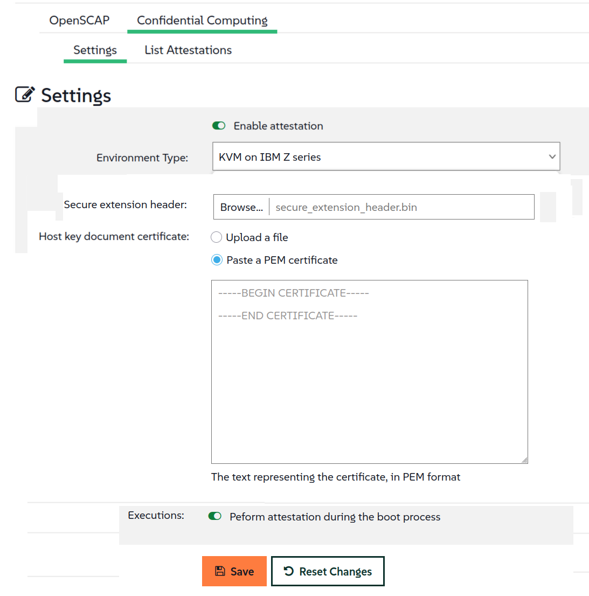

- Feature Name: Confidential Compute Attestation for IBM Z series
- Start Date: 2026-03-31

# Summary
[summary]: #summary

Extension of the Multi Linux Manager confidential computing attestation mechanism to secure KVM images
running on IBM Z series mainframes

# Motivation
[motivation]: #motivation

More and more systems run as virtual machines or (public) cloud instances. 
Customers want to be sure that the data of these VMs, which is loaded in memory, 
cannot be read by administrators or the cloud provider.
Confidential computing is the way to solve this problem. 

Multi Linux Manager already provides a confidential computing attestation mechanism for AMD processor families.
Now this attestation mechanism should be extended also to VMs running on IBM Z series machines.

With this change, we are moving from one-only kind of attestation environment (AMD) to (potentially) many ones, 
so some adaptations to the code are expected. A side effect outcome is that the next extension
will be probably simpler. 


# Detailed design
[design]: #detailed-design


## Key concepts about IBM attestation

### Host key document

Host key document is basically the public key associated to a specific server instance.  
Every IBM Z series server is equipped with a private host key that is specific to that particular server.
This private key is “buried” and protected by hardware and firmware, so that nobody can access or manipulate
the private host key.   
The host key document is necessary to build a secure VM image, to ensure that the created image can run
on that particular host. Therefore the image creator can provide it. The host key document is **not** security
sensitive, since it’s basically a public key of the host.


### Secure execution header

When building a secure VM image, the kernel, initial RAM file system, and parameter file are encrypted into
an integrity-protected file that contains all information required for booting.  
This file is called **Secure Execution Header**, and it is cryptographically signed with the aforementioned 
host key document.  

The secure execution header is also holding the information of all the hosts we want to run the VM image into
(if the image is meant to run on more than one host).

This file is an outcome of the process of building a secure VM image, therefore the image creator can provide it.
The Secure Execution Header is **not** security-sensitive, because it is safeguarded such that only the Ultravisor
from a target host can verify its integrity and access the confidential data within the header itself.


## The attestation process for IBM Z series 

IBM provides a script named `pvattest` to perform all confidential computing operations needed.  
This command is inside the package `s390-tools` (https://github.com/ibm-s390-linux/s390-tools 
and https://build.opensuse.org/package/show/openSUSE:Factory/s390-tools).  
**Important**: the package `s390-tools` is currently provided only on x86_64 and s390x platforms.  


## Step 0: checking the `pvattest` script
Be aware:  in order to run all the preparation and verification commands (`pvattest create`, `pvattest verify`)
the MLM server should install the package `s390-tools`.

When on the guest/minion, it is not necessary to check if the system is z16 or z17: if the confidential computing
attestation is not supported, the `pvattest` command will fail anyway.


## Step 1: Preparation of the attestation request
The tool `pvattest` requires to create a binary file as an attestation request document, in order to then perform
the attestation execution measurement.

**Inputs**:
- **host key document**
- (if the verify mode is used - see below) the certificates used to establish a chain of trust for the verification
of the host key document.
Two certificates are needed:
  - the **IBM Z host signing-key** certificate
  - the **root CA** certificate  

**Outputs**:  
- **attestation_request.bin**: a binary file of the created attestation request
- **attestation_protection_key.key**: a randomly generated AES-256-GCM key that protects the attestation request,
generated by the `pvattest` tool, and that will be used for the attestation verification  

**Command example**:
```
pvattest create -v
  -k input/host_key_document.crt
  --no-verify
  -o output/attestation_request.bin
  -a output/attestation_protection_key.key
  --add-data phkh-img
  --add-data phkh-att
```
**Command example (with verification)**:
```
pvattest create -v
  -k input/host_key_document.crt
  -C input/DigiCertCA.crt
  -C input/ibm-z-host-key-signing.crt
  -o output/attestation_request_with_verify.bin
  -a output/attestation_protection_key_with_verify.key
  --add-data phkh-img
  --add-data phkh-att
```

----  
### Architectural choice n. 1: How to compute the attestation request?
The command `pvattest create` can be run using the `--no-verify` flag, thus disabling the host-key
document verification. This requires the host-key document to be valid.

Here there are the two potential ways of doing it:

#### 1A) use the --no-verify flag
>  we assume that the user is providing the correct and valid host-key document. If not, the whole chain of
> verification does not work anyway  
> 
>pros:
>- simpler management of the command, no need to get and store other intermediate certificates, less chance of
>command failure.
>- after all, if the host-key document is the wrong one (the one of another machine) or expired, the whole 
verification chain does not work anyway.
>
> cons:
>- if the host-key document certificate given by the user is NOT valid, it cannot be discovered earlier in the process.
>- IBM recommends to use this flag only for testing purposes.

#### 1B) do NOT use the --no-verify flag and provide the two certificates for host-key document verification
>pros:  
> 
>- IBM recommends to do the verification every time  
>-  we can provide earlier feedback to the customer if the host-key document certificate is invalid
(expired or the wrong one)
>
>cons:
>- the two intermediate certificates for validation must be obtained (`DigiCertCA.crt` and `ibm-z-host-key-signing.crt`)
>- their expiry date has to be monitored and new ones must be obtained if the case
>- the more arguments you put, the more the chances the command to fail for some reason

#### Final architectural choice 1):
TBD   

----
### Architectural choice n. 2:  Where to compute the attestation request?
The `pvattest` tool must be installed in the place where the attestation request is computed.

#### 2A) Compute the attestation request on the MLM server
>pros:
>
>- the `pvattest create` command outputs (`attestation_request.bin` and `attestation_protection_key.key`)
can be directly and immediately stored in the MLM database
>
>cons:
>- `s390-tools` package dependency must be installed on MLM server even if no IBM minions are enrolled
(package pollution)
>- what if MLM server is not running on one of the platforms supporting `s390-tools` package?

#### 2B) Compute the attestation request on the coco-attestation microservice
>pros:
> 
>- s390-tools package dependency is installed anyway, to do the attestation verification of IBM Z  
>- the “listening on database row” queue mechanism already used for attestation verification can be reused:
listening to a row in the MLM database containing the host-key document certificate, and then running
the `pvattest create` command to create the attestation request  
>- the two `pvattest create` command outputs (`attestation_request.bin` and `attestation_protection_key.key`)
can be directly stored back in the MLM database with no further communication involved  
>
> cons:
>
>- If the microservice is not explicitly activated, not even the attestation measurement/execution can be done
(while for example for AMD the attestation measurement can be done but the verification is pending). 
With the microservice not activated, since the attestation verification cannot be done anyway, 
do we really bother that the attestation measurement/execution is not doable?

#### Unsafe: Compute the attestation request on the IBM Z minion
>- Although s390-tools package dependency is installed anyway, we have assume the guest/minion as “untrusted” 
(this is the whole point of the attestation).   
Therefore it is not safe to compute the request on the guest/minion itself


#### Final architectural choice 2):
TBD

----
### Architectural choice n.3:  When to compute the attestation request? Can it be reused?
   
#### 3A) Compute once and reuse it
>This solution is the simplest.  
>Please consider that the validity of the attestation request is the shortest validity of the chain of certificates
> (host_key_document, ibm-z-host-key-signing.crt,  DigiCertCA.crt).  
>Using an MLM generated random nonce data, instead of recreating the attestation request every time,
does protect us from the reply attacks, according to IBM.  
However, they never used this nonce data in this way.  
Then, although recognizing the solution is working, IBM recommends to re-create a new attestation request every time,
to avoid reply attacks (they don’t want to commit on our proposed solution).

#### 3B) Compute every time we want to run an attestation request
>This solution could be more complex, implementation is depending on where the request is computed
(result of architectural choice n.2).

#### Final architectural choice 3):
TBD


## Step 2: Run the attestation measurement/execution to get the attestation report
Once the attestation request has been created, an attestation measurement must be done on the minion to get an
attestation report.

**Where**: on the minion/secguest (this needs `/dev/uv`)  

**Inputs**:
- **attestation_request.bin** (the generated attestation measurement request)
- **random_user_nonce.txt** (file with random user generated nonce)

**Outputs**:
- **attestation_report.bin** (report of running a measurement to the ultravisor)

**Command example**:
```
pvattest perform -v
   -i input/attestation_request.bin
   -u input/random_user_nonce.bin
   -o output/attestation_report.bin
```

#### Note a)
If the result of the `pvattest perform` command and the calculated results do match,
the command ends with exit code 0. This can be checked by displaying the `$?` variable with the echo command

#### Note b)
The presence of the device `/dev/uv` should be checked beforehand by a simple `ls` command
```
(minion)# ls /dev/uv
```
If the uv device is not available, use `modprobe` to load the uv device module.  
```
(minion)# modprobe --first-time uvdevice
```

#### Note c)
The `random_user_nonce.txt` file is generated by MLM and contains a random user generated nonce of 256 bytes.

This data is an arbitrary user-defined data appended to the attestation measurement. It is verified during the 
attestation measurement verification.

IBM recognized that, although this argument was thought for another use and they never used the nonce data in this way,
this is solution prevents the reply attack.  
Nevertheless they don’t want to commit on our solution, so in order to avoid reply attacks,
IBM recommends to re-create a new attestation request every time.


## Step 3: Verify the attestation report to get the attestation result
When the attestation report is obtained by an attestation measurement, any third party can cryptographically 
have the proof that the confidential computing environment is genuine.

**Where**: on a trusted verifier, where the script `pvattest` can run. As per current implementation, this is run 
on a coco-attestation microservice
(see https://github.com/uyuni-project/uyuni-rfc/blob/coco-attestation/accepted/00099-coco-attestation.md)

**Inputs**:
- **attestation_report.bin** (attestation report to be verified)
- **secure_extension_header.bin** (secure extension header of the guest image)
- **attestation_protection_key.key** (The generated GCM-AES256 key that protects the attestation request/result)

**Outputs**:
- **attestation_result.yaml** (output for the verification result)
- **attestation_verification_random_user_nonce.txt** (verification of the random user nonce to be matched with
the random user generated nonce file random_user_nonce.txt)

**Command example**:
```
pvattest verify -v
   -i input/attestation_report.bin
   --hdr input/secure_extension_header.bin
   --a input/attestation_request_protection_key.key
   -u output/attestation_verification_random_user_nonce.txt
   -o output/attestation_result.yaml
```

# Implementation details

## Modification on the settings to add some settings inputs




For all AMD environment types, the settings page looks like the current one. Basically there are no specific
settings input to AMD.  
For IBM Z environment there are two input items to be added to the general settings:
1) the secure extension header file (binary file of about 1040 bytes to be loaded)
2) the host key document certificate (the control can be reused from the one used to register a new peripheral server)

These two data items need to be stored in the MLM database.

### Implementation proposal:
**Store those additional inputs where the other inputs are**, that is in table `suseServerCoCoAttestationConfig`
(object `ServerCoCoAttestationConfig`)

We should expand the table, adding the following 3 fields

- **in_data jsonb NOT NULL**

>This field will contain data coming from settings input  (base 64 encoded, as json)  
>  - hostKeyDocument  
>  - secureExtensionHeader

- **out_data jsonb NOT NULL**

>This field will contain the result of creating the attestation request from the input data (base 64 encoded, as json)
> - attestation measurement request (binary file, about 500 bytes)
> - attestation_protection_key (key, 32 bytes)

- **status character varying(32) COLLATE pg_catalog."default" NOT NULL**
> The status field should be one of:
> - PENDING when new and waiting for the attestation request creation
> - SUCCEEDED if the creation of the attestation request is ok
> - FAILED if for some reason (wrong or insufficient in_data) the attestation request creation fails
> 
> For AMD inputs, the status field is only and always SUCCEEDED

The status field is imitating the one present on table `suseCoCoAttestationResult`.  
This field is needed if we want to create the attestation request from an external microservice
(e.g. the coco attestator)

**Also**:
- add the same CONSTRAINTS present on suseCoCoAttestationResult status field
- add the same TRIGGERS present on suseCoCoAttestationResult status field

The trigger(s) are needed if we want to create the attestation request from an external microservice

## Communicating and running attestation execution on the minion

The communication happens applying salt states
- Data input from MLM server to the minion: creation of attestation data pillar
- Running the attestation execution: state apply of a salt request data file (`requestdata.sls`)
- Data output back from the execution from the minion to the MLM server: json result of the application of
the salt state

There are 2 main modifications to be done, they can be both be related to the behaviour of the class
CoCoAttestationAction

### Modification A: different salt states for each environment
The method `CoCoAttestationAction.getSaltCalls` must call `State.apply` with a different salt request data file
depending on the type of attestation. In fact, depending on AMD or IBM environment, different input data,
tool requests and outputs are needed.

### Implementation proposal:
**Salt state file**:  
- A single state apply file is kept (`requestdata.sls`), instead of having a different file for each environment
- The file `requestdata.sls` is reorganised like:
  - the file `requestdata.sls` performs only a switch on the pillar test types and calls sub-states 
(to keep the file manageable and to avoid mixing different tools inputs and results)
  - each sub-state is a separate `sls` state file, with the definitions of that state (separation of concerns), e.g.:
    - `amd_epyc_snpguest_request.sls` (for AMD environment)
    - `ibm_z_pvattest_request.sls` (for IBM environment)

**Pillar data**:
Different pillar data needs to be generated for the different environments (see `AttestationManager.initializeReport`).

Pillar data is generated/retrieved like this:
- CoCoConfiguration object has the enum CoCoEnvironmentType
- CoCoEnvironmentType enum object has a list of supported result types of enum CoCoResultType
- CoCoResultType enum object will be expanded to contain an object of class CoCoAttestationDataCreator or derived
 (different for AMD and IBM results)
- A hierarchy of classes derived from `CoCoAttestationDataCreator` 
(`CoCoAmdSevSnpAttestationDataCreator`, `CoCoIbmPvattestAttestationDataCreator`) is created
- `CoCoAttestationDataCreator` object implements a method `buildAttestationInputData`, 
that returns a map of the pillars to be created

For a proof of concept of this solution, see https://github.com/uyuni-project/uyuni/pull/11656/commits 
(proof of concept on how to generate different pillar data needed as input for different attestations)

### Modification B: different salt state results for each environment method

Overridden method `CoCoAttestationAction.handleUpdateServerAction` must parse jsonResult coming from the 
salt state apply results.

### Implementation proposal:
Instead of creating a hierarchy of derived actions (one per environment), we let a class `CoCoAttestationRequestData`
parse the json result from the salt state apply.  
In particular:

- The class `CoCoAttestationRequestData` implements a method void  `parse(JsonElement jsonResult) ` aimed at parsing 
the aforementioned json result
- A hierarchy of helper classes is created to parse the json result (e.g. `CoCoAmdEpycAttestationRequestData`
and `CoCoSecureBootAttestationRequestData` and `CoCoIbmPvattestAttestationRequestData`).
These classes parse and convert StateApplyResult items out of a json file returned from a State.apply of a salt state,
which is different depending on the single class
- The class `CoCoAttestationRequestData` contains a list of one of each of the helper classes
- When method `parse()` is called, the `CoCoAttestationRequestData` class parses the JsonElement on all the
helper classes instances, so that every helper class can parse their results of type `StateApplyResult<CmdResult>`
using the @SerializedName annotation
- The helper classes not finding any correspondence will have their results put as `null`
- The class `CoCoAttestationRequestData` implements a method `Map<String, Object> asMap()` 
aimed at collecting the parsed data.
- The json file stored in the database as report result coming from the aforementioned `asMap()` method can avoid 
to render `null` values, so that the final json is holding only real information.

For a proof of concept of this solution, see https://github.com/uyuni-project/uyuni/pull/11656/commits 
(proof of concept on how to partition CoCoAttestationRequestData (see CoCoAttestationRequestDataCarlo and
CoCoAttestationRequestDataCarlo2)


### New service to create attestation requests, to be added to coco-attestation microservice 
If we decide to create the requests on the coco-attestation microservice in previously mentioned
Architectural choice n. 2, we need to implement the creation of the attestation request in the coco-attestation
microservice. If not, this paragraph can be ignored.

### Implementation proposal:
The mechanism is similar to the existing one for the attestation verification.
This time the microservice should listen to the trigger on the newly inserted field status in the table
`suseServerCoCoAttestationConfig`. Once a new row is added and the status is “pending”, then the microservice activates,
retrieves the configuration row, runs the `pvattest create` script and  stores the results in the output data column
of the same table row


**Steps**:
- listens to rows in table suseServerCoCoAttestationConfig with pending attestation_request_status, with a query like:
  - `SELECT id FROM suseServerCoCoAttestationConfig WHERE attestation_request_status = 'PENDING' AND env_type = IBM_Z`
- locks row to be processed and retrieves the data of the locked row, with a query like:
  - `SELECT id, host_key_document FROM suseServerCoCoAttestationConfig WHERE id = #{rid}`
- creates/spawns an `AttestationWorker`, based on the env_type/result_type field
- gets the locked row in `suseServerCoCoAttestationConfig`
- processes the config data and creates an attestation request and its protection key
- updates table `suseServerCoCoAttestationConfig` with a query like:
  - `UPDATE suseServerCoCoAttestationConfig SET attestation_request_status = #{status},
  attestation_request = #{request}, attestation_protection_key = #{protectionKey} WHERE id = #{id}`


# Drawbacks
[drawbacks]: #drawbacks

Currently limited to KVM secure image guests.

# Alternatives
[alternatives]: #alternatives

N/A

# Unresolved questions
[unresolved]: #unresolved-questions

- none at the moment
