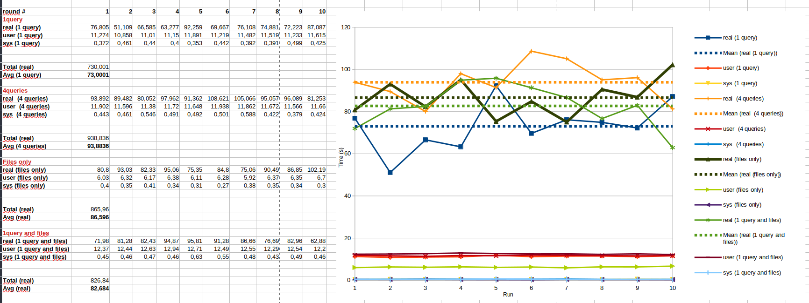

- Feature Name: Database backed salt pillar storage
- Start Date: 2021-01-13
- RFC PR: https://github.com/uyuni-project/uyuni-rfc/pull/51

# Summary
[summary]: #summary

Use database as a storage for Uyuni salt pillars instead of plain files.

# Motivation
[motivation]: #motivation

Pillars are used for passing reliable and trustworthy data to salt clients. Salt integration into Uyuni generates pillar files which are then loaded to the salt ecosystem by Uyuni external pillar.
Advantage of this solution is rather easy implementation and quick visibility of the data when inspecting in filesystem, however there are disadvantages to consider. Data consistency [issue#5678](https://github.com/SUSE/spacewalk/issues/5678) and [issue#10679](https://github.com/SUSE/spacewalk/issues/10679), [filesystem performance](https://github.com/SUSE/spacewalk/pull/10391#discussion_r375147529), backup procedure must consider these files as well.

This RFC proposes to instead of plain files, database based storage should be used for all pillars produced by Uyuni.

This is expected to help with maintaining consistency, help with backup procedure and with interserver sync as well, potential performance improvement (TBD - filesystem access vs. database indexes).

# Detailed design
[design]: #detailed-design

## Database storage

In this RFC I propose to use native JSON type of PostgreSQL ([see](https://www.postgresql.org/docs/12/datatype-json.html)) to use as a storage of the pillar data, particularly JSONB type:


```sql
CREATE TABLE suseSaltPillars
(
    id integer PRIMARY KEY GENERATED ALWAYS AS IDENTITY,
    server_id NUMERIC
              CONSTRAINT suse_salt_pillar_sid_fk
              REFERENCES rhnServer (id)
              ON DELETE CASCADE,
    group_id NUMERIC
             CONSTRAINT suse_salt_pillar_gid_fk
             REFERENCES rhnServerGroup (id)
             ON DELETE CASCADE,
    org_id NUMERIC
           CONSTRAINT suse_salt_pillar_oid_fk
           REFERENCES web_customer (id)
           ON DELETE CASCADE,
    category VARCHAR NOT NULL,
    pillar JSONB NOT NULL,
    UNIQUE (server_id, category),
    UNIQUE (group_id, category),
    UNIQUE (org_id, category),
    CONSTRAINT suse_salt_pillar_only_one_target CHECK (
      ( server_id is not null and group_id is null and org_id is null ) or
      ( server_id is null and group_id is not null and org_id is null ) or
      ( server_id is null and group_id is null and org_id is not null ) or
      ( server_id is null and group_id is null and org_id is null)
    )
);

CREATE INDEX suse_salt_pillar_server_id_idx ON suseSaltPillars (server_id);

CREATE INDEX suse_salt_pillar_group_id_idx ON suseSaltPillars (group_id);

CREATE INDEX suse_salt_pillar_org_id_idx ON suseSaltPillars (org_id);

CREATE INDEX suse_salt_pillar_category ON suseSaltPillars (category);
```

To see differences between TEXT, JSON and JSONB datatype I quote PostgreSQL documentation:

> JSON data types are for storing JSON (JavaScript Object Notation) data, as specified in RFC 7159.Such data can also be stored as text, but the JSON data types have the advantage of enforcing that each stored value is valid according to the JSON rules.
>
> The json and jsonb data types accept almost identical sets of values as input. The major practical difference is one of efficiency. The json data type stores an exact copy of the input text, which processing functions must reparse on each execution; while jsonb data is stored in a decomposed binary format that makes it slightly slower to input due to added conversion overhead, but significantly faster to process, since no reparsing is needed. jsonb also supports indexing, which can be a significant advantage.

Pillar can be minion pillar, group pillar, organizational pillar and global pillar. Although `salt` itself does not have this divisions, Uyuni does and is indeed in use e.g. in image building which creates organizational pillars and formulas with group pillars:

* Minion pillars have `server_id` FK referencing `rhnServer` row.
  This is not native to `salt`, in Uyuni world however the server id is the main identifier and Uyuni supports changing salt minion ids. To prevent errors in case of forgotten minion rename, in this RFC I suggest to use foreign key to `rhnServer` table to address minion pillars.
* Group pillars have `group_id` FK referencing `rhnServerGoup` row.
* Organizational pillar have `org_id` FK referencing `web_customer` row which is used to id organizations.
* Global pillars have all three of these FKs NULL.

Pillar can have only one target to avoid confusions. Therefore `CONSTRAINT suse_salt_pillar_only_one_target` is added to ensure each row can have only one not null foreign key.

Added `category` VARCHAR is there to provide easer manipulation and understanding of stored data. Currently all Uyuni pillar data are written using `com.suse.manager.webui.services.pillar.MinionPillarManager` (assuming [PR#3093](https://github.com/uyuni-project/uyuni/pull/3093) is merged) and each type of pillars have their own respective [generator class](https://github.com/nadvornik/uyuni/tree/custominfo/java/code/src/com/suse/manager/webui/services/pillar). To maintain some form of distinction I propose this `category` column to allow to have multiple pillar entries per salt client.

## Salt access

Salt ecosystem needs a way how to access these pillars. For this salt provides mechanism of external pillar, particularly [salt.pillar.postgres module](https://docs.saltproject.io/en/latest/ref/pillar/all/salt.pillar.postgres.html).
Accessing database can be done in one query, however that would need a change in `sql_base.py` in salt because currently it supports only one `%s` replacement for minion id.

This limitation can be solved by using postgres function and then call just function from the external pillar:

```sql
CREATE OR REPLACE FUNCTION suse_minion_pillars(
  mid VARCHAR
) RETURNS TABLE (pillar JSONB) LANGUAGE plpgsql
AS $$
DECLARE
  sid NUMERIC;
BEGIN
  SELECT server_id INTO sid FROM suseMinionInfo WHERE minion_id = mid;
  RETURN QUERY
  SELECT p.pillar from suseSaltPillars AS p WHERE (p.server_id is NULL AND p.group_id is NULL AND p.org_id is NULL)
       OR (p.org_id = (SELECT s.org_id FROM rhnServer AS s WHERE s.id = sid))
       OR (p.group_id IN (SELECT g.server_group_id FROM rhnServerGroupMembers AS g WHERE g.server_id = sid))
       OR (p.server_id = sid)
       ORDER BY CASE WHEN p.org_id IS NULL AND p.group_id IS NULL and p.server_id is NULL THEN 0 ELSE 1 END, p.org_id NULLS LAST, p.group_id ASC NULLS LAST, p.server_id ASC NULLS FIRST;
END
$$;
```

```yaml
# postgresql configuration for external pillar
postgres:
  db: susemanager
  host: localhost
  pass: spacewalk
  port: 5432
  user: spacewalk

# Configure external pillar
ext_pillar:
  - postgres:
      - query: "SELECT suse_minion_pillars(%s)"
        as_json: True
```


Alternatively database can be accessed using multiple queries, however with some performance hit:

```yaml
postgres:
  db: susemanager
  host: localhost
  pass: spacewalk
  port: 5432
  user: spacewalk

ext_pillar:
  - postgres:
      - query: "SELECT pillar from suseSaltPillars WHERE server_id is NULL AND group_id is NULL AND org_id is NULL"
        as_json: True
      - query: "SELECT pillar from suseSaltPillars WHERE org_id = (SELECT org_id FROM rhnServer AS S LEFT JOIN suseMinionInfo AS M on S.id = M.server_id WHERE M.minion_id = %s)"
        as_json: True
      - query: "SELECT pillar from suseSaltPillars WHERE group_id IN (SELECT server_group_id FROM rhnServerGroupMembers AS G LEFT JOIN suseMinionInfo AS M ON G.server_id = M.server_id WHERE M.minion_id = %s)"
        as_json: True
      - query: "SELECT pillar from suseSaltPillars WHERE server_id = (SELECT server_id FROM suseMinionInfo AS M WHERE M.minion_id = %s)"
        as_json: True
```

Salt automatically merge results from these queries, latest with the highest priority.

### Upstream changes needed

salt.pillar.postgres module, resp. salt.pillar.sql_base is not yet designed to work with JSON results directly from database and expects always to get results in *key:value* format. To enable JSON output, small patch need to be negotiated with upstream (patch against pre-blackened version):

```diff
diff --git a/salt/pillar/sql_base.py b/salt/pillar/sql_base.py
index eeb2269f77..dae0b36204 100644
--- a/salt/pillar/sql_base.py
+++ b/salt/pillar/sql_base.py
@@ -352,8 +352,13 @@ class SqlBaseExtPillar(six.with_metaclass(abc.ABCMeta, object)):
                         # dict, descend.
                         crd = crd[ret[i]]

+            # We have just one field without any key, assume returned row is already a dict
+            # aka JSON storage
+            if self.num_fields == 1:
+                crd.update(ret[0])
+
             # If this test is true, the penultimate field is the key
-            if self.depth == self.num_fields - 1:
+            elif self.depth == self.num_fields - 1:
                 nk = self.num_fields-2  # Aka, self.depth-1
                 # Should we and will we have a list at the end?
                 if ((self.as_list and (ret[nk] in crd)) or
```

Tracked in [PR#59777](https://github.com/saltstack/salt/pull/59777).

## Performance impact

I did a small scale E2E test:
* 1001 minions (one real, 1000 evil minions)
* 10 pillar items repetitions
* 4000 rows in pillar database (1000 rows per organization, group, minion and global)
* regular Uyuni pillar files for one registered minion
* default Uyuni salt worker settings (8 worker threads)

Command:

```bash
time bash -c 'for i in `seq 1 10`;do time salt "*" pillar.items >/dev/null;salt "*" test.ping > /dev/null;echo "== Round $i done"; done'       
```

Results:




### Impact of increased worker threads on database connections

In default settings, using 8 salt worker threads I observed:
  Connections to postgres up to 14
  Postgres backends up to 6


Given the discrepancy between number of salt clients and opened connections to the database, I increased number of salt worker threads to test hypothesis that indeed number of salt threads is limiting number of connections to the database. Upon increasing salt worker threads to 28 I got following results:


  Connections to postgres up to 44
  Postgres backends up to 14


In conclusion I do not see performance impact in this isolated scenario. Number of opened connections is correlated with number of salt worker threads, this needs to be taking into account in case of tuning individual installations.

# Drawbacks
[drawbacks]: #drawbacks

Why should we **not** do this?

* what other parts of the product will be affected?
  
  Salt integration and thus basically whole product is affected.
  
* will the solution be hard to maintain in the future?
  
  I expect easier maintaining then with file generators.

* Hibernate support

  Hibernate itself does not support JSONB data type. It is possible to either implement our own user type in hibernate or use (and package) existing project [hibernate-types](https://github.com/vladmihalcea/hibernate-types).
  
* Affecting users usage patterns

  Example is lack of OS Images import capability that lead some users to use their own solution - copy both OS image and pillar files from one Uyuni to another. This works currently, but switching from file based pillars to database will break their unsupported, but working solution.
  Mitigation in this scenario is just not to use database backed pillar for images until there is another way to move the images, but there may be other users who depends on how pillars currently work in Uyuni.

# Alternatives
[alternatives]: #alternatives

- Use single pillar row for each minion and without `category` column.

This was the original idea how to implement this, however during prototype implementation having separate rows for separate pillar data made implementation better match how it is done now. I am not opposed using single row per minion, but I also do not see disadvantages for using multiple rows per minion.

- Instead of using upstream `salt.pillar.postgres` module, option is to write our own customized for Uyuni database. This would help for example with integrating formula pillars into database at minimal costs to adapt formula system. As formulas are not storing complete pillar information, rather in format of changes to form.yml. So `suma_minion.py` on top of loading formula pillar JSON needs to parse formula `form.yml` and merge data properly. Our custom db module would be able to read formula JSON pillar from database and do the same parsing of `form.yml` and data merge.

- Use single `target` column instead of three FK columns:
  ```sql
  CREATE TABLE suseSaltPillars
  (
      target VARCHAR(256) NOT NULL,
      category VARCHAR,
      pillar JSONB
  );
  
  CREATE INDEX suse_salt_pillar_target_idx ON suseSaltPillars (target);
  ```
  
  This was original idea for this PR, but this had problem with minion id renaming.
  
  `target` column is to contain `minion_id` of salt client, however to support universal and system group pillars I opted to use VARCHAR with limit of 256 (as is the limit of minion id, group name is limited to 64 characters). For universal pillar I propose to use `*` character.
  
  Integration with salt would then use postgresql external pillar configuration:
  ```yaml
  postgres:
    db: susemanager
    host: localhost
    pass: spacewalk
    port: 5432
    user: spacewalk

  ext_pillar:
    - postgres:
        - query: "SELECT pillar from suseSaltPillars WHERE target = '*'"
        - query: "SELECT pillar from suseSaltPillars WHERE target = (SELECT CONCAT('org_id:', org_id::VARCHAR) FROM rhnServer AS S LEFT JOIN suseMinionInfo AS M on S.id = M.server_id WHERE M.minion_id = %s)"
        - query: "SELECT pillar from suseSaltPillars WHERE target IN (SELECT CONCAT('group_id:', server_group_id::VARCHAR) FROM rhnServerGroupMembers AS G LEFT JOIN suseMinionInfo AS M ON G.server_id = M.server_id WHERE M.minion_id = %s)"
        - query: "SELECT pillar from suseSaltPillars WHERE target = %s"
  ```
  
  This example contains three different queries:
  - Universal pillars looking for target `*`
  - Organization pillars looking for target `org_id:<organization id>`
  - Group pillars. This is done by looking up salt client `server_id` using its `minion_id` joining server group membership table to obtain `server_group_id` set where salt client is a member. Then looking up target `group_id:<group id>` in this result set.
  - Minion pillars looking for `minion_id`

  Responsibility to provide up to date data remains, as is the case today, on the component changing the data. That means, when information about minion is changed, then relevant pillar generator must be called to refresh the pillar in database.
  However with the pillar in database and loosely (no foreign key relation) connected to minions and groups, database trigger which can remove pillar entries when minion or group is removed:

  ```sql
  CREATE OR REPLACE FUNCTION minion_removed() RETURNS TRIGGER AS $$
  BEGIN
    DELETE FROM suseSaltPillars WHERE target = OLD.minion_id;
    RETURN OLD;
  END $$ LANGUAGE PLPGSQL;

  CREATE OR REPLACE FUNCTION group_removed() RETURNS TRIGGER AS $$
  BEGIN
    DELETE FROM suseSaltPillars WHERE target = CONCAT('group_id:',OLD.id::VARCHAR);
    RETURN OLD;
  END $$ LANGUAGE PLPGSQL;

  CREATE TRIGGER minion_removed BEFORE DELETE ON suseMinionInfo FOR EACH ROW EXECUTE PROCEDURE minion_removed();

  CREATE TRIGGER group_removed BEFORE DELETE ON rhnServerGroup FOR EACH ROW EXECUTE PROCEDURE group_removed();
  ```

  In case of organization removal, enhance `delete_org` stored procedure to delete organizational pillar as well.


# Unresolved questions
[unresolved]: #unresolved-questions

- Migration from file based pillars to database based pillars need to be part of the implementation. However I did not yet touch this subject how to exactly perform migration.
  Needs to take care also about messaging the change to users in clear and visible manner not to surprise users with change of behaviour.
