- Feature Name: mqtt_event_publisher
- Start Date: 2026-06-11

# Summary
[summary]: #summary

Add an MQTT event publisher to the Uyuni reactor pipeline. When certain
Salt events come in (system registered, job finished, state applied, etc.),
we publish a JSON message to a local Mosquitto broker so that external
tools — Node-RED, Grafana, custom scripts — can subscribe and react
without polling the API.

The first version covers five event types: system registration, job
completion, state application, image deployment, and batch operations.

# Motivation
[motivation]: #motivation

Right now Uyuni keeps all Salt events inside the Java server. If an
external tool wants to know when a minion registers or a highstate fails,
the only option is polling the XML-RPC / HTTP API. That adds latency
and puts extra load on the server for no good reason.

MQTT is a lightweight publish/subscribe protocol that is already widely
adopted in infrastructure automation and IoT. Mosquitto, the reference
broker implementation, is packaged and available on openSUSE and SLES.
Publishing reactor events to MQTT gives us:

- Admins can see registration, job, and state events as they happen,
  no polling needed.
- Node-RED or similar tools can subscribe and trigger workflows
  (post to Slack on a failed highstate, open a ticket on new registration).
- Consumers subscribe to the broker, not to Uyuni directly. Adding or
  removing a consumer does not touch the server at all.
- Event streams can feed into Prometheus Alertmanager, Grafana, or
  anything that speaks MQTT.

### Current State vs. Proposed State

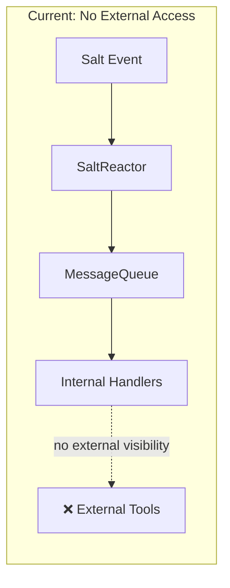

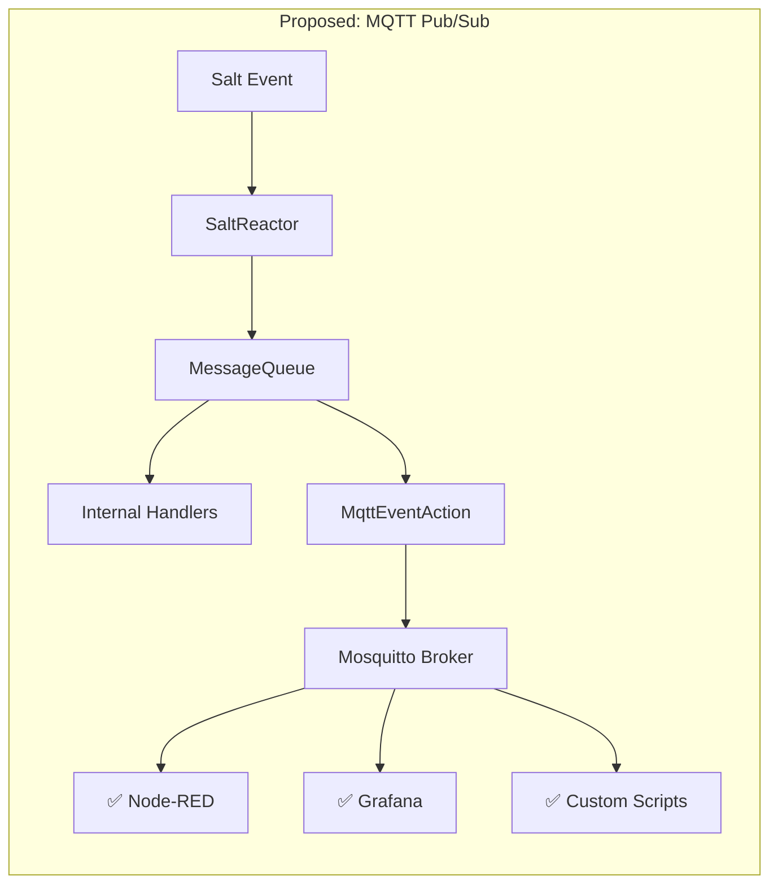

## Why MQTT?

- MQTT is an OASIS standard with broad tooling support.
- Mosquitto is lightweight (< 1 MB RSS), runs as a single process,
  and is already available in openSUSE and SLES package repositories.
- The publish/subscribe model is a natural fit: Uyuni publishes events
  and any number of consumers can subscribe without coupling.
- QoS levels (0, 1, 2) allow consumers to choose their delivery
  guarantee. QoS 1 ("at least once") provides a good balance between
  reliability and performance for operational events.
- Eclipse Paho, the reference Java MQTT client, is mature, small, and
  has no transitive dependencies beyond the JDK.

## Why Not WebSockets, Server-Sent Events, or a REST Callback?

- **WebSockets / SSE** require the consumer to maintain a persistent
  HTTP connection to the Uyuni server itself, coupling availability
  and adding load. MQTT decouples the broker from the application.
- **REST callbacks (webhooks)** require consumers to expose an HTTP
  endpoint that Uyuni pushes to. This inverts the dependency: Uyuni
  must know about every consumer, handle retries, and manage
  authentication. With MQTT, consumers subscribe independently.

# Detailed design
[design]: #detailed-design

## Architecture Overview

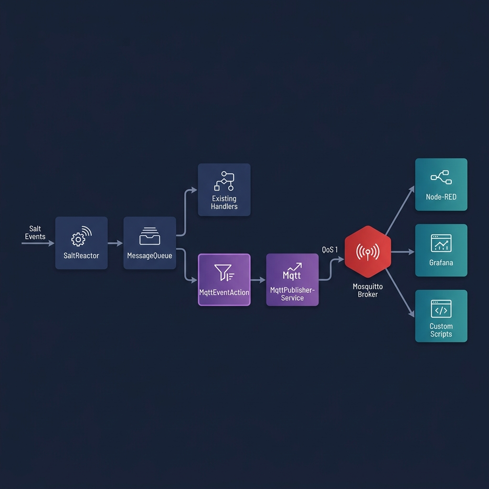

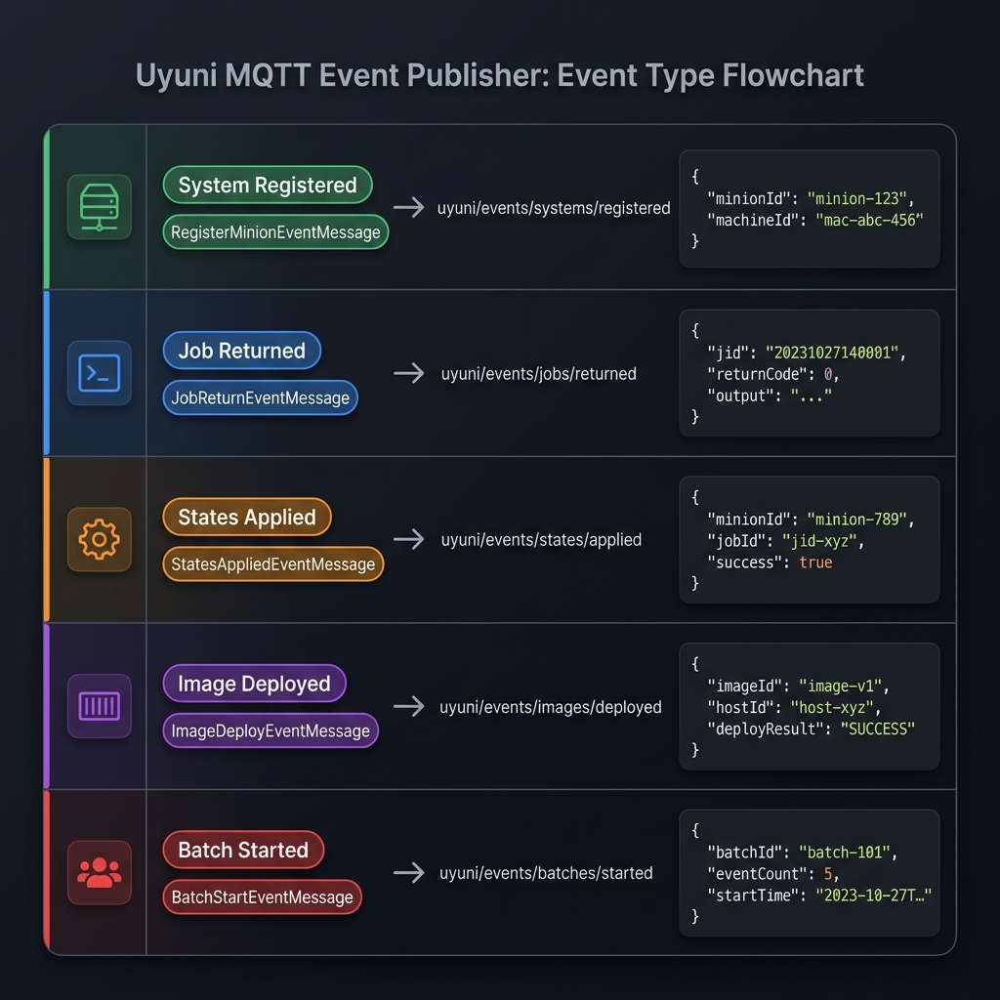

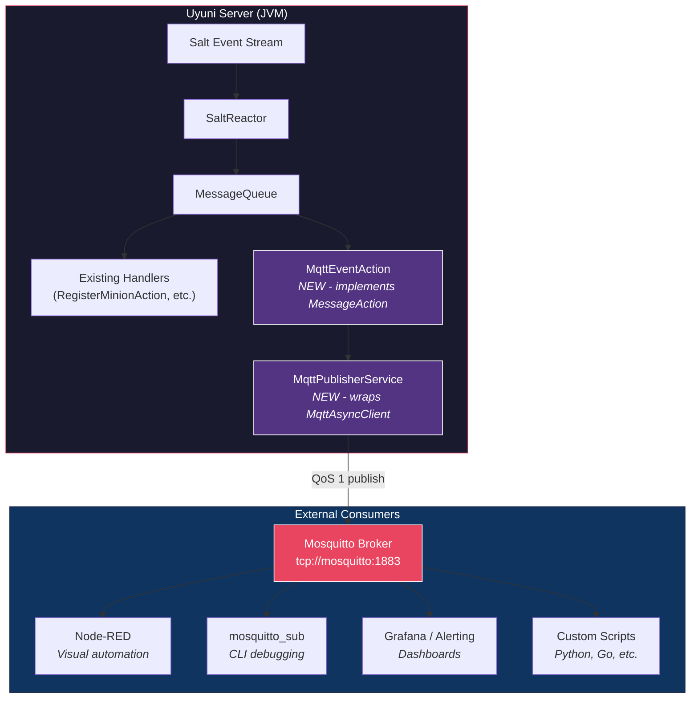

The design introduces two new classes in a new `com.suse.manager.reactor.mqtt`
package and a small registration block in the existing `SaltReactor`.

## Event Flow Sequence

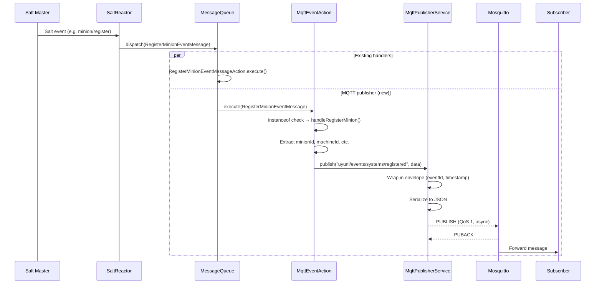

## Class Diagram

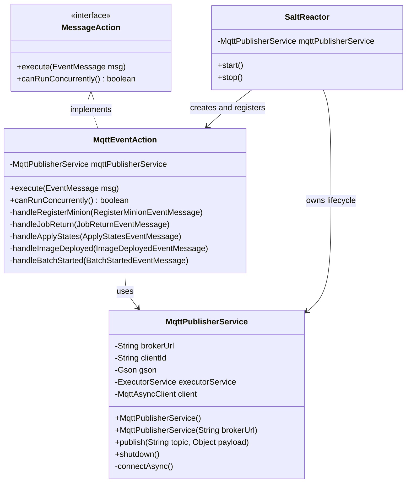

## New Dependency

The Eclipse Paho MQTT v3 client library is added as a Maven dependency:

- **Group:** `org.eclipse.paho`
- **Artifact:** `org.eclipse.paho.client.mqttv3`
- **Version:** `1.2.5`

The version is declared in the parent `java/pom.xml` BOM and consumed
without version in `java/core/pom.xml`, following the existing convention.

MQTT is chosen because the Mosquitto broker shipped with openSUSE and SLES
is lightweight and the feature does not require complex capabilities.

## MqttPublisherService

`MqttPublisherService` handles all communication with the MQTT broker.

**Responsibilities:**

- Establish and maintain an asynchronous connection to the MQTT broker
  using `MqttAsyncClient`.
- Serialize event payloads to JSON using Gson.
- Wrap each payload in a standard envelope containing `eventId`,
  `timestamp`, `topic`, and `data`.
- Publish messages at QoS 1 (at least once delivery).
- Handle reconnection automatically via the Paho `automaticReconnect`
  option.
- Provide a clean `shutdown()` method for graceful teardown.

**Key design decisions:**

1. **Asynchronous client.** The reactor sits on a hot path — we cannot
   block it waiting for a broker ACK. `MqttAsyncClient` returns right
   away and deals with delivery in the background.

2. **Single-thread executor.** All publish operations are submitted to a
   single-thread executor. This guarantees message ordering and avoids
   contention on the Paho client. The thread is created as a daemon
   thread so it does not prevent JVM shutdown.

3. **Configurable broker URL.** The default broker URL is
   `tcp://mosquitto:1883`, matching the container name in the Uyuni
   containerized deployment. It can be overridden via the JVM system
   property `uyuni.mqtt.broker.url`.

4. **Broker down? Keep going.** If the broker is not reachable at startup
   or drops mid-run, we log a warning and skip publishing. The reactor
   keeps working as usual. Once the broker is back, Paho reconnects on
   its own and events start flowing again.

5. **Envelope pattern.** Every published message includes a UUID
   `eventId` for deduplication (relevant at QoS 1, which may redeliver)
   and an ISO-8601 `timestamp` indicating when the event was published.

### Connection Lifecycle

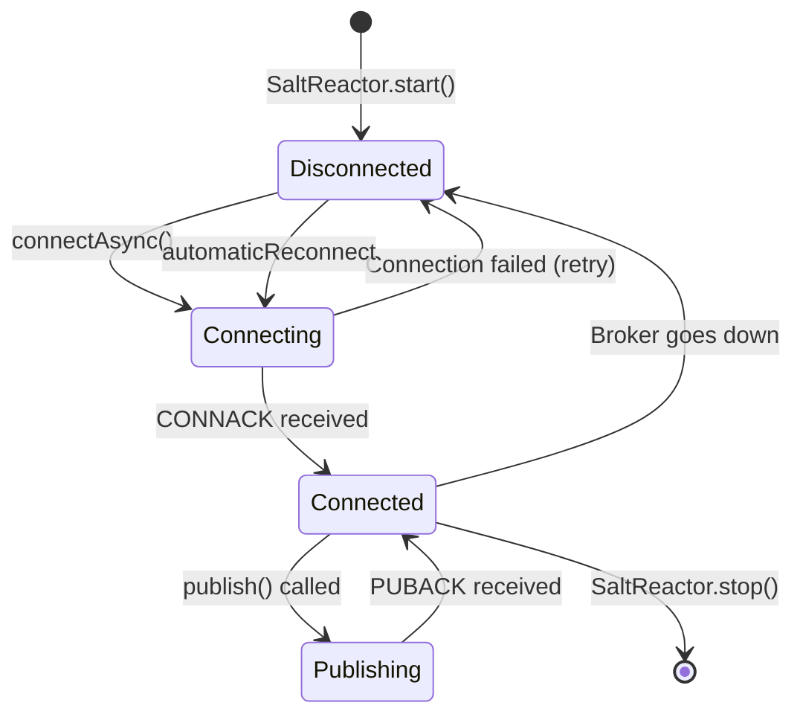

## MqttEventAction

`MqttEventAction` implements the existing `MessageAction` interface.
It maps each internal event message to the right MQTT topic and
builds the JSON payload to publish.

**Supported event types and topics:**

| Internal Event Class            | MQTT Topic                        | Trigger                    |
|---------------------------------|-----------------------------------|----------------------------|
| `RegisterMinionEventMessage`    | `uyuni/events/systems/registered` | New minion bootstrapped    |
| `JobReturnEventMessage`         | `uyuni/events/jobs/returned`      | Salt job completed         |
| `ApplyStatesEventMessage`       | `uyuni/events/states/applied`     | Highstate / state.apply    |
| `ImageDeployedEventMessage`     | `uyuni/events/images/deployed`    | OS image deployed          |
| `BatchStartedEventMessage`      | `uyuni/events/batches/started`    | Batch operation started    |

**Payload extraction:** Each handler picks out only the fields that
make sense for external consumers. For example, `handleRegisterMinion`
publishes `minionId`, `machineId`, `saltbootInitrd`, and
`managementKey` — we do not dump the entire event message object.

**Concurrency:** `canRunConcurrently()` returns `true` because the
action delegates all work to the publisher service's executor thread.
There is no shared mutable state in the action itself.

**Error handling:** All exceptions thrown during event processing are
caught and logged. A failure to publish one event does not affect the
processing of subsequent events and does not impact other registered
`MessageAction` handlers.

### Event Routing Logic

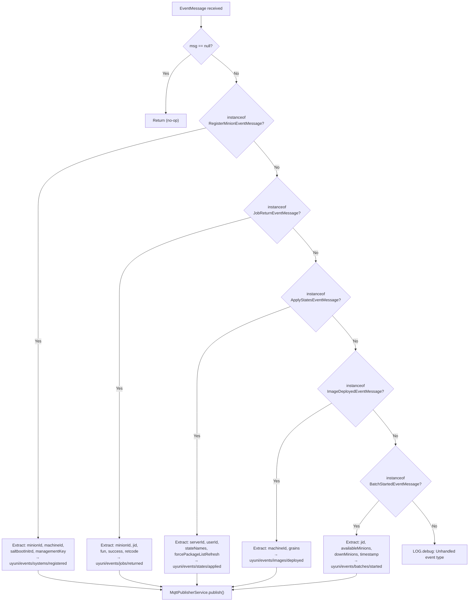

## SaltReactor Integration

The `SaltReactor.start()` method is extended to:

1. Instantiate `MqttPublisherService`.
2. Create an `MqttEventAction` with a reference to the publisher.
3. Register the action for each of the five event classes using
   `MessageQueue.registerAction()`.

The `SaltReactor.stop()` method calls `mqttPublisherService.shutdown()`
to close the broker connection and shut down the executor thread.

This is the same pattern every other handler in `SaltReactor` uses.
The MQTT action runs alongside the existing handlers — nothing
changes for current event processing.

## Topic Hierarchy

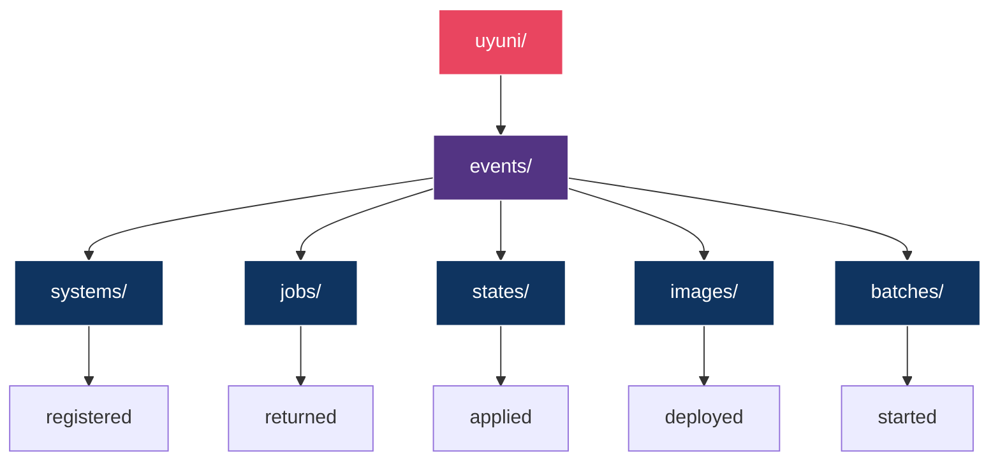

This hierarchy allows consumers to subscribe at different granularity
levels using MQTT wildcards:

- `uyuni/events/#` — all events
- `uyuni/events/systems/#` — only system lifecycle events
- `uyuni/events/jobs/#` — only job events

## Message Envelope Format

Every message published to the broker has a consistent JSON envelope:

```json
{
  "eventId": "a1b2c3d4-e5f6-7890-abcd-ef1234567890",
  "timestamp": "2026-06-11T10:30:00.000Z",
  "topic": "uyuni/events/systems/registered",
  "data": {
    "minionId": "web-server-01.example.com",
    "machineId": "550e8400-e29b-41d4-a716-446655440000",
    "saltbootInitrd": false,
    "managementKey": "1-default"
  }
}
```

### Payload Fields per Event Type

**`uyuni/events/systems/registered`**

| Field            | Type    | Description                                  |
|------------------|---------|----------------------------------------------|
| `minionId`       | String  | Salt minion ID                               |
| `machineId`      | String  | Hardware machine ID (from grains, if present) |
| `saltbootInitrd` | Boolean | Whether this is a Saltboot PXE registration   |
| `managementKey`  | String  | Activation key used (if any)                  |

**`uyuni/events/jobs/returned`**

| Field       | Type    | Description                      |
|-------------|---------|----------------------------------|
| `minionId`  | String  | Minion that ran the job          |
| `jid`       | String  | Salt job ID                      |
| `fun`       | String  | Salt function executed           |
| `success`   | Boolean | Whether the job succeeded        |
| `retcode`   | Integer | Return code                      |
| `timestamp` | String  | When the job completed           |

**`uyuni/events/states/applied`**

| Field                     | Type     | Description                        |
|---------------------------|----------|------------------------------------|
| `serverId`                | Long     | Uyuni server ID of the target      |
| `userId`                  | Long     | User who triggered the apply       |
| `stateNames`              | String[] | Names of states applied            |
| `forcePackageListRefresh` | Boolean  | Whether package list refresh forced |
| `directCall`              | Boolean  | Whether this was a direct call      |

**`uyuni/events/images/deployed`**

| Field       | Type   | Description                        |
|-------------|--------|------------------------------------|
| `machineId` | String | Target machine ID                  |
| `grains`    | Object | Salt grains from the deployed host |

**`uyuni/events/batches/started`**

| Field              | Type     | Description                    |
|--------------------|----------|--------------------------------|
| `jid`              | String   | Batch job ID                   |
| `availableMinions` | String[] | Minions available for the batch |
| `downMinions`      | String[] | Minions reported as down       |
| `timestamp`        | String   | When the batch started         |

## Configuration

| Property                    | Default                  | Description                  |
|-----------------------------|--------------------------|------------------------------|
| `uyuni.mqtt.broker.url`     | `tcp://mosquitto:1883`   | MQTT broker connection URL   |

The property is read via `System.getProperty()` and can be set in the
Tomcat startup configuration or via JVM arguments.

## Failure Modes

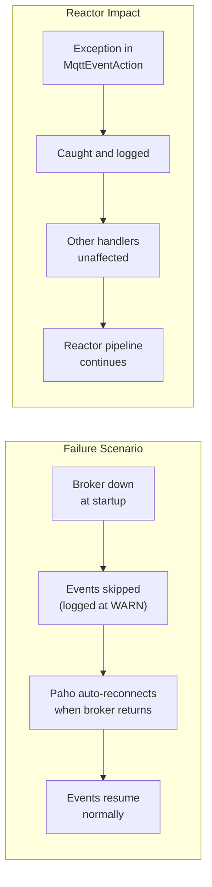

| Scenario                     | Behavior                                        |
|------------------------------|-------------------------------------------------|
| Broker not running at start  | Logged as error. Reactor starts normally.        |
| Broker goes down at runtime  | Events skipped with warning. Auto-reconnect.     |
| Broker comes back up         | Paho reconnects automatically. Events resume.    |
| Malformed event data         | Caught, logged. Other events unaffected.         |
| Paho library throws          | Caught, logged. Reactor pipeline unaffected.     |

## Files Changed

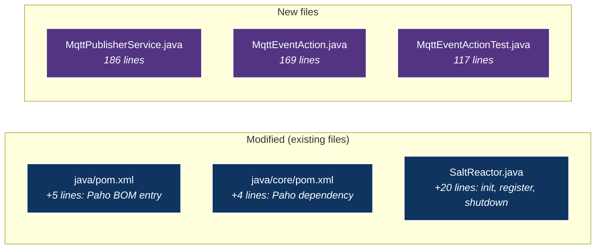

## Testing

Unit tests for `MqttEventAction` use a test spy subclass of
`MqttPublisherService` that captures the topic and payload instead of
connecting to a real broker. This verifies:

- Correct topic mapping for each event type.
- Correct payload field extraction.
- Null safety and error handling.

Integration testing against a running Mosquitto instance can be done
with `mosquitto_sub` or by connecting a Node-RED flow to the broker.

# Drawbacks
[drawbacks]: #drawbacks

- Adds a new external dependency (Eclipse Paho). However, Paho is a
  small library (< 300 KB) with no transitive dependencies.
- Requires a Mosquitto broker to be deployed alongside Uyuni. In the
  containerized deployment this is straightforward (sidecar container).
  On traditional installations it requires installing and enabling the
  `mosquitto` package.
- Events published before the broker connects are dropped (not buffered
  indefinitely). This is a deliberate choice to avoid unbounded memory
  usage, but means the first few seconds after startup may have gaps.

# Alternatives
[alternatives]: #alternatives

- **Salt's own event bus** — Salt already has a ZeroMQ-based event bus,
  but it requires a Salt API listener, uses a different wire format,
  and is not accessible to tools that do not speak the Salt protocol.
- **WebSocket endpoint in Uyuni** — Would couple consumers to the Uyuni
  web application lifecycle. A broker provides better decoupling.
- **Database triggers + polling** — Higher latency, more complexity,
  and adds load to the database.
- **Apache Kafka** — Much heavier infrastructure requirement. MQTT is
  sufficient for the expected event throughput and is simpler to deploy.

# Unresolved questions
[unresolved]: #unresolved-questions

- Should the set of published event types be configurable (e.g. via a
  system property or database setting), or is the hardcoded set of five
  sufficient for the initial release?
- Should the publisher buffer a bounded number of events when the broker
  is temporarily unavailable, or is the current skip-and-log behavior
  acceptable?
- Should the MQTT topic prefix (`uyuni/events/`) be configurable to
  support multi-server environments where each Uyuni instance publishes
  to a shared broker?
- Authentication and TLS: should the first version support
  username/password or TLS client certificates for broker connections,
  or is unauthenticated localhost-only access sufficient initially?
