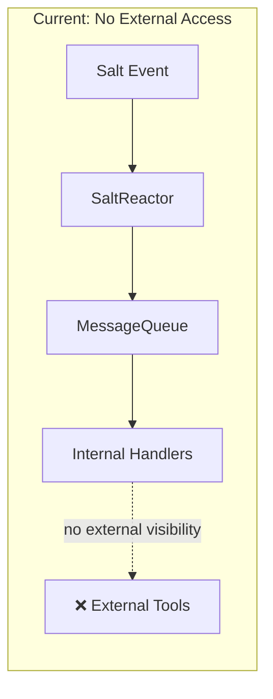
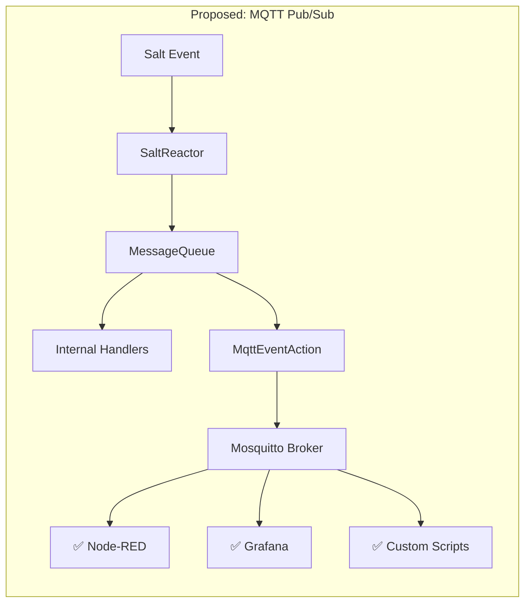
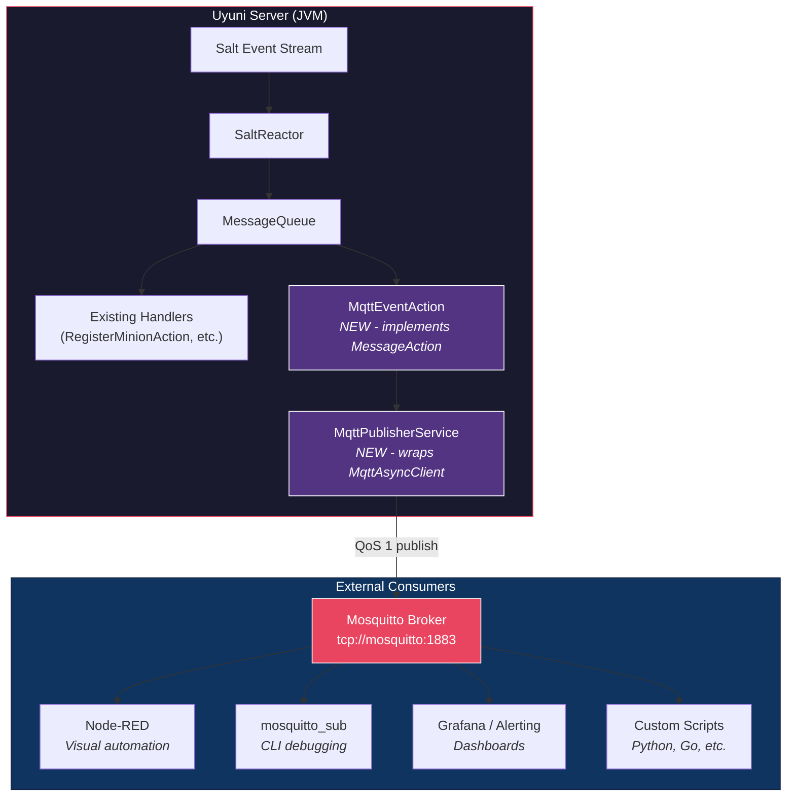
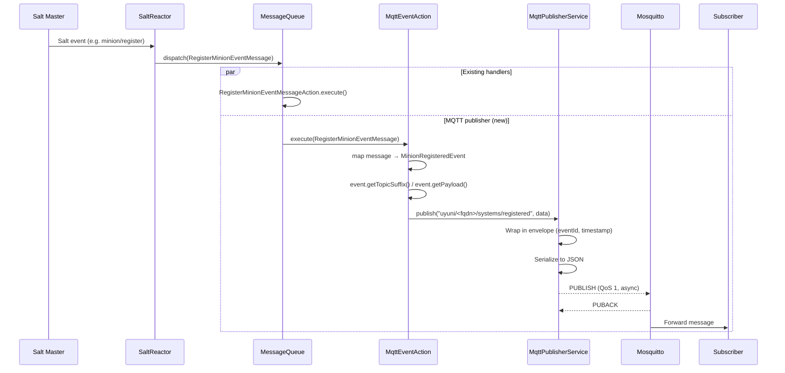
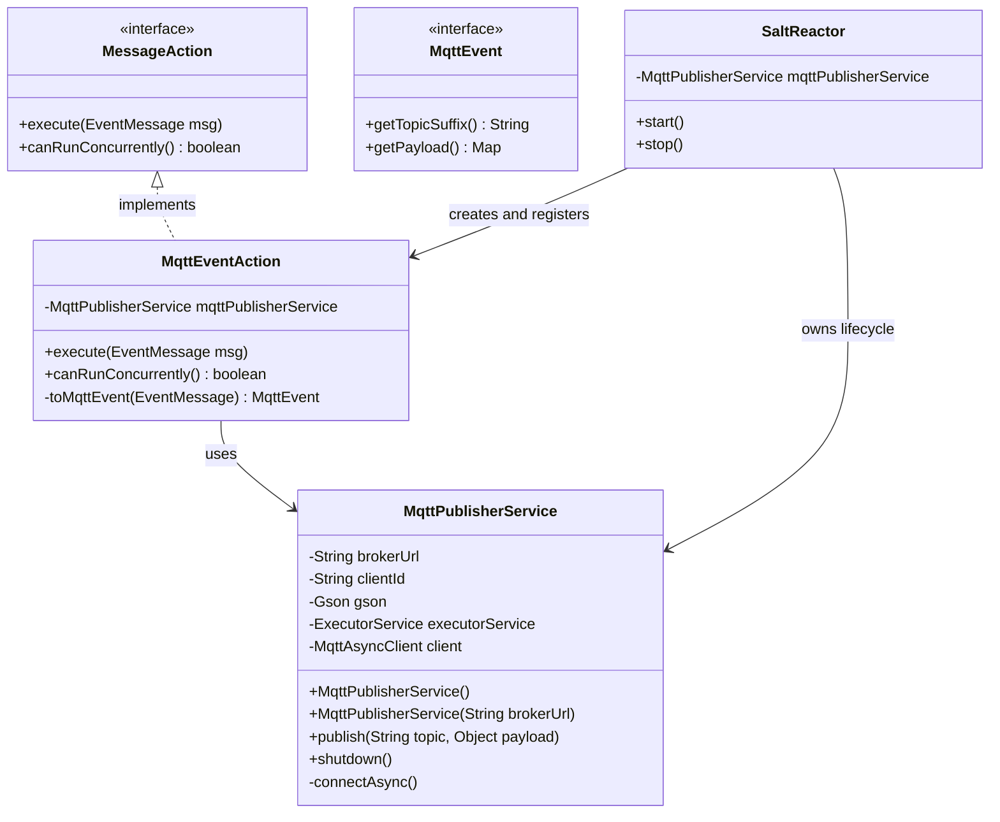
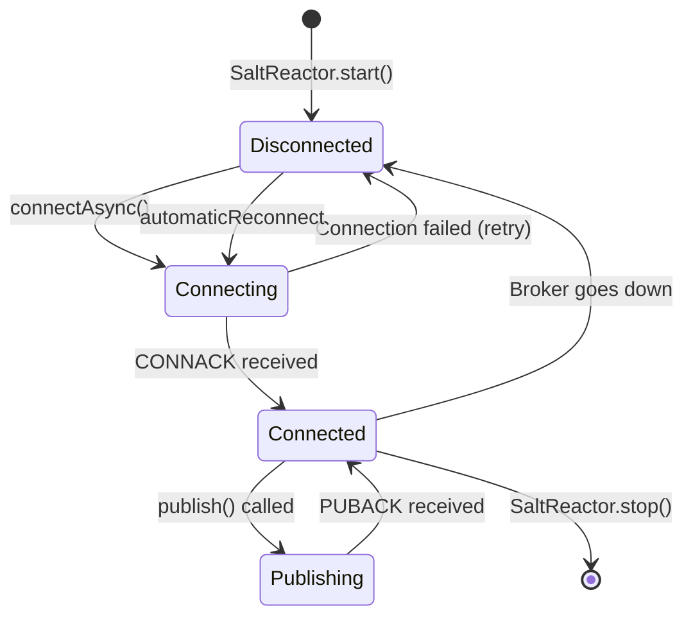
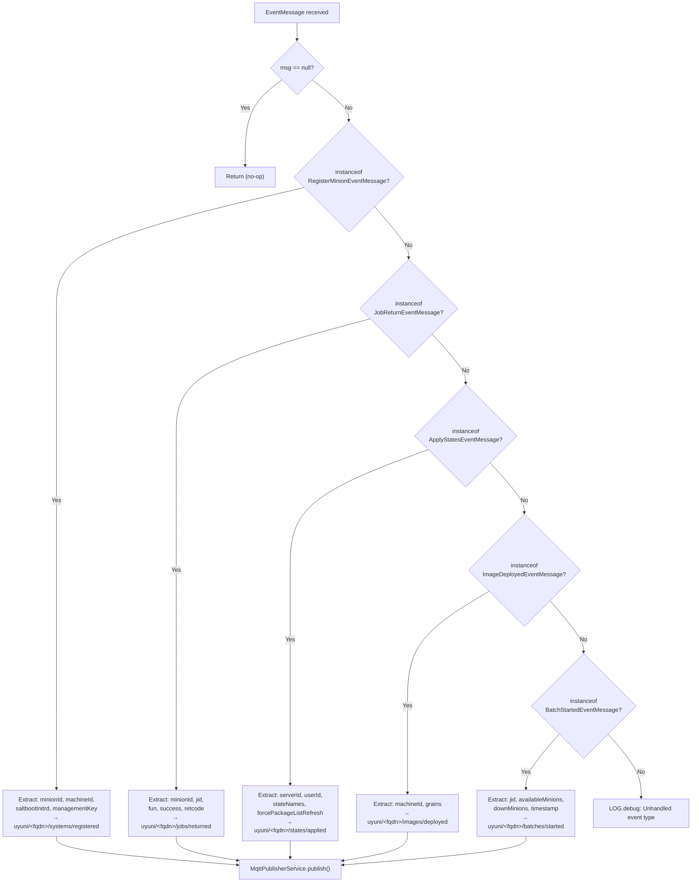
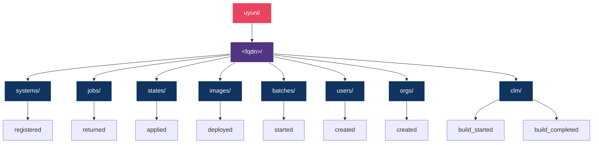
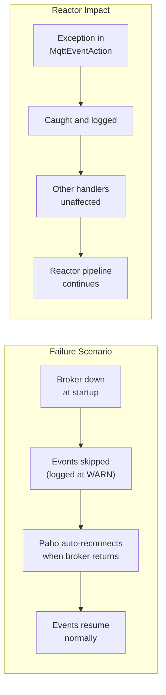

- Feature Name: mqtt_event_publisher
- Start Date: 2026-06-11

# Summary
[summary]: #summary

This document describes the addition of an MQTT-based event publishing
mechanism to the Uyuni server. The mechanism publishes selected Salt event
types from the reactor pipeline as well as native Java application events
(such as user creation, organization creation, and Content Lifecycle Management
build events) as structured JSON messages to a local or remote Mosquitto MQTT
broker, making them available for external consumption by automation tools
such as Node-RED, Grafana alerting pipelines, or custom scripts.

The first iteration covers nine event types across both Salt-based reactor moments
and Java application actions:
- Salt Reactor Events: system registration, job completion, state application, image deployment, and batch operations.
- Java Application Events: user creation, organization creation, CLM build start, and CLM build completion.

# Motivation
[motivation]: #motivation

Today, Uyuni processes Salt events entirely inside the Java application
server. External tools that want to react to fleet-wide events (a new
system registering, a highstate failing, a batch operation starting) have
no way to subscribe to these events in real time. The available options
are polling the XML-RPC or HTTP API, which introduces latency and adds
unnecessary load on the server.

MQTT is a lightweight publish/subscribe protocol that is already widely
adopted in infrastructure automation and IoT. Mosquitto, the reference
broker implementation, is packaged and available on openSUSE and SLES.
By publishing reactor events to an MQTT broker, we enable:

- **Real-time fleet visibility** — administrators can see registration,
  job, and state events the moment they happen, without polling.
- **Low-code automation** — tools like Node-RED can subscribe to event
  topics and trigger workflows (e.g. post to Slack when a highstate
  fails, open a ticket when a new system registers).
- **Decoupled integration** — external consumers subscribe to the broker
  independently of the Uyuni server. Adding or removing consumers has
  zero impact on reactor performance.
- **Monitoring and alerting** — event streams can feed into Prometheus
  Alertmanager, Grafana, or any system that speaks MQTT.

### Current State vs. Proposed State





## Why MQTT?

- [MQTT](https://mqtt.org/) is an [OASIS standard](https://www.oasis-open.org/standards/#mqtt) with broad tooling support.
- [Mosquitto](https://mosquitto.org/) is lightweight (< 1 MB RSS), runs as a single process,
  and is already available in openSUSE and SLES package repositories.
- The publish/subscribe model is a natural fit: Uyuni publishes events
  and any number of consumers can subscribe without coupling.
- [QoS levels (0, 1, 2)](https://www.hivemq.com/blog/mqtt-essentials-part-6-mqtt-quality-of-service-levels/) allow consumers to choose their delivery
  guarantee. QoS 1 ("at least once") provides a good balance between
  reliability and performance for operational events.
- [Eclipse Paho](https://eclipse.dev/paho/), the reference Java MQTT client, is mature, small, and
  has no transitive dependencies beyond the JDK.

## Why Not WebSockets, Server-Sent Events, or a REST Callback?

- **WebSockets / SSE** require the consumer to maintain a persistent
  HTTP connection to the Uyuni server itself, coupling availability
  and adding load. MQTT decouples the broker from the application.
- **REST callbacks (webhooks)** require consumers to expose an HTTP
  endpoint that Uyuni pushes to. This inverts the dependency: Uyuni
  must know about every consumer, handle retries, and manage
  authentication. With MQTT, consumers subscribe independently.

# Detailed Design
[design]: #detailed-design

## Architecture Overview



The design introduces two new classes in a new `com.suse.manager.reactor.mqtt`
package and a small registration block in the existing `SaltReactor`.

## Event Flow Sequence



## Class Diagram



## New Dependency

The Eclipse Paho MQTT v3 client library is added as a Maven dependency:

- **Group:** `org.eclipse.paho`
- **Artifact:** `org.eclipse.paho.client.mqttv3`
- **Version:** `1.2.5`

The version is declared in the parent `java/pom.xml` BOM and consumed
without version in `java/core/pom.xml`, following the existing convention.

MQTT is chosen because the Mosquitto broker shipped with openSUSE and SLES
is lightweight and the feature does not require complex capabilities.

## MqttPublisherService

A new class `MqttPublisherService` encapsulates all broker communication.

**Responsibilities:**

- Establish and maintain an asynchronous connection to the MQTT broker
  using `MqttAsyncClient`.
- Serialize event payloads to JSON using Gson.
- Wrap each payload in a standard envelope containing `eventId`,
  `timestamp`, `topic`, and `data`.
- Publish messages at QoS 1 (at least once delivery).
- Handle reconnection automatically via the Paho `automaticReconnect`
  option.
- Provide a clean `shutdown()` method for graceful teardown.

**Key design decisions:**

1. **Asynchronous client.** The reactor processes Salt events on a hot
   path. A synchronous publish call would block the reactor thread
   while waiting for a broker ACK. `MqttAsyncClient` returns immediately
   and handles delivery acknowledgement in the background.

2. **Single-thread executor.** All publish operations are submitted to a
   single-thread executor. This guarantees strict global message ordering and
   prevents contention on the underlying Paho client. The thread is configured
   as a daemon thread so it does not block JVM shutdown.

   *Scaling & High Throughput:* For massive batch operations (e.g., mass minion
   registrations or large-scale `state.apply` across thousands of minions), the
   single-thread executor queues incoming events in memory using a non-blocking
   work queue. Since serialization and publishing over local socket connections
   is extremely fast (< 1 ms), a single thread is highly performant and keeps the
   design simple. If strict global ordering needs to be relaxed for scaling in the
   future, we can partition task submissions using a thread pool based on the
   minion ID, maintaining order within each minion while processing different
   minions concurrently.

3. **Configurable broker URL.** The default broker URL is
   `tcp://mosquitto:1883`, matching the container name in the Uyuni
   containerized deployment. It can be overridden via the JVM system
   property `uyuni.mqtt.broker.url`.

4. **Graceful degradation.** If the broker is unavailable at startup or
   disconnects at runtime, events are logged and skipped. The reactor
   continues to process events normally. When the broker becomes
   available again, Paho reconnects automatically and new events are
   published.

5. **Envelope pattern.** Every published message includes a UUID
   `eventId` for deduplication (relevant at QoS 1, which may redeliver)
   and an ISO-8601 `timestamp` indicating when the event was published.

### Connection Lifecycle



## MqttEventAction

A new class `MqttEventAction` implements the existing `MessageAction`
interface from the Uyuni messaging framework. It acts as the mapping
layer between internal event message objects and MQTT topics/payloads.

**Supported event types and topics:**

Topics use the server's fully qualified domain name (FQDN) instead of a
static segment. This allows multiple Uyuni instances to publish to a
shared broker while consumers can subscribe per-instance or across all
instances using MQTT wildcards.

| Internal Event Class            | MQTT Topic                              | Trigger                    |
|---------------------------------|-----------------------------------------|----------------------------|
| `RegisterMinionEventMessage`    | `uyuni/<fqdn>/systems/registered`       | New minion bootstrapped    |
| `JobReturnEventMessage`         | `uyuni/<fqdn>/jobs/returned`            | Salt job completed         |
| `ApplyStatesEventMessage`       | `uyuni/<fqdn>/states/applied`           | Highstate / state.apply    |
| `ImageDeployedEventMessage`     | `uyuni/<fqdn>/images/deployed`          | OS image deployed          |
| `BatchStartedEventMessage`      | `uyuni/<fqdn>/batches/started`          | Batch operation started    |

**Payload extraction:** Each event is represented by its own class
implementing the `MqttEvent` interface, which declares just two methods:
`getTopicSuffix()` and `getPayload()`. An event therefore owns both where it is
published and what it publishes, and `MqttEventAction` is reduced to translating
a reactor message into the matching `MqttEvent`.

This keeps the action from accumulating a handler method per topic as coverage
grows: adding a topic means adding a class and one line to the mapping, rather
than extending a class that would otherwise grow without bound. The same
interface is used by both the Salt reactor events and the Java-native events, so
there is a single payload contract across all nine topics.

Each event exposes only the fields relevant to external consumers; internal
implementation details are not published. `MinionRegisteredEvent`, for example,
emits `minionId`, `machineId`, `saltbootInitrd` and `managementKey`, not the
underlying event message object.

Events whose source message carries nothing to report — a job return with no
job return event attached, for instance — are built through a static factory
that returns nothing, and the action then publishes nothing.

**Concurrency:** `canRunConcurrently()` returns `true` because the
action delegates all work to the publisher service's executor thread.
There is no shared mutable state in the action itself.

**Error handling:** All exceptions thrown during event processing are
caught and logged. A failure to publish one event does not affect the
processing of subsequent events and does not impact other registered
`MessageAction` handlers.

### Event Routing Logic



## SaltReactor Integration

The `SaltReactor.start()` method is extended to:

1. Instantiate `MqttPublisherService`.
2. Create an `MqttEventAction` with a reference to the publisher.
3. Register the action for each of the five event classes using
   `MessageQueue.registerAction()`.

The `SaltReactor.stop()` method calls `mqttPublisherService.shutdown()`
to close the broker connection and shut down the executor thread.

This follows the exact pattern used by every other event handler in
`SaltReactor`. The MQTT action is registered alongside (not instead of)
the existing handlers, so all current event processing continues
unchanged.

## Topic Hierarchy

Topics include the Uyuni server's FQDN as the second segment. This
replaces the previous static `events/` segment and enables multi-instance
deployments where each server publishes to the same shared broker.

The FQDN is read from `java.net.InetAddress.getLocalHost().getCanonicalHostName()`
at service startup and cached for the lifetime of the publisher.



This hierarchy allows consumers to subscribe at different granularity
levels using MQTT wildcards:

- `uyuni/#` — all events from all instances
- `uyuni/uyuni.example.com/#` — all events from one specific instance
- `uyuni/+/systems/#` — system lifecycle events from all instances
- `uyuni/uyuni.example.com/jobs/#` — only job events from one instance
- `uyuni/+/users/created` — user creation notifications from all instances
- `uyuni/+/clm/#` — Content Lifecycle Management events (builds started/completed) from all instances

## Message Envelope Format

Every message published to the broker has a consistent JSON envelope:

```json
{
  "eventId": "a1b2c3d4-e5f6-7890-abcd-ef1234567890",
  "timestamp": "2026-06-11T10:30:00.000Z",
  "topic": "uyuni/uyuni.example.com/systems/registered",
  "data": {
    "minionId": "web-server-01.example.com",
    "machineId": "550e8400-e29b-41d4-a716-446655440000",
    "saltbootInitrd": false,
    "managementKey": "1-default"
  }
}
```

### Payload Fields per Event Type

**`uyuni/<fqdn>/systems/registered`**

| Field            | Type    | Description                                  |
|------------------|---------|----------------------------------------------|
| `minionId`       | String  | Salt minion ID                               |
| `machineId`      | String  | Hardware machine ID (from grains, if present) |
| `saltbootInitrd` | Boolean | Whether this is a Saltboot PXE registration   |
| `managementKey`  | String  | Activation key used (if any)                  |

**`uyuni/<fqdn>/jobs/returned`**

| Field       | Type    | Description                      |
|-------------|---------|----------------------------------|
| `minionId`  | String  | Minion that ran the job          |
| `jid`       | String  | Salt job ID                      |
| `fun`       | String  | Salt function executed           |
| `success`   | Boolean | Whether the job succeeded        |
| `retcode`   | Integer | Return code                      |
| `timestamp` | String  | When the job completed           |

**`uyuni/<fqdn>/states/applied`**

| Field                     | Type     | Description                        |
|---------------------------|----------|------------------------------------|
| `serverId`                | Long     | Uyuni server ID of the target      |
| `userId`                  | Long     | User who triggered the apply       |
| `stateNames`              | String[] | Names of states applied            |
| `forcePackageListRefresh` | Boolean  | Whether package list refresh forced |
| `directCall`              | Boolean  | Whether this was a direct call      |

**`uyuni/<fqdn>/images/deployed`**

| Field       | Type   | Description                        |
|-------------|--------|------------------------------------|
| `machineId` | String | Target machine ID                  |
| `grains`    | Object | Salt grains from the deployed host |

*Performance Note on Grains:* Because image deployments are relatively rare operational lifecycle events, the transient CPU and memory overhead of serializing the full `grains` map is negligible. Under extremely constrained environments, administrators can filter out the image deployment events entirely using `uyuni.mqtt.events.enabled`.

**`uyuni/<fqdn>/batches/started`**

| Field              | Type     | Description                    |
|--------------------|----------|--------------------------------|
| `jid`              | String   | Batch job ID                   |
| `availableMinions` | String[] | Minions available for the batch |
| `downMinions`      | String[] | Minions reported as down       |
| `timestamp`        | String   | When the batch started         |

**`uyuni/<fqdn>/users/created`**

| Field      | Type   | Description                       |
|------------|--------|-----------------------------------|
| `username` | String | Login of the newly created user   |
| `userId`   | Long   | ID of the newly created user      |
| `orgId`    | Long   | Organization ID of the new user   |

**`uyuni/<fqdn>/orgs/created`**

| Field     | Type   | Description                            |
|-----------|--------|----------------------------------------|
| `orgId`   | Long   | ID of the newly created organization   |
| `orgName` | String | Name of the newly created organization |

**`uyuni/<fqdn>/clm/build_started`**

| Field          | Type   | Description                             |
|----------------|--------|-----------------------------------------|
| `projectLabel` | String | Content Lifecycle Project label         |
| `username`     | String | User who started the build              |

**`uyuni/<fqdn>/clm/build_completed`**

| Field          | Type   | Description                             |
|----------------|--------|-----------------------------------------|
| `projectLabel` | String | Content Lifecycle Project label         |
| `version`      | String | New version generated by the build      |
| `username`     | String | User who completed the build            |

*Published only for synchronous builds.* When a build is requested
asynchronously the channel alignment is merely scheduled at this point, so the
build has not finished and no completion event is emitted. Reporting completion
there would announce work that has not yet started. Publishing an event once the
scheduled alignment finishes is left for a follow-up.

## Configuration

| Property                      | Default                  | Description                                                  |
|-------------------------------|--------------------------|--------------------------------------------------------------|
| `uyuni.mqtt.broker.url`       | `tcp://mosquitto:1883`   | MQTT broker connection URL                                   |
| `uyuni.mqtt.broker.username`  | (none)                   | Optional username for broker authentication                  |
| `uyuni.mqtt.broker.password`  | (none)                   | Optional password for broker authentication                  |
| `uyuni.mqtt.events.enabled`   | (none)                   | Comma-separated list of enabled event topics to publish      |
| `uyuni.mqtt.qos`              | `1`                      | MQTT Quality of Service level (0, 1, or 2) to use for publish|
| `uyuni.mqtt.queue.limit`      | `10000`                  | Bounded event queue capacity to prevent memory buildup       |

The properties are read via `System.getProperty()` (credentials can also be loaded via `UYUNI_MQTT_BROKER_USERNAME` and `UYUNI_MQTT_BROKER_PASSWORD` environment variables) and can be set in the Tomcat startup configuration or via JVM arguments.

### Broker side

The accompanying Mosquitto image (`containers/mqtt-broker-image`) does not
accept anonymous clients. Its password file is generated at container start from
`MQTT_PUBLISHER_PASSWORD` and `MQTT_SUBSCRIBER_PASSWORD`, so no credentials are
baked into the image, and the broker refuses to start if either is missing.

Two accounts are defined, each restricted to one direction of traffic:

| User               | Permission          | Used by                      |
|--------------------|---------------------|------------------------------|
| `uyuni-publisher`  | write to `uyuni/#`  | The Uyuni server             |
| `uyuni-subscriber` | read from `uyuni/#` | Node-RED and other consumers |

The split matters: a compromised consumer cannot inject forged events into the
stream, and the server cannot read back what other instances publish. The user
names are fixed because the ACL grants permissions per user; only the passwords
are configurable. The Uyuni server therefore authenticates as `uyuni-publisher`.

## Failure Modes



| Scenario                     | Behavior                                        |
|------------------------------|-------------------------------------------------|
| Broker not running at start  | Logged as error. Reactor starts normally.        |
| Broker goes down at runtime  | Events skipped with warning. Auto-reconnect.     |
| Broker comes back up         | Paho reconnects automatically. Events resume.    |
| Malformed event data         | Caught, logged. Other events unaffected.         |
| Paho library throws          | Caught, logged. Reactor pipeline unaffected.     |

## Files Changed

**Modified**

| File | Change |
|------|--------|
| `java/pom.xml` | Paho entry in dependency management |
| `java/core/pom.xml` | Paho dependency |
| `java/buildconf/ivy/ivy-suse.xml` | Paho for the Ant/Ivy build |
| `SaltReactor.java` | Register the action for the five Salt event types |
| `RhnServletListener.java` | Create the publisher on start-up, shut it down on context destroy |
| `OrgFactory.java` | Publish `orgs/created` after commit |
| `UserFactory.java` | Publish `users/created` after commit |
| `ContentManager.java` | Publish the two CLM events after commit |

The last three touch core domain classes. Each adds a single call, and the
publishing is deferred until the surrounding transaction commits, so a rollback
never leaves an event announcing a change that was discarded.

**New — `com/suse/manager/reactor/mqtt/`**

`MqttPublisherService`, `MqttEventAction` and `MqttEventHelper`, plus the
`event/` package containing `MqttEvent` and its ten implementations:
`MinionRegisteredEvent`, `JobReturnedEvent`, `StatesAppliedEvent`,
`ImageDeployedEvent`, `BatchStartedEvent`, `UserCreatedEvent`,
`OrgCreatedEvent`, `ClmBuildStartedEvent` and `ClmBuildCompletedEvent`.

**New — tests**

`MqttEventActionTest` and `MqttEventHelperTest`.

**New — outside the Java tree**

`containers/mqtt-broker-image/` (Mosquitto image with authentication and ACLs),
`containers/node-red-image/` (Node-RED with the Uyuni nodes pre-installed) and
`node-red-contrib-uyuni/` (the Node-RED node package).

## Testing

Unit tests for `MqttEventAction` use a test spy subclass of
`MqttPublisherService` that captures the topic and payload instead of
connecting to a real broker. This verifies:

- Correct topic mapping for each event type.
- Correct payload field extraction.
- Null safety and error handling.

Integration testing against a running Mosquitto instance can be done
with `mosquitto_sub` or by connecting a Node-RED flow to the broker.

# Drawbacks
[drawbacks]: #drawbacks

- Adds a new external dependency (Eclipse Paho). However, Paho is a
  small library (< 300 KB) with no transitive dependencies.
- Requires a Mosquitto broker to be deployed alongside Uyuni. In the
  containerized deployment this is straightforward (sidecar container).
  On traditional installations it requires installing and enabling the
  `mosquitto` package.
- Events published before the broker connects are dropped (not buffered
  indefinitely). This is a deliberate choice to avoid unbounded memory
  usage, but means the first few seconds after startup may have gaps.

# Alternatives
[alternatives]: #alternatives

- **Salt's own event bus** — Salt already has a ZeroMQ-based event bus,
  but it requires a Salt API listener, uses a different wire format,
  and is not accessible to tools that do not speak the Salt protocol.
- **WebSocket endpoint in Uyuni** — Would couple consumers to the Uyuni
  web application lifecycle. A broker provides better decoupling.
- **Database triggers + polling** — Higher latency, more complexity,
  and adds load to the database.
- **Apache Kafka** — Much heavier infrastructure requirement. MQTT is
  sufficient for the expected event throughput and is simpler to deploy.

# Unresolved Questions
[unresolved]: #unresolved-questions

- ~~Should the set of published event types be configurable (e.g. via a
  system property or database setting), or is the hardcoded set of five
  sufficient for the initial release?~~ **Resolved:** Configurable via the `uyuni.mqtt.events.enabled` property.
- ~~Should the publisher buffer a bounded number of events when the broker
  is temporarily unavailable, or is the current skip-and-log behavior
  acceptable?~~ **Resolved:** The current skip-and-log behavior is acceptable. Dropping and logging offline events is preferred to avoid unbounded memory buildup.
- ~~Should the MQTT topic prefix (`uyuni/events/`) be configurable to
  support multi-server environments where each Uyuni instance publishes
  to a shared broker?~~ **Resolved:** Topics now include the server FQDN
  as the second segment (`uyuni/<fqdn>/...`), enabling multi-instance
  environments natively.
- ~~Authentication and TLS: should the first version support
  username/password or TLS client certificates for broker connections,
  or is unauthenticated localhost-only access sufficient initially?~~ **Resolved:** Username and password authentication is supported via the configuration properties `uyuni.mqtt.broker.username` and `uyuni.mqtt.broker.password` (or via environment variables). TLS client certificates are left for a future enhancement.
