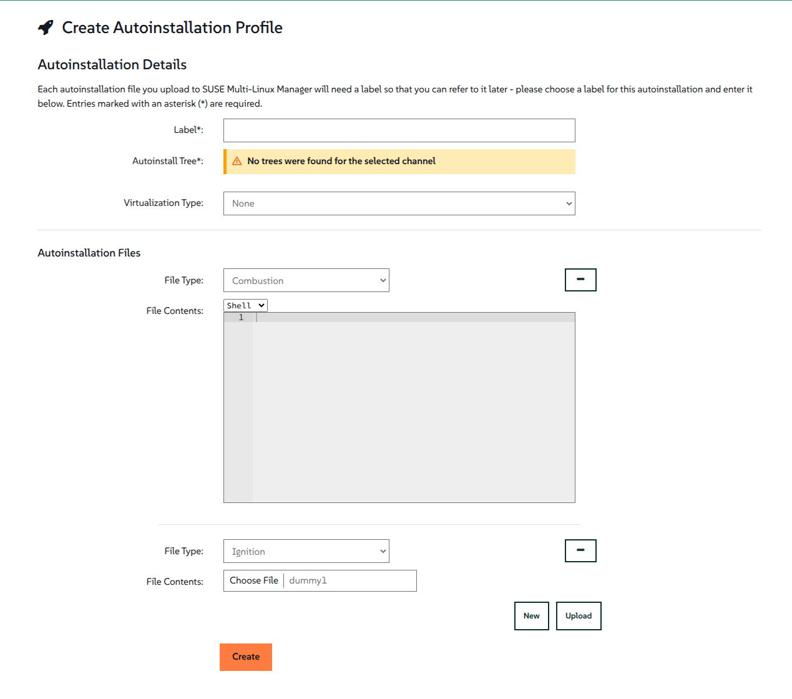

- Feature Name: Multi-file Autoinstallation Support
- Start Date: 2025-10-07

# Summary
[summary]: #summary

This RFC proposes extending the autoinstallation profile mechanism to support multiple files per profile and storing them in the database (instead of relying on Cobbler).

# Motivation
[motivation]: #motivation

Current approach has a few challanges. With this development we're aiming at:

## Number of files
Currently, the autoinstallation UI and backend allow only one file per profile (either uploaded or edited in textarea).

This limitation makes it hard to manage cases where:
- Installation workflows require separating configuration into multiple files;
- Users want to reuse snippets across different setups;
- Different configuration formats must coexist in the same context (eg: AutoYaST or ignition + custom scripts).

## Source of truth
Files will be stored locally (in the database), making the system the primary source of truth, rather than relying on external services like Cobbler.

## Validation
Ensure that uploaded file types are compatible with the selected OS or distribution (eg, Agama files for SLE15SP6).
  
## Benefits
To sum it, supporting multiple files would:
- Simplify complex installation scenarios;
- Enable future features that rely on combining configurations;
- Ensure better reliability and traceability;
- Reduce dependency on Cobbler

# Detailed design
[design]: #detailed-design

## Database
- New tables:
  - suseAutoInstallFileType — id, type, description, timestamp
  - suseAutoInstallFile — id, type FK, content, timestamp

## API / Backend:
Ensure we have endpoints to:
- Upload multiple files
- List files in a profile
- Edit / replace files
- Delete individual files
- Delete profile

All endpoints should maintain backward compatibility with existing single-file profiles

## UI 
- List allowed file types
- Support multi-file upload.
- Display file name, type, and actions (edit, delete).

## Validations
- Ensure OS / distribution compatibility (e.g., Agama not allowed on SLE15SP6).
- Can validate the files using profile OS selection or base channel in distribution profile.

## Deletion Policy
- Deleting a profile deletes all associated files.
- Deleting an individual file does not affect the rest of the profile.

# Drawbacks
[drawbacks]: #drawbacks

- Introduces new tables and data management, increasing complexity.
- Must maintain backward compatibility with single-file profiles.
- Validation and compatibility checks may introduce overhead.
- Full templating/snippet handling still depends on Cobbler at this stage.

# Alternatives
[alternatives]: #alternatives

- Keep only one file per profile - too restrictive for complex setups.

# Unresolved questions
[unresolved]: #unresolved-questions

- Should we limit:
  - Number of files in a profile?
  - Number of files per type?
  - File size?

- Should list the allowed file types (in the UI)?
- Should we restrain a known file type list or allow a "any" type? If so, how would it impact the previous questions?
- UI/UX design for multi-file edit/upload - the provided screen update is a suggestion. UI team should review it so we make sure were following FE rules and usability constraints are met.

## Future steps
- Should files be validated for content according to type?
- Templating/snippet support should be covered by another RFC?
