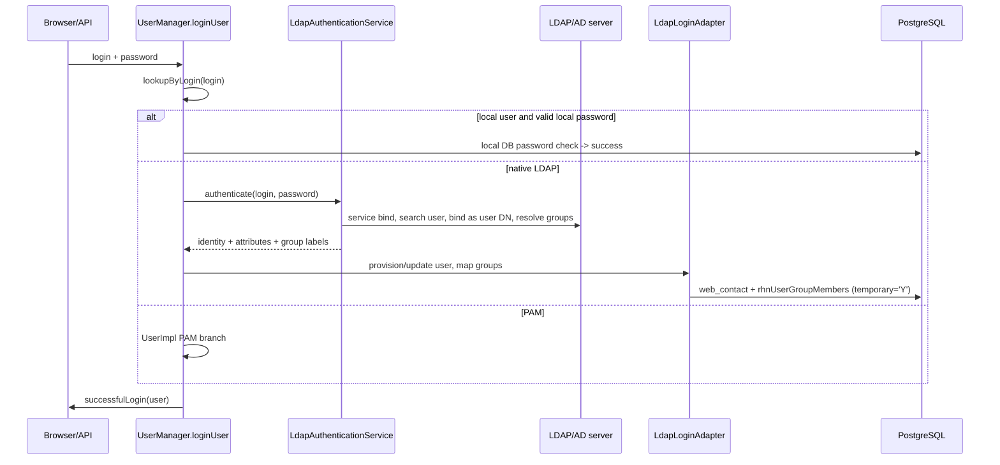

- Feature Name: native_ldap_authentication
- Start Date: 2026-06-04

# Summary
[summary]: #summary

Add a native, Java-based LDAP/Active Directory authentication provider to Uyuni's web application. Administrators configure the directory connection from Uyuni itself instead of relying on the host operating system (SSSD/PAM) or a reverse proxy. A successful LDAP login can optionally create or update the Uyuni user, and LDAP group membership is mapped to Uyuni roles by reusing the existing external group mapping tables (`rhnUserExtGroup` / `rhnUserExtGroupMapping`) and the temporary-role lifecycle already used for header-based external authentication.

# Motivation
[motivation]: #motivation

Today Uyuni can authenticate against a directory only indirectly:

- **PAM/SSSD**: the host OS is configured for LDAP and Uyuni delegates the password check to PAM (`WEB_PAM_AUTH_SERVICE` plus a per-user `usePamAuthentication` flag). The directory configuration lives in `sssd.conf`, edited over the CLI, outside Uyuni.
- **Header-based external auth** (`REMOTE_USER`): a frontend web server or IdP authenticates the user and passes identity and group headers, which Uyuni trusts (`LoginHelper.checkExternalAuthentication`).

In both cases the directory integration is invisible to Uyuni: an administrator cannot configure, test, or troubleshoot it from the product, and there is no managed concept of an "LDAP group" inside Uyuni. The external group string is consumed transiently during a `REMOTE_USER` login and then discarded.

This feature brings directory integration into Uyuni so that an administrator can point Uyuni at an Active Directory, FreeIPA, or OpenLDAP server, optionally enable just-in-time user creation, map a directory group such as `uyuni-admins` to the Org Admin role, and have those users log in with the right roles without touching `sssd.conf`. Local Uyuni users continue to work unchanged.

# Detailed design
[design]: #detailed-design

## Existing authentication flow

```text
Browser / API client
  -> LoginController.performLogin()
     -> LoginHelper.checkExternalAuthentication()        (REMOTE_USER header path)
     -> if no external user:
        -> UserManager.loginUser(login, password)
           -> UserFactory.lookupByLogin(login)
           -> UserImpl.authenticate(password)
              -> PAM   (if WEB_PAM_AUTH_SERVICE set and user.usePamAuthentication)
              -> local DB password check otherwise
     -> LoginHelper.successfulLogin()
```

The design reuses two existing patterns rather than reinventing them:

- The **PAM service/factory shape** (`PamServiceFactory` → `DefaultPamServiceFactory` → `PamServiceWrapper`) is the structural template for isolating an external credential check behind a factory.
- The **external-auth lifecycle** in `LoginHelper` already performs just-in-time user creation (`CreateUserCommand`), profile updates (`UpdateUserCommand`), external group to role mapping (`UserGroupFactory.lookupExtGroupByLabel`), and temporary-role assignment. This is the model for the LDAP user and role lifecycle.

A standalone proof of concept (UnboundID LDAP SDK 7.0.4, Java 17) was run against a seeded OpenLDAP fixture to confirm the operations the design depends on: service-account bind, pooled connections, user search, group resolution by `(member=<userDN>)` without a `memberOf` overlay, a successful credential bind, and rejection of invalid credentials.

## Proposed architecture

LDAP authentication is implemented as a service behind a factory (mirroring PAM), with the user lifecycle handled at the login orchestration layer so just-in-time provisioning and role mapping are possible:

```text
LdapServiceFactory            (selects the configured implementation; testable seam)
  -> LdapAuthenticationService
       -> LdapConnectionProvider   (UnboundID LDAPConnectionPool, TLS, timeouts, failover)
       -> LdapUserResolver         (bind/search/bind, attribute extraction)
       -> LdapGroupResolver        (member= search and/or memberOf, normalization)
  -> LdapLoginAdapter            (maps the LDAP result onto CreateUserCommand /
                                  UpdateUserCommand / UserManager.resetTemporaryRoles)
```

Class names are indicative; the responsibilities are the design contract: connection handling, user lookup, group lookup, and mapping onto the Uyuni user lifecycle.



## Login ordering

The credential resolution order for username/password login is **Local DB → Native LDAP → PAM**. Concretely, in `UserManager.loginUser` (after the `REMOTE_USER` external-auth check that already runs first in `LoginController`):

1. Look up the user by login. If a local user exists, has a usable local password, and that password verifies, log in locally.
2. Otherwise attempt native LDAP (bind/search/bind). On success, provision or update the user, map groups to temporary roles, and log in.
3. Otherwise attempt PAM (unchanged).
4. Otherwise fail with a single generic message (see Failure modes).

This ordering is why the LDAP step lives at the orchestration layer and not inside `UserImpl.authenticate()`: step 2 may need to create a user that does not yet exist locally, while `UserImpl.authenticate()` runs only after `UserFactory.lookupByLogin()` has found one.

## LDAP authentication flow

The provider uses the standard bind/search/bind sequence:

1. Bind with the configured service account (or anonymous bind if explicitly enabled).
2. Search for the user under the configured base DN using the configured filter; require **exactly one** match.
3. Bind as the discovered user DN with the password supplied at login.
4. Resolve the user's groups.
5. Return the normalized login, profile attributes, and group labels to the lifecycle adapter.

User input is never concatenated into a filter; values are escaped (the POC uses `Filter.createEqualityFilter`, which escapes automatically). Selecting the server type pre-fills attribute and filter defaults (AD vs. IPA/POSIX), so administrators rarely type raw attribute names:

```text
ldap.server_type        = ACTIVE_DIRECTORY        # or FREE_IPA / OPENLDAP / POSIX
ldap.url                = ldaps://ad.example.com:636
ldap.bind_dn            = CN=uyuni-reader,OU=Service,DC=example,DC=com
ldap.user_base_dn       = OU=Users,DC=example,DC=com
ldap.user_filter        = (&(objectClass=user)(sAMAccountName={login}))
ldap.login_attribute    = sAMAccountName           # uid for FreeIPA/OpenLDAP/POSIX
ldap.group_base_dn      = OU=Groups,DC=example,DC=com
ldap.group_filter       = (&(objectClass=group)(member={userDn}))
ldap.group_name_attribute = cn
ldap.provisioning_mode  = JIT                      # default; EXISTING_ONLY opt-in
ldap.default_org_id     = 1
```

## User provisioning

Two modes, controlled by `provisioning_mode`:

- **JIT** (default): a successful LDAP login creates the Uyuni user if absent, reusing `CreateUserCommand` exactly as `LoginHelper.newRemoteUser` does today (login set, non-usable placeholder password, attributes, org, temporary roles).
- **EXISTING_ONLY**: LDAP authenticates only users that already exist in `web_contact`.

JIT is the default because the project goal and the Satellite/Foreman precedent both assume directory users can log in without a pre-created account, and Uyuni already implements this lifecycle for external auth. When JIT is enabled, the UI requires a valid `default_org_id`, mirroring the existing `EXTAUTH_DEFAULT_ORGID` behavior. Attribute- or group-based org mapping is a later enhancement. `EXISTING_ONLY` remains available for deployments that require manual user creation first.

On each successful login, selected profile fields (first name, last name, email) are refreshed from LDAP via `UpdateUserCommand`, as `updateRemoteUser` does; missing LDAP attributes do not overwrite existing Uyuni values.

## Group resolution and role mapping

The portable baseline is a group-side search, which the POC confirmed works without a server-side `memberOf` overlay:

```text
(&(objectClass=groupOfNames)(member=<userDN>))     # OpenLDAP / generic
(&(objectClass=group)(member=<userDN>))            # Active Directory
```

`memberOf` on the user entry is supported as an optional optimization where the directory exposes it. Group labels are normalized to a configured attribute (default `cn`), with full-DN matching available where simple names are ambiguous. Nested groups are AD-specific (matching-rule OID `1.2.840.113556.1.4.1941`) and are deferred to a later iteration.

Role mapping reuses the existing external group mechanism rather than introducing a new model. `rhnUserGroup` remains the role-assignment model; `rhnUserExtGroup` / `rhnUserExtGroupMapping` are dormant but reusable; `access.accessGroup` is the authorization layer for new endpoints, not the LDAP role target.

```text
LDAP groups
  -> normalize to external group labels
  -> UserGroupFactory.lookupExtGroupByLabel(label)   (rhnUserExtGroup -> rhnUserExtGroupMapping)
  -> resolve org-scoped rhnUserGroup rows (the roles)
  -> assign as temporary roles (CreateUserCommand/UpdateUserCommand.setTemporaryRoles)
  -> on each login, UserManager.resetTemporaryRoles recomputes the set
```

Manually assigned permanent roles are never removed by LDAP login; only temporary (LDAP-derived) roles are recomputed, so a user removed from a directory group loses the corresponding Uyuni role on next login. The existing `EXTAUTH_KEEP_TEMPROLES` switch (`UserExternalHandler.setKeepTemporaryRoles`) governs whether temporary roles survive a later non-LDAP login.

This also promotes the LDAP group to a first-class, managed entity: the `rhnUserExtGroup` row becomes the persisted representation of a known LDAP group, optionally scoped to a specific server (see Database design), managed from the Admin UI/API. The existing `REMOTE_USER` path is left untouched in v1; the LDAP adapter calls the same `LoginHelper.getRolesFromExtGroups()` resolution, and integration tests cover these previously dormant paths.

## RBAC integration

The new RBAC model (`access.namespace`, `access.endpoint`, `access.accessGroup`) is used only to protect the new LDAP configuration endpoints: the setup pages and API methods are registered in the RBAC endpoint mapping[^3] so only privileged administrators can read or change LDAP configuration. LDAP-derived user roles continue to flow through `rhnUserGroup`. Automatic population of `access.accessGroup` from LDAP groups is out of scope for v1.

## Database design

Reused tables:

| Table | Use |
| --- | --- |
| `web_contact` | user identity; JIT users get a non-usable placeholder password |
| `rhnUserGroup` / `rhnUserGroupType` | org-scoped role instances (unchanged) |
| `rhnUserGroupMembers` | role membership; `temporary='Y'` for LDAP-derived roles |
| `rhnUserExtGroup` / `rhnUserExtGroupMapping` | external group to role mapping (revived) |
| `suseCredentials` | bind password, via a new `ldap` credential type (see below) |

One new entity (working name `suseLdapAuthServer`, one row per configured directory) holds the connection and mapping configuration. Rather than fix the exact columns, types, and constraints now, the design captures the data the entity must hold, grouped by purpose; the concrete schema is settled during implementation:

- **Connection** - label, enabled flag, server type, host, port, transport, and a connect/response timeout. Server type (`ACTIVE_DIRECTORY` / `FREE_IPA` / `OPENLDAP` / `POSIX`) and transport (`LDAPS` / `STARTTLS` / `PLAIN`) are modeled as Java enums, as CoCo attestation models `env_type`[^6].
- **Bind account** - the service-account bind DN (null meaning anonymous bind) and a reference to the stored bind password (see below).
- **User lookup** - user base DN, user search filter, login attribute, and optional first-name, last-name, and email attributes.
- **Group lookup** - group base DN, group filter, group-name attribute (default `cn`), a `memberOf` toggle, and an optional pre-authentication scope filter.
- **Provisioning** - provisioning mode (`JIT` / `EXISTING_ONLY`) and the default org applied to JIT-created users.

This entity is the single source of truth for a directory, and the enum-backed fields keep server-type and transport handling type-safe in Java rather than relying on free-form strings.

To make external groups first-class and optionally LDAP-scoped, the design adds a nullable reference from `rhnUserExtGroup` to the new directory entity. A null value preserves today's server-agnostic behavior (used by `REMOTE_USER`); a set value scopes the mapping to one directory. Modeling this as a nullable link on the existing table, rather than a parallel new table, avoids duplicating the established external-group mechanism.

The **bind password** is stored in `suseCredentials` under a new `ldap` credential type, reusing the `PasswordBasedCredentials` pattern already used for SCC, registry, and cloud-RMT credentials (Base64-encoded at rest). In practice this adds an `ldap` type to the credential model and a corresponding credentials entity; the password is write-only in the UI/API, as SCC credentials are. Whether Base64-at-rest is sufficient or stronger encryption is required is left open below.

## Transport security

Production deployments must use encrypted transport (`LDAPS` or `STARTTLS`); `PLAIN` is allowed only for explicit dev/test. Trust material is validated against the JVM trust store. Because the server container already mounts CA anchors at `/etc/pki/trust/anchors/`, administrators can add the directory CA there or upload it through the UI. The exact integration is left open below.

## Connection handling

A pooled service connection (`LDAPConnectionPool`, validated in the POC) is used for searches, and a short-lived dedicated connection is used for each user credential bind. A connect/response timeout of 3–5s ensures an unreachable directory fails fast. Multiple servers can be combined via UnboundID's `FailoverServerSet` for HA in a later iteration.

## Failure modes

| Situation | Behavior |
| --- | --- |
| Active session, LDAP goes down | Unaffected; LDAP is checked only at login, never mid-session |
| Local user logs in, LDAP down | Unaffected; local auth is first and independent |
| LDAP user logs in, LDAP unreachable | Fail after the timeout; show "invalid credentials or directory unreachable, try again later" |
| LDAP user, wrong password | Reject (invalid credentials) |
| LDAP user also has a local password | No silent fallback to local after LDAP failure |
| User search returns 0 or >1 entries | Treat as authentication failure (ambiguous) |
| Group lookup fails after successful bind | Authenticate, assign no LDAP-derived roles, log the failure |
| User maps to no Uyuni roles | Login succeeds with no temporary roles |

The generic failure message intentionally does not distinguish "user unknown" from "wrong password" from "server down" to avoid user enumeration; details go to the server log.

## User interface and API

A new **Admin -> Setup -> LDAP** area follows Satellite's proven four-tab layout: **Server** (host, port, transport, type), **Account** (bind DN/password, base DNs, filters, provisioning mode, default org), **Attribute mappings** (login/name/email/group attributes, pre-filled from server type), and **User Groups** (external group to role bindings, extending the existing `ExtGroupDetailAction` UI). Three test actions give immediate feedback before LDAP is enabled and map directly onto POC operations: test connection (service bind), test user lookup (search), and test group resolution. A freshly provisioned user with no mapped groups logs in with no permissions until a mapping matches.

Both API interfaces are provided, following the HTTP API RFC convention: the existing `user.external` XML-RPC namespace (`UserExternalHandler`) is extended for group-to-role mappings, a new `auth.ldap` namespace handles server CRUD and the test operations, and the same handlers are auto-exposed over JSON via the Spark route wrapper.

## Phasing

1. **Backend authentication** - `LdapServiceFactory` + `LdapAuthenticationService`, bind/search/bind, Local -> LDAP -> PAM ordering, minimal config, unit + integration tests against the fixture.
2. **Provisioning + roles** - JIT user creation, profile sync, group-to-role mapping via `rhnUserExtGroup`, temporary-role reset.
3. **UI + API** - four-tab Admin UI, test actions, XML-RPC + JSON endpoints, RBAC registration.
4. **Advanced** - auth-source filter, multiple servers/failover, `memberOf` and AD nested groups.

## Testing

A local OpenLDAP fixture (seeded with `alice`/`bob` and `uyuni-admins`/`uyuni-users`) backs integration tests, seeded from the existing POC. Unit tests cover filter construction/escaping, attribute mapping, group normalization, role mapping, and temporary-role reset. Regression tests confirm local and PAM logins and the ordering are unaffected. Note: the core test tree currently has pre-existing compile breakage (`RhnMockHttpServletHttpServletResponse`, `SimpleTestingResponse`); whether it is fixed as part of this work is for the maintainers to decide.

# Drawbacks
[drawbacks]: #drawbacks

- It adds code to a security-sensitive path; mistakes in ordering, fallback, filter escaping, or mapping could cause auth/authz bugs.
- It introduces a runtime dependency on an external directory; timeouts and failure modes must be disciplined.
- It likely adds a new third-party Java dependency (UnboundID LDAP SDK) that must clear licensing/packaging review.
- It revives dormant `rhnUserExtGroup` code that may need repair and test coverage.
- LDAP/AD deployments vary widely; v1 must choose clear defaults and document its limits rather than support every schema.

# Alternatives
[alternatives]: #alternatives

- **Stay on PAM/SSSD only** - no new code, but no in-product configuration, testing, profile sync, or group-to-role mapping. Does not meet the goal.
- **Improve only header-based `REMOTE_USER`** - keeps authentication outside Uyuni and still requires a proxy or IdP, with no in-product visibility. The Spacewalk/IPA integration[^4] is the precedent for this approach and its limits.
- **LDAP only inside `UserImpl.authenticate()`** - minimal and mirrors the PAM branch, but cannot do first-login provisioning because user lookup precedes authentication; viable only for an `EXISTING_ONLY` build.
- **Implementation-level choices** - for the LDAP client library, JNDI avoids a third-party dependency but is lower-level with harder pooling, StartTLS, and testability, while Apache Directory LDAP API and Spring LDAP are further candidates; the UnboundID SDK[^9] is the baseline pending licensing review. For bind-password storage, a plain column on `suseLdapAuthServer` or a container-level secret were considered but rejected in favor of the existing `suseCredentials` pattern for consistency with how Uyuni already stores SCC and registry secrets.

# Unresolved questions
[unresolved]: #unresolved-questions

1. **Secret and trust material** - is Base64-at-rest (as for SCC/registry credentials) acceptable for the bind password, or is encryption required, and where should the directory CA live: the JVM trust store, the container's `/etc/pki/trust/anchors/`, or an upload-through-UI flow?
2. **Scoping external groups to a server** - is the nullable `rhnUserExtGroup.ldap_server_id` FK the right approach, or should mappings stay server-agnostic?
3. **Superuser reachability** - may an LDAP group grant the top-level admin role, or should the highest privileges remain local-only?
4. **Org assignment for JIT users** - is a single configured default org enough for v1, or is attribute-/group-based mapping needed early?
5. **`access.accessGroup` future** - should the RFC commit to a later phase mapping LDAP groups into the new RBAC access groups, or leave it out of scope?
6. **Primary target directory** - which directory is the primary path for the test matrix and docs: Active Directory, FreeIPA, or OpenLDAP?

# References
[references]: #references

[^1]: Uyuni RFC template - https://github.com/uyuni-project/uyuni-rfc/blob/master/00000-template.md
[^2]: RBAC RFC PR #95 - https://github.com/uyuni-project/uyuni-rfc/pull/95
[^3]: RBAC endpoint mapping wiki - https://github.com/uyuni-project/uyuni/wiki/RBAC-Endpoint-Mapping
[^4]: Spacewalk and IPA integration - https://github.com/spacewalkproject/spacewalk/wiki/SpacewalkAndIPA
[^5]: CVE auditing with OVAL RFC - https://github.com/uyuni-project/uyuni-rfc/blob/master/accepted/00098-cve-auditing-with-oval.md
[^6]: Confidential Compute Attestation RFC - https://github.com/uyuni-project/uyuni-rfc/blob/master/accepted/00100-coco-attestation.md
[^7]: HTTP API RFC - https://github.com/uyuni-project/uyuni-rfc/blob/master/accepted/00088-http-api.md
[^8]: LDAP Authentication in Satellite 6 (UX reference) - https://www.youtube.com/watch?v=gJAeRSE2IjQ
[^9]: UnboundID LDAP SDK - https://github.com/pingidentity/ldapsdk
