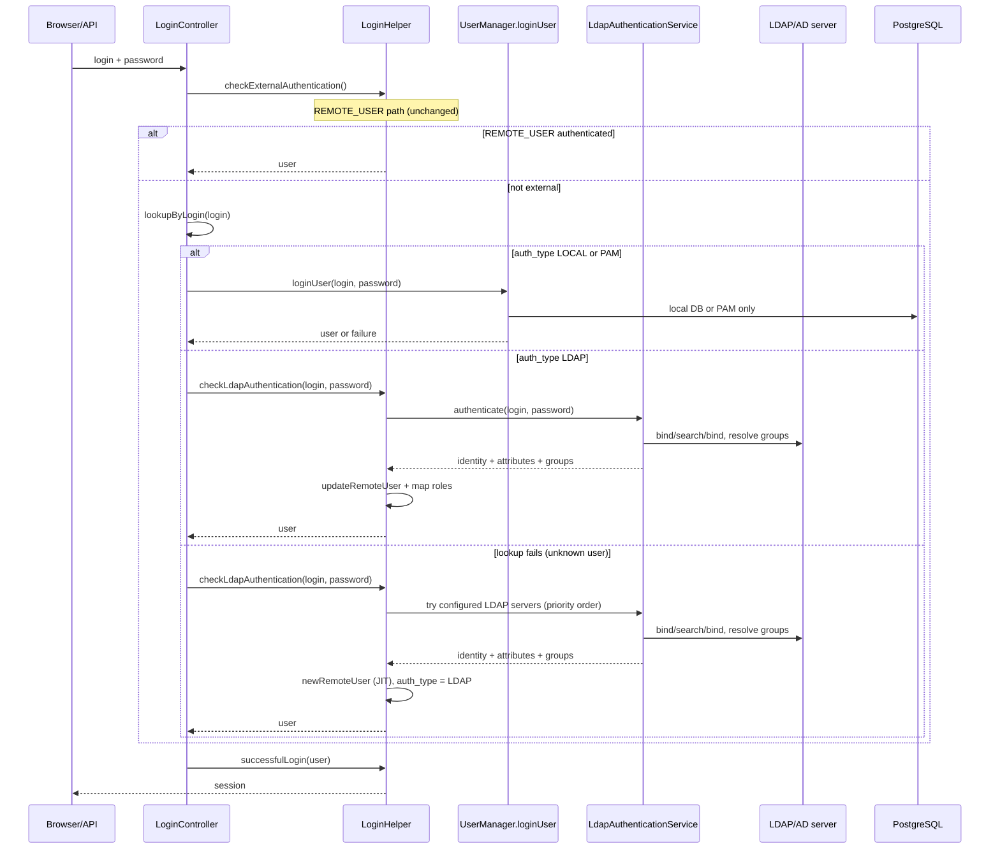

- Feature Name: native_ldap_authentication
- Start Date: 2026-06-03

# Summary
[summary]: #summary

Add a native, Java-based LDAP/Active Directory authentication provider to Uyuni's web application. Administrators configure the directory connection from Uyuni itself instead of relying on the host operating system (SSSD/PAM) or a reverse proxy. A successful LDAP login can optionally create or update the Uyuni user, and LDAP group membership is mapped to Uyuni roles by reusing the existing external group mapping tables (`rhnUserExtGroup` / `rhnUserExtGroupMapping`) and the temporary-role lifecycle already used for header-based external authentication.

## At a glance

- **Admin value** — configure, test, and troubleshoot LDAP from Uyuni; map directory groups to Uyuni roles.
- **Unchanged** — local DB users, per-user PAM users, and header-based `REMOTE_USER` auth.
- **Login orchestration** — `LoginController` → `LoginHelper` (same layer as `checkExternalAuthentication`), not inside `UserManager.loginUser`.
- **Per-user routing** — `auth_type` on `rhnUserInfo` (`LOCAL` / `PAM` / `LDAP`); no cascade between backends for known users.
- **JIT** — unknown logins probe configured LDAP servers (priority order); on success, create the user with `auth_type = LDAP`.
- **Out of scope for v1** — nested AD groups, `access.accessGroup` population from LDAP, multi-server HA failover.

# Motivation
[motivation]: #motivation

Today Uyuni can authenticate against a directory only indirectly:

- **PAM/SSSD**: the host OS is configured for LDAP and Uyuni delegates the password check to PAM (`WEB_PAM_AUTH_SERVICE` plus a per-user `usePamAuthentication` flag). The directory configuration lives in `sssd.conf`, edited over the CLI, outside Uyuni.
- **Header-based external auth** (`REMOTE_USER`): a frontend web server or IdP authenticates the user and passes identity and group headers, which Uyuni trusts (`LoginHelper.checkExternalAuthentication`).

In both cases the directory integration is invisible to Uyuni: an administrator cannot configure, test, or troubleshoot it from the product, and there is no managed concept of an "LDAP group" inside Uyuni. The external group string is consumed transiently during a `REMOTE_USER` login and then discarded.

This feature brings directory integration into Uyuni so that an administrator can point Uyuni at an Active Directory, FreeIPA, or OpenLDAP server, optionally enable just-in-time user creation, map a directory group such as `uyuni-admins` to the Org Admin role, and have those users log in with the right roles without touching `sssd.conf`. Local Uyuni users continue to work unchanged.

# Detailed design
[design]: #detailed-design

## Existing authentication flow (today)

```text
Browser / API client
  -> LoginController.performLogin()
     -> LoginHelper.checkExternalAuthentication()        (REMOTE_USER header path)
     -> if no external user:
        -> UserManager.loginUser(login, password)
           -> UserFactory.lookupByLogin(login)
           -> UserImpl.authenticate(password)
              -> PAM   (if WEB_PAM_AUTH_SERVICE set and user.usePamAuthentication)
              -> local DB password check otherwise
     -> LoginHelper.successfulLogin()
```

Native LDAP extends this at the same orchestration layer: after `checkExternalAuthentication`, a new `checkLdapAuthentication` step handles directory users and JIT provisioning before `UserManager.loginUser` is called for `LOCAL` / `PAM` users only (see Login routing).

The design reuses two existing patterns rather than reinventing them:

- The **PAM service/factory shape** (`PamServiceFactory` → `DefaultPamServiceFactory` → `PamServiceWrapper`) is the structural template for isolating an external credential check behind a factory.
- The **external-auth lifecycle** in `LoginHelper` already performs just-in-time user creation (`CreateUserCommand`), profile updates (`UpdateUserCommand`), external group to role mapping (`UserGroupFactory.lookupExtGroupByLabel`), and temporary-role assignment. Native LDAP follows this same lifecycle via a new `checkLdapAuthentication` helper parallel to `checkExternalAuthentication`.

## Proposed architecture

LDAP directory operations live behind a factory (mirroring PAM). User provisioning and role mapping stay in `LoginHelper`, reusing the external-auth lifecycle:

```text
LdapServiceFactory
  -> LdapAuthenticationService
       -> LdapConnectionProvider   (UnboundID LDAPConnectionPool, TLS, timeouts)
       -> LdapUserResolver         (bind/search/bind, attribute extraction)
       -> LdapGroupResolver        (member= search and/or memberOf, normalization)

LoginHelper.checkLdapAuthentication(login, password)
  -> LdapAuthenticationService.authenticate(...)
  -> newRemoteUser / updateRemoteUser / getRolesFromExtGroups   (shared with REMOTE_USER)
```



## Login routing

Password login does **not** cascade through Local → LDAP → PAM. Each known user is routed by `auth_type` on `rhnUserInfo`:

| `auth_type` | Backend | Notes |
| --- | --- | --- |
| `LOCAL` | Local DB password (`UserImpl.authenticate`, non-PAM branch) | Default for existing users without PAM |
| `PAM` | PAM (`UserImpl.authenticate`, PAM branch) | Replaces today's `use_pam_authentication = Y` |
| `LDAP` | `LoginHelper.checkLdapAuthentication` → `LdapAuthenticationService` | Directory bind/search/bind |

Orchestration stays in `LoginController.performLogin()`:

1. `LoginHelper.checkExternalAuthentication()` — `REMOTE_USER` headers (unchanged).
2. `UserFactory.lookupByLogin(login)` — decide the path from stored `auth_type`:
   - user exists, `auth_type = LOCAL` or `PAM` → `UserManager.loginUser(login, password)` only; **LDAP is not attempted**.
   - user exists, `auth_type = LDAP` → `LoginHelper.checkLdapAuthentication(login, password)` only.
   - lookup fails → `LoginHelper.checkLdapAuthentication(login, password)` probes configured LDAP servers (priority order) for JIT.
3. `LoginHelper.successfulLogin()`.

Step 2 is a dispatch, not a cascade: each login hits exactly one credential backend. `checkLdapAuthentication` mirrors the external-auth lifecycle (`newRemoteUser` / `updateRemoteUser` / `getRolesFromExtGroups`).

**Known user:** lookup succeeds → read `auth_type` → dispatch to exactly one backend. Wrong password on that backend fails immediately; no fallback to another backend.

**Unknown user (lookup fails):** try configured LDAP servers in administrator-defined priority order. On success, JIT-provision the user (if `provisioning_mode = JIT`) with `auth_type = LDAP`. If all servers fail, reject with a generic login error.

**Migration:** existing users with `use_pam_authentication = Y` become `auth_type = PAM`; all others default to `LOCAL`. JIT-created LDAP users get `auth_type = LDAP`.

This is why LDAP does not belong inside `UserImpl.authenticate()`: provisioning and group mapping require the `LoginHelper` lifecycle, and `UserManager.loginUser` assumes the user already exists.

## LDAP authentication flow

The provider uses the standard bind/search/bind sequence:

1. Bind with the configured service account (or anonymous bind if explicitly enabled).
2. Search for the user under the configured base DN using the configured filter; require **exactly one** match.
3. Reject an empty supplied password outright, then bind as the discovered user DN with that password. (Many directories treat a bind with a valid DN and an empty password as a successful unauthenticated bind, so an empty password must never reach the bind call.)
4. Resolve the user's groups.
5. Return the normalized login, profile attributes, and group labels to `LoginHelper`.

User input is never concatenated into a filter; values are escaped (the POC uses `Filter.createEqualityFilter`, which escapes automatically). Server type pre-fills attribute and filter defaults (AD vs. IPA/POSIX):

```text
ldap.server_type          = ACTIVE_DIRECTORY
ldap.url                  = ldaps://ad.example.com:636
ldap.bind_dn              = CN=uyuni-reader,OU=Service,DC=example,DC=com
ldap.user_base_dn         = OU=Users,DC=example,DC=com
ldap.user_filter          = (&(objectClass=user)(sAMAccountName={login}))
ldap.login_attribute      = sAMAccountName
ldap.group_base_dn        = OU=Groups,DC=example,DC=com
ldap.group_filter         = (&(objectClass=group)(member={userDn}))
ldap.group_name_attribute = cn
ldap.provisioning_mode    = JIT
ldap.default_org_id       = 1
```

## User provisioning

Two modes, controlled per LDAP server (`provisioning_mode`):

- **JIT** (default): a successful LDAP login creates the Uyuni user if absent, reusing `CreateUserCommand` as `LoginHelper.newRemoteUser` does today. The new user is stored with `auth_type = LDAP`.
- **EXISTING_ONLY**: LDAP authenticates only users that already exist in `web_contact` with `auth_type = LDAP`.

When JIT is enabled, the UI requires a valid `default_org_id`, mirroring `EXTAUTH_DEFAULT_ORGID`. On each successful login, profile fields (first name, last name, email) are refreshed from LDAP via `UpdateUserCommand`; missing LDAP attributes do not overwrite existing Uyuni values.

## Group resolution and role mapping

Baseline group lookup (POC-validated on OpenLDAP):

```text
(&(objectClass=groupOfNames)(member=<userDN>))     # OpenLDAP / generic
(&(objectClass=group)(member=<userDN>))            # Active Directory
```

`memberOf` is an optional optimization. Nested groups are deferred.

Role mapping reuses `rhnUserExtGroup` / `rhnUserExtGroupMapping` (live today for `REMOTE_USER`):

```text
LDAP groups -> normalize labels (cn)
  -> UserGroupFactory.lookupExtGroupByLabel(label)
  -> mapped role types (rhnUserGroupType); unmapped labels skipped
  -> temporary roles via CreateUserCommand / UpdateUserCommand
  -> UserManager.resetTemporaryRoles on each login
```

Manually assigned permanent roles are never removed. Only temporary (LDAP-derived) roles are recomputed. The `private` methods in `LoginHelper` (`getRolesFromExtGroups`, `newRemoteUser`, `updateRemoteUser`) must be extracted into a shared component before the LDAP path can call them.

## RBAC integration

The new RBAC model (`access.namespace`, `access.endpoint`, `access.accessGroup`) protects only the new LDAP configuration endpoints[^3]. LDAP-derived user roles continue through `rhnUserGroup`. Automatic `access.accessGroup` population from LDAP is out of scope for v1.

## Database design

Reused tables:

| Table | Use |
| --- | --- |
| `web_contact` | user identity; JIT users get a non-usable placeholder password |
| `rhnUserInfo` | per-user `auth_type` (`LOCAL` / `PAM` / `LDAP`); replaces `use_pam_authentication` over time |
| `rhnUserGroup` / `rhnUserGroupType` | org-scoped role instances (unchanged) |
| `rhnUserGroupMembers` | role membership; `temporary='Y'` for LDAP-derived roles |
| `rhnUserExtGroup` / `rhnUserExtGroupMapping` | external group to role-type mapping |
| `suseCredentials` | bind password via new `ldap` credential type |

One new entity (`suseLdapAuthServer`, one row per directory) holds connection and mapping configuration:

- **Connection** — label, enabled, server type, host, port, transport, timeout, priority (for multi-server probe order).
- **Bind account** — reference to `suseCredentials` (bind DN as `username`; no row = anonymous bind).
- **User lookup** — user base DN, filter, login and profile attribute names.
- **Group lookup** — group base DN, filter, group-name attribute, optional `memberOf` toggle.
- **Provisioning** — mode (`JIT` / `EXISTING_ONLY`) and default org for JIT users.

A nullable directory FK on `rhnUserExtGroup` optionally scopes external-group mappings to one server (null = server-agnostic, as today for `REMOTE_USER`).

Bind passwords reuse the existing `PasswordBasedCredentials` / `suseCredentials` pattern as-is (bind DN stored as credential `username`, Base64-at-rest like SCC/registry credentials). A future migration to salted or encrypted credential storage is orthogonal to this feature and should not change the LDAP integration interface. Schema constraints on `suseCredentials` need a new `ldap` credential type.

## Transport security

Production deployments use `LDAPS` or `STARTTLS`; `PLAIN` only for explicit dev/test. Directory CA certificates are uploaded through the LDAP setup UI/API (write-only upload, same interaction pattern as Hub peripheral CA upload in **Admin → Hub Configuration → Add Peripheral**). Uyuni does not yet provide a generic CA-storage service, so v1 implements LDAP-specific CA handling rather than reusing a shared component. Uploaded CAs are installed into the server trust store used for LDAP connections.

## Connection handling

A pooled service connection (`LDAPConnectionPool`) handles searches; each user credential bind uses a short-lived connection. Connect/response timeout of 3–5s. Multiple servers are tried in priority order for unknown-user LDAP probe; HA failover via `FailoverServerSet` is a later iteration.

## Failure modes

| Situation | Behavior |
| --- | --- |
| Active session, LDAP goes down | Unaffected; LDAP checked only at login |
| `LOCAL` user, LDAP down | Unaffected; routed to local DB only |
| `LDAP` user, LDAP unreachable | Fail after timeout; generic error message |
| `LDAP` user, wrong password | Reject; no fallback to local or PAM |
| Unknown user, all LDAP servers fail | Generic login failure |
| User search returns 0 or >1 entries | Authentication failure; **log details** (filter, base DN, result count) for the administrator |
| Group lookup fails after successful bind | Authenticate; no LDAP-derived roles; **log failure with details** |
| User maps to no Uyuni roles | Login succeeds with no temporary roles |
| Same login exists as `LOCAL` user | LDAP JIT blocked; `auth_type` on existing row wins |

The UI shows only a generic message ("invalid credentials" or "user unknown"). It does **not** expose whether the password was wrong, the directory was unreachable, or the search was ambiguous. Those distinctions are written to the server log with enough detail for an administrator to correct configuration (LDAP URL, bind DN, filters, attribute mappings).

## User interface and API

A new **Admin → Setup → LDAP** area follows the **Satellite 6 LDAP authentication source** layout[^8]. Satellite places LDAP configuration under **Administer → LDAP authentication**; Uyuni uses its own Setup path but keeps the same **three-tab** auth-source editor:

1. **Server** (or "LDAP server") — name, host, port, TLS, directory type  
2. **Account** — bind credentials, base DNs, optional search filter, JIT provisioning  
3. **Attribute mappings** — login / name / email attributes, pre-filled per server type  

External group → role mapping is **not** a fourth tab on the auth source in Satellite. It lives under **User Groups → External groups** (external group name + auth source → roles). Uyuni reuses the existing external-group UI (`ExtGroupDetailAction` / `UserExternalHandler`) for LDAP group → Uyuni role bindings, scoped to a directory where needed. Uyuni maps LDAP groups to role types directly via `rhnUserExtGroup`; Satellite uses an intermediate user group.

On the **Users** list, Satellite shows an **Authorized by** column (`INTERNAL` vs. the LDAP source name, e.g. `LDAP-AD-AUTH`). Uyuni exposes the same idea through per-user `auth_type` (`LOCAL` / `PAM` / `LDAP`) and, where applicable, the directory that authenticated the user.

Three test actions on the LDAP server form map to POC operations: test connection, test user lookup, test group resolution.

### UI mockups (basic)

**Server list** (Satellite: "Authentication Source Configuration")

```text
+-- Admin > Setup > LDAP -------------------------------------+
|  LDAP-based user information and authentication.            |
|  Requires an LDAP provider (OpenLDAP, FreeIPA, or AD).      |
|  [+ New LDAP server]                                        |
|  +--------------------------------------------------------+ |
|  | Name      Host              Type   Priority  Enabled    | |
|  | corp-ad   ad.example.com     AD    1         [x]  Edit | |
|  +--------------------------------------------------------+ |
+-------------------------------------------------------------+
```

**Edit server — tabs:** `[ Server | Account | Attribute mappings ]`

**Server tab**

```text
Name *:       [corp-ad]
Host *:       [ad.example.com]  Port *: [636]  [x] LDAPS
Server type *: [Active Directory v]
[ Test connection ]
```

**Account tab**

```text
Bind DN:      [CN=reader,OU=Service,DC=example,DC=com]  (optional)
Password:     [********]  (write-only, optional)
User base:    [OU=Users,DC=example,DC=com]
Group base:   [OU=Groups,DC=example,DC=com]
LDAP filter:  [(&(objectClass=user)(sAMAccountName={login}))]  (optional)
[x] Automatically create accounts on first login (JIT)
    Default org for new users: [Default v]
[x] Sync external groups on login
[ Test user lookup ]  [ Test group resolution ]
```

**Attribute mappings tab**

```text
Login:       [sAMAccountName]     e.g. uid
First name:  [givenName]
Last name:   [sn]
Email:       [mail]
(pre-filled from server type; editable)
```

**External group mapping** (existing Setup UI, not a tab on the LDAP server — Satellite: User Groups → External groups)

```text
External group name: [uyuni-admins]   Auth source: [corp-ad v]
  -> Uyuni role(s): [Org Admin]
[+ Add mapping]
```

**API:** extend `user.external` (`UserExternalHandler`) for group mappings; new `auth.ldap` namespace for server CRUD and test operations; JSON via Spark route wrapper per HTTP API RFC[^7].

## Phasing

1. **Backend** — `LdapServiceFactory` + `LdapAuthenticationService`, bind/search/bind, fixture tests.
2. **Login wiring** — `auth_type` on `rhnUserInfo`, `checkLdapAuthentication` in `LoginController`, extract shared `LoginHelper` lifecycle.
3. **Provisioning + roles** — JIT creation, profile sync, group-to-role mapping, temporary-role reset.
4. **UI + API** — three-tab LDAP server UI, external-group mapping in existing Setup UI, test actions, RBAC endpoint registration.
5. **Advanced** — HA failover, `memberOf` path, AD nested groups, `member;range=`.

## Testing

OpenLDAP fixture (`tooling/dev-ldap`, seeded `alice`/`bob`, groups `uyuni-admins`/`uyuni-users`) backs integration tests. Unit tests cover filter escaping, attribute mapping, group normalization, role mapping, and `auth_type` routing. Regression tests confirm `LOCAL`, `PAM`, and `REMOTE_USER` paths are unaffected.

## Proof of concept

A standalone POC (UnboundID LDAP SDK 7.0.4, Java 17, `tooling/ldap-poc`) against a seeded OpenLDAP fixture (`tooling/dev-ldap`) validated:

- Service-account bind, pooled connections, user search, credential bind
- Group resolution by `(member=<userDN>)` without a `memberOf` overlay
- Group-label-to-role mapping mirroring `LoginHelper.getRolesFromExtGroups`
- JIT provisioning for a directory-only user and profile/role update for an existing user

Findings fed into this RFC: external-group mapping is live; mapping is at the role-*type* level; `LoginHelper` lifecycle methods are `private` and must be extracted; profile attributes need configurable fallbacks.

**Scope.** OpenLDAP only, plain LDAP (no TLS), standalone simulation — not yet wired into `LoginController` or a live database. Active Directory, FreeIPA, LDAPS/StartTLS, and anonymous bind are designed from code reading and precedent, not yet executed in-product.

# Drawbacks
[drawbacks]: #drawbacks

- Security-sensitive path; mistakes in routing, filter escaping, or mapping could cause auth/authz bugs. Per-user `auth_type` dispatch with no ordering and no fallback between backends (per mentor feedback) mitigates part of this risk.
- Runtime dependency on an external directory; timeouts and failure modes must be disciplined.
- New third-party dependency (UnboundID LDAP SDK) pending licensing review.
- `LoginHelper` lifecycle methods are `private` and must be extracted before LDAP can reuse them.
- Temporary-role mechanism is mid-migration to RBAC; semantics may shift.
- LDAP/AD schema variety; v1 documents clear defaults and limits.

# Alternatives
[alternatives]: #alternatives

- **Stay on PAM/SSSD only** — no in-product configuration or group mapping. Does not meet the goal.
- **Improve only `REMOTE_USER`** — auth stays outside Uyuni; no in-product visibility[^4].
- **LDAP only inside `UserImpl.authenticate()`** — cannot JIT-provision; rejected in favor of `LoginController` orchestration.
- **Local → LDAP → PAM cascade** — tries multiple backends per login; rejected as neither robust nor performant.
- **Implementation choices** — JNDI vs. UnboundID SDK[^9]; bind password in `suseCredentials` vs. plain column (latter rejected).

# Unresolved questions
[unresolved]: #unresolved-questions

1. **LDAP server per user** — should `rhnUserInfo` also store which directory server an LDAP user belongs to (`ldap_server_id`), or probe all servers in priority order on every LDAP login?
2. **Scoping external groups to a server** — nullable directory FK on `rhnUserExtGroup` (extending `(label, org_id)` uniqueness), or server-agnostic mappings only?
3. **Superuser reachability** — may an LDAP group grant the top-level admin role, or remain local-only?
4. **Org assignment for JIT users** — single default org enough for v1, or attribute/group-based mapping needed early?
5. **Temporary roles under RBAC migration** — target legacy temporary roles for v1 and adapt later, or align with RBAC migration now?

**Settled assumptions (reviewer input):** bind passwords use the existing `suseCredentials` / `PasswordBasedCredentials` storage as-is; migrating to salted credentials is a separate task. Directory CA material is uploaded through the LDAP-specific UI/API (Hub upload pattern, not a shared CA service).

# References
[references]: #references

[^1]: Uyuni RFC template - https://github.com/uyuni-project/uyuni-rfc/blob/master/00000-template.md
[^2]: RBAC RFC PR #95 - https://github.com/uyuni-project/uyuni-rfc/pull/95
[^3]: RBAC endpoint mapping wiki - https://github.com/uyuni-project/uyuni/wiki/RBAC-Endpoint-Mapping
[^4]: Spacewalk and IPA integration - https://github.com/spacewalkproject/spacewalk/wiki/SpacewalkAndIPA
[^5]: CVE auditing with OVAL RFC - https://github.com/uyuni-project/uyuni-rfc/blob/master/accepted/00098-cve-auditing-with-oval.md
[^6]: Confidential Compute Attestation RFC - https://github.com/uyuni-project/uyuni-rfc/blob/master/accepted/00100-coco-attestation.md
[^7]: HTTP API RFC - https://github.com/uyuni-project/uyuni-rfc/blob/master/accepted/00088-http-api.md
[^8]: LDAP Authentication in Satellite 6 (UX reference) - https://www.youtube.com/watch?v=gJAeRSE2IjQ
[^9]: UnboundID LDAP SDK - https://github.com/pingidentity/ldapsdk
