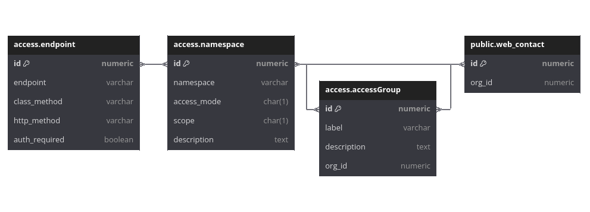

# RFC: Role-Based Access Control

- Feature Name: Role-Based Access Control (RBAC)
- Start Date: 2024-11-12
- Author: @cbbayburt

# Summary
[summary]: #summary

This RFC proposes implementing role-based access control (RBAC) in Uyuni to meet users' needs for fine-grained access control and configuration.
The solution is extensible, integrates with existing features of the codebase, and is independent of the ongoing efforts to migrate from the Struts framework.


# Motivation
[motivation]: #motivation

Currently, access control rules are defined by static role information and controlled individually within each action.
By default, each new feature must define its own access rules; if no rules are explicitly defined, the feature is available to all authenticated users.

This proposal moves access control rules to a centrally managed location.
The code implementation is generic and relies on configurable access policy definitions, allowing new use cases and rule definitions to be addressed through configuration rather than code changes.
The Uyuni Server deploys with sensible defaults and enables users to define custom access policies (user access groups) to meet their specific needs.

The goal of access control is to answer the following question: "Can user U perform operation O on resource R?"

Access control operates on three distinct levels, each with specific goals and constraints:

1. **Authentication:** Identifies the user calling this action.
2. **Authorization:** Determines if the user is allowed to call the endpoints for this action.
3. **Accounting:** Tracks and logs actions taken by users on specific resources.

This proposal specifically addresses level 2, authorization. However, managing access control across different instances or sets of the same resource type is considered beyond the scope of this RFC.


# Detailed design
[design]: #detailed-design

## Overview

This solution stores all available network endpoints in the database and determines which endpoints each user can access, with the exception of the **Uyuni Administrator** role, which bypasses access control.

Endpoints are organized into functional groups called **namespaces**, allowing administrators to modify access control rules easily without needing to navigate the complex endpoint structure.
This approach reduces the risk of misconfiguration.

The namespaces are further categorized by access mode into "View" and "Modify" to provide a clear distinction of access levels.
Access policies are defined by mapping namespaces to access control groups.

All existing endpoints must be mapped and grouped into namespaces:

- **308** endpoints in Spark framework used by the web UI
- **757** XML-RPC and JSON over HTTP API endpoints (excluding overloads)
- **563** Struts entry points

The proposed solution is based on the following key components:

1. Access control data
2. User access information
3. Access control filters
4. Management interface
5. Development resources

## 1. Access Control Data

Every access point in Uyuni is mapped as an **endpoint** in the database and grouped into **namespaces**.
Access control is enforced by defining rules for these namespaces, either per **user** or **access group**.

Below is a simplified ER diagram illustrating the proposed structure for access information in the database:


*[View in dbdiagram.io](https://dbdiagram.io/d/Uyuni-RBAC-672e18b3e9daa85acacbddd0)*

### Endpoint

An **endpoint** represents a specific access point that can be called by a client, such as a web page URL, an internal API endpoint used by a web page, or a public API endpoint.

- **`endpoint`**: The accessible URI of the endpoint.
- **`class_method`**: The Java class that handles incoming requests to the endpoint, such as a controller class for web endpoints or an API handler for API endpoints.
- **`http_method`**: The HTTP method (e.g., GET, POST, PUT, DELETE) accepted by the endpoint. If multiple methods are supported, each should be defined as a separate endpoint since they typically serve different purposes.
- **`scope`**: Indicates whether the endpoint is accessible through the web UI (including internal API calls) or the public API.

### Namespace

A **namespace** is a logical grouping of endpoints that performs a specific task and defines the smallest unit of access control.

- **`namespace`**: A label representing the namespace, expressed as a dot-separated string of components. Each component corresponds to a level of hierarchy for a task, with related tasks sharing the same components at higher levels.

  *Example:*
    - `clm.project.list`: Allows viewing the CLM projects list.
    - `clm.project.details`: Allows viewing or modifying the details of a CLM project.

- **`access_mode`**: Defines the access level for each namespace as either "View" (R) or "Modify" (W). Many namespaces will have separate entries for each mode, with different endpoints for each purpose.

  For example, `clm.project.details` **[R]** allows viewing a project's details, where `clm.project.details` **[W]** allows modifying them.

- **`description`**: A clear description of what a namespace grants access to.

#### Organization of namespaces

Organizing namespaces in a hierarchical structure with distinct access modes simplifies management and modification of access rules for administrators across users or groups.

### Access group

An **access group** is a collection of access rules that can be assigned to users, allowing administrators to manage permissions for multiple users at once.
Access groups can be either predefined or created by administrators.
Predefined groups serve as replacements for existing user roles on the Uyuni server.

- **`label`**: The label of the access group.
- **`description`**: The purpose or scope of the access group.
- **`org_id`**: The ID of the organization to which the group belongs. This field will be `null` for predefined groups.

#### Existing roles

To ensure a smooth transition, existing roles will remain until all JSP/Struts pages are fully removed. The new access control mechanism includes default user access groups replicating the following roles:

- Uyuni Administrator
- Organization Administrator
- Activation Key Administrator
- Configuration Administrator
- Image Administrator
- Channel Administrator
- System Group Administrator
- Read-only API User


## 2. User Access Information

Users can be granted access either individually or through access groups.

Users assigned to an access group inherit all permissions defined within that group.
While administrators can grant individual users additional permissions beyond those provided by their assigned group, they cannot revoke permissions set by the group. Additionally, users can belong to multiple access groups and inherit all associated access rules.

Predefined access groups are designed to meet the needs of most environments; however, administrators can create custom groups to address specific requirements as needed.

Below is a conceptual example of how access rules can be defined for an individual user:

**Example:** Grant tailored access to content management (images) feature for user `Alice`

Available namespaces in the content management feature:

|    namespace      | access_mode |                               description
|-------------------|-------------|-------------------------------------------------------------------------
|cm.build           | Modify (W)  | Build container or Kiwi images
|cm.image.import    | Modify (W)  | Import container images from a registered image store
|cm.image.list      | View (R)    | List all images
|cm.image.list      | Modify (W)  | Delete images
|cm.image.overview  | View (R)    | View image details, patches, packages, build log and cluster information
|cm.image.overview  | Modify (W)  | Inspect, rebuild, delete images
|cm.profile.details | View (R)    | View details of an image profile
|cm.profile.details | Modify (W)  | Create image profiles, edit profile details
|cm.profile.list    | View (R)    | List all image profiles
|cm.profile.list    | Modify (W)  | Delete image profiles
|cm.store.details   | View (R)    | View details of an image store
|cm.store.details   | Modify (W)  | Create image stores, edit store details
|cm.store.list      | View (R)    | List all image stores
|cm.store.list      | Modify (W)  | Delete image stores

Setting up access rules for user `Alice`:

- Grant view access to the entire images feature:

  ```
  Grant 'View' on 'cm.*' to 'Alice'
  ```

- Prevent access to sensitive image store information:

  ```
  Revoke 'View' on 'cm.store.details' from 'Alice'
  ```

- Allow `Alice` to build and manage images:

  ```
  Grant 'All' on 'cm.build' to 'Alice'
  Grant 'All' on 'cm.image.*' to 'Alice'
  ```

- With these permissions, `Alice` can now:

  - List all images
  - Delete all images
  - View image details, patches, packages, build log and cluster information
  - List all image profiles
  - View details of an image profile
  - List all image stores
  - Build container or Kiwi images
  - Inspect, rebuild, delete images
  - Import container images from a registered image store

- When permissions are no longer needed, revoke them:
  ```
  Revoke 'All' on 'cm.*' from 'Alice'
  ```

*Permissions can be assigned to an access group instead of an individual user in the same manner.*


## 3. Access Control Filters

Access control is enforced at the endpoint level through a dedicated Java servlet filter.

The filter queries the database to verify if the current user is permitted to access a specified endpoint.
It does this by matching the requested URI with the `endpoint` field of allowed endpoints within any associated namespace before passing the request along the chain.

Additionally, the filter injects details of the relevant access rule, such as the namespace and the access mode, into the request context, allowing the controller processing the endpoint to access this information.
This enables the controller to serve conditional content based on each user's access rules, such as hiding unauthorized sections of the page. New ACL methods can also be used to check access to arbitrary namespaces for similar purposes.

The filter controls access to the following types of endpoints:

- Struts pages
- Spark web UI endpoints (pages and internal API)
- Spark public API endpoints (JSON over HTTP API)
- Saltboot endpoints
- Ajax endpoints
- Websocket endpoints

By default, any requested URI is denied access unless a match is found.

### XML-RPC API

Access to XML-RPC API methods is managed through the `BaseHandler` class, the base class for all XML-RPC handlers.
Access is granted if the requested method's name and handler match the `class_method` field of an allowed endpoint.

XML-RPC and HTTP APIs share the same endpoint entries in the database. However, while HTTP requests are validated against the `endpoint` field, XML-RPC requests are validated against the `class_method` field.

### Performance

Access control checks query the database on every request.
To mitigate performance impact, a user's access rules can be preloaded into memory and stored in the user's session data during login, enabling faster access control validation.


## 4. Management Interface

A UI catalog is proposed for access control administration, offering a clear and user-friendly view of all namespaces along with their descriptions.

Additionally, administrators can manage access through a new API namespace called `access`, which provides methods to:

- Grant or revoke access to a namespace for a user or access group
- Add or remove a user from an access group
- Check if a user or group has access to a specific namespace
- List all available namespaces for a particular feature


## 5. Development Resources

After the initial development and mapping of all existing endpoints to the new structure, ongoing effort is required to keep endpoint mappings and the namespace structure up-to-date. To reduce RBAC overhead when implementing new features, the following additional resources are proposed:

- An extensive Wiki guide on adding necessary endpoints with proper namespace organization
- Stored procedures and scripts to easily grant/revoke user access for development
- CI checks to detect any unmapped endpoints when introducing new features
- A failsafe mechanism to prevent access to unmapped endpoints
- Startup checks in the Uyuni Server to log any misconfigurations within a specific deployment

# Drawbacks
[drawbacks]: #drawbacks

- **Increased development complexity and overhead:** Maintaining RBAC will require additional development effort, especially to ensure that all endpoints are properly mapped and categorized. Each new feature will need to be carefully aligned with access policies, adding complexity to the process.

- **Potential for configuration drift**: Over time, there is a risk that the RBAC namespace structure and actual endpoint mappings may drift apart. If new endpoints or features are not consistently mapped or if namespace groupings are mismanaged, this can lead to security gaps or unintended access permissions.

- **Learning curve for administrators and developers**: Introducing a new RBAC model with detailed namespace mapping and access modes may require training for both developers and administrators. Adjusting to this new model and understanding the finer distinctions of access control may initially be challenging.

# Unresolved Questions
[unresolved]: #unresolved-questions

- **Granularity of access control:** Should the RBAC model include finer-grained permissions, such as access by specific actions (create, update, delete) within a namespace, or is the proposed "View" vs. "Modify" access mode sufficient for most cases?

- **External integration needs:** Will the RBAC system require compatibility with external authentication or access control systems, such as LDAP, and if so, what integration points are required to support this?

- **Additional access groups:** Should predefined access groups be expanded to cover specific use cases beyond those mirroring existing roles?
