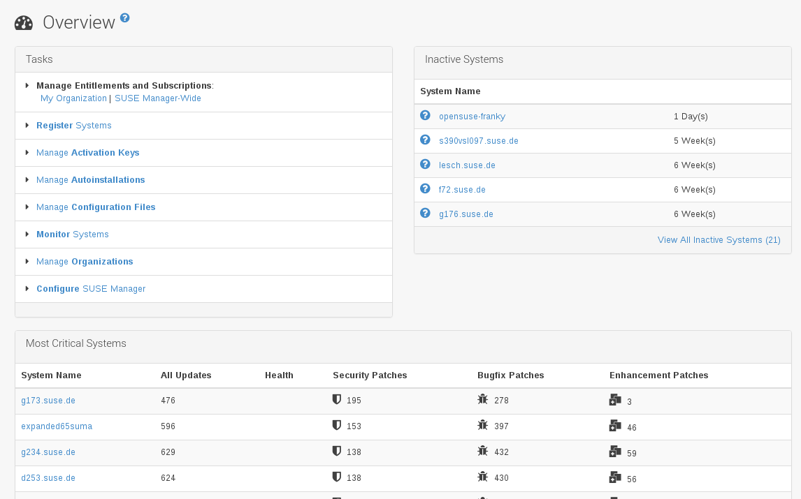
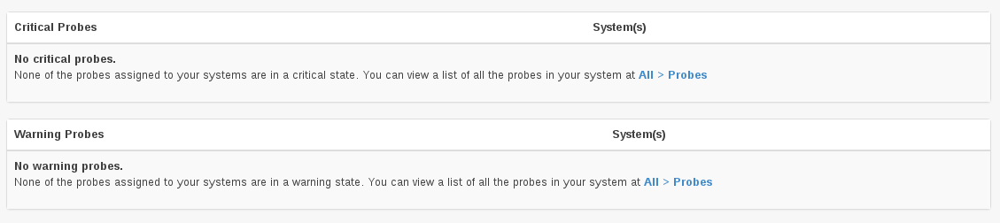
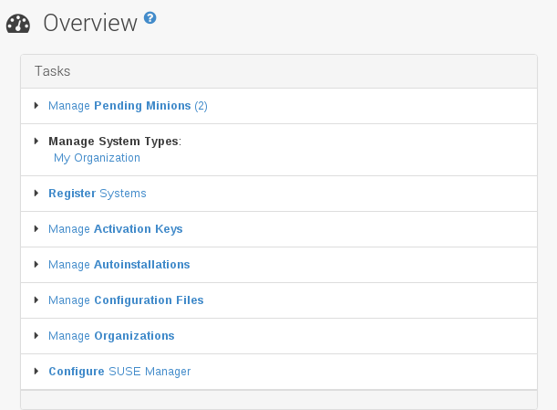
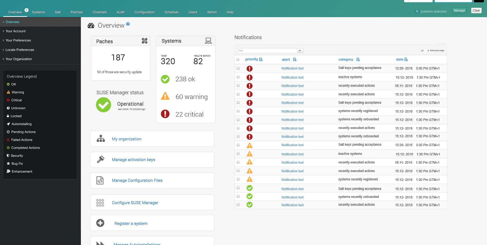

- Feature Name: Displaying notifications to the user
- Start Date: 2016-04-28

# Summary
[summary]: #summary

This RFC describes a proposal to make the user aware of events and problems that currently SUSE Manager/Spacewalk is not able to display.

# Motivation
[motivation]: #motivation

There are circumstances where SUSE Manager is not doing a good job telling the user that something has not gone as expected, for example:

* A minion failed onboarding (e.g. SUSE Manager could not get some required data from the system in order to onboard it).
* Facts that are important to achieve other tasks like a subscription expiring (which would prevent channel syncing).

At the same time, we plan in the future to aggregate information coming from external systems:

* Summary coming from external monitoring solutions.
* Integration with external monitoring solutions, which can provide events/warnings that are not always related only to systems but could be more abstract.

# Detailed design
[design]: #detailed-design

## User experience

The obvious place to show important information is to use the overview page, which is where the user nowadays starts browsing for relevant information.





However, this page is filled with information of inconsistent importance.

* There is a box called tasks which is just a collection of shortcuts (but it is called "Tasks")
* With Salt support, We added "Pending minions" overview to this "Tasks" box, and therefore it got it first real "Task".



This RFC proposes using the overview page in the most prominent place to display this global events and notifications, but at the same time move related things together to make it consistent.

The first step is to add the place where these events will be shown. Lets call it "Notifications" for now. Here you will see:

* Important notifications from the product.
* Expired or about to expire subscriptions, with links to renewal.
* Overall status or links injected by external systems that SUSE Manager integrates to, for example ticketing, workflows and monitoring. (which does not mean monitoring could not inject some data also to the specific system page).
* Background tasks that failed and that the user need to review or restart (e.g. failed onboardings).

However, the "Pending minions" links we added to the original box at the left belongs here, as it is something that the user needs to take action, while the original left box was just a collection of links. So the proposal is to move "Pending minions" also here (shown by typo as incoming minions in the mockup).

The inactive systems box is really big and is a full list, not an overview. So the proposal is to remove it and addit as one entry to the new box, and display it ONLY if there are inactive systems, and not ALWAYS like it is now (consuming a big chunk of the main screen BEFORE scrolling without any useful information).

So the screen would end having the following information:

* Patching summary
* Summary from monitoring system.
* SUSE Manager server self-health summary.
* Notifications and event alerts.
  * Some of them sticky (disk space running out will go away once there is space).
  * Some of them dismissible (they are marked as "read").
* List of links/shortcuts to common tasks.

### Mockup



## Delivery to customers

* This will be a new overview page, default in HEAD.
* In 3.0 a banner will appear offering the possibility to switch.

## Implementation

The over view box will show a mix of items that can be put under two categories:

* Actionable items (once you onboard or delete a minion it is no longer in the pending list)
* Items whose action is to read it (3 systems failed onboarding)

The actionable category comes from queries. The readable category comes from events that already happened, therefore a place and API that processes can use to deliver those notifications is needed.

* Rhn

| Id  | Type     | Text                            | Status |
| ----| -------- | ------------------------------- | ------ |
| 1   | WARNING  | System failed onboarding <a>....| N      |
| 2   | INFO     | New SUSE Manager release <a>... | A      |

The API would allow to directly put messages there:

```java
message = new UserNotificationMessage();
message.setHtml("System failed onboarding <a>....");
message.setType(UserNotificationMessage.WARNING);
message.save();
```

The user interface would display a `dismiss` button on the ones where there is nothing else to do that to read them (where we can't figure out what action was taken).

```java
message = UserNotificationMessageFactory.lookupById(htmlNodeId);
message.setStatus(UserNotificationMessageFactory.ARCHIVED);
message.save();
```

### Additional ideas

* One idea would be to implement the whole "Tasks" as a class, and have actionable and readable items share an interface. Then the UI and code adding to the list would not know about both "types". The backend would take care of fetching from both sources.

* Allow to setup when creating the message where it deserves an email notification as well:

```java
message = new UserNotificationMessage();
message.setHtml("System failed onboarding <a>....");
message.setType(UserNotificationMessage.WARNING);
message.setEmailAdmin(true);
message.save();
```

# Drawbacks
[drawbacks]: #drawbacks

* The amount of information on the overview page will be higher, but less verbose.
* We are changing some user interface elements that will require updating documentation and screenshots.

# Alternatives
[alternatives]: #alternatives

What other designs have been considered? What is the impact of not doing this?

# Unresolved questions
[unresolved]: #unresolved-questions

* How the user dismisses notifications?
  * Example: a "Manage pending minions" entry would go away when there are no more pending minions, but when should a "3 systems failed onboarding" entries go away.
* How the table relates to org, users and roles so that the right people can see them?
