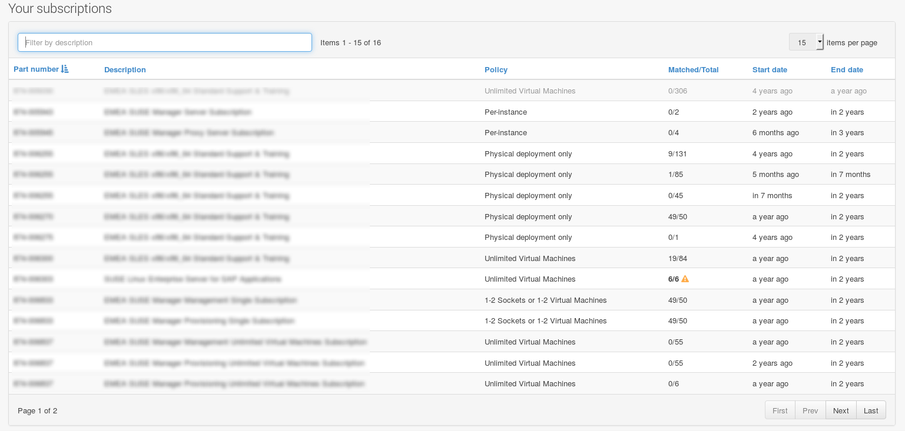

- Feature Name: unified React table component
- Start Date: 2016-05-19
- RFC PR: (leave this empty)

# Summary
[summary]: #summary

Create a unified React table component that suits our needs.

# Motivation
[motivation]: #motivation

We already have two different React table components around. Those should be unified in order to make tables:

1. look equal everywhere
2. use the same component (codebase) everywhere

# Detailed design
[design]: #detailed-design

Table component features:
- browser side pagination
- browser side textual search
- browser side column sorting
- user changeable number of rows to show per page
- fully customizable cell and header contents

## Table API
```html
<Table
  data="[1]"
  pagination="[2]"
  pageSize="[3]"
  rowDecoratorFn="[4]"
  searchFn="[5]"
  className="[6]"
>
  <Column
     sortFn="[7]"
     className="[8]"
     >
     <Header>[9]</Header>
     <some.widget ...>[10]</some.widget>
  </Column>   
</Table>
```
1. Mandatory. The data to be rendered. Must be an array containing the objects to be rendered. 
2. Optional. `true/false`. Default: `true`. Enable or disable pagination
3. Optional. Default: `15` The initial page size if pagination is enabled
4. Optional. `function(rowIndex, rowData, rowElement)`. Default: `None`. Function used to decorate the row (e.g. add alternative css clases for odd/even rows, etc). 
   - `rowIndex` - the index of the row in the current page
   - `rowData` - the data for the row
   - `rowElement` - the `<tr>` element.
5. Optional. `function(data, criteria)`. Default: `None`. Function used to filter the data. If no function is provided the search box will not be rendered. 
6. Optional. Default: `None`. CSS class name to be applied to the whole table.
7. Optional. `function(columnIndex, rowA, rowB)`. Default: `None`. Function used to sort the data.
8. Optional. Default: `None`. CSS class name to be applied to each cell in the column.
9. Mandatory. The column header. Can contain any other component.
10. Mandatory. The widget used to render the content of the column. Must accept a `data` prop that will hold the row data.

### Look and Feel

The look and feel must be similar to the existing table.js component.



# Proof of concept

http://jsbin.com/jigoji/edit?js,output

# Drawbacks
[drawbacks]: #drawbacks

Refactoring work needed to adapt the existing tables.

# Alternatives
[alternatives]: #alternatives

Use an existing table component. [This one](http://facebook.github.io/fixed-data-table/) was created by Facebook and is pretty feature rich.

# Unresolved questions
[unresolved]: #unresolved-questions

Q: Support server side filtering, sorting and pagination ?

Q: How to expose the table state to the cell components ? This might be usefull for highlighting the content when searching.

A: The table state can be exposed as-it-is to the components in the cells. These components have to be made aware of the table state. There's an example in the Proof of Concept.

Q: Alternatively support a "row-oriented" API similar to the current table component ?

Advantage: Might make porting easier. 
Drawback: Two ways of doing the same thing. 

```html
<Table 
  data="[1]"  
  ...
  >
  <Rows contentFn="[2]" header="[3]" sortFn="[4]" sortableColumns="[5]" .../>
</Table>  
```
1. the data to be rendered. Must be a list containing the objects to be rendered.
2. function that takes a list of objects from [1] as input and returns a list of `<tr/>` elements.
3. headers in case the content function is used.
4. function used to compare rows when sorting
5. the indexes of the sortable columns

A: No definitive conclusion was reached. For now having a unified table component is more important therefore we'll proceed with the column oriented approach.
