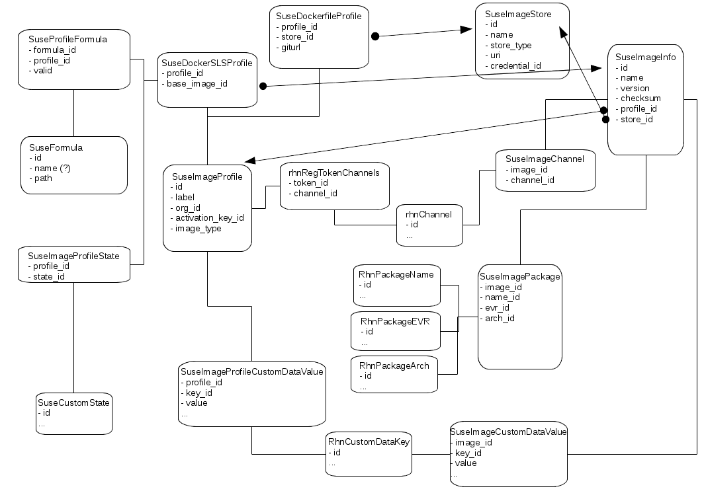

- Feature Name: Image Content Management with SUSE Manager
- Start Date: 2016-12-13
- RFC PR: (leave this empty)

# Summary
[summary]: #summary

Managing content of images: building, storing and auditing.

# Motivation
[motivation]: #motivation

We want to manage the content of images used to run or install systems.
To achieve this we need to:

- building images (docker, cloud, etc.) with SUSE Manager (cloned) repos
- feeding image stores
- audit images for compliance

# Detailed design
[design]: #detailed-design

## Defining and configure Build Hosts

- Use Addon System Types
- Can be defined for salt base entitlement only
- provide add-on system types as pillar data to use it in states
- ship a static state to define the requirements for that build host type.
  The state should only be applied when this system has the system type
  defined in the pillar data
- While adding a system type we need to take care that the state is applied
- when the system type is added via activation-key, we need to apply the highstate
- architecture dependency

### Specific requirements for a Docker Build Host:

Required packages:
- docker
- python-docker-py
- salt >= 2016.11

We need to check, if required packages are available in the assigned channels.

Required service running:
- docker

### Specific requirements for a Kiwi Build Host:

To be defined later

## Building an Image

The idea is to use a salt state to build the images. But customers may have already
Dockerfiles and a build process in place. So we need to support building via Dockerfile
(incl. directory with other files) as well.

Possible solution: dockerng.build seems to take a git URL.

Building an image requires a special role.

### ImageProfile

An ImageProfile `suseImageProfile` contains the following data:

- label: identifier
- org_id: definition per org
- activation_key: reference to an activation key to define used channels
- image_type: e.g. docker, qcow2, pxe, etc.
- metadata: reference to `rhnCustomDataKey` (?)

Different Profiles have different needs for data.
We need extensions to the DB schema with suseImageProfile as a base and
something like suseDockerProfile, suseDockerGitProfile and suseKiwiProfile
as extensions.

To define "channels" we store a reference to an activation key as defined in
[RFC#00024](./00024-docker-integration.md)

Extension `suseDockerSLSProfile`:

- states: reference to `suseCustomState` (?)
- formulars: (no DB entry)
- base_image: reference to `suseImageInfo` or a string (?)

Extension `suseDockerfileProfile`:

- base_image: reference to `suseImageInfo` or a string (?)
- giturl: for Dockerfile and additional files (alternative to states)

Extension `suseKiwiProfile`:

Depends on the implementation. Possibily we implement a salt module which also
work with a git url.

The org states are included automatically. For building an image an extra pillar data is defined
to be able to exclude or include parts of the states by matching on these pillar data.
One possibility would be to add the image_type as pillar data

 image_type: docker

States created by the customer in /srv/salt cannot be used directly. The customer should
create a custom state and include its own state. With this workflow he can use its own states.

Formulas are not yet reflected in the database. We need to move parts of it in the DB first.
The main content of formulas are still on the filesystem.
In case a formula got removed we need to mark it as "invalid" in the profile.

### Execute Building

For building we need to specify the Build Host, the Image Profile and the target Image Store where this image
should be uploaded after the build is finished.

#### Docker building

For docker the `salt.module.dockerng.sls_build` already exists. For Dockerfile we can use `salt.module.dockerng.build`.

A new defined role `Docker Image Admin` is required to define docker profiles and build them.

#### Kiwi building

To be defined later

### Build Results

As a final step of the building process should be sending an inventory and store these information in SUSE Manager.
In SUSE Manager the `suseImageInfo` should contain the following data:

- name
- version
- checksum
- image_type
- org_id
- channels: reference to `rhnChannel`
- packages: similar to `rhnServerPackage`
- metadata: reference to `rhnCustomDataKey` (?)
- profile: reference to `suseImageProfile`
- image_store: reference to `suseImageStore`
- build_location: string where it was build

For situations where we build without salt it makes sense to implement *inspect* as a seperate step.

- build
- inspect
- store

Inspecting images build with a Dockerfile might be complicated. It could be ignored if it become too complex
for the first implementation of this feature.

## Storing

It is not planned that SUSE Manager store the images itself and provide a service for image storing and fetching
(Maybe there is one exception when it comes to PXE boot images).
The goal is to integrate with existing solutions like docker-registry, portus, glance, etc.

Storing images mean:

- We need a UI to configure Image Stores
- We need the ability to upload the images into the correct store
- SUSE Manager should know where the images are stored, it has uploaded.

Secondary goals depends on the image store implementation and its capabilities:

- list images in the store
- delete an image from a store when it gets deleted from SUSE Manager

### suseImageStore

In SUSE Manager the `suseImageStore` contains the following data:

- name
- store_type: e.g. docker-registry, portus, glance, S3, etc.
- uri
- credentials: if needed a refernce to `suseCredentials`
- org_id

### Image Store Type - Docker Registry

One type of an image store if a `docker-registry`.

Configuring [authentication for a docker-registry](https://docs.saltstack.com/en/latest/ref/modules/all/salt.modules.dockerng.html#authentication)
in the dockerng module can happen via pillar data.

### Image Store Type - Glance or other VM image stores

To be defined later

## Auditing

The *inspect* step could return the package list of the final image like we do it for a system.
If we create a database structure around a `suseImageInfo` table similar to the `rhnServer` table we
could copy the SQL queries used for CVE Audit and other things and just rename some tables.
The algorythms could stay the same.

### Future Goals

In future SUSE Manager should be aware of infrastructure who runs the images.
SUSE Manager should be able to list running instances and map them to known images.
With this it can say during the audit which images should be replaced because newer images
are available or which images requires a re-build because new software is available.

## DB schema

# Drawbacks
[drawbacks]: #drawbacks

- Not part of this RFC and maybe never in scope of SUSE Manager is: running the images and controlling where an image is running.
  This can be added later when it should become part of the scope if SUSE Manager and the environment is more clear.

# Alternatives
[alternatives]: #alternatives

n/a

# Unresolved questions
[unresolved]: #unresolved-questions

1. Do we need to introduce user permissions?

On suseImageInfo it might makes sense similar to systems. This would make it easier to
reuse SQL queries.

1. Do we need to "share" images (similar to custom channels - private, protected, public?)

Answer: No - Images end up in an image store. The image store is responsible for access management.
