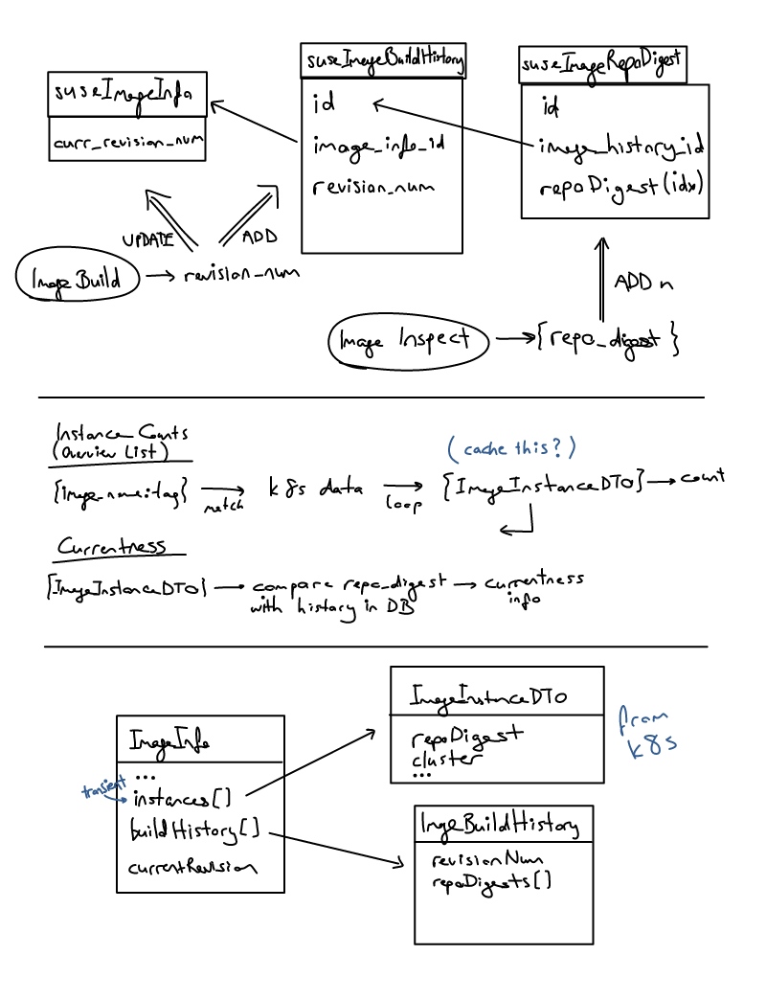

- Feature Name: Kubernetes integration
- Start Date: 2017-07-16
- RFC: 00035

# Summary
[summary]: #summary

This describes the initial implementation of retrieving image information from a Kubernetes cluster.
Initially we'll focus on CaaSP as a Kubernetes implementation.

# Motivation
[motivation]: #motivation

This is driven by the need to integrate with the new CaaSP product.

# Detailed design
[design]: #detailed-design

## Scope

This covers just the initial implementation of the Kubernetes integration. More specifically:
* store information about the Kubernetes endpoints and authentication information
* retrieve basic information about the nodes of a cluster
* discover instances of SUSE Manager built images that are running in a Kubernetes cluster
* show the outdated containers that are running in a cluster

## Implementation

### Connection to Kubernetes

SUSE Manager will store the `kubeconfig` file. This contains the API endpoint and the authentication information for one
or more clusters.

The user will upload this file when configuring a cluster.

### Client library

We already package the `python-kubernetes` library which is the official python client and we'll it for the Virtual Host
gatherer.

This library will be also used for getting the required information about nodes, pods, etc from Kubernetes. To facilitate
the integration with the Java code a custom Salt runner will be implemented that will use this library.

### Matching Kubernetes containers with SUSE Manager built images

SUSE Manager must be able to match Manager built images to containers running a Kubernetes cluster.

This will be achieved by matching the `RepoDigests` of the Docker image to the `Image ID` of the
 Kubernetes container.

The `Image ID` must have the `docker-pullable://` prefix in order for the matching to work.

If the `docker://` prefix is present then the content of the `Image ID` will match the `Id` field of the Docker image.

The `RepoDigests` of an image will be stored to the database when inspecting the image.

In case the `Image ID` of a Kubernetes container is not found in the database (e.g. image built outside of SUSE Manager)
 but the `registry/name:tag` of the container match perfectly a SUSE Manager image then at least warning will be shown.

In case there's no `Image ID` match and no exact `registry/name:tag` then the container will be ignored.


```bash
docker inspect registry.example.com/kubernetes-test:latest
```
```json
[
    {
        "Id": "sha256:edde377d56efa538439845ee6cbcc02a3cc0db98994749886adace4f14a2b19e",
        "RepoTags": [
            "registry.example.com/kubernetes-test:latest"
        ],
        "RepoDigests": [
            "registry.example.com/kubernetes-test@sha256:ea40a5d3703a556f0be297cb87504b1ef51f011c5c433402da70563ae256235c"
        ]
        ...
    }
]

```

```bash
kubectl describe pod kubernetes-test-310237000-5wkb7
```
```
Name:           kubernetes-test-310237000-5wkb7
...
Containers:
  kubernetes-test:
    Container ID:       docker://fec1667e5fe3a777141dc321fd14262a24f5bf159a259c079b1b7908c558db47
    Image:              registry.example.com/kubernetes-test:latest
    Image ID:           docker-pullable://registry.example.com/matei-kubernetes-test@sha256:ea40a5d3703a556f0be297cb87504b1ef51f011c5c433402da70563ae256235c
...
```

### UI changes


### Virtual Host Gatherer extensions

We already have the Virtual Host Manager which provides a way to gather information from foreign virtual hosts.
This can be extended to do a similar job for a Kubernetes cluster.

An additional module will be implemented that collects information about the nodes of a Kubernetes cluster.

A list of nodes will be presented to the user.


### Database changes



#### suseImageBuildHistory (new)

Historical information about each image build triggered from SUSE Manager.

* id
* image_id REFERENCES suseImageInfo (id)
* created

#### suseImageBuildDigests (new)

`RepoDigests` assigned to images by the Docker registry. These will be used for matching the images with the Kubernetes containers.

* id
* build_id REFERENCES suseImageBuildHistory (id)
* digest

#### suseImageInfo (existing)

New field to hold a revision number what will be incremented for each successful build:

* build_revision (new)

#### suseServerVirtualHostManager (existing)

* id (new)
* node_id REFERENCES suseVirtualHostManagerNodeInfo (id) (new)
* server_id (existing) will be changed to NULLABLE.

Restrictions:
server_id and node_id can't be both NULL at the same time

#### suseVirtualHostManagerNodeInfo (new)

Information about Kubernetes nodes. Will be filled with info provided by the Virtual Host Gatherer.

* id
* name
* arch
* cpu
* memory

# Drawbacks
[drawbacks]: #drawbacks

Why should we *not* do this?

# Alternatives
[alternatives]: #alternatives

What other designs have been considered? What is the impact of not doing this?

# Unresolved questions
[unresolved]: #unresolved-questions

Q: Is `python-kubernetes` (via a Salt runner) a good option in the Java code? Should we use the `fabric8io` library in the Java?
A: We will use `python-kubernetes` in implementation

Q: Where to store the kubeconfig file? Should we store it verbatim as uploaded by the user or only the selected context?
A: We will store the file as-is.

~~Q: In case we don't find the `Image ID` in the database should we also match containers by repository & name & tag? Since the matching would not be exact we could show a warning in the UI informing about possible match.~~
