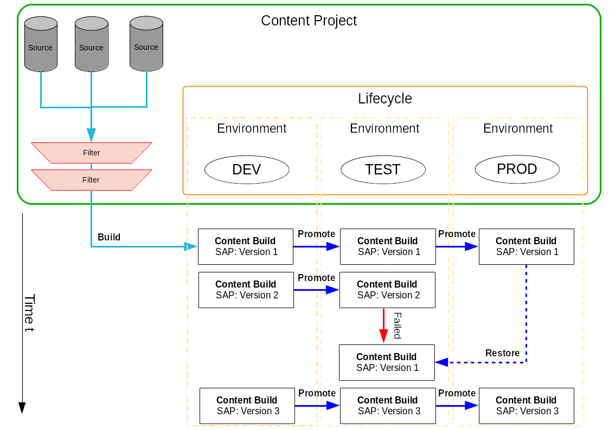

- Feature Name: Content Lifecycle Management
- Start Date: 2018-01-10
- RFC PR: #62

# Summary
[summary]: #summary

Define how content should be collected in a view and promoted via different environments/stages.

# Motivation
[motivation]: #motivation

Customers typically do not use our Vendor Channels directly. They create clones, modify them by removing packages and/or patches from it, add their own repositories and more. When they think they have a collection which fulfills their needs they want to test it before they bring this into production.

This can be implemented by using environments/stages like `DEV`, `QA`, `PRODUCTION` and content is just copied from one environment/stage to the next. There are systems assigned to these environments to develop and test newly added content before all production servers are updated.

*Content* is not limited to Channels. It could also be "Configuration Channels" for states, "formulas" and more.

This RFC was inspired by best practices, Customer feedback and Katello.

# Glossary
[glossary]: #glossary

* *Content Project*: A Project to attach Sources and Filters. It defines the Environments and the Lifecycle. The Content Project keeps a history of changes.

* *Content*: Data for Systems like: Channels, Repositories with RPMs and Patches, Config Channels, Salt states and formulas. (Container images may or may not be seen as content. VM images are not content as nobody would use it. They are built from content but not built based on top of another image.)

* *Content Build (CB)*: A snapshot of *Content* - optionally filtered - in an *Environment*.

* *Content Snapshot* (*Snapshot*): Data containing a version and a description of a *Content Build* (e.g. channels, packages, errata, activation keys). Can be used for re-creating a *Content Build* later in the future (used for the "restore" functionality).

* *Filter*: A filter to deny or allow different kind of *Content*.

* *Environment*: AKA *Stage* or *Landscape* (`DEV`, `TEST`, `PRODUCTION`). Contains a version of a *Content Build*.

* *Lifecycle*: Sequence of *Environment*s that forms the content promotion order.

* *Build*: *Building* generates a new *Content Build* version by cloning all attached Sources and applying the Filters. *Building* happens in order to lock the content in place.

* *Promote*: *Content Build*s are copied along the *Lifecycle* to the different *Environments* defined in the *Content Project* (e.g. `DEV` to `TEST` to `PRODUCTION`). During *promotion* no filtering happens.

* *Restore*: Restore *Content* of given *Environment* to the state described by given *Content Snapshot*. Again, no filtering happens.

# Detailed design
[design]: #detailed-design

## Managing Content

Different kind of *Content* Sources can  be attached to a *Content Project*.

Optionally *Filters* can be added to globally filter *Sources* content. *Filters* will be applied with an *AND* in the middle.
Filters for Software Channels can be denylisting a package by name or version, or denylisting patches by date or type.
The implementation should be generic to add other filters in future versions.

The *Content Project* also defines the *Lifecycle*. Minimal one Environment must be specified. It should be possible to add as many *Environments* as needed in a row.

*Sources* to attach could be Software Channels, Configuration Channels, Formulas, etc.
For Software Channels *one* base channel and all or some of its children can be added to the *Content Project*.

Our *Best Practices Guide* says that custom channels (Channel created by the customer with 3rd Party software) should live in a separate tree,
we must also allow to select other channels from different base channels. They need to be cloned during the *building process* under the new common
base channel.

To create a *Content Build* from a *Content Project* it needs to be *built*. While *building* it generates clones of all the
attached *Sources* and applies the *Filters* if there were any attached. The result is a versioned snapshot of the *Content Build* in the first *Environment* of the *Lifecycle*.

It should be possible to add a description to the version of the *Content Build*.
Showing a *History* of an *Environment* with descriptions of all promoted(?) *Content Builds* might be useful.
Automatically added text snippets for the description while adding or removing a *Filter* help to know when a certain package or patch
was excluded or included again.

After the *Content Build* is built, it can be *promoted* to the next *Environment* defined by the *Lifecycle*.
Promote *Content Builds* is just copying it from one *Environment* to the next. It is not possible to change the content between the *Environment*s.
*Filter*s are applied only when *building* the *Content Build* for the first *Environment*.

As the *Content* in *Sources* changes and also *Filters* can be added and removed, new *building* compiles a new version of the *Content Build*.
A new version **overwrites** the older version. Only the latest version of a *Content Build* in an *Environment* materializes on disk and can be used.

The user still has option to restore an *Environment* to a previous state(s) using the *restore* functionality and *Content Snapshot*s (see the [Restore functionality](#restore-functionality) section).

If an *Environment* does not have a successor it should be possible to append a new one to the end of the *Lifecycle*.
In case there is a successor, adding an *Environment* would insert it in between the current *Environment* and the current successor.

Removing of an *Environment* should be possible. Removing it from the middle of the *Lifecycle* would just link the current predecessor and successor together.

## Using Environments

To use an *Environment* a *Content Project* generates an `activation key` and a `system group` per *Environment*. The default here is that all *Content*
available in an *Environment* is used when a registration happens using such an activation key. By using such an activation key a system would
automatically join the corresponding system group.
The *Content* is either added to the activation key or to the system group.

## Content Profiles

Systems do not necessarily need to use all contents of the content build, but can pick only parts of it. Systems with the same selection of *Content* belong to the same *Content Profile*. *Content Profile*s are defined on the *Content Project* level (**not** on the *Environment* level).

**Example:** Customer has a group of web servers and a group of HA servers as a part of one *Content Project*. They want the web servers to be subscribed to one group of channels, whereas the HA servers should use other group (HA channels)). They can create a *Content Profile* for each such group of servers.

There will be a set of `activation key`/`system group` per *Content Profile* and *Environment*. These determine which *Content* are systems in corresponding *Content Profile* subscribed to.

There will always be one *implicit* *Content Profile* - `ALL` (or `DEFAULT`). Systems in this *Content Profile* get all the content from their current *Content Build*.

**Example:** Same setup as in the previous example (2 explicit *Content Profile*s). Customer has 2 staging *Environment*s - `TEST` and `PROD`. In this case, 6 activation keys and 6 groups are generated:
  * For each *Environment* (`TEST`, `PROD`), for each *Content Profile* (`HA`, 'Web Servers', implicit `ALL` group (systems in this group get all *Content* from *build*ed *Content Build*)).
  * The activation keys/groups naming scheme should follow some convention - it could be derived from the names of *Content Project*, *Environment* and *Content Profile*, e.g. `contentproject1-PROD-HA`.

We should make it easy for an user to manage activation keys and groups for a *Content Profile* (i.e. creating a *Content Profile* spawns multiple activation keys/groups) and to define their selection of *Content*.

# Special Usecases
[special]: #special-usecases

## Releases vs. Staging

Some customers prefer to do "Releases". They prepare *Content* and re-assign all Clients to the new Channels and do not move the *Content* along the *Lifecycle*.
*Content Builds*s can be used for this as well. While using *Filters* and assigning Sources in a *Content Project* you can create a "Release"
just by *building* the *Content Build* with just one *Environment*.

To create the next *Release* it would be helpful to be able to "copy" the *Content Project*. This would copy all attached *Sources* and *Filters* under a new name
and the version would be reset to `1`. Now everything can be adapted and a new building action would create a release of the new first *Environment*.

Copying *Content Projects* would also be useful when a user wants to create similar projects but with different *Lifecycle*s.
Example: Groups like "Internal low risk server", "SAP systems" and "external web servers" may have different *Lifecycles* with different steps.
A customer could create these different *Content Projects* always by creating a new one and assign filters and other things to it. But it is easier to
"copy" an existing one and just changing *Filters*, *Sources* or adding/removing *Environments*.

## Fast Track

No special implementation needed.

If a customer wants a "Fast Tack Channel", they can just create an empty channel and assign it to the *Content Project*. It will be
promoted through all the steps up to the final production level.

If an urgent security patch must be delivered fast, the customer could clone the patch into any Fast Track channel.

We could add special support for "Fast Track" channels by allowing to *promote* of just this channel independent from the whole *Content Build*.

## Exception Channels

aka channels that serve as storage for patches that are supposed to be temporarily excluded from an *Environment*.

We want to exclude patch `CVE-123` from the `DEV` environment. This could be modelled with *Filter*s as follows.
On an existing *Content Project*:

* Add one more *Filter* to exclude the patch `CVE-123`
* Build a new *Content Build*

For this, it would be useful if we allowed to add a comment field for a *Content Build*s, or even to particular *Filter*.
With *Filter*s and comments we could build a history which fulfill the idea of "Exception Channels". "Exception Channels" are obsolete in
this case.

## Behavior after a Service Pack migration

During a SP migration the user selects an update target and after this a base channel. The base channel selection can be modified to select
an *Environment* instead of a base channel. If a system is not attached to an *Environment* we should show the existing UI.
Doing this we should change also the group which identifies the *Environment*. With this we would directly get also new states and formulas
from the new selected *Environment*.
We could also show an activation key/system group combinations. A SP migration could re-apply it to make the new states active.

## Automatic channel archiving

In the *Best Practices guide* there is a suggestion to archive vendors channels (cloning them) periodically using a cron job.
We could integrate this with an option to *build* a *Content Project* at a specific point in time to generate a *Content Build*
similar to the schedule definition of a repository sync.

Adding a timer is optional.

## Restore functionality

Support limited *Content* version tracking and restoring (or rolling back).

The most important entity is the *Snapshot*. It has a version and it contains all the information needed for re-creating a *Build* in particular state in a future:
* software channels reference (also the pointer which channel is the base (or "leader) in the *Build*
* packages per channel reference
* errata per channel
* others (after we implement support for them): activation key, configuration channels, ...

### Create Content Snapshot (backup)
*Snapshot* is created after a successful *Project* *build*. It is populated with the references to channels and their packages/errata based on the *build*. Note that the software channels references point to the **source** channels of a project, not to the built ones.

### Restore Content Snapshot
Restoring a *Snapshot* to a *Environment*.

The data from the *Snapshot* is evaluated and the *Content* is re-created from it (e.g. the software channel tree is re-created in given environment and populated by packages and errata from the *Snapshot*).

Technical note: For this, the adapted code for promoting *Environment*s could be used

### Possible improvement: Using restore functionality for promoting
The already existing *promote* functionality could be replaced by the *restore* code since it does the same.

### Version management
Keeping all versions of *Snapshot*s throughout the *Project* existence would be impractical for 2 reasons:
* DB pollution (growing table for *Snapshot*)
* integrity issues (it is likely that some entities referenced from very old *Snapshot*s will be deleted).

The proposal is to keep only selected subset of the *Snapshot* versions per each *Environment*:
* for the last *Environment*  in the *Path* (typically a "production" environment), keep 3 *Snapshot*s,
* for other *Environment*s, keep 1 *Snapshot*.

These numbers can be configurable via a SUSE Manager global option (alternatively, this could be overriden on a *Project* level).

Some kind of "garbage collection" has to be run on *Project* operations to remove old *Snapshot* versions. The algorithm makes sure that the existing *Snapshot*s conform to the conditions above. It should be run on *build*, *promote* and *restore* actions.

### Limitations
The *Snapshot* only contains pointers to other entities (software channels, packages, errata, ...). When a referenced entity is removed by the user, the *restore* function will not work as expected.

## Removing an Environment

In case an *Environment* gets removed, we need to define what should happen to the Infrastructure representing the *Environment* and systems using it.

Associated infrastructure of an *Environment*:
* Software Channels
* Config Channel, states, etc.
* System Groups
* Activation Keys

When we remove all of them when we remove an *Environment* we need to remove them also from systems.
Another option would be to keep them as "standalone" components and keep the systems assigned.
(Needs to be defined)

# Implementation Step 1 - content definition

*aka the "Minimal Viable Product"*

As a first step for the implementation we should concentrate on the general infrastructure and Software Channels as *Content*.
We would need to implement *Content Projects* with the possibility to define *Environments*.
A basic *Filter* should be part of this first implementation to prove the concept.
The *build* and *promote* functionality must be implemented together with a minimal *History*.

Create mockups of the web UI.

Implement basic *Content Project* wizard consisting of steps for
* creating a *Content Project*,
* defining the *Environment*s and *Lifecycle*,
* defining *Source*s (software channels only in the 1st version) and a basic *Filter*,
* (maybe assigning systems to the environments).

Implement *Content Project* API. It should support basic operations
* CRUD of *Content Project* and its parts,
* Create a *Content Project* based on some text descriptor (`YAML`/`JSON` file).

# Implementation Step 2 - content-to-systems assignment, Content Profiles
The infrastructure to "use" *Environments* needs to be implemented: adding and managing *Content Profile*s (handling multiple activation key / system group definitions).

An operation for 're-applying' an activation key must be implemented.

The *Content Project* wizard could be enhanced with template support.

# Implementation Step 3 - further improvements

Enhance the managed *Content* with Configuration Channels. This will include also *Custom States* when they are implemented as Configuration Channels.

Add more *Filter*s.

# Alternatives
[alternatives]: #alternatives

Reassigning of channels:
* define virtual channels assigned to systems to keep a unique name
* define invisible real channels with the content
* define with invisible channels should be used when a virtual channel is accessed.
* promoting a new *Content Build* would just change the assignment of the virtual channels.

Pro:
* no regeneration of metadata needed
* full history available because invisible channel will be kept. Rollback possible.

Con:
* Current concept of channels must be changed globally. A side by side coexistence of old and new model not possible as we have a lot of queries and tables which calculate needed packages and patches based on the assigned channels. We would need to rewrite all these queries. Supporting both concepts would be at least very hard if not impossible. Changing this concept would be very  expensive.

Alterntatively, instead of virtual channels, the building could create
versioned *Content Build* (with versioned channels (`v1`, `v2` suffixes,
for instance). Promoting a *Content Build* to *Environment*s would mean to
switch the subscribed channels of the systems in the *Environment* to higher
version of the *Content Build*. Cons: Promoting would be an expensive
operation (it leads to non-trivial db operations and re-generating of access
tokens for a lot of salt clients in case the *Environment*s are big).

Let systems only use all channels of an environments. Do not allow an admin to remove channels.

Pro:
- A test system would test exactly what a production system uses

Con:
- Customers might have a lot of groups of systems which would result in an unmanageable amount of *Content Projects* and *Environments*.
- Hard to prevent with the current implementation. Every system has a channel page and API which needs to be touched to forbid changes here.

=> Possible Solution (See the *Content Profile*s section):
- Separate Content Staging from the usage
- create *Content Profile*s (activation keys / system groups combination) where multiple groups can be attached to the same *Content Project*
- Every *Content Profile* exists for all *Environments* in the attached *Content Project*
- Every *Content Profile* defines which parts of the *Content* it wants to use, but it does for all *Environments*.

Using System Groups as Environments:
- Would require that systems can only use everything what is defined in an *Environment*, if we assign salt states to this group
- In case we want to implement usage groups, *Environments* are better defined separate.

# Unresolved questions
[unresolved]: #unresolved-questions

# Resolved questions
[resolved]: #resolved-questions

* Q: Naming of *Content Profile*s, more options:
  * *Usage Group*s, *Application Profile*s, *Environment Profile*s,
  * *Application Groups*, *System flavours*, *Usage Units*, *Application Units*, *Environment Activator*s, ...
  * A: *Content Profile*s.

* Q: What should an *Environment* be?
  * A1: An *Environment* is made for a specific type of systems and these systems should use **all** *Content* provided by the *Environment*.
  * A2: An *Environment* is a collection of *Content* and a system can choose which parts it wants to use.
  * We will most likely go with **A2**.

* Clarify/unify the terms: *Content View*s/*Environments*/*Landscape*s/*Stages*
  * Q: Content View: alternatives? Content Build, Content Snapshot, ???
  * A: *Content Build*.
  * Q: Environment: alternatives? Stage or Landscape?
  * A: *Environment*.

* Q: Should a system assigned to an *Environment* get all Software Channels or should it be possible to *disable* some child channels?
  As you can always go to the System => Software => Channels page and change it for a system the latter would be easier.
  This would result in: An *Environment* defines possible content to use. The client is free to use **less** - but it is not recommended.
  In case the environment get a new child channel added this will not automatically added to the registered systems (?)
  Maybe we can provide a solution for promoting new *Environment*s with assigning newly added channels automatically to all systems assigned.
  * A: See Q1.

* Cloning Channels from different base channels under a new common base channel seems to be required because of our Best Practices Guide.
  * Q: Do we need to allow everything or can we limit this somehow?
    * allow only selecting Custom Child Channel?
    * Do we need to allow to do this with Vendor Channels?
    * Do we need to allow to select base channels to be cloned as child channels under the new base?
  * A: We allow to select any type of `custom channel` (base or child) to be cloned under a different base. Cloning vendor channels this way is not allowed because for vendor channels the parent/child relation defines compatibility.

* Q: Changes in SP migration when customers do not want to use *Content View*s and *Environments*. What should we do? How can a UI look like to support this?

  * A: Provide *Environment* selection only if the system is registered against an *Environment*. Otherwise show existing UI.

* Q: Should *Content Builds* or *Environments* be shareable across organizations?
  * Wish: Preferably yes. (Note: may be hard to implement)

* Q: Do we need a possibility to "detach" a system from an *Environment* ? What would this mean?
  **Example**: In case we implement *Environments* just as *System Groups* detaching may just mean remove the system from the group.
  But channels would not change by this. Or should we define a workflow for detaching by requiring to select new channels?
  * A: depends if we really assign systems to *Environment*s or if we just use the content.

* Restore clients: in case of a test failed have a way to restore also the clients (from meeting with Jeff and Raine).
  This cannot work in all cases as a normal RPM based rollback may not restore the client in the state it had before the update.
  Is it required to do this? From developers point of view I would like to **not** make this part of this feature.
  * A: As it is not a safe operation we would not consider it for now. We recommend that test clients have a filesystem snapshot function.
     (snapper or VM)

* Q: Will implementing this RFC deprecate well-known `spacewalk-manage-channel-lifecycle`?
  * A: No. We will keep it. Maybe it'll be adjusted so that it uses the new backend functionality exposed via XMLRPC (if it does not change the functionality of the script).

# Useful links
* Jeff Price: Advanced Patch Lifecycle Management with SUSE Manager: https://www.suse.com/documentation/suse-best-practices/susemanager/data/susemanager.html
* Katello documentation: https://www.theforeman.org/plugins/katello/nightly/user_guide/content_views/index.html, https://www.theforeman.org/plugins/katello/nightly/user_guide/lifecycle_environments/index.html
* Joachim Werner: Doing Staging Right (internal only): http://ramrod.mgr.suse.de/pub/Staging.odt
