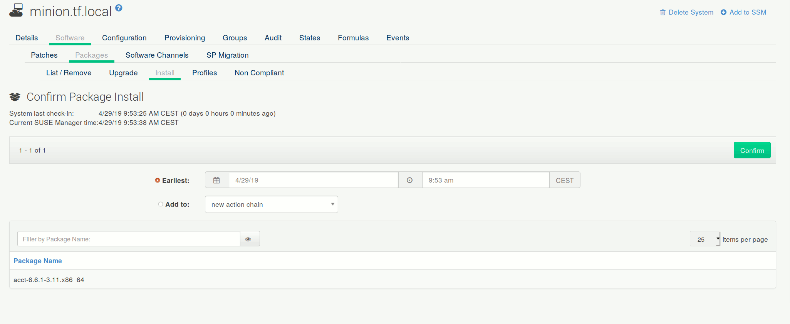

- Feature Name: new-package-predownloading
- Start Date: 29-03-2919
- RFC PR: https://github.com/uyuni-project/uyuni-rfc/pull/5

# Summary
Change the current package predownloading ("staging") feature for minions. Allow users to customize the start download time on a per-minion/per-group/per-Action basis.

# Motivation

Package pre-downloading is an essential feature to shorten the length of patch windows and is one of the features to enable bandwidth management for installations that might not have good connectivity between systems and Proxies, or Proxies and Server.

Currently package pre-downloading is a global setting - either all or none of the Actions get it. Moreover the time window is unique ([documentation reference](https://github.com/SUSE/doc-susemanager/blob/a5a5c8ec/modules/reference/pages/admin/organizations.adoc#organization-details--configuration)), and a restart of Tomcat and Taskomatic is required to change it.

This RFC is about adding explicit "download only" package installation/patch application Actions that can be scheduled as needed.

Motivation summary:
 - users might want to change the download schedule depending on physical locations, often represented by System Groups
   - this is particularly true in SUSE Manager for Retail use cases
 - users might need to change the download schedule depending on workload, available calendar time, other factors
 - we want users to be able to change the download schedule without restarting Tomcat and Taskomatic (currently the case as parameters are in `rhn.conf`)

# Detailed design

## User interface

### GUI

Whenever a package installation or patch application is scheduled, users will need a new checkbox to schedule a "download only" Action:

The checkbox will not appear for traditionally managed systems.

This will need changes in the following pages:

- Single systems:
  - patch application: https://server.tf.local/rhn/systems/details/ErrataList.do?sid=1000010000&
  - package installation: https://server.tf.local/rhn/systems/details/packages/InstallPackages.do?sid=1000010000&
  - package upgrade: https://server.tf.local/rhn/systems/details/packages/UpgradableList.do?sid=1000010000&

- SSM:
  - patch application: https://server.tf.local/rhn/systems/ssm/ListErrata.do
  - package installation: https://server.tf.local/rhn/ssm/PackageInstall.do
  - package upgrade: https://server.tf.local/rhn/ssm/PackageUpgrade.do

*Links above assume `server.tf.local` as the server location and `1000010000` as a minion ID.*

### API

The following calls will need a new optional `downloadOnly` boolean flag:
- `actionchain.addErrataUpdate`
- `actionchain.addPackageInstall`
- `actionchain.addPackageUpgrade`
- `actionchain.schedulePackageInstall`
- `actionchain.schedulePackageInstallByNevra`
- `system.schedulePackageInstall`
- `system.schedulePackageInstallByNevra`
- `system.scheduleApplyErrata`
- `systemgroup.scheduleApplyErrataToActive`

## Implementation
- new checkbox item will be added to current JSPs/React components
  - checkbox has to be shown only if applicable systems are all minions
- existing Java handling code will receive the new flag, pass it down to Salt calling code in order to apply
  - [pkgdownload.sls](https://github.com/uyuni-project/uyuni/blob/c8ffe6b9425392f5235864ad070646bb8ebc2ecb/susemanager-utils/susemanager-sls/salt/packages/pkgdownload.sls) instead of [pkginstall.sls](https://github.com/uyuni-project/uyuni/blob/c8ffe6b9425392f5235864ad070646bb8ebc2ecb/susemanager-utils/susemanager-sls/salt/packages/pkginstall.sls) if set
  - [patchdownload.sls](https://github.com/uyuni-project/uyuni/blob/c8ffe6b9425392f5235864ad070646bb8ebc2ecb/susemanager-utils/susemanager-sls/salt/packages/patchdownload.sls) instead of [patchinstall.sls](https://github.com/uyuni-project/uyuni/blob/c8ffe6b9425392f5235864ad070646bb8ebc2ecb/susemanager-utils/susemanager-sls/salt/packages/patchinstall.sls) if set
  - alternatively, those files might be unified and use `pkg.downloaded` instead of `pkg.installed` conditionally (resp. `pkg.patch_downloaded` instead of `pkg.patch_installed`)
- existing configuration options are to be deprecated (in SUSE Manager supported versions) or removed
  - existing code handling the configuration options can be removed from Uyuni

# Drawbacks
 - this is limited to Salt minions. Traditional clients retain their existing mechanism and are not affected
 - as the `pkg.downloaded` state [is not yet supported in Salt for Debian systems](https://docs.saltstack.com/en/2018.3/ref/states/all/salt.states.pkg.html#salt.states.pkg.downloaded), this remains an exclusive for `yum` and `zypper` (this RFC does not change this aspect)
 - current users of the existing feature will have to adapt their workflows

# Alternatives
- add UI pages and API calls to define "download time windows". Allow users to Actions to "download time windows" at scheduling time
  - pro: with the UI, users do not have to go through the package/patch selection twice
  - con: more difficult to implement
- also keep the old mechanism in place
  - pro: users can either use the old and the new mechanism
  - con: more maintenance work

# Unresolved questions
- is such a workflow acceptable for users?
