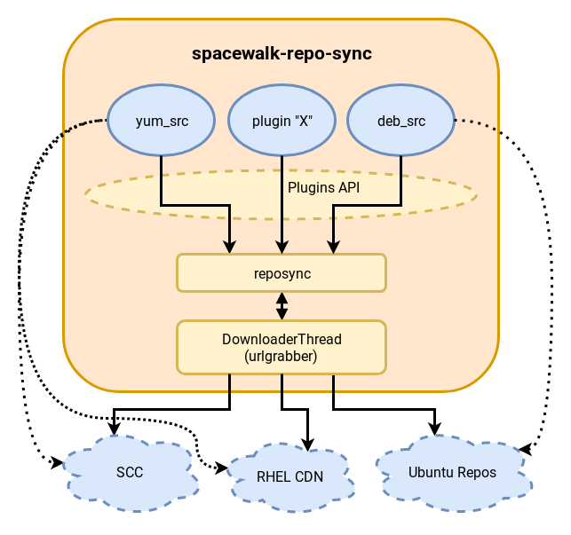

- Feature Name: Use DNF for managing the RPM content
- Start Date: 04-04-2019
- RFC PR: https://github.com/uyuni-project/uyuni-rfc/pull/4

# Summary
[summary]: #summary

Uyuni contains components that support importing external repositories;
collecting and retrieving information on packages, products, modules, and other content;
and hosting repositories to be consumed by Spacewalk clients. For RPM repositories,
it currently uses Zypper and libsolv (and previously used YUM), per
[a previously implemented RFC](https://github.com/uyuni-project/uyuni-rfc/blob/master/accepted/00047-yum-replacement.md).

However, this makes it difficult to run Uyuni on Red Hat Enterprise Linux and CentOS servers
without replacing base packages (violating subscription support terms in the RHEL case),
and makes it even more challenging to properly support newer extensions to RPM repositories,
such as RH/Fedora modules introduced in Fedora 30 and RHEL 8.

This RFC proposes to redo the ["YUM replacement" RFC](https://github.com/uyuni-project/uyuni-rfc/blob/master/accepted/00047-yum-replacement.md)
to add another implementation using DNF instead of Zypper.

# Motivation
[motivation]: #motivation

The work done to switch to Zypper broke the ability for the Uyuni server to run properly
on CentOS/RHEL servers because Zypper is unavailable.

Previously, Uyuni used YUM (through the `yum` Python library module) for these pieces,
which is available on CentOS/RHEL 7. However, in order to move to Python 3, Uyuni cannot
use `yum` anymore.

For expediency for the downstream SUSE Manager product delivery schedule, Uyuni is using
Zypper for now. However, the intent for Uyuni is to be an open upstream project that
supports more host environments than SUSE Manager does.

Moreover, neither YUM nor Zypper have any reasonable awareness of how to properly
handle [RH/Fedora modules](https://docs.pagure.org/modularity/). It's currently
only implemented in DNF. Using DNF opens the door to developing features specific
to handling modules in the future.

As of today, DNF is available across RHEL/CentOS 7 and newer, Fedora, and
(open)SUSE Linux 15.0 and newer (though PackageHub for SLE 15). Starting with
openSUSE Leap 15.1, DNF supports RH/Fedora modules. So migrating to DNF will
restore the capability to run Uyuni on CentOS and Fedora servers, while
preserving the ability to run on openSUSE and SUSE Linux Enterprise 15.

# Detailed design
[design]: #detailed-design

The below design information is derived from detailed design information from the "YUM replacement" RFC:

### The `spacewalk-repo-sync` architecture

### The purpose of a "ContentSource" plugin:

Since there are multiple types of content sources (i.a. repositories types),
`spacewalk-repo-sync` delegates the handling of each type to plugins. These "ContentSource" plugins must:

- Get repository information and metadata from a repository (ContentSource).
- Provide a list of packages, products and errata coming from that ContentSource. (ContentPackage)
- Provide contact & download parameters to the Downloader Thread for downloading the packages.
- Resolve package dependencies. Since `spacewalk-repo-sync` allows filtering (include/exclude) packages when syncing, package dependencies need to be calculated when running on this mode.

With this information collected by the plugin, the `DownloaderThread` from `reposync`
is able to perform the actual download of the necessary package files when `spacewalk-repo-sync` is called.

Currently, `spacewalk-repo-sync` comes with the following plugins:
- `yum_src`: RPM based repositories
- `deb_src`: DEB based repositories
- `uln_src`: Oracle ULN repositories (a wrapper of `yum_src` with custom authentication)

### The "ContentSource" plugin API

Mandatory methods:
- `get_md_checksum_type`: Return the checksum_type of primary.xml
- `get_products`: Return products metadata if any
- `get_susedata`: Return suse metadata if any
- `get_updates`: Return "updateinfo" / "patches" info
- `get_groups`: Return repo groups if any
- `get_file`:
- `get_modules`: Return module metadata if any
- `raw_list_packages`: Return the raw list of packages available after filtering.
- `list_packages`: Return a list of `ContentPackage` rhn class for the available packages after filtering.
- `clear_cache`: Clear cache files
- `set_download_parameters`: Prepare the downloader params dictionary

Yum specific methods we also need to cover:
- `repomd_up_to_date`: Check if repomd.xml checksum is up-to-date.
- `get_metadata_paths`: Simply load primary and updateinfo path from repomd.

#### The "ContentPackage" class
A "ContentSource" plugin needs to provide a list of "ContentPackage" objects to the reposync. This RHN class represents the package like by:

- NEVRA
- unique ID
- checksum
- checksum type

### Adding a "DNF" plugin like the custom "Zypper" + "libsolv" plugin.

The idea here would be the following:

- The repository metadata downloading is delegated to DNF (which uses [librepo](http://rpm-software-management.github.io/librepo/) for the actual fetching)
- The downloaded XML metadata can be manually read (packages, updates, products, etc).
- Authentication with ULN repositories can be done by porting the YUM plugin to DNF
- Legacy metadata not normally handled by DNF could be fetched by [librepo](http://rpm-software-management.github.io/librepo/) or urlgrabber through a plugin module like the ULN one

The usage of this plugin will be gated by a conditional in the `spacewalk-backend`
package spec file to use Zypper on SUSE Linux Enterprise to ensure that the
SUSE Manager downstream product continues to use Zypper.

#### How to calculate the dependencies?
To access this information, we would use [the DNF API](https://dnf.readthedocs.io/en/latest/api.html) (OBS packages at [openSUSE:Factory](https://build.opensuse.org/package/show/openSUSE:Factory/dnf) - [openSUSE:Backports:SLE-15-SP1](https://build.opensuse.org/package/show/openSUSE:Backports:SLE-15-SP1/dnf)).

#### Requirements for this approach:
- We would need to use `python3-dnf` library ([OBS link](https://build.opensuse.org/package/show/openSUSE:Backports:SLE-15-SP1/dnf)) to do this.
- For fetching metadata not referenced by `repomd.xml`, we could use the `python3-librepo` library ([OBS link](https://build.opensuse.org/package/show/openSUSE:Backports:SLE-15-SP1/librepo)).
  + Alternatively, the `python3-urlgrabber` library ([OBS link](https://build.opensuse.org/package/show/openSUSE:Factory/python-urlgrabber)) could be used.

#### DNF Python code examples
- Some DNF use cases from Python: https://dnf.readthedocs.io/en/latest/use_cases.html
- Working with DNF: http://abregman.com/2016/11/29/python-working-with-rpms/
- DNF `reposync` subcommand code: https://github.com/rpm-software-management/dnf-plugins-core/blob/master/plugins/reposync.py
  + This implementation will download all metadata referenced by `repomd.xml`, even stuff not currently handled by DNF itself.
- Example of resolving dependencies in a repo with DNF: https://pagure.io/releng/blob/master/f/scripts/spam-o-matic
- Some Python examples with librepo: https://github.com/rpm-software-management/librepo/tree/master/examples/python

# Drawbacks
[drawbacks]: #drawbacks

The main drawback of this would be imposing the DNF stack as a dependency for the server.

As it currently stands, this is not much of a drawback, as we are currently going to keep using
the Zypper plugin for the SUSE Manager product and with SUSE Linux Enterprise for Uyuni.

In the future, if we elect to standardize around the DNF plugin for SUSE Manager as well,
the drawback is more important. It is slightly an issue in SUSE Linux Enterprise, as it's
maintained in PackageHub. For the downstream SUSE Manager product, it is likely that the
DNF stack packages would need to be imported to be maintained exclusively for being used
with SUSE Manager.

However, this is unlikely to be much of a maintenance burden as the community packaging
is actively maintained and well-structured. The packager (who is also the author of this RFC)
is responsive to Uyuni/SUSE Manager needs and the upstream DNF developers are interested
and responsive to community consumers' needs.

# Alternatives
[alternatives]: #alternatives

## Revert back to using YUM

One alternative to resolve this issue is to roll back to using YUM. However, this is a bad idea.
YUM is dead, and DNF is the maintained successor. YUM does not support Python 3, and there is an
immediate goal to be able to run Uyuni on a system lacking Python 2.

And even with reverting back to YUM, Uyuni would not be able to properly support RH/Fedora modules.
Even Spacewalk (which has not yet migrated to DNF) is not able to deal with modules properly as
they are offered in Red Hat Enterprise Linux 8.

Moreover, [YUM has been retired in Fedora 31](https://fedoraproject.org/wiki/Changes/Retire_YUM_3)
and "YUM" in Red Hat Enterprise Linux 8 is just a CLI shim to DNF, and only the DNF Python interface
and libraries are available. Thus, reverting to the "YUM" version would not work.

## Package and port Zypper to other distributions for Uyuni

Another alternative is to package Zypper for distributions that lack it. But this is not appropriate
for CentOS/RHEL as doing so requires replacing and upgrading packages in the distribution base to
build it. Notably, the `libsolv` package is too old in CentOS/RHEL, and even if it was not, it is
not configured in a manner that is usable for the Zypper stack to build on top of it.

For people who wish to use Uyuni on Red Hat Enterprise Linux, a requirement to replace base packages
is unacceptable, since it would break the terms of supportability per the Red Hat Enterprise Linux
subscription. There is also the potential consequence of breaking other parts of the system by using
a different configuration in libsolv than what Red Hat ships.

Finally, Zypper does not implement support for handling RH/Fedora modules, so it will be very hard
to properly support handling RH/Fedora modules without using DNF anyway (most of the sorting, filtering,
and solution management logic for modules is implemented in DNF itself right now). This becomes a
major issue with Red Hat Enterprise Linux 8 as managing it does not work in large part due to this.

# Unresolved questions
[unresolved]: #unresolved-questions

- Would we need to extend the librepo API to pull legacy repodata information?
  + If we need to pull stuff not referenced in `repomd.xml`, we probably need to add it to librepo unless we want to just call urlgrabber to fetch it manually...
