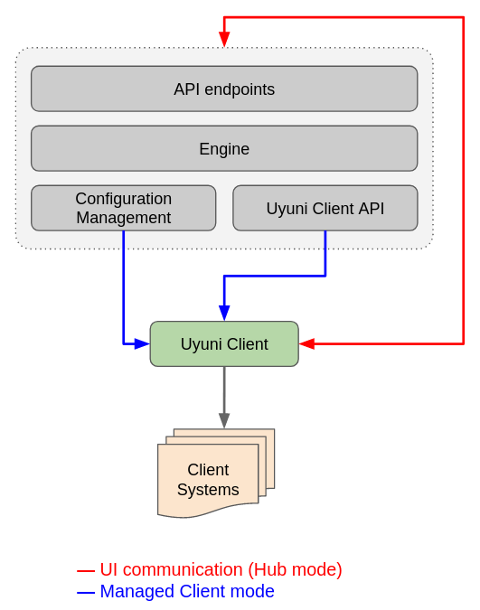

- Feature Name: hub_service
- Start Date: 2019-11-7
- RFC PR:

# Summary
[summary]: #summary

This RFC describes alternative architecture for Hub in order to foresee more features that currently purposedly omitted and tradeoffs that will affect performance and scalability.

See the [Hub general RFC](00060-hub-general.md) for an introduction to the Hub project.

# Terminology

- **Uyuni Client**. This is an Uyuni Server (Uyuni Manager or Proxy), connected to Hub and is managed by it.
- **Client System**. This is a managed system in the Data Center. That is, any machine, managed by a specific *Uyuni Client*.
- **CM Master**. This is a Configuration management master component, which issuing specific commands to the *CM Clients*.
- **CM Client**. This is a Configuration management client component, which receives commands from the *CM Master*.
- **Hub**. This is a reference to an available online service, which itself may be constructed of a set of various software components, including load balancers, configuration management software etc.

# Motivation
[motivation]: #motivation

_"One does not simply puts an Uyuni Server into a container"_

In the current state, the design of the Hub is limited to only one instance of it without scalability and HA in mind for itself. It is also presented in a layout as a "Server of Servers", withouth any HA, scalability and containerisation in mind. Additionally, it is hardware-eager and brings completely unnecessary functionality.

From the requirements:

  * Performance: support high number of clients and Servers
    * maximum expected number of clients: about 100k
    * maximum expected number of Servers: 9k
    * typical numbers:
      * 3 to 20 Servers with a few thousand clients each ("large data center scenario")
      * a few thousand Servers with 10-20 clients each ("large retailer scenario")
  * Compatibility: all OSs currently supported by Uyuni (may not be all supported in first version)
  * Maintainability: any new component should be designed in a modern way, with containerization/scalability/HA in mind
  * Performance: Server functionality can stripped down in order to achieve smaller hardware footprint

## Addressed Design Trade-offs
[trade-offs]: #trade-offs

This RFC is addressing the following trade-offs, introduced by the currently accepted design, without changing [the main requirements](https://github.com/uyuni-project/uyuni-rfc/blob/master/accepted/00060-hub-general.md):

1. **Hub outage**
   There is no HA in mind and there is no fall-backs other than only directly logging in into an existing Uyuni servers. While no explicit requirements of HA, it doesn't mean no HA might be needed. How the current design solves this problem on the time when it come?

2. **Manager of Managers**
   Current design introduces still a full-blown "Uyuni Server for Uyuni Servers". But mostly all functionality will be unused or might introduce additional problems. The Uyuni Server itself requires its own maintenance, needs "beefy" enough hardware, complex setup etc. In case of HA, which implies at least "more than one" instance, it will turn into "Manager**s** of Managers".

3. **Unused Functionality**
   Current Hub is a "Server of Servers", or a simply put, another Uyuni Server instance, managing the same identical Uyuni Clients (see the terminology above). That also means that **each** Uyuni Client internally also has that Hub functionality, except it is unused.

4. **Testing Approach**
   Since there will be no two separate repositories like one for Uyuni Server with Hub and Uyuni Server without it but just the same repository, then naturally this would require an additional testing for "Hub mode". In that case test suite would be exponentially more complicated.

5. **Heavyweight and Stateful**
   Due to a lot of functionality and integration with another systems, the Uyuni Server "as is" requires enough RAM, CPU power and disk IO. Uyuni Server is also stateful, which naturally impacts scalability.

6. [Feature Creep](https://en.wikipedia.org/wiki/Feature_creep)
   Systems management as _orchestrated machines_ with specific running applications in the Data Center is a clear use case where Uyuni Server shines. But managing the Uyuni Server internal components by itself, performing vital tasks, like e.g. upgrading database schema etc is way beyond out of the scope admin's job. Channels, errata, package management, autoinstallation, virtual host managers, images build, patches, audit etc — all that is not needed and might be actually **dangerous features**. Ideally, Hub user should be able to only see the reports which Uyuni Clients are outdated, updated, failed to be updated and still will be. Any _manual work_ or _custom work_ to update thousands of Uyuni Clients themselves should be a solely job of the Hub on its own.

# Use Case Dependency

This RFC proposes architecture design is not dependend on any specific use case that would affect infrastructure layout. If there should be a use case of running one central console to keep overview of all registered _Uyuni Clients_ (e.g. Proxies) for Retail or there should be a Data Center where _Uyuni Clients_ are multiplied just for handling more _Client Systems_, [the main requirements](https://github.com/uyuni-project/uyuni-rfc/blob/master/accepted/00060-hub-general.md) should be met in any case.

# Detailed Architecture Design
[design]: #detailed-design

## Definition

In a nutshell, Hub in principle can be thought as a multicast state-less service providing own APIs, is running one or many lightweight servers behind the load balancer, and its job is to accept a given task and perform it on a chosen set of managed Uyuni Servers through integrated underlying transport components (Salt in this case).

## Overview

As shown on _Figure 1_, each Uyuni Client which can be either a proxy or Uyuni Server managing a set of Client Systems, is connected the Hub and is managed by it through the Configuration Management System, using API:

_Figure 1_

Similar to the relations between _Uyuni Client_ and _Client System_ where Uyuni Client is running a _CM Master_ in order to manage each registered _Client System_ with the _CM Client_, also each _Uyuni Client_ is running _CM Client_ locally for itself and therefore is managed by a _CM Master_, which is a part of Hub service.

## Hub Internals

As from the definition in this RFC, Hub is an online service that may consist of several components.

Currently accepted design is basing Hub on top of just plain Uyuni Server. In a nutshell, it just yet another dedicated Uyuni Server, used solely against a set of Uyuni Servers.

This RFC, however, is proposing to implement Hub as a standalone containerised stateless microservice, providing APIs to interact with the underlying Configuration Management system and bulk-control Uyuni Server APIs through the single endpoint. As seen from the _Figure 2_, it will leverage _any_ existing Uyuni Client UI capabilities  which will provide UI for the command and reporting console. Simply put, any Uyuni Client in the current infrastructure can be turned into a Hub UI application.

### UI

User Interface for Hub is provided from any Uyuni Client, as per _Figure 2_ (red line). Any Uyuni Server in the Hub-aware infrastructure should be able to communicate with the Hub over its API endpoints. The UI should be a single-page app, appearing as yet another section in the Uyuni Server, once user is logged in into it with Hub role permissions. This single-page app should utilise Hub microservice APIs to get the data about connected Uyuni Clients, their status, reports, logs etc as well as run specific tasks on them.

API endpoints are providing standard, fixed general APIs to interface with the microservice for:

- Getting/sending data from the Uyuni Clients
- Send specific tasks to the Uyuni Clients, which the Engine will do it via Uyuni Client API or Configuration Management.

In non-Hub mode, Uyuni Client behaving just like any other Uyuni Client (blue lines). That implies that since any Uyuni Client is aware of the Hub, it can also provide an independent UI for it. The UI can also allow only one session per a time (i.e. logoff other sessions forcibly, once admin logged in more than once from different machines).

_Figure 2_

Rationale: Containerised lightweight multiply-able service, which is reusing already existing Uyuni Servers infrastructure in order to achieve high availability.

Key points:

- Stateless lightweight microservice should be able to respawn without losing data
- Microservice should be able to be instantiated multiple times to ensure high availability
- Utilising existing Uyuni Clients software components, reuse power of already running Uyuni Clients
- Providing its own API endpoint, allow integration with the software components instead of building the functionality on top of only specific one

## Handling Outages

Any system that operates on a large amount of machines should consider how to provide high availability at some point. In case of basing Hub on top of existing Uyuni Server, any high availability would imply _at least_ two instances of full-blown Uyuni Server, at least two extra virtual machines on those etc, which draws obvious consequences of the price supporting and maintaining such setup.

A microservice, on the other hand, can have unlimited amount of instances running anywhere (docker container or VM, or even as-is on the localhost with the Uyuni Server etc) and its cost of maintenance is low to none, as it is simply a part of Uyuni Server. In fact, **any** Uyuni Client from the Hub can as well run Hub microservice directly alongside of it, having it connected to the rest of the Uyuni Clients. That is, if Hub is operating over 1K Uyuni Clients, then it is also multiplied 1K times, thus providing high availability. In this case every Uyuni Client can also run Hub service at the same time.

As seen on the Figure 3, this approach while not changing the main requirements, yet **completely eliminates the overhead** of necessity having "special" Uyuni Master Server, yet provides high availability:

_Figure 3_

Rationale: Reduce costs of maintenance and single point of failure.

Key points:
- No special Uyuni Server as "master server"
- High Availability in mind
- Containerised stateless service

## Feature Creep and Dead Code

Currently accepted approach "Uyuni Server as Hub" brings enormous load of feature creep effect, while in practical sense they little to none even needed to exist. Examples are: errata, patches, channels, products, images, scheduler, audit... All that makes perfect sense to manage machines in the Data Center, but the Uyuni Server _itself_. Instead, Uyuni Server should be automatically updated during the maintenance updates and these updates should be maximum only visible as report in a Hub UI, such as "Server A, C and D are updated, Server B failed to update (see the logs remotely), Server E is offline and the rest are updating (spinners)".

Dead Code (or unused features) are naturally occur since each Uyuni Server, connected to the Uyuni Master Server (as Hub, per accepted design) are technically also Uyuni Master Servers under the hood, except they are running into a different mode. So while they do have the possibility to be a Master Servers, such feature is simply not used by design, which renders such design quite inefficient.

The microservice approach elimitates all that problem by proxy-passing any Uyuni Client through it to a set of other Uyuni Clients, allowing all functionality at any Uyuni Client to be fully utilised when it is needed.

Rationale: use Uyuni Server full features all the time

Key points:
- No special "Hub mode" only on one of the Uyuni Servers
- No "turned off" features on the rest of the Uyuni Servers
- Full usage

## Testing

This RFC is addressing another overlooked issue when using Uyuni Server as a Hub instance: testing approach. Since there won't two separate codebases in a sense of "Uyuni Server as Hub" and traditional "Uyuni Server", but "Uyuni Server that has Hub mode". In this case integration testing will be exponentially much bigger than it currently is.

### Problem

The problem arises when one Uyuni Server should run in a Hub mode and at least one more Uyuni Servers should run as client. Such tests will unlikely might scale well, especially per a PR. This will likely lead to the overhead in the test suite.

### Solution

Microservice approach as per current RFC, however, would allow to have separate test suites running API tests in parallel to other test suites. That alone would dramatically simplify testing per PR and keep it in the separete repository. The integration tests in current testing suite of the Uyuni Server could only extend it by the UI verification tests, because the very Uyuni Server is a client to itself anyway, so it is sufficient to apply all the Hub functionality on itself.

## Content Lifecycle Management (CLM)

Any Uyuni Client should do the CLM, then export it to the form, where it should be imported elsewhere on another Uyuni Client system. The flow should be as follows:

1. User should be able to create Content Lifecycle Project as usual on any Uyuni Client
2. After adding sources to the project and stages, Project is serialised into importable form and is stored on all Uyuni Client nodes in the internal cache as "CLM Drafts". This way CLM Project should be generally available on all Uyuni Clients (see Handling CLM Outages).

### Handling CLM Outages

> **NOTE:** This is only for the demonstration of the benefits of the proposed architecture in this RFC and may be added on demand at any time.

Currently accepted architecture will not be able to continue content management if Hub node (i.e. Uyuni Server) is no longer available and/or its data is corrupted due to whatever reasons. In other words, all the projects will be just lost.

However, proposed architecture could allow so-called Draft Mode, where saved Project is transparently exported into a serialised importable form and is stored through the Hub on **all Uyuni Clients** as Draft Project, replicated in its internal cache e.g. `/var/spacewalk/clm/...`. Simply put, if any of the Uyuni Clients, which was used for the CLM project turns out to broken for whatever reasons, the project can be simply resumed on any other instance.

To retrieve specific (or all) Content Lifecycle Projects any Hub users should be able through the Hub interface in the same Uyuni Client with the similar steps:

1. Login to any of the Uyuni Client with the Hub role credentials
2. From the Hub UI select CLM draft project and activate it
3. Once finished, deploy it on the set of Uyuni Clients where it should belong to

## Ultimate Hub Layout

The Ultimate Hub deployment would be physically having... none! In principle, current RFC allows to detach from traditional and very limited "master of masters" approach, thinking from the grid perspective instead. Proposed architecture ultimately allows that _each Uyuni Client_ could also run on their each localhost a Hub microservice instance, and so then all these microservices could be also connected through a scalable high availability bus, as on _Figure 4_:

_Figure 4_

# Conclusion

> This proposed architecture is not seeing Hub as a server, but as a service.

Hub is a service, not one or few servers. In that sense Hub feels like a logical operator distributed engine, rather then a single command issuer with a single point of failure and other traditional issues.

This architecture turns each Uyuni Client into a part of Hub, adding it as a node into a general distributed grid. This will allow Hub as a service to be responsive, scalable and highly available, as long as bi-directional HTTPS communication is allowed.

# Alternatives

The alternative to this RFC is the current accepted design.

# Unresolved questions
[unresolved]: #unresolved-questions

All questions has been resolved.