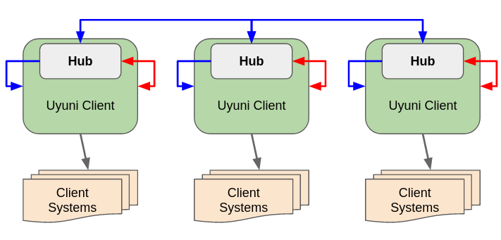

- Feature Name: hub_service
- Start Date: 2019-11-7
- RFC PR:

# Summary
[summary]: #summary

This RFC describes **alternative architecture overview** for Hub in order to foresee more features that currently purposedly omitted and tradeoffs that will affect performance and scalability. This overview is not covering technical details.

See the [Hub general RFC](00060-hub-general.md) for an introduction to the Hub project and the requirements.

# Terminology

- **Uyuni Hub Client**. This is a standalone typical Uyuni Server (Uyuni Manager or Proxy) setup with registered Client Systems machines as usual. This Uyuni Server is connected to the Hub and is managed and queried by it.
- **Client System**. This is a managed system in the Data Center. That is, any machine, managed by a specific *Uyuni Hub Client*.
- **CM Master**. This is a Configuration management master component, which issuing specific commands to the *CM Clients*.
- **CM Client**. This is a Configuration management client component, which receives commands from the *CM Master*.
- **Hub**. This is a reference to an available complete online service, which itself may be constructed of a set of various software components, including load balancers, bus, configuration management software etc.

# Motivation
[motivation]: #motivation

_"One does not simply puts an Uyuni Server into a container"_

The following points was a motivation to bring an alternative architecture:
- Design the Hub service that is not limited to only one instance of it and is not in an old fashion layout as a "Server of Servers"
- Foresee solutions for high availability, scalability and containerisation in a future
- Avoid hardware-eager solution, proposing instead only functionality that is necessary for the Hub
- Design a system that would be able to exceed given numbers in the requirements below

From the requirements:

  * Performance: support high number of clients and Servers
    * maximum expected number of clients (managed systems): about 100k
    * maximum expected number of (Uyuni) Servers: 9k
    * typical numbers:
      * 3 to 20 Servers with a few thousand clients each ("large data center scenario")
      * a few thousand Servers with 10-20 clients each ("large retailer scenario")
  * Compatibility: all OSs currently supported by Uyuni (may not be all supported in first version)
  * Maintainability: any new component should be designed in a modern way, with containerization/scalability/HA in mind
  * Performance: Server functionality can stripped down in order to achieve smaller hardware footprint

## Addressed Current Design Trade-offs
[trade-offs]: #trade-offs

Without changing [the main requirements](https://github.com/uyuni-project/uyuni-rfc/blob/master/accepted/00060-hub-general.md), this RFC is addressing the major trade-offs, introduced by the [currently staged design](https://github.com/uyuni-project/uyuni-rfc/blob/master/accepted/00062-hub-xmlrpc-api.md):

1. **Hub outage**
   Problem: If Hub would consists only of one node and its outage happens, there is no fall-backs other than only directly logging in into an existing Uyuni Hub Clients (Uyuni Servers). The goal is to solve this by high availability at design phase.
   - What would HA look like?
   - What costs will be required to implement it?

2. **Managers of Managers**
   Problem: Introduction of a full-blown "Uyuni Server for Uyuni Servers". Mostly all of the functionality will be unused or might introduce additional problems by allowing "too much". The Uyuni Server as a base for Hub would require its own extra maintenance and would need "beefy" enough hardware, its usual complex setup etc. In case of high availability, which implies at least "more than one" instance of it, a chain of Uyuni Servers will turn into a "Manager**S** of Managers" chain.
   - Would it need to have "Hub of Hubs" in that case?

3. **Unused Functionality**
   Problem: If a Hub is meant to be a "Server of Servers", or a simply put, another Uyuni Server instance in front of the same identical Uyuni Hub Clients (see the terminology above) as managed systems, then it also would mean that **each** Uyuni Hub Client internally also is a Hub by a nature, because the same code is anyway deployed everywhere in the cluster. Except it is totally unused, dead code. This renders such design as quite inefficient.
   - What kind of existing features in Uyuni Server are actually needed for the Hub?
   - What users should expect from the Hub functionality?
   - What users should not expect from the Hub functionality?

4. **Testing Approach**
   Problem: Since there will be no two separate repositories like one for Uyuni Server with Hub and Uyuni Server without it but just the same repository, then naturally this would require an additional testing for "Hub mode". In that case test suite would be exponentially more complicated, requiring minimum two Uyuni Servers or even more.
   - How many Uyuni Server instances is needed for successfull integration testing?
   - How test suite will handle that exponential growth?
   - What kind of alternative approaches to the testing we can look for?

5. **Heavyweight and Stateful**
   Problem: Due to a lot of functionality and integration with another systems, the Uyuni Server "as is" requires enough of RAM, CPU power and disk IO. Uyuni Server is also stateful, which naturally impacts scalability and high availability mechanisms.
   - Is there any alternative ways to avoid this?

6. [**Feature Creep**](https://en.wikipedia.org/wiki/Feature_creep)
   Problem: Systems management as operations against _orchestrated machines_ with specific running applications in the Data Center is a clear use case where Uyuni Server shines. But managing the Uyuni Server's internal components, performing vital tasks, like e.g. upgrading database schema etc is way beyond out of the scope admin's job.
   - Stripping features vs adding features
   - What is needed and what is not?

7. **API Forest Over Multiple Protocols**
   Problem: Proxy-passing API to provide end-points might be a cheapest way of achieving early results, but not nesessary is a right solution in a long run, and not nesessary is what end user (a Data Center administrator) would actually need.
   - What purpose of Hub APIs, so what do they serve for?
   - What a typical Data Center admin can make use of them in a daily routine, focusing on job to maintain his machines, instead of maintaining Uyuni Cluster itself?
   - What kind of load and data processing Hub API is expecting?

   <!-- Channels, errata, package management, autoinstallation, virtual host managers, images build, patches, audit etc — all that is questionable if needed, and yet might be actually **dangerous features**. Ideally, Hub user should be able to only see the reports which Uyuni Hub Clients are outdated, updated, failed to be updated and still will be. Any _manual work_ or _custom work_ to update thousands of Uyuni Hub Clients themselves should be a solely job of the Hub on its own. -->
# DISCLAIMERS
[disclaimers]: #disclaimers

## Use Case Dependencies
[use-case-deps]: #use-case-dependencies
This architecture design, proposed in this very RFC **is not dependent** upon any specific use cases that would affect infrastructure layout.

## Main Requirements Changes
[main-req-changes]: #requirements-changes

Any currently known use cases, such as running one central console to keep overview of all registered _Uyuni Hub Clients_ (e.g. Proxies for Retail), or running a general enterprise in a Data Center where _Uyuni Hub Clients_ are multiplied just for handling more _Client Systems_ — **none of [the main requirements](https://github.com/uyuni-project/uyuni-rfc/blob/master/accepted/00060-hub-general.md) should be changed or in any way affected**.

# Detailed Architecture Design
[design]: #detailed-design

## What is Hub?
[what-is-hub]: #what-is-hub

In a nutshell, Hub in principle can be thought as a **multicast state-less service** providing own APIs, is running one or many its instances behind the load balancer, and its mere job is to accept a given task and perform it on a chosen set of managed Uyuni Servers through the integrated underlying transport for the configuration management (Salt in this case).

## Overview
[overview]: #overview

Conceptually, Hub is a layer "on top of" at least one Uyuni Hub Client (which is an Uyuni Server, essentially). As shown on _Figure 1_, each Uyuni Hub Client (those can be either a Uyuni Proxy or Uyuni Server managing a set of Client Systems) is connected to the Hub and is managed by it through the Configuration Management System.

> **IMPORTANT:** Diagram on the _Figure 1_ does not shows "one physical Hub server to many physical Uyuni servers" layout, but only shows conceptual relationship between the software component objects within the Hub-aware cluster. See below about possible network layout of the Hub service.

_Figure 1_

Hub service essentially runs the _CM Master_ in order to manage registered systems (Uyuni Hub Clients), which are locally running _CM Clients_ each. Then each Uyuni Hub Client itself is running its own _CM Master_ so each registered _Client System_ is running its own _CM Client_ in order to be managed.

## Hub Internals

As from the definition in this RFC, Hub is **an online service** which may consist of several integrated software components, providing one single instance of the Hub node.

Currently accepted design is basing Hub on top of just plain Uyuni Server, which is an opposite way to the current RFC idea. In a nutshell, it just yet another dedicated Uyuni Server, used solely against a set of Uyuni Servers. While it does provide some sort of scalability feeling across the child-registered Uyuni Hub Clients, yet it provides a bottleneck on its own, by inheriting all the qualities from the Uyuni Server, qualities that Hub is trying to solve. Consequently, performing many large-scale use cases would be very difficult or even impossible (e.g. querying all managed systems, handling the massive result output), as the Hub is still inheritently suffering the same issues as it's connected Uyuni Servers at first place!

This RFC, however, is proposing to implement Hub as a **standalone containerised stateless microservice**, providing APIs to interact with the underlying Configuration Management systems and bulk-control Uyuni Server APIs through the single endpoint.

### UI

As seen from the _Figure 2_, Hub will leverage from _any_ existing Uyuni Hub Client UI capabilities  which will provide UI for the command and reporting console of the Hub. Simply put, any Uyuni Hub Client in the current infrastructure can be turned into a Hub UI application instantly.

User Interface for Hub is provided from any Uyuni Hub Client, as per _Figure 2_ (red line). Any Uyuni Server in the Hub-aware infrastructure should be able to communicate with the Hub over its API endpoints. The UI should be a single-page app, appearing as yet another section in the Uyuni Server, once user is logged in into it with Hub role permissions. This single-page app should utilise Hub microservice APIs to get the data about connected Uyuni Hub Clients, their status, reports, logs etc as well as run specific tasks on them.

API endpoints should be considered standard, fixed general APIs to interface with the microservice for:

- Getting/sending data from the Uyuni Hub Clients
- Send specific tasks to the Uyuni Hub Clients, which the Engine will do it via Uyuni Hub Client API (XML-RPC) or Configuration Management (REST).

In non-Hub mode, Uyuni Hub Client behaving just like any other Uyuni Hub Client (blue lines). That implies that since any Uyuni Hub Client is aware of the Hub, it can also provide an independent UI for it. The UI can also allow only one session per a time (i.e. logoff other sessions forcibly, once admin logged in more than once from different machines, similar to WhatsApp Web).

_Figure 2_

Rationale: Containerised lightweight multiply-able service, which is reusing already existing Uyuni Servers infrastructure in order to achieve high availability.

Key points:

- Stateless lightweight microservice should be able to respawn without losing data
- Microservice should be able to be instantiated multiple times to ensure high availability
- Utilising existing Uyuni Hub Clients software components, reuse power of already running Uyuni Hub Clients
- Providing its own API endpoint, allow integration with the software components instead of building the functionality on top of only specific one

### Common API

Since each Uyuni Server internally runs a configuration management master component (Salt Master in this case), then in case of Hub-aware setup, they need to be seamlessly integrated with one interface.

From the requirements:

- Hub implements centralized content management of (in order of importance)
  - Configuration Management data (states, pillars...)

- Hub implements API endpoints to act on Servers
  - Configuration management

Primary admin's example daily tasks would be:

- Query all managed systems in the Data Center behind each Uyuni Hub Client and aggregate the result
- Run specific task on a subset across all managed systems in the Data Center, regardless behind which Uyuni Hub Client they are registered
- Get _all managed system_, which CVE number is applicable and patch them (regardless behind what current Uyuni Server they are located)

Hub would help to write a simple consumer client scripts the following ways:

- Reconcile different backend versions, e.g. different Salt APIs, Uyuni Server XML-RPCs etc
- Handle logins to the different realms and manage sessions across the cluster
- Provide unique API endpoints that would work on multi-node Uyuni Servers paradigm
- Take care of throttling, rate limiting, back-pressure etc

Simply put, Hub would be acting as an API Gateway (regardless of the implementation).

_Figure 3_ shows a typical scenario of the consumer. Consumer would use just a common Hub API (1). Since Each Uyuni Hub Client is running a configuration management master unit (Salt Master in this case), Hub should be able to query these (2) in case admin would like to know an overview of the cluster itself. However, since admin's main concern are end systems that are managed behind each Uyuni Hub Client (Uyuni Server), in this case Hub should be also able to query _all managed systems behind all Uyuni Hub Clients_ (or a subset of those) as well as handle the return load (3), (4). At the end of the cycle, Hub should be able to handle return from either layer (cluster configuration management or the whole subset of the managed systems).

_Figure 3_

## Handling Outages

Any system that operates on a large amount of machines should consider how to provide high availability at some point. In case of basing Hub on top of existing Uyuni Server, any high availability would imply _at least_ two instances of full-blown Uyuni Server, at least two extra virtual machines on those etc, which draws obvious consequences of the price supporting and maintaining such setup.

A microservice, on the other hand, can have unlimited amount of instances running anywhere (docker container or VM, or even as-is on the localhost with the Uyuni Server etc) and its cost of maintenance is low to none, as it is simply a part of Uyuni Server. In fact, **any** Uyuni Hub Client from the Hub can as well run Hub microservice directly alongside of it, having it connected to the rest of the Uyuni Hub Clients. That is, if Hub is operating over 1K Uyuni Hub Clients, then it is also multiplied 1K times, thus providing high availability. In this case every Uyuni Hub Client can also run Hub service at the same time.

As seen on the Figure 3, this approach while not changing the main requirements, yet **completely eliminates the overhead** of necessity having "special" Uyuni Master Server, yet provides high availability:

_Figure 4_

Rationale: Reduce costs of maintenance and single point of failure.

Key points:
- No special Uyuni Server as "master server"
- High Availability in mind
- Containerised stateless service

## Feature Creep and Dead Code

Currently accepted approach "Uyuni Server as Hub" brings enormous load of feature creep effect, while in practical sense they little to none even needed to exist. Examples are: errata, patches, channels, products, images, scheduler, audit... All that makes perfect sense to manage machines in the Data Center, but the Uyuni Server _itself_. Instead, Uyuni Server should be automatically updated during the maintenance updates and these updates should be maximum only visible as report in a Hub UI, such as "Server A, C and D are updated, Server B failed to update (see the logs remotely), Server E is offline and the rest are updating (spinners)".

Dead Code (or unused features) are naturally occur since each Uyuni Server, connected to the Uyuni Master Server (as Hub, per accepted design) are technically also Uyuni Master Servers under the hood, except they are running into a different mode. So while they do have the possibility to be a Master Servers, such feature is simply not used by design, which renders such design quite inefficient.

The microservice approach elimitates all that problem by proxy-passing any Uyuni Hub Client through it to a set of other Uyuni Hub Clients, allowing all functionality at any Uyuni Hub Client to be fully utilised when it is needed.

Rationale: use Uyuni Server full features all the time

Key points:
- No special "Hub mode" only on one of the Uyuni Servers
- No "turned off" features on the rest of the Uyuni Servers
- Full usage

## Testing

This RFC is addressing another overlooked issue when using Uyuni Server as a Hub instance: testing approach. Since there won't two separate codebases in a sense of "Uyuni Server as Hub" and traditional "Uyuni Server", but "Uyuni Server that has Hub mode". In this case integration testing will be exponentially much bigger than it currently is.

### Problem

The problem arises when one Uyuni Server should run in a Hub mode and at least one more Uyuni Servers should run as client. Such tests will unlikely might scale well, especially per a PR. This will likely lead to the overhead in the test suite.

### Solution

Microservice approach as per current RFC, however, would allow to have separate test suites running API tests in parallel to other test suites. That alone would dramatically simplify testing per PR and keep it in the separete repository. The integration tests in current testing suite of the Uyuni Server could only extend it by the UI verification tests, because the very Uyuni Server is a client to itself anyway, so it is sufficient to apply all the Hub functionality on itself.

## Content Lifecycle Management (CLM)

Any Uyuni Hub Client should do the CLM, then export it to the form, where it should be imported elsewhere on another Uyuni Hub Client system. The flow should be as follows:

1. User should be able to create Content Lifecycle Project as usual on any Uyuni Hub Client
2. After adding sources to the project and stages, Project is serialised into importable form and is stored on all Uyuni Hub Client nodes in the internal cache as "CLM Drafts". This way CLM Project should be generally available on all Uyuni Hub Clients (see Handling CLM Outages).

### Handling CLM Outages

> **NOTE:** This is only for the demonstration of the benefits of the proposed architecture in this RFC and may be added on demand at any time.

Currently accepted architecture will not be able to continue content management if Hub node (i.e. Uyuni Server) is no longer available and/or its data is corrupted due to whatever reasons. In other words, all the projects will be just lost.

However, proposed architecture could allow so-called Draft Mode, where saved Project is transparently exported into a serialised importable form and is stored through the Hub on **all Uyuni Hub Clients** as Draft Project, replicated in its internal cache e.g. `/var/spacewalk/clm/...`. Simply put, if any of the Uyuni Hub Clients, which was used for the CLM project turns out to broken for whatever reasons, the project can be simply resumed on any other instance.

To retrieve specific (or all) Content Lifecycle Projects any Hub users should be able through the Hub interface in the same Uyuni Hub Client with the similar steps:

1. Login to any of the Uyuni Hub Client with the Hub role credentials
2. From the Hub UI select CLM draft project and activate it
3. Once finished, deploy it on the set of Uyuni Hub Clients where it should belong to

## Networking Hub Layout

In principle, current RFC allows to detach from traditional and quite limited "master of masters" approach. Proposed architecture ultimately allows that _each Uyuni Hub Client_ could also run on their each localhost a Hub microservice instance, and so then all these microservices could be also connected through a data pipeline bus (e.g. Apache Kafka), as on _Figure 5_:

_Figure 5_

Then in order to use UI for the Hub purposes, one could navigate to a specific DNS name, which is essentially a load balancer behind all Uyuni Hub Clients all together and choose least loaded one. Since all changes would reflect on all the nodes simultaneously, navigating to another instance of Uyuni Server should not be an issue.

# Conclusion

> This proposed architecture is not seeing Hub as a server, but as a service.

Hub is a service, not one or few servers. In that sense Hub feels like a logical operator distributed engine, rather then a single command issuer with a single point of failure and other traditional issues.

This architecture turns each Uyuni Hub Client into a part of Hub, adding it as a node into a general distributed grid. This will allow Hub as a service to be responsive, scalable and highly available, as long as bi-directional HTTPS communication is allowed.

#### On Hub's API:

- If Hub is providing own common API endpoints, this alone by definition invalidates all existing consumer scripts. If that is the case, all scripts needs to be re-thought and possibly rewritten from scratch. On that basis, there is no reasons to use old fashioned XML-RPC protocol with a very limited types, instead of modern one, e.g. gRPC.
- Amount of machines can be queried behind the scenes

# Alternatives

The alternative to this RFC is the current accepted design.

# Unresolved questions
[unresolved]: #unresolved-questions

All questions has been resolved.