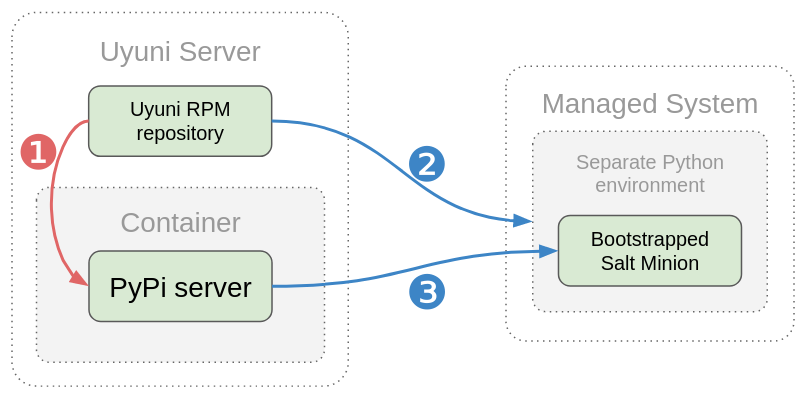
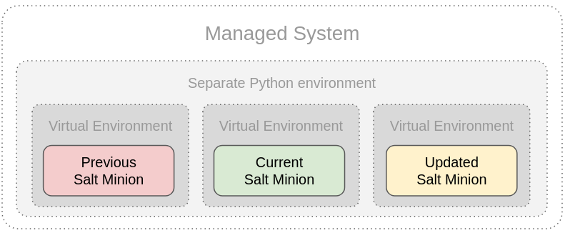

- Feature Name: Salt Minion Update
- Start Date: 2019-11-26

# Summary
[summary]: #summary

Uyuni-controlled Salt Minion update mechanism on all platforms and architectures.

# Motivation
[motivation]: #motivation

Due to Salt's nature, it comes with the modules that are persistently installed on the Salt Minions. Given Salt Minion outdated due to variety of reasons (e.g. being a part of OS's maintenance schedule), this leads to inconsistent infrastructure, where the same modules might have different capabilitles.

This RFC has the following goals to resolve:

- Ensure Python environment with a specific version on all clients.
- Ensure identical version of Salt Minions with the Salt Master.
- Independence from client OS's maintenance cycle.

# Detailed design
[design]: #detailed-design

## Approach

**Volatile Salt Minion**

SaltSSH as of today is unable to work across different architectures that differs from the one where Salt Master is running. This limitation is due to the binary modules are included into pre-generated `thin.tgz` and they are coming from the hardware architecture on which they are installed at Salt Master side. That said, running SaltSSH from the x86 platform against e.g IBM System/390 or ARM will just fail to load binary included `.so` modules.

However, SaltSSH is treating Salt Minion as volatile entity, and such approach can be successfully reused in a standard deployments, where Salt Minion can be fully installed into a separate optional environment e.g. in `/opt/salt<version>` with its own Python environment and also be directly removed with `rm -rf /opt/salt<version>` without breaking anything on the managed OS. Essentially, this makes Salt Minion state-less and can be removed and reinstalled at any time, regardless what kind of communication channel is used (ZMQ or SSH).

If Salt Minion could be no longer needed to be packaged from the client OS perspective and is deployed from the Salt Master host, then the support routine is also shifting only to a Salt Master host.

**Independent Maintenance Cycle**

In order to efficiently update Salt Minion on any version of operating system, the update cycle of a Salt Minion needs to be independent from the maintenance update of the very operating system itself. This can be achieved by keeping Salt Minion volatile and nearly state-less.

Rationale: Allow components update as soon as it is needed for the software component, without waiting for the general maintenance update.

**Isolation**

Since Salt Minion is a part of configuration management system, it is also a good to have it "static", in terms of zero dependencies from the operating system it currently runs.

Rationale: Allow running latest modern software on much older environments without any impact to the managed operating system.

**In-place Bootstrapping**

Each Salt Minion is not packaged anymore in OS-specific package manager (RPM, Deb etc), but is bootstrapped via standard Python mechanism (Package Installer for Python, PIP).

Rationale: Track all the patches in only one place. As the code is isolated (see above), avoid unnecessary extra-packaging for isolated version of the Salt Minion.

## Deployment Cycle

### Overview

Deployment of the Salt Minion consists of two parts:

1. Setting up statically compiled Python environment. This include 3rd party modules and dependencies, such as MCrypto, SSL etc.
2. Deploy Salt Minion and all its included modules.

The principle is to run own minimal [PyPi](https://pypi.org/project/pypiserver/) local server on Uyuni cluster. In order to install a Salt Minion, a managed system should use PIP againstlocal PyPi server, as shown on Figure 1 below:

_Figure 1_

Process update or installation flow as follows:
1. Salt Minion **(1)** is provided for all supported platforms and architectures, pre-compiled and deployed on the PyPi server as PyPi packages. Essentially, the RPM package is installing packages that are still going to be deployed elsewhere. This way all the patches to the Salt Minion are still tracked at RPM `.spec` level. The essential difference here is to re-package compiled result into a PyPi-served binary wheel archives form. For environments, where RPM or Debian packaging is not used (e.g. purely PIP-bootstrapped environments etc), the PyPi packages are made directly per architecture. A single wheel archive can indicate its compatibility with a number of Python language versions, implementations and system architectures. More on [Wheel Binary Package Format](https://www.python.org/dev/peps/pep-0427/) in PEP427.

2. Statically compiled general Python vanilla environment is provided in RPM packages from Uyuni repository (or any other package repository source, if needed) and is allowed to be installed **(2)** on a Managed System, e.g. in `/opt/python3.8` or whatever version is needed. That way it is also allowed to have many Python versions as well as its modifications if ever needed. This also is only needed on the systems where no Python is installed or it is older version that minimum is required. On the systems, where minimum required Python is already installed, this entire step can be simply skipped.

3. The Salt Minion is also installed into a Python Virtual Container in order to segregate the modules outside of the main Python installation (whether it is system-wide Python or statically provided). Once an empty virtual environment (not shown on the _Figure 1_) is created for chosen Python interpreter, Salt Minion is bootstrapped via PIP against custom PyPi server, where all required Salt Minion dependencies reside.

The outcome is to achieve running fully featured Salt Minion of latest available version in an isolated virtual environment on an OS-provided Python interpreter (static or provided with the OS packaging). Once Uyuni Server is updated to another version, so is the PyPi container image content is also upgraded (or the packages inside the PyPi are updated). This way Uyuni Server is issuing mass-upgrade command to the all Salt Minions, similarly how SaltSSH would re-generate `thin.tgz` archive.

Consequently, this mechanism will allow to keep always aligned Salt Minions across the entire infrastructure consistent and identical.

### SaltSSH 2.0

Essentially the entire approach of Salt Minion deployment on a managed machines is borrowing from the original SaltSSH principle, merging both installed Salt Minion and SaltSSH, delivering fully empowered Salt Minion, supporting cross-architecture binary modules from 3rd party on variety of operating systems, their architectures and versions.

In order to complete deployment sequence, a similar tool to SaltSSH needs to be developed from the beginning with the following basic functionality:

1. Connect via SSH to the target machine and detect the following data:
   - OS type
   - OS version
   - Package Manager type
   - Newest version of Python
   - Minimum requirements to provision Salt Minion on that machine

2. Update the deployment configuration with the data from the step #1 above.
3. Provision Python interpreter, if needed.
4. Install "heavyweight" 3rd party dependencies, such as MCrypto, SSL etc. These modules do not depend on Salt Minion version releases or any changes at all. So their update is separeted from the Salt Minion itself.
5. Create Virtual Environment for that Python interpreter, inheriting its `dist-packages`.
6. Install all Salt-related dependencies from custom PyPi server.
7. Install Salt Minion from the custom PyPi server.
8. Set/verify all file permissions and make it ready to work with the init system, which is available on the operating system. This step actually may be performed with the Salt Minion itself, ran with the `--local` option over delivered state formula that actually doing this.

All the above operations should be strictly remote, without having nothing copied to the target machine. Additionally:

- If provisioned Salt Minion required to be used over ZMQ:
  1. Setup Minion configuration against the Salt Master machine from which this tool is called.
  2. Start Minion
  3. Verify the cipher key and accept the Minion to the Salt Master

- If provisioned Salt Minion is required to be used over SSH:
  1. Install script runtime that is using the same Salt Minion in "passive mode" with `--local` option.
  2. Provide a temporary directory where `state.tgz` per PID are stored.

The same tool would replace `salt-ssh` command entirely, as it would no longer need to copy `thin.tgz`, detect the environment etc, but only deliver `state.tgz` to already installed Salt Minion and simply reuse it.

Further development may include:

- Drop the [concept of SaltSSH Roster](https://docs.saltstack.com/en/latest/topics/ssh/roster.html) entirely, merging its purpose with ZMQ-based minions. That said, e.g. `salt \* ...` should include also SSH-managed minions, effectively dropping `salt-ssh` command as well.
- Transparently switch the communication channel between ZMQ and SSH for a given Salt Minion, allowing start and accept Salt Minion as permanently running daemon over ZMQ or stop it and communicate only via SSH. All that should be "behind the scenes" of user used `salt \* ...` command interface.
- Run asynochronous Salt calls over separate SSH connections from multiple processes. Currently SaltSSH does not support this.
  _NOTE: This RFC document does not covering possible SSH-enabled Minion asynchronous mechanism._
- Unregister and completely remove Salt Minion from the target machine.

## Fail-proof Updates

Each Salt Minion is deployed into a newly created, fresh Python Virtual Environment. The reason of doing it is to reuse the same Python environment, separated from the Salt Minion procedure deployment. The reason to keep it fully separated is because Python environment may be fully static or a part of the operating system. In any of these cases Salt Minion provision should not affect the Python interpreter realm.

Having running Salt Minion inside a virtual environment, allows to deliver fail-proof updates. The basic mechanism is to clone Python Virtual Environment from the current active Salt Minion and update the Salt Minion there.

If update is finished successfully, Salt Minion is restarted into a new environment, which is set as default. Previos environment is kept, and is purged over one update cycle (one after current update). This way administrator always has an ability to roll-back to the previous known working version.

If update failed, Salt Minion keeps running without changes, report is created and new Virtual Environment is purged immeditately.

As shown on the _Figure 2_, the difference between RPM-based updates is that the software components are overwritten, instead of installed nearby. Therefore once Salt Minion is broken on upgrade for whatever reasons, it might be no longer possible to revert this with the faulty Salt Minion itself.

_Figure 2_

According to the _Figure 2_, if updated Salt Minion is successfully updated and is trusted enough, then the statuses of each virtual environment are shifted, and "Previous Salt Minion" is purged.

Naturally, the same way it is possible to update the entire Python version on production and roll-back to the previous Python version, in case things go wrong.

## Installation/Update Process

This RFC is separating Python installation/update process from the Salt Minion installation/update processes, both on all architectures and OS versions. Consequently, mechanisms are different.

### Step 1: Python Interpreter

Python interpreter in "vanilla version" should be packaged as usual in RPM, per OS. However, compiled statically for that specific OS version and architecture. This alone allows update Python interpreter independently from the currently running Salt Minion. The diffrence is that the Python interpreter is installed in an optional namespace, e.g. `/opt/python<VERSION>/bin/python<VERSION>` path. The very RPM package, however, is served by Uyuni Server repository, instead of default channels.

This RPM package remains being vendor supported.

### Step 2: Virtual Environment

Once Python interpreter is delivered and installed on a managed system, Virtual Environment is created. It should contain Package Installer for Python (PIP) and Salt Minion required packages list.

Salt Minion is no longer installed from the RPM package, but bootstrapped by PIP environment. However, the distributed package version that is on the PyPi server remains vendor supported.

> Idea for audit: checksums of all the files in the Virtual Environment can be calculated and stored in the database that might run on PyPi container. This way it is possible to detect if the environment was tampered.

### Step 3: Running Salt Minion

Ready to go Salt Minion on the Virtual Environment is linked for the `systemd` as default and is started.

### Next Steps: Updating Salt Minion

In order to update Salt Minion to the latest Uyuni-supported version, Step 2 is repeated and new Virtual Environment is created nearby current one. Virtual Environment manager component should relink default environments shifting current to "previous" and "new" to "current", and then restart Salt Minion.

### Restoring Failed Minion Update

**Problem**
New Salt Minion is completely broken and doesn't start anymore. This renders managed system no longer be able to be managed via Salt.

**Rationale**
Automatically restore and reconnect previous Salt Minion, once new Salt Minion upgrade went wrong and new Salt Minion is either fails to start at all or fails to communicate/respond or has any other major fatal issues.

**Solution**
One of the ideas is to switch Minions with a simple watchdog function, which has only one purpose: to watch status of some cookie file for a specific amount of time and restore previous minion, in case timeout is over. This function could be a part of the mechanism that takes care of managing Python Virtual Environments.

E.g. if new Salt Minion restarted successfully and reported back, Salt Master can issue another command to "finalise upgrade" and so Salt Minion updates cookie file. In this case watchdog function will get a signal that the previous Virtual Environment restoration is no longer needed. Otherwise, previous Salt Minion is restored back.

# Drawbacks
[drawbacks]: #drawbacks

- 3rd party dependencies should go through the review process, before they appear in the PyPi repository, available for the installation. Possible solution to seamlessly un-RPM them from the packages. Conversion from RPM sources back to the PyPi format?
- Essentially, PyPi server will take a control (and a responsibility) for *all the dependencies* for Salt Minion. It no longer will be valid to rely on  whatever package comes with the current OS. But it is also **a positive side**: it allows to have newest possible library, that is no longer available on the current system in that particular version.

# Unresolved questions
[unresolved]: #unresolved-questions

N/A
