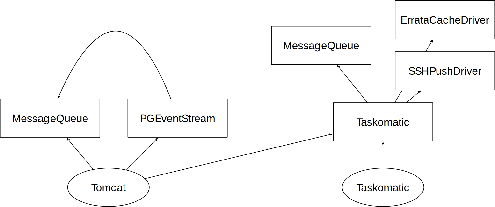

- Feature Name: akka
- Start Date: 2020-03-12
- RFC PR: (leave this empty)

# Summary
[summary]: #summary

Replace homegrown asynchronous task facilities in Java code with an "off-the-shelf", proven open source component (or set of components). Goal is to reduce internal complexity, remove known hacks and possibly attain better observability, performance and ease of tuning.

More background can be found on the [HackWeek 19 Akka project page](https://hackweek.suse.com/projects/uyuni-re-architecting-code-with-akka) which is basically a proof-of-concept of the content of this RFC.

# Motivation
[motivation]: #motivation

Uyuni's long history has, in some cases, resulted in different organically-grown solutions to problems common in different areas of the codebase. One of those problems is the execution of asynchronous tasks within Java code, where currently we have at least 4 different "frameworks". In addition to the accidental complication, none of them is really complete in terms of current and predictable future requirements.

Specifically, those are:

- Taskomatic's basic facilities, including one-shot tasks
- Some specific Taskomatic task facilities (eg. `ErrataCacheDriver`, `SSHPushDriver`)
- Tomcat's `MessageQueue` facility (also replicated in Taskomatic)
- Tomcat's Salt event handler (`PGEventStream`, which also reuses parts of `MessageQueue`)

Open problems that in various degrees affect all of the above are:

1. enforcing dependencies between asynchronous tasks
2. enforcing dependencies between asynchronous tasks and other parts of the codebase
3. establishing priority of tasks
4. tuning, performance
5. observability
6. learnability (by new developers and existing developers unfamiliar with the interested code area, eg., for bugfixing purposes)

At this point the main goal is to **improve internal quality by rationalizing the internal rearchitecture**.

# Detailed design
[design]: #detailed-design

## Core idea

Remove homegrown solutions and replace them with [akka.io](https://akka.io/), a well-known open source tookit for concurrent/reactive/distributed applications.

With reference to the open problems stated above:

1. in Akka dependencies can be expressed by actors firing messages to other actors when done
2. any other part of the code base can ask an Akka actor to do something by sending it a message
3. [Akka has a concept of priority messages to actors](https://doc.akka.io/docs/akka/2.5/mailboxes.html)
4. Akka seems to be regarded as high performance, has thorough and well-documented tuning knobs
5. [Akka has a lot of utilities for monitoring](https://developer.lightbend.com/docs/telemetry/current/home.html)
6. Akka is generally known and well documented, has books, videos and other material available

## Detail design ideas

 - The Akka-based asynchronous facility will be made available via a facade (`ActorManager` in the above PR)
   - any code needing to run an asynchronous computation will use the facade
   - the facade will accept messages to Actors (`Command`s), instantiated by calling code
   - the facade will route `Command`s to respective `Actor`s - `Actor`s normally receiving one `Command` type and corresponding to one computation unit (current `Action`s, `Task`s and so on)
   - all `Commands` should be `Serializable` and contain simple data types as much as possible
   - the "functional" Akka style is preferred when writing Actors

## Steps

1. package Akka and integrate it with the Uyuni product packages, build systems
2. move Tomcat's `MessageQueue`-based Actions to Akka
3. move `PGEventStream`-based Salt event handlers to Akka
4. drop `MessageQueue` and related mechanisms

All of the above was implemented (as proof-of-concept) as part of [this HackWeek PR](https://github.com/uyuni-project/uyuni/pull/1903)  (excluding commits after February 15, which deal with Akka Clustering) which can serve as a reference for implementation details.

Some shortcuts have been taken during HackWeek and will not be acceptable for proper implementation, particularly:

 - unit tests have been arbitrarily disabled or left broken
 - new methods/classes do not have new accompanying unit tests
 - logging is incomplete
 - code style of Akka-related parts follows the Akka coding conventions, which are different from the CheckStyle rules currently applied. We will either need to adapt new code to the existing conventions or relax them/create different rules
 - error handling was not tested thoroughly, might need rework
 - the Cucumber integration testsuite was not run on the resulting code
 - performance tests will have to be conducted to make sure there is no regression (and evaluate possible speedups)
 - the reflections-based mechanism to find out workers will have to be considered and it might be removed in exchange for an explicit approach
 - most but not all Actor Messages were made `Serializable`, more refactoring might be needed to ensure this is always the case
 - Akka tuning knobs were not all exposed, or exposed by reusing existing configuration variables. New variables might need to be introduced and properly documented
 - the `DeferredActor` implementation is at the moment not completely written in functional style

5. move specific Taskomatic task facilities (eg. `ErrataCacheDriver`, `SSHPushDriver`) to Akka
6. refactor Taskomatic itself to use Akka

Last point is about having Quartz-based Taskomatic logic only caring aobut the triggering of jobs, and leave to Akka their execution. Basically when Taskomatic fires (eg. on cron line) it will send a message to an Akka actor which would then carry out the actual computation.

## Following Steps

Following points need further research when points 1.-6. are completed, and possibly need follow-up RFCs, still are reported here for completeness.

### Move Taskomatic code in the Tomcat web app

After all asynchronous computation is moved to Akka, it might make sense to consider moving all Taskomatic code out of the currently separated daemon snd into the main Tomcat web app.

Architecturally, such a change would have pros and cons:
 - pro: we could remove the internal Tomcat XMLRPC API, eliminating substantial complexity and the synchronization/availability problems we currently face (eg. [the race condition in `MinionActionExecutor`](https://github.com/uyuni-project/uyuni/blob/4.1-alpha1/java/code/src/com/redhat/rhn/taskomatic/task/MinionActionExecutor.java#L82-L102), as per [downstream issue 10657](https://github.com/SUSE/spacewalk/issues/10657))
 - pro: with one DB connection pool and one Akka thread pool, it should result in an easier-to-tune Server
 - pro: currently many support issues boil down to undetected Taskomatic failures. With one only web app, it should be easier to surface errors in a more user-visible way
 - con: unexpected Taskomatic errors may bring Tomcat down as well. At the moment this does not happen, but as we rely on Taskomatic much more than in original Spacewalk, in many cases we already end up with a non-functioning Server anyway

### Leverage Akka Clustering to offload computation onto other machines

Akka has an optional module called Clustering that allows to transparently move computation across machines, specifically by instantiating Actors on remote nodes and letting Akka route messages to them.

This has been demoed as proof-of-concept [in the HackWeek PR](https://github.com/uyuni-project/uyuni/pull/1903) (commits after February 15), and it is an interesting door to have opened by the work in this PR.

Before considering this for the main codebase, the following aspects should be evaluated:

 - out of all the workloads migrated to Akka, which ones make sense to distribute? In many cases, Uyuni bottlenecks lie in the database or Salt components, and those would not be affected by such a change
 - does the trade-off make sense at all from a performance perspective? Addding a network layer introduces latency which might end up negating any speedup gained because of the cluster
 - how can Akka Cluster nodes connect back to the one only Salt and database instances? During HackWeek, a simple SSH tunnel was used for demonstration's sake. Distributing Salt or the database are separate efforts with their own set of trade-offs
 - is the extra administration overhead worth it? In which cases? Maintaining a cluster is much more work-intensive than maintaining a single VM
 - how can we deal with upgrades? Akka Clustering has primitives for versioning, but making them work with existing packaging and delivery processes requires some study

# Drawbacks
[drawbacks]: #drawbacks

 - as with all refactorings, we risk introducing regressions at least initially
 - Akka itself is a complicated artifact. Although external quality seemed very good during HackWeek (no bugs or strange/undocumented behavior was noticed, great documentation) there is always a chance some internal bug hits us, and might be difficult to solve
 - we get to maintain a packaged version of Akka
 - performance has to be measured - we expect it to improve but that is not guaranteed

# Alternatives
[alternatives]: #alternatives

The only considered alternative at this point is to roll our own thread pool model and infrastructure and use it to replace all current implementations. This is expected to be much more difficult and error-prone.

# Unresolved questions
[unresolved]: #unresolved-questions

- Just how far do we feel like going in the steps listed above?
