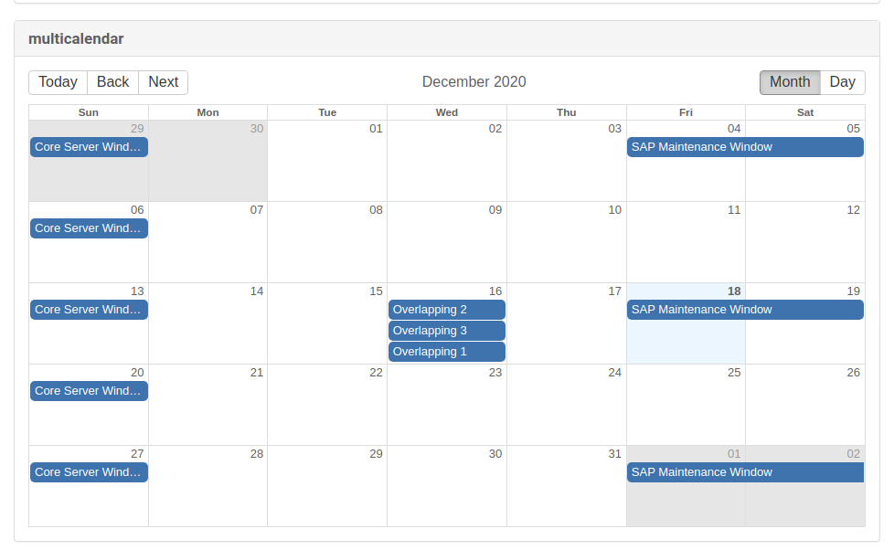
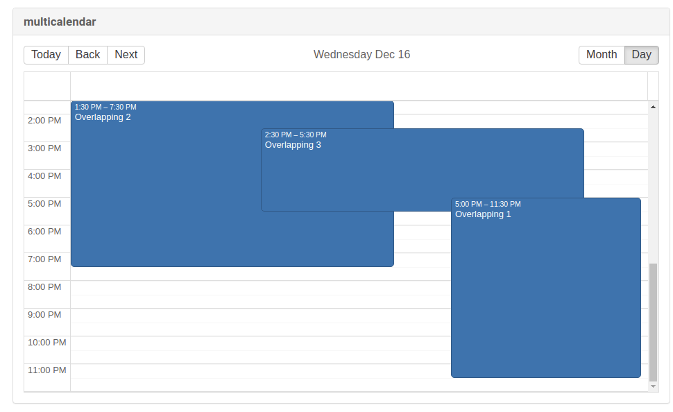

- Feature Name: Maintenance Windows Web Calendar
- Start Date: 2020-12-18
- RFC PR: (leave empty)

# Summary
[summary]: #summary

Provide the user with a calendar view that displays information about the maintenance windows associated with the calendar.

# Motivation
[motivation]: #motivation

### Why are we doing this?
Currently we display the contents of the ical file uploaded by the users in the calendar details and creation menus. Since it's difficult to draw information about the maintenance windows defined in that file from the pure ical we want to provide this information displayed as a calendar.

### What use cases does it support?

When choosing a maintenance schedule from a maintenance calendar the user needs to know the details of the maintenance windows contained in the calendar.

Typical workflow when creating new maintenance windows:

1. Head to `Schedule` -> `Maintenance Windows` -> `Calendars` -> `Create`
2. Follow the steps to create a new calendar
3. Go to `Schedules` to create a new maintenance schedule
4. Use the information provided in the created calendars details view to pick a maintenance schedule
5. Assign systems to the newly created maintenance schedule

### What is the expected outcome?

Replace the plain ical text in the calendar details and creation menu with a visual representation of the maintenance windows contained in the uploaded ical file.
Use the created calendar view to also display information about a maintenance window in the maintenance schedule details and creation menu.

# Detailed design
[design]: #detailed-design

### UI

Following example screenshot should help to provide a basic idea of how the implementation should look like. (created using react-big-calendar)

Month view:

Day view:

Events belonging to different Maintenance Schedule should have a different color

To prevent massive scrolling needed within the calendar view `Back` and `Next` buttons
should navigate to the previous/next months/days that have at least one maintenance window.

The calendar should have a `read-only` mode to prevent manipulation of displayed events but also support it for potential future use.

As a bonus we could display scheduled actions of systems assigned to a Maintenance Schedule

### Getting data from the backend

A new function to calculate the maintenance windows contained in a maintenance Calendar needs to be implemented. It looks like `calculateUpcomingMaintenanceWindows` in `IcalUtils` can be reused/adapted in this case.

I see 3 ways of calculating the maintenance windows displayed in the calendar
1. Stick to the current way and calculate the next x (e.g. 10) maintenance windows
2. Calculate all the maintenance windows within a given period (e.g. one year) and limit the months displayed in the calendar.
3. Make a async call to the backend to retrieve all the maintenance windows of a month when clicking the `Back` and `Next` buttons. (basically server side pagination)

From my point of view 1 is out. 3 would be the preferred way, but 2 is faster to implement and probably good enough.

After some discussion we decided that we should go with option 3. The existing pagination utility
code should be able to be reused/adapted to work here as well.

### Storing ical data
There are two ways to represent ical data in our database.

1. Continue to store the ical file as text blob in `suseMaintenanceCalendar` table.
Relevant for creating Calendars via the web component only (later):
Ical stores timezone information such as `daylight saving time` and the resulting time shift. The `ical4j` package allows creating the `vtimezone` information by passing the timezone e.g. "Europe/Berlin" to it. This way we can reconstruct an ical file from the data provided by the web Calendar.

2. Parse the ical file and store relevant content in it's own table(s). We could store generic ical data such as `timezone` information in the `suseMaintenanceCalendar` table and save `vevent` data in it's own table with a 1:many relationship to `suseMaintenacneCalendar`.
`vevent` data we would have to store: `summary` used as the name of a maintenance schedule (if type multi is used), `rrule` to determine the recurring frequency, `dtstart` and `dtend` for the first/last occurrence of the Maintenance Window
Switching over to option 2 also requires adapting existing Manager/Factory classes related to Maintenance Windows to the new representation.

My proposal is to stick with option 1 for now and reiterate when researching for creating calendars through the web component (this will require it's own rfc anyway, since it's way more complex than just displaying Maintenance Windows through the web calendar). The additional workload required to switch to option 2 after the implementation of displaying the MWs should be marginal.

# Alternatives
[alternatives]: #alternatives

There seem to be a couple of solutions potentially suited for our use case:

1. [Full Calendar](https://github.com/fullcalendar/fullcalendar)
2. [React Big Calendar](https://github.com/jquense/react-big-calendar)
3. [TOAST UI Calendar for React](https://github.com/nhn/toast-ui.react-calendar)

## Full Calendar

**License:** MIT (Community Edition only)

**Dependencies:** Full Calendar will add `preact`, `tslib` and `ical.js` beside itself to our project.

**Codebase Size:** Measured using (`git ls-files | xargs wc -l`) ~95k lines (excluding examples)

There is a legal entity (FullCalendar LLC) behind the project that offers a paid premium version.
Non of the non-free features are required for our purpose, hence this remains a valid option.
It seems though that there is only one active main contributor on the project, occasional commits come from the community. Response time to created issues appears to be promptly.
A lot of test cases are covering the project.

There is a react wrapper ([fullcalendar-react](https://github.com/fullcalendar/fullcalendar-react)) available

### Fitting our purpose?

It allows to create custom buttons to be displayed in the header toolbar to allow navigating between dates/months containing maintenance window relevant data.

Supports using the calendar in `read-only` mode

Coloring events differently is supported as well.

Supports displaying events in different timezones.

As a bonus Full Calendar is able to read its events directly from ical files. This allows us to potentially cut back on backend work.

### Integration burden

The integrated ical support should make this option faster to integrate. The documentation is great and there are a lot of examples that help you getting started.

## React big calendar

**License:** MIT

**Dependencies:** Will add (besides itself) `popperjs/core`, `moment`, `restart/hooks`, `types/react`, `types/warning`, `clsx`, `csstype`, `date-arithmetic`, `dom-helpers`, `lodash-es`, `react-overlays`, `uncontrollable`

**Codebase Size:** Measured using (`git ls-files | xargs wc -l`) ~25k lines (excluding examples)

This is a more lightweight option to `Full Calendar` and was inspired by it. So they share similar functionality and looks.
The project is reasonably active and kept alive by the community, but the owner seems to have abandoned the project in recent times. Compared to Full Calendar the response time to issues is longer but most of them seem to get attention after a couple days. It does not have any tests however.

### Fitting our purpose?
This calendar supports creating your own sub components to customize it's functionality. It has the option to create custom `Toolbar` component that can be used to support the creation of dedicated `previous` and `next` buttons to navigate between days/months that contain maintenance windows.

Coloring different events individually to distinguish between them is possible.

Read only mode is available.

There is no integrated support to switch between timezones and no ical support.

### Integration burden

Compared to the first option the documentation is a bit lackluster, but there are examples provided that somewhat compensate for that. Also there is no integrated ical support which will require querying data for events from the backend which needs to be implemented.

## Toast UI Calendar

**License:** MIT

**Dependencies:** Won't introduce anything new (besides itself)

**Codebase Size:** Measured using (`git ls-files | xargs wc -l`) ~90k lines (excluding examples)

The project is active though almost all of the development seems to be done by one person. There are hardly contributions from the community especially in recent times. Issue response time is fast and every issue gets attention by the main contributor. There is test coverage of the project.

React wrapper component for [tui-calendar](https://github.com/nhn/tui.calendar).

Uses Google Analytics which can be disabled, but needs to be manually taken care of by passing an option to the component every time it's used.

### Fitting our purpose?

This component does not allow to manipulate the functionality of the `previous` and `next` buttons in any way, hence we wouldn't be able to prevent the need of massive clicking if maintenance windows are far apart.

Coloring events is possible.

Read only mode is available.

Timezone support is there but has limited functionality. Timezone objects need to be created manually (define the name, the GMT shift and the displayed tooltip yourself) and there is no button to change them on the fly (we would need to implement that).

Ical support is not integrated.

### Integration burden

There are examples to help you get started as well as detailed documentation with use example of the different API elements. Personally I would rank the documentation between `big calendar` and `full calendar`. Overall this project caused me the most trouble to find myself into despite decent docs and examples. No ical support so additional backend work will be required.

## Conclusion

After evaluating each of the three options. My conclusion is that the closest fit for our needs is `Full Calendar`. The ability to read events directly from ical files will spare us from calculating the maintenance schedules in the backend. At the same time it meets all the requirements mentioned above.

After some discussion we came to the conclusion that it would likely be better to not use `Full Calendars` ical API and instead use server side pagination to get the data to display in the calendar, since `Full Calendar` only allows reading data from ical files and is not able to output ical from created events. This does however not affect my decision that `Full Calendar` is the component to use for this implementation.

# Drawbacks
[drawbacks]: #drawbacks

## React big calendar

Maintenance windows that occupy more than on day are displayed in the 'all-day' section of the day view and not shown in the time section. This is not really suitable for our use case.
However there are two potential solutions to that:
1. Split these maintenance windows into multiple one day events (just for display purpose)
2. Create a own day view [component](https://github.com/jquense/react-big-calendar/issues/765) based on the existing one

## General risk

Generally switching between calendar components once settled for one won't be straitforward. Whilst the backend part should be salvageable between multiple components the frontend obviously won't. The components presented have complety different APIs, hence switching calendar components will require the frontend part to be reimplemented.

# Future Improvements
The current scope includes only the display of maintenance schedules/calendars. In the future we might expand this to support the creation of Maintenance Windows within our webui. All off the options discussed above support the creation of events.
Reworking the Maintenance Window picker (part of the Action picker if a maintenance window is assigned) will require our struts/jsp action pickers to be migrated to react first and thus will be handled separately.

# Unresolved questions
[unresolved]: #unresolved-questions

Q: If we decide to represent the ical data in dedicated database tables. How would we handle migrating existing Maintenance Window data from the current representation (ical file as blob)?

A: @hustodemon: We were having discussion about such wild migrations in the past. In the end I used the UpgradeCommand java class, which was pretty convenient: you can run any java code on tomcat startup (i.e. you can use ical4j library for migration). Another option would be to write a PLSQL procedure converting the ical file to the tables (IMHO that would be a mess and "fun" to write).
