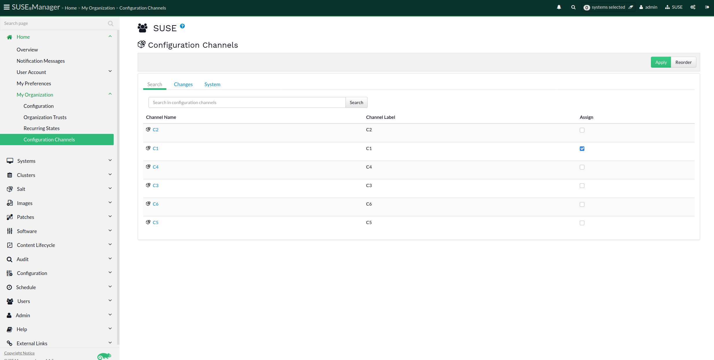
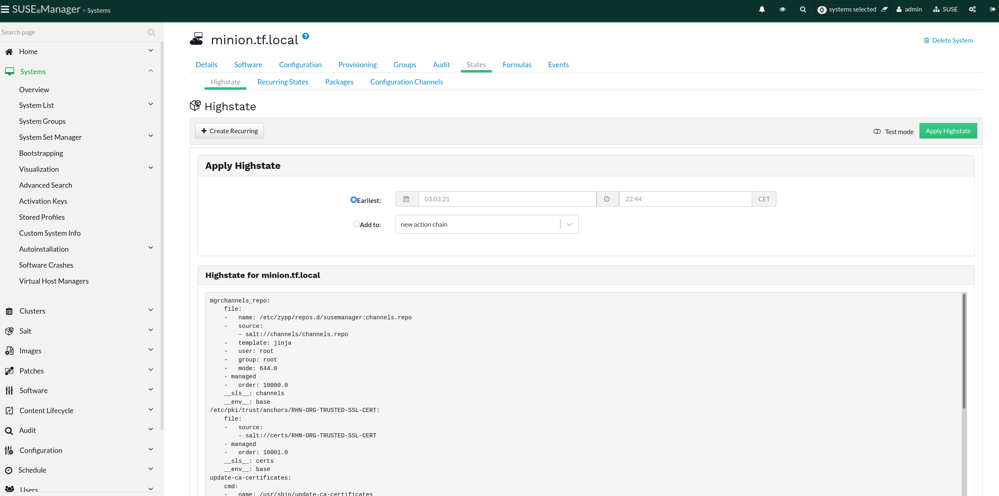
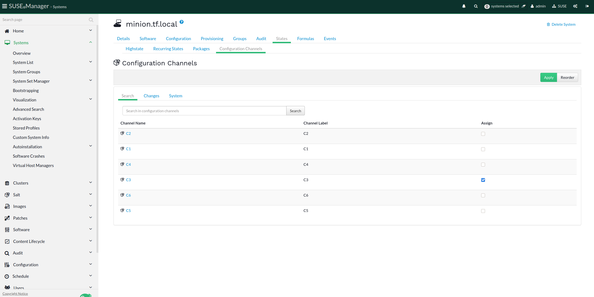
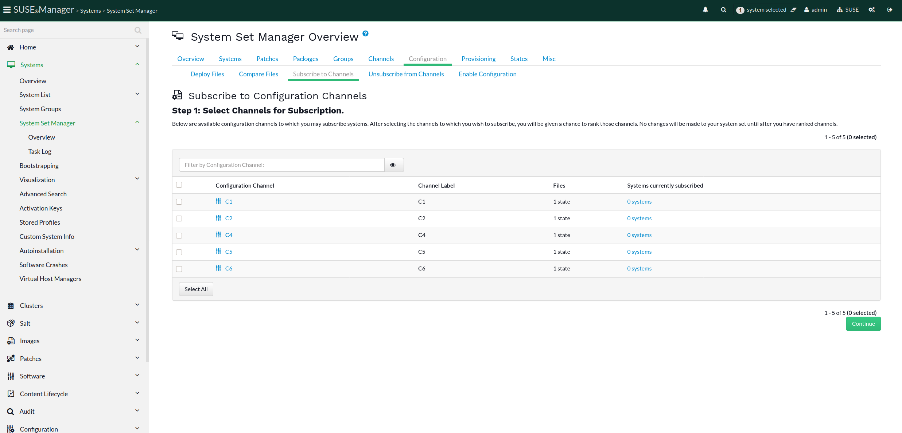
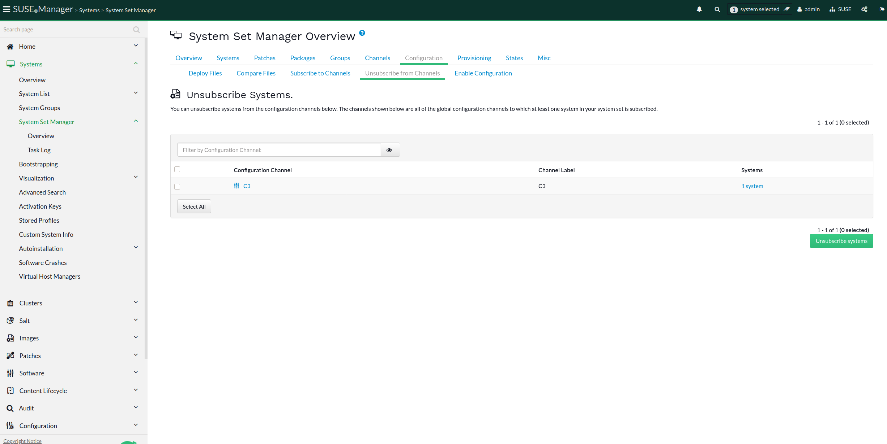
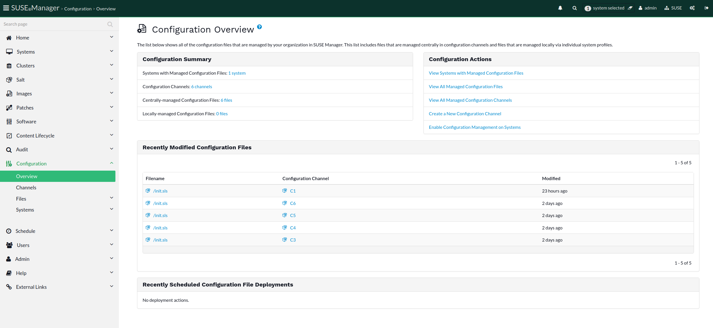
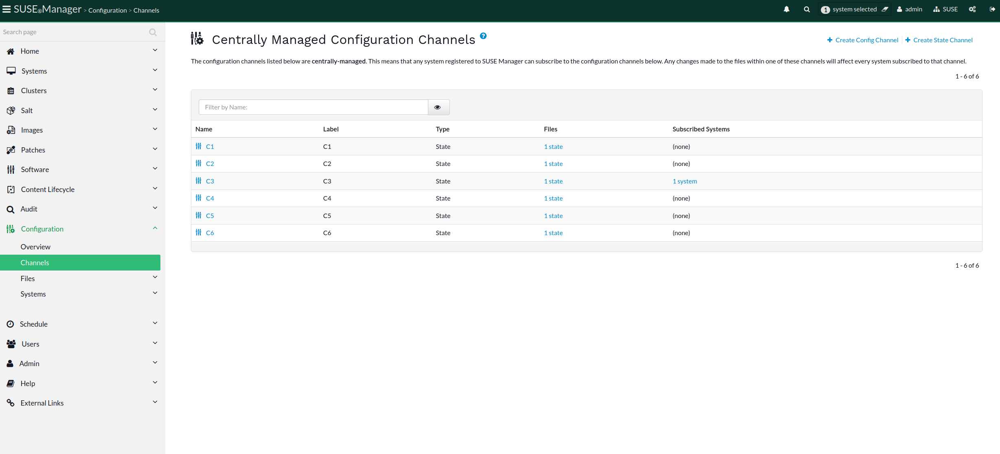
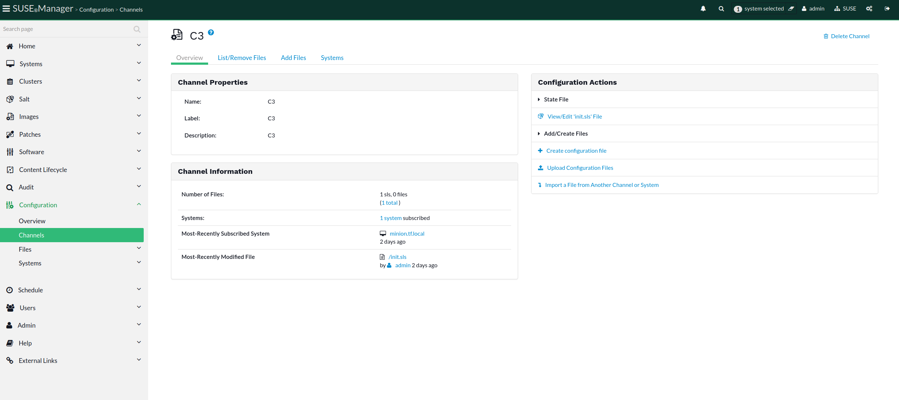
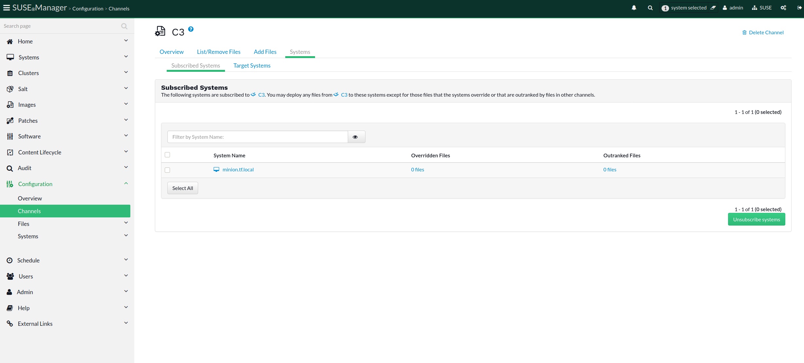

- Feature Name: Enhance visibility of connected State Channels
- Start Date: 2020-12-17
- RFC PR:

# Summary
[summary]: #summary

Provide better visibility of the relationships between State Channels, System Groups, Organizations and Systems - especially indirect ones.
The goal is to clarify which system **inherits** which State Channels, and why - conversely, which State Channel are ultimately associated to which Groups, Organizations and Systems.

*Note: everything discussed in this RFC applies to Salt clients only. Traditional clients do not inherit State Channels.*

# Motivation
[motivation]: #motivation

## Why are we doing this?

By definition a State Channel is a pool of Salt states. Once a Channel of this type is created, it is possible to subscribe systems to it in order to apply such states to them. Alternatively, State Channels can also be assigned to System Groups and/or to Organizations.

Collecting the possibilities as described above, we can see that:
- a channel can be assigned directly to a system `channel --> system`
- a channel can be assigned to a system group `channel --> group`
- a channel can be assigned to an organization `channel --> org`

On top of this it has to be considered that by design a System is part of an Organization `system --> org`, and it can also be part of a System Group `system --> group`.

The final channel assignements result, from a system perspective, can be:
1. `system --> channel`
2. `system --> group --> channel`
3. `system --> org --> channel`

That said, in the current implementation there is no way to figure out which channels are assigned to a system other than the directly assigned ones (1.).

Users have a hard time figuring out those relationships, this RFC has the goal to make them more evidently visible in the UI.

Note: in addition to what has been described so far, for what concerns the State Channels case, behind all the Salt States collected from the channels, there are also a bunch of default Salt States, the ones the server has to supply during the registration of a salt minion client, and during other management operations (such as channel - normal software channels - subscription, certificates, etc). Those are not *assigned* in any way because they are not part of any State Channel, they do just exists due to the logic implementation of a client registration using Salt. In the end, those are not visible Salt States anyway, and the System will be affected by them during those maintenance actions, so from the System perspective an additional source of Salt States could be defined as directly assigned: a non-manageable source behaving as a State Channel that will be named *internal management states*. It must be mentioned that also States coming from Formulas will be included within these *internal states* because they are part of the mechanism for the System to be configured according to Formulas assigned.


Adding the latter to the picture:
1. `system --> channel`
2. `system --> group --> channel`
3. `system --> org --> channel`
4. `system --> internal states`


## What are the use cases?

A complete but simple use case:

1. create an Organization O1
2. create a System Group G1
3. onboard a System S1 as a Salt client in the Organization O1 and System Group G1
4. create a State Channel C1 assigned to Organization O1
5. create a State Channel C2 assigned to System Group G1
6. create a State Channel C3 assigned directly to System S1
7. go to System Detail > States > Configuration Channels > System
8. the C3 channel is listed as an assignment to S1
9. there is no info about C1 nor C2 channels, but because of step 4. 5. in reality S1 will receive not only C3 but also C1 and C2 as inheritance of its own setup, being part of O1 and G1
10. the reverse logic is valid as well, there is no information about systems assigned to channels C1 or C2 in Configuration > Channels > Channel Overview > Systems because. No system is directly assigned to them, but S1 inherits them.

Adding complexity to the scenario described above:

1. create another System Group G2
2. create another System Group G3
3. create a State Channel C4 at System group G2
4. create a State Channel C5 at System Group G2
5. create a State Channel C6 at System Group G3
6. check the following system groups channels assignments:
  - G1 --> C2
  - G2 --> C4
  - G2 --> C5
  - G3 --> C6
7. add the System S1 to System Groups G2 and G3
8. go to System Detail > States > Configuration Channels > System
9. still only the C3 channel is listed as an assignment to S1, but in reality S1 is inheriting C2 from G1, C4 and C5 from G2 and C6 from G3


## What is the expected outcome?

A transparent representation of all State Channels assigned to a system from all the possible sources: direct and inherited (from System Groups, from Organization and from the system registration).

## Limitation

Salt States are collected from various sources including but not limited to States Channels. Those are handled by Salt which builds up the Salt highstate (or other target aggregated states). At the time of writing, Salt lacks tracking information about the origin of each state, and it is not part of this RFC to add such tracking.

This RFC exclusively covers adding visibility to relationships of State Channels, and not individual states.


# Detailed design
[design]: #detailed-design

### `Home > My Organization > Configuration Channels`
This page presents associations between an organization and both Configuration Channels and State Channels. All systems in this organization will inherit Channels selected here. This is a list of Configuration Channels and State Channels with the possibility of selecting/deselecting channels and Applying any changes.

Proposal is to add a filter to the list page for convenience.

Before:


After:


### `Systems > Details > States > Highstate`
Before:


After:


### `Systems > Details > States > Configuration Channels`
Before:


After:


### `Systems > System Groups > Details > States > Configuration Channels`
This page presents associations between a system group and State Channels. All systems in this system group will inherit the selected set of channels.

Proposal is to add a filter to the list page for convenience.

Before:


After:


### `Systems > System Set Manager > Overview > Configuration > Subscribe to Channels`
Before:


After:


### `Systems > System Set Manager > Overview > Configuration > Unsubscribe to Channels`
Before:


After:


### `Configuration > Overview`
Before:


After:


### `Configuration > Channels`
Before:


After:


### `Configuration > Channels > Details > Overview`
Before:


After:


### `Configuration > Channels > Details > Systems > Inheriting Systems`
This is a **new** page where systems are listed only if not subscribed to a given channel directly, but inheriting it through an Organization or System Group assignment. The list will contain two columns: one for the system name and one for the source the system got the channel inherited from.

Before:


After:


The list could look like:
```
|----------------+-----------------|
| System name    | Inherited from  |
|----------------+-----------------|
| test01.suse.de | org1, my group1 |
| test02.suse.de | my group2       |
|----------------+-----------------|
```


### `Configuration > Channels > Details > System Groups`
This page reproduces the same behavior of the `Configuration > Channels > Details > Systems` tab, but for System Groups. Being able to filter by System Group would be a nice but not strictly required addition.

This **new** page is pointed by:
- the `Channel information` box link of the system groups counting in the `Configuration > Channels > Details > Overview` page: the link will land on the new page at the `Subscribed System Groups` tab

### `Configuration > Channels > System Groups`
This page represents a complete list of pairs value `State Channel - System Group`: every value is a link to the specific entity detail (channel or system group). Filters for both fields should be available in order to look for a certain State Channel or a System Group or both.

This **new** page is pointed by:
- the `Configuration summary` box link of the system groups counting in the `Configuration > Overview` page: the link will land on the new page where all the pairs `State Channel - System Group` are listed
- the `Configuration > Channels` list, for every channel entry, from the `Subscribed System Groups` counting link value


# Drawbacks
[drawbacks]: #drawbacks

## Why should we **not** do this?

No real reason for not enhancing the feature adding the missing visibility.

The concrete drawback is: the solution is adding information to a tech-debt affected architecture, spreading the same information in many places (see how many pages/screenshots). Maintaining should not be complicated, but future refactoring of the feature workflow could be more difficult.

# Alternatives
[alternatives]: #alternatives

## What other designs/options have been considered?

Without investigating deeply, the alternative would be redesigning the feature completely from both the design and technical perspectives: the technical refactoring should get rid of the struts stack and redefine the concept of Configuration Channel and State Channel used by traditional or salt minion clients. By addressing the technical part, also the workflow could be re-drawn, dropping some pages and instead of adding separated tabs of tables it would be preferrable to have unified modern lists of filterable entries. The drawback of this alternative is that it would take much longer (from 3 to 5 times roughly) than the proposed official solution.


# Unresolved questions
[unresolved]: #unresolved-questions

## What are the unknowns?
1. No known unknown at the moment

## What can happen if Murphy's law holds true?
1. No periculous path visible at the moment
