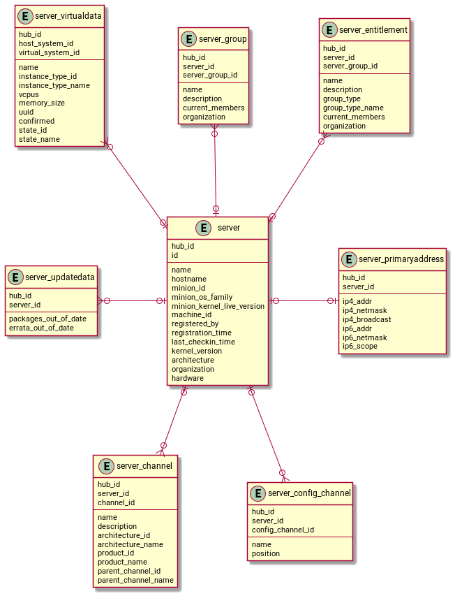

- Feature Name: Hub Reporting
- Start Date: 2021-11-23

# Summary
[summary]: #summary

Design and implement the infrastructure for a central reporting on Uyuni Hub.

# Motivation
[motivation]: #motivation

In a Uyuni Hub scenario we have the Hub to prepare and provide content for multiple peripheral Uyuni Servers.
The goal is now to get data from these Servers back and have combined reporting data available on the Hub.

The data should be made available for external Reporting Tools.

If possible, the data should also be usable on a single Uyuni Server with the same mechanism.

# Detailed design
[design]: #detailed-design

The data should be made available in a PostgreSQL database. We considered using other database types,
but the increased maintenance effort for new packages and limited knowledge about NoSQL databases
let us stay with the good well known PostgreSQL database.
Also PostgreSQL seems to be accepted in most Reporting tools as data source, while NoSQL databases
are not supported, or only via standard DBMS modules. Native support was rarely available.

### The Database
The main database is a PostgresDB in the Uyuni Hub system (but in the future it will be possible to 
use also an external db): it stores all the information collected from all the servers, and eventually
aggregates them. Other databases with the same schema are also present in all the servers, to collect 
information for that system.
All the databases (in the Uyuni Hub and in all Uyuni Server) needs to be made available on the network to either connect in a secure way (using the SSL
certificates provided by Uyuni Server) with the reporting tool or (for Uyuni Server) with the Hub to gather the data. 
If possible the connection to the main Uyuni DB from the outside should be forbidden.
In summary:
- the DB in Uyuni Hub stores, collects and eventually aggregates data coming from all the DBs of the peripheral Servers,
- the DB in Uyuni Hub stores also its own data - data from the systems directly connected and managed by the Hub,
- the DB in peripheral Uyuni Server stores its own data,
- the reporting tool can be connected either to the Hub or to any Uyuni Server,
- all connections are secure.

### The Database Schema

The schema should export the most important tables from the main Uyuni Database as a de-normalized
variant containing only data which are relevant for a report.

A ready-to-use report can be provided with views doing joins over multiple tables.
No foreign keys should be used to make data update and refreshing easier and independent from the order
of the tables.

Every table gets an extra column for the Uyuni server id of server which provide the data (`mgm_id`).
On a single Uyuni Server this column has the standard value `1` which represent "localhost".
On the Hub it will be replaced with the real server id the managed server has in the hub database.

As of now a Hub cannot be cascaded. A Hub of Hubs is not supported. For this we do not need to care
about how to represent cascaded "management ids".

Every row should get a report timestamp column (`exported`), which is set to the time when the data
were exported from the main Uyuni Server database.

Indexes should be set on the typical columns which might be searched for.

Data which belong to the traditional stack only (like osad status) should not be made available in the
reporting database as the traditional stack will be deprecated soon.

#### Schema example
A detailed database schema is not part of this RFC, but as an example, the data related to servers could be 
denormalized and presented in the reporting database in the following way:

This data structure can be used to extract the pieces of information that are currently available through the reports:

- inventory
- inactive systems
- hosts/guests
- system profile

This existing reports can be provided in the new schema as views, ready to be consumed. In addition, the user will
have the possibility to extract the pieces of information he needs by querying the data directly from the tables and
combining them as needed.

# Installation
The reporting tools will be installed by default; all the upgrade to a newer version, will install the 
reporting tools as well. Several packages will be provided in order to provide the following tools and
functionalities:
- setup the database and initialize the schema,
- perform database schema migration,
- setup database users,
- setup tasktomatic jobs.

All the other information required (e.g. Uyuni Server info) will be retrieved by already existing configuration.

## Reporting Database
A reporting DB is setup in all Uyuni Servers and Uyuni Hub nodes to store reporting data.
The default setup will create a Read/Write user, to manage the database and write the data from it into the Reporting DB.
This user and the DB connection parameters are written into `/etc/rhn/rhn.conf` similar to the default DB options.

## Initial Setup
Uyuni Hub should create its own read-only user on the Reporting Databases of the peripheral Servers.
As the peripheral Servers are managed with salt, we will write a state to create an account.
The username and password are generated on the Hub and provided as pillar data.
On the peripheral server the state take care of the existence of the account and the Hub
can store the parameters in its database under the system entry.

This account does not need to be stored in plain text on the managed Server and can be kept only on the Hub.
The same apply for accounts created by the administrator used for Reporting Tools which need access
to the Reporting Database.

# Workflow

## Scheduled job: collect from Uyuni DB
A taskomatic job is responsible to fetch and prepare the data from the main Uyuni
Database and insert them into the Reporting Database.
The job should be written in a way, that the Reporting Database could be on different Host.

Keeping the code which insert the data into the reporting DB in sync with the Reporting Database Schema
is a requirement.

Implementing a taskomatic simple java job should be sufficient as we need only one task which run at a
certain point in time.

We will create Views in the main Uyuni Database which prepare the data. The job should just query all and insert
the data into the reporting DB. We will get schema errors in case the schema of the main Uyuni Database change.

As we design this feature to be ready to use an external database for reporting, we do not use materialized views.

## Scheduled job: collect remote data
We also have an additional taskomatic job which collect the data from all peripheral
Uyuni servers and insert them into the Hub Reporting Database which could be
again an external DB.
We must parallelize the jobs to be able to gather the data from all Servers even in a large environment.
The goal is to get the data from 1000 Servers in maximal 3 hours.

The job get the list of candidates from the Hub Database including the user and connection paramaters to the
reporting databases of the peripheral Uyuni Servers.
To identify "Uyuni Severs" in the Hub Database, we need to add an entitlement to the registered system.
We will identify a "Uyuni Server" during the onboarding process on the basis of the installed products.
This detection should be easy changable as we might need a different mechanism in future when we containerize the Server.

The reporting DB does not use own ID columns with own sequences. To keep things simple we will
remove all rows for the Uyuni Server identified by its `mgm_id` and insert all which we get new from the it.
The job takes care to replace the `mgm_id` comming from the server("1") with the real ID it has in the Hub Database.

In case we see performance problems we need to re-think this approach and need to implement a more inteligent
mechanism.

## Consistency during upgrade
The database schema on the Hub and the Uyuni Servers might differ as not all server might be updated
at the same point in time. To support schema differences we should:

- query tables on the Uyuni Server and compare them with the tables available on the hub. 
  Only tables, which exists on both ends, will be synchronized
- query columns of the table in the Uyuni Server and compare them with the columns available on the Hub table.
  Only columns which are available on both sides will be synchronized. Columns available only on the Hub will
  stay empty. Columns only available on the Uyuni Server will not be exported.

Implementing this as a taskomatic QueueJob could be an option. The Queue Job is started and collect a list
of candidates. A number of parallel workers can be specified to connect to every single server instance.

## Show data on reporting tool
In order to use the data stored in the hub and/or in the servers as a datasource for external reporting tools,
the admin should create a read-only user to query information from DBs.

# Documentation
Documentation will cover:
- reporting tool architecture
- setup
- user creation/management
- reporting schema

# Drawbacks
[drawbacks]: #drawbacks

# Alternatives
[alternatives]: #alternatives

- SQL or NoSQL DB?
  - Reporting tools often support PostgreSQL directly why we could not find a similar good support
    for NoSQL databases
  - very limited knowledge in NoSQL makes it hard to decide for a technology we do not know
  - use case seems better to fit of SQL (based on a very limited knowledge about NoSQL databases)
  - no obvious killer features provided by NoSQL which we want to use

