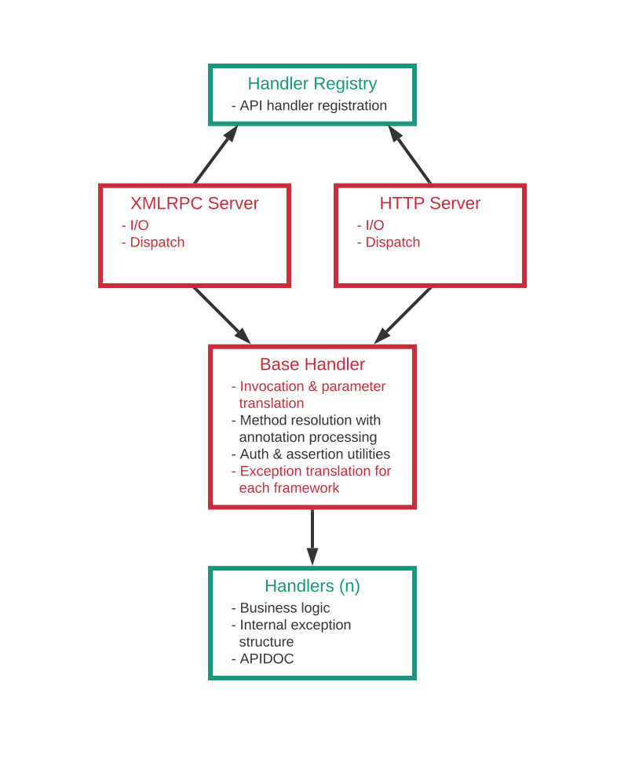

- Feature Name: HTTP API
- Start Date: 2022-02-08

# Summary

Provide an HTTP API exposing the existing methods via plain JSON, in addition to the XMLRPC protocol.


# Motivation

Reports suggest that SUSE Manager is seeing more use in automated scenarios, where it is a part of a bigger system and driven via its APIs - possibly but not necessarily a CI system.

The XMLRPC protocol has a very low barrier of entry for some use cases, notably Python programs, but as of recent years the industry has favored REST and, in general, HTTP APIs in terms of popularity and tooling support.


# Detailed Design

The design aims to provide a plain HTTP endpoint to the existing methods by reusing the available business logic with minimum redundancy. The bulk of the effort is to decouple the existing layers from protocol-dependent parts as much as possible, so that the most of the workflow can be utilized for both interfaces in an agnostic manner.


*Current workflow*

The components marked with red are tightly coupled to the XMLRPC-specific functionality, and cannot be reused with HTTP as-is.

The main goal is to restructure the workflow so that the agnostic parts can be isolated into separete components and be shared between two interfaces. These components are drawn in green in the proposed model below. This is especially important for handler classes, which are the linear growing components of the API implementation.

To implement the plain HTTP over JSON interface, the existing [Spark framework](https://sparkjava.com) shall be used.


*Proposed workflow*

The design is split into a number of areas that represent different aspects of the new API. The rest of the section describes each aspect in detail.

1. [Endpoint registration](#1-endpoint_registration)
2. [Authentication](#2-authentication)
3. [I/O](#3-io)
4. [Exception handling](#4-exception-handling)
5. [Security](#5-security)
6. [Documentation](#6-documentation)


## 1. Endpoint Registration

The most of the boilerplate code involves registration of the endpoint handlers, dispatching requests, and parameter matching. The XMLRPC framework provides an interface to register a class as a handler for a specific namespace. Further resolution of a method in a namespace is handled by the `BaseHandler` class using Java reflection to match the method names and parameters. `BaseHandler` is the base class that all the namespace handler classes inherit from.

On the HTTP side, Spark allows registration of an endpoint as a "route" per each endpoint method. The existing `HandlerFactory` shall be queried to retrieve and register the available handlers to Spark automatically without any extra effort.

The actual handler methods are designed to use POJOs as parameters. However, Spark expects a specific signature that takes `request` and `response` as parameters for route handlers. A simple wrapper shall unpack the parameters from the request and call the appropriate handler method for each request.

A typical resource-oriented REST API relies on various HTTP verbs to provide contextual information on what type of operation an endpoint is used for. However, the XMLRPC protocol is designed around methods, rather than resources. Therefore, HTTP verbs will be restricted to GET for read-only, and POST for read-write operations regardless of whether they require a payload or not.

Spark provides 3 common ways to attach data to a request. Named route parameters that are part of the base URL, querystring parameters, or the payload itself.

For primitive types, either querystring parameters or the request body may be used.

To pass parameters for a request, the request payload of type `JSON` shall be used. The Spark route wrapper shall unpack the payload using the `GSON` library. The top level structure of the JSON must be an object that contains all the parameters as properties with matching names.

Primitive parameter types may optionally be passed via the query string. This allows passing of parameters with GET requests as well.

The exposed HTTP routes shall follow the same namespace-method structure with a few extensions:

```
/rhn/manager/api/namespace/[namespace/]method[?query=params]
```

On each request, the Spark route wrapper shall unpack both types of arguments in the request, deserialize the payload, and call the appropriate handler method with unpacked arguments.

Java annotations shall be used to determine attributes of an endpoint, such as whether it is a read-only method or not.

Below is an example of such an annotation structure:

#### @ApiIgnore(API_TYPE) Target=Method

The methods annotated with `@ApiIgnore` shall be ignored by the handler registry in either HTTP, XMLRPC, or both. An interface can be specified by using the annotation parameter.

#### @ReadOnly Target=Method

An endpoint handled by this method will be set as a read-only endpoint.

**HTTP:** Spark will create `GET` endpoints for the methods marked with this annotation. If not used, Spark's method wrapper will check the requesting user and block access if restricted.

**XMLRPC:** `BaseHandler` will check this annotation against the requesting user and block access if restricted. This will replace the existing behavior of looking up the method name prefixes to determine if a method is read-only.

### Example 1

Consider the following XMLRPC handler method:
```java
public ActivationKey getDetails(User user, String key)
```

With the proposed annotations, it may be written as:
```java
@ReadOnly
public ActivationKey getDetails(User user, String key)
```

At registration, Spark route wrapper will create the following route definition for this method:

```java
// GET https://uyuni.server/rhn/manager/api/activationkey/get_details?key=1-DEFAULT

get("/activationkey/get_details", (req, res) -> {
  // 1.Unwrap the session user, and the querystring parameter named "key"
  // 2.Call to the `getDetails` method, passing the unwrapped arguments
  // 3.Serialize and return the JSON result
});
```

### Example 2

Consider the following XMLRPC handler method:
```java
public ContentProject updateProject(User user, String label, Map<String, Object> props)
```

At registration, Spark route wrapper will create the following route definition for this method:

```java
// POST https://uyuni.server/rhn/manager/api/contentmanagement/update_project?label=myproject
// {
//   'props': {
//     'name': 'My Project',
//     'description': 'This is my project'
//   }
// }
//
// or
//
// POST https://uyuni.server/rhn/manager/api/contentmanagement/update_project
// {
//   'label': 'myproject',
//   'props': {
//     'name': 'My Project',
//     'description': 'This is my project'
//   }
// }

post("/contentmanagement/update_project", (req, res) -> {
  // 1.Unwrap the session user, the query parameter named "label",
  //   and the JSON object named "props" from the request body
  // 2.Call to the `updateProject` method, passing the unwrapped arguments
  // 3.Serialize and return the JSON result
});
```


## 2. Authentication

The web UI performs token-based authentication via a session cookie called `pxt-session-cookie`. Currently, the web UI login page exposes an API endpoint to support this process. This endpoint shall also be used for API authentication.

### Login handshake demo

```bash
$ curl --include --header "Content-Type: application/json" \
--data "{'login':'admin','password':'admin'}" \
https://uyuni.server/rhn/manager/api/login

HTTP/1.1 200 200
...
Set-Cookie: pxt-session-cookie=209x9fa00e2e947ace87de0743f6cf63b8b0b4bfbfca2310ce6829941fa9db947987; Max-Age=3600; Expires=Tue, 08-Feb-2022 20:05:41 GMT; Path=/; Secure; HttpOnly;HttpOnly;Secure
...

$ curl --include --cookie "pxt-session-cookie=209x9fa0..." \
https://uyuni.server/rhn/manager/api/systems/keys

HTTP/1.1 200 200
...
<JSON data follows>
```


## 3. I/O

On the HTTP API side, I/O serialization is handled by the `GSON` library. However, the XMLRPC implementation does not have dedicated Java classes for the result payloads, and the serialization is defined manually to expose data in a custom structure. For this purpose, XMLRPC uses specialized "serializer" classes to write structured output on XML. These serializers must be enhanced to implement the `JsonSerializer` interface from `GSON` so that Spark can serialize the output in the same way.


## 4. Exception Handling

In XMLRPC, all the exceptions used inherit `FaultException` directly. Every exception has a unique integer code that describes an XMLRPC error. For HTTP, the `FaultException` tree must be enhanched with an HTTP status code that will be used in the response in any case of exception. Unlike the unique XMLRPC fault codes, HTTP codes will be chosen from a small subset of the standard HTTP status codes.

Apart from the ehancement above, the current exception structure can be used as-is with the HTTP interface.


## 5. Security

The HTTP interface reuses the existing Spark framework. Therefore, we're typically not exposed to any new security issues. However, with the introduction of the new API, existing interface will be more critical for external use, so it would be beneficial to propose an approach to security testing.


## 6. Documentation

APIDOC is an extensive tool that automatically generates documentation for the API endpoints written in many languages. It can be used to generate the documentation for the HTTP API as well.
More research is required to provide the framework for creating documentation for both interfaces with minimum duplication.


# Unresolved Questions

### Naming standard

We use the term REST causally when describing the HTTP API, but as covered in this document, we don't intend to implement "REST" in a traditional way. Therefore, the term REST might be misleading for the user. On the other hand, "HTTP API" does not reflect the whole picture as well, since the existing XMLRPC API technically also utilizes HTTP. For the most clarity, we must determine a standard name for the API and use it consistently on all user-facing media (web UI, documentation, etc.).

**Resolution:** "JSON over HTTP API" and "HTTP API" will be used as the long and short standard names throughout the product.

### Automatic handler discovery

Currently, all the handler classes must be registered manually in the `HandlerFactory` class. This can be improved by the use of class annotations and package scanning. However, this would require use of a 3rd-party library since automatic scanning for annotations in packages is not possible with plain Java. Since the HTTP API implementation will not introduce any new handlers initially, this improvement will only provide convenience for the future additions in expense of additional work and an extra dependency in the initial implementation.

### Parameter name matching

XMLRPC relies strictly on the order of the sent arguments to match a method signature to a request. In contrast, the arguments sent via HTTP or JSON does not have any explicit ordering. For that reason, we must rely on parameter names and types to be able to match a signature to a request.

By default, parameter names are not preserved in the compiled Java classes, and this makes parameter name matching impossible. To solve this problem,  `-parameters` `javac` argument must be used when compiling to preserve parameter names in the compiled bytecode.

As demonstrated in the [proof of concept](https://github.com/uyuni-project/uyuni/pull/4910), this option has no major side effects (e.g. ignorable file size difference). However, the CI flow has to be considered when applying this change. 

### CSRF tokens

To be able to provide API POST routes, the CSRF token must be disabled for the POST endpoints in the new HTTP API. It is possible to define exceptions to CSRF token validation via a path root. However, in the current proposal, the API path root is shared with the internal React API (`/rhn/manager/api`). We must decide on an approach to disable CSRF exclusively for the HTTP API endpoints:

 - Host the new API in a dedicated sub-path
 - Disable CSRF for the whole `/rhn/manager/api` path
 - Add an explicit rule for each path
