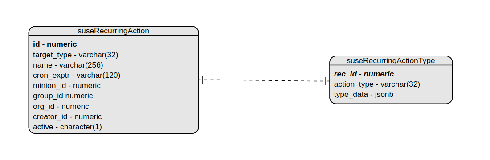

- Feature Name: Recurring Actions
- Start Date: 2023-03-01

# Summary
[summary]: #summary

Extend the recurring highstate framework to support other recurring action types.
The goal here is to have a framework that supports the implementation of currently planed action types as well as new ones in the future.

# Motivation
[motivation]: #motivation

- Why are we doing this?
Customers want to be able to further automate their workflows. Recurring highstate was one step in this direction but there are some areas that would greatly benefit from being automated.

- What use cases does it support?
Schedule recurrent execution of administration tasks that used to need manual scheduling in the past.

- What is the expected outcome?
Have a framework that allows the creation of recurrent action schedules of currently planed as well as potential future actions.

# Detailed design
[design]: #detailed-design

## General design

The existing recurring highstate framework already provides us with the bulk part of what be need for a generalized implementation. Some changes to the `RecurringAction` entity are required to make it work with multiple recurring action types. See details below.

### Database

**Solution #1:**

Create a new table called `suseRecurring<Action_Type_Name>` with the name of the action we want to support, e.g. `suseRecurringState` which has a one-to-one relationship with the `suseRecurringAction` table. The `suseRecurringAction` table would contain the data all the recurring actions have in common (independent of action type). The new `suseRecurring<Action_Type_name>` table will contain any data needed to schedule a recurring action of that type with one column of the appropriate type per parameter needed to schedule the action.

Migrate the `test_mode` column to newly created table since it's highstate specific.

An alternative way way would be to create one generic `suseRecurringActionType` table that would store the type of the action in a `action_type` column and any action specific data in a `type_data` column in json format.

Using a json type column comes with the disadvantage that we won't have foreign keys to reference the target action (e.g. `project_id` to reference its CLM project).
We don't want the recurring action schedule to persist if its related object gets deleted.

I see the following solutions:

1) Explicitly delete the recurring schedule in the objects delete function.
2) Delete the schedule if the lookup fails in the `RecurringActionApplyJob` taskomatic job.
3) Create a trigger to handle it.

This is how a trigger for the example of a linked CLM project could look like:
```
CREATE OR REPLACE FUNCTION suse_contentproject_del_trig() RETURNS TRIGGER AS $$
DECLARE project_id int;
BEGIN
  project_id = OLD.id;
  DELETE FROM suseRecurringActionType
    WHERE action_type in ('clm-build','clm-promote')
      AND (SELECT (type_data->>'project_id')::int FROM suseRecurringActionType) = project_id;

  RETURN NULL;
END;
$$ LANGUAGE plpgsql;

CREATE OR REPLACE TRIGGER suse_contentproject_del_trig
AFTER DELETE ON suseContentProject
FOR EACH ROW EXECUTE PROCEDURE suse_contentproject_del_trig();
```

The preferred solution in this case is option 1).

See ERM model below:



See [here](https://github.com/uyuni-project/uyuni/pull/6678/commits/ba13bb918c0220a9455ddf1cf2d4373c12742d3b) for a POC of the proposed entity changes.

In the end we decided to go with one new table (`suseRecurring<Action_Type_Name`) per recurring action type we want to support to avoid having to use triggers when deleting actions if using json format or having to delete the entry explicitly.

**Solution #2:**

Another possible solution is to use the `rhnAction` table to store the recurring action data.
We would create an `rhnAction` entry per recurring action without an associated `serverAction` this way the action won't get picked up by any entity
and stick around indefinitely. Since recurring actions schedule actions for a specific action type e.g. `ApplyStatesAction` for highstate / custom state we can store all the needed data in the `rhnAction<ACTION_TYPE> ` tables.

See [here](https://github.com/parlt91/uyuni/commit/8ffe1c9e79899c0eb0b58da196ca62999385b06d) for a POC that makes the current highstate implementation use the `rhnAction` to store it's `testMode` parameter.

There is one problem however:
The recurring `CLM build/promote` action we want to implement don't target a specific entity and thus we don't have an action for them.
The solution is to create a 'dummy' `ContentManagementAction` that stores the project and the environment we want to build or promote.
This action only exists for the purpose of storing the data we need to schedule recurrent runs and will never actually be scheduled on an entity (minion/group/org).

See [here](https://github.com/parlt91/uyuni/commit/ac608e7865b0d6e6eee0ff495cc886664489c86d) for a POC of the `ContentManagementAction`.

And [here](https://github.com/parlt91/uyuni/commit/898103d38e194fc1dcf4b72877d566e49f3c799c) for a POC of a working recurring CLM project build backend implementation.

### Backend

See [here](https://github.com/uyuni-project/uyuni/pull/6678/commits/61cadb982fcbdd46546ff219f658aaefa21c1f4b) for an outline on how the use of a specific entity created above would look like for the existing recurring highstate.
Recurring action type entities would be created/managed based on the action type received from the frontend.

The workflow to add new recurring action types would look like:
1) Think about which action specific parameters need to be stored to schedule the action from the `RecurringActionApplyJob` `Taskomatic` job.
2) Add a new element to the `ActionType` enum in `RecurringActionType`.
3) Add a new db table called suseRecurring<Action_Type_Name> which is used to store any action specific data from step 1).
4) Create a new `Recurring<Action_Type_Name>Type` class extending the base `RecurringActionType` class and include the parameters (including getters/setters) from 1).
5) Receive action type and parameters from the frontend (add CRUD support on the frontend for the type)
6) Add support for the action type in `RecurringActionController/Manager`
7) Make the `RecurringActionApplyJob` schedule the action.

For action type specific backend implementations see below.

This solution was evaluated to be inappropriate for our use case since using an `rhnAction` without the corresponding `serverAction` isn't how the table is meant to be used.

### Frontend

The changes required on the frontend part depend on the type of recurring action we want to implement. In general the frontend code used for the highstate implementation can also be reused for creating/listing/modifying and deleting of other recurring action types.

Some terminology changes regarding recurring actions on the frontend (and ideally on the backend to avoid confusion) are going to be required.

To clarify:
1) All `Recurring States` mentions that do not specifically mean the currently existing recurring `highstate` are going to be renamed to `Recurring Actions`.
2) All `Recurring States` mentions that related to the `highstate` are going to be renamed to `Recurring Highstate`

The list of `all` recurring actions in the main menu `Schedules` -> `Recurring States (renamed to Recurring Actions)` will be used to display all created recurring action schedules independent of entity (e.g. minion) and action type.

To support this a new column called `Action Type`(Highstate, Custom State, openSCAP, etc.) is going to be added to the list to be able to distinguish between them.

There are to improvments we want to make to the current implementation:

1) Currently the general list does not indicate for which entity the schedule was created for (only the entity type) this should be changed by adding a title to the entity type displaying the entity name as well as a link to the entity.

2) We want to show all the existing recurring schedules that affect an entity. E.g. also display relevant group and org schedules in the recurring action list of a system.

Since it not currently possible and the number of recurring action schedules is expected to grow significantly we also want to support being able to filter the list as well as implement server side pagination.

On the system level the `Recurring States` tab is currently displayed as a sub to of the `States` tab. It will be moved to the top level tabs and renamed to `Recurring Actions` since it's no longer going to be state specific.

For action type specific frontend implementations see below.

## Specific implementations

### Custom States

The idea here is to schedule a `Apply states[custom]` action on a recurring basis. 

**Iteration #1: Recurring config channels**

The backend part can be implemented simply following the workflow described above. The order and which config state channels to execute can be stored as an array in the `type_data` column.

For the frontend I'd suggest to add a `Create Recurring` button on the `Configuration Channels` page on System / Group / Org level similar as it was done for `Highstate`.
The frontend pages for the highstate scheduling can be reused as they are and just pass/receive a `customstate` action type to/from the Controller class.

When creating a recurrent config channel execution the user needs to be able to configure which states to run and in which order. We can reuse the UI from `System` -> `States` -> `Configuration Channels` here.

If there is still time we can proceed with the 2nd iteration.

**Iteration #2: Custom states**

We want the user to be able to define their custom state to run based on both config channels as well as on states stored on the `salt-filesystem`.

For this to work on a recurrent basis we need to rework the `States` -> `Configuration Channels` UI first to include custom states and `static SUMA integrated` states.

I suggest the following approach:

1) Retrieve a list of available states. This can be done through `salt-run fileserver.file_list`. It's output is also available in the java code through the `salt-netapi-client`.

The list would look similar to:
```
- SR-IOV/init.sls
- _beacons/pkgset.py
- _grains/cpuinfo.py
- _grains/virt.py
- _modules/kiwi_info.py
- _modules/kiwi_source.py
- _states/bootloader.py
- _states/mgrcompat.py
- _states/mgrutils.py
- actionchains/force_restart_minion.sh
- actionchains/resumessh.sls
- actionchains/startssh.sls
- ansible/init.sls
- ansible/mgr-ssh-pubkey-authorized.sls
- ansible/mgr-ssh-pubkey-authorized.yml
- ansible/runplaybook.sls
- bind/files/arch/named.conf
- custom/custom_07ab3bbb1ebe2cba154cdb7862cbfdac.sls
- custom/custom_09f62203a137b29345a35c6c62cbfdaa.sls
- custom/group_10.sls
- custom/org_1.sls
- dhcpd/init.sls
.
.
.
```

To retrieve the available states from it we need to:
  - to only include `.sls` files.
  - if it's an `init.sls` file take the directory name
  - Otherwise take the filename (without the `.sls`)

2) We need to come up with a blacklist of states that we want to exclude. E.g. states in `custom/` since those are the config channel states.

3) Implement new UI to select states from the list of states and config channels and allow to reorder them.

4) Add backend support to schedule apply states based on the list. A handler method that supports this (`SystemHandler.scheduleApplyStates(User loggedInUser, Integer sid, List<String> stateNames, Date earliestOccurrence, Boolean test)` already exists).

To make it work with recurring schedules:

1) Implement UI to allow defining a custom state list when creating a recurring schedule (using the UI implementation above).

2) Store the resulting list as an array in the `suseRecurringActionType.type_data` column.

3) Support running custom states from a list in the taskomatic job

### Content Lifecycle Management

Recurring CLM management will work a bit different compared to other recurring action types since we don't have an entity here for which an action will be scheduled.

To make it work I propose to create a new entity that could be called `NoEntityRecurringAction` it would set a new `target_type` `no-entity` in the `suseRecurringAction` table and still use the `org_id` as identifier since CLM project are bound to organizations.

In contrast to the `OrgRecurringAction` this type would not calculate the orgs minions though since it's not required here.

Two new action types `clm-build` and `clm-promote` would be supported (including `RecurringContentBuildType` and `RecurringContentPromoteType` entities).

The `suseRecurringActionType` table would store a reference to the project (project_id) for the `clm-build` type and in addition a reference to the environment (env_id) to promote for the `clm-promote` type.

The `RecurringActionApplyJob` `Taskomatic` job would then call the functions to build/promote a CLM project on recurrent basis.

On the frontend side I'd suggest to add a new main menu item called e.g. `Recurring Lifecycle Management` in `Content Lifecycle` (below `Filters`).

Here a list with existing recurring CLM build/promote schedules would be displayed as well as a button to prompt to create new schedules.

The create page would add new input fields to select the project, the type (build/promote) and the environment to promote (if chosen).

### Action Chains

For Action Chains to work with recurrent application some changes to the current Action Chain design will have to be made:

1) They need to be persistent/reusable (currently it gets deleted once execution of the last action was completed).
2) We'd need the ability to schedule generalized actions e.g. apply all currently available security updates to a system as opposed to apply a specific set of security updates (that happen to be available on the system at the time of scheduling).

Further research on how to make the above work (if desired) should be done in it's own dedicated RFC due to it's expected complexity.

Once Action Chains operate in before mentioned way they can be implemented for recurring execution in the same way:

1) Create a `RecurringActionChainType` entity.
2) Add an `action_chain_id` column to the `suseRecurringActionType` that would reference the `ActionChain` object.
3) Add backend support for the ActionChainType.
4) Adapt the `RecurringActionApplyJob` `Taskomatic` job to support the type.
5) Allow CRUD operations to be performed on the frontend side.

Recurring Action Chains could be accessed from the main menu `Schedule` -> ` Action Chains` -> `Recurring (Action Chains)`.

### OpenSCAP scans

To make openSCAP scans work properly with recurring actions we need to be able to create persistent openSCAP scan profiles that would be reused on every action execution. Currently openSCAP scans can be scheduled using a set of parameters and rescheduled only from the results of a previously performed scan.

These profiles should also be able to apply to entire system groups and orgs to make recurring schedules on group/org level work.

The `suseRecurringActionType` table would then only need to include an id referencing the openSCAP profile entity.

The rest of the implementation would work similar to other action types.

### Ansible Playbook execution

A recurring playbook execution would be a minion recurring action scheduled on the minion that's configured as `Ansible Control Node`. Scheduling a playbook execution requires 4 parameters:

1) playbook_path - The path to the playbook we want to execute
2) inventory_path - The path to the configured ansible iventory
3) test_mode - If we want to schedule a test execution
4) flush_cache - Whether the ansible cache should be flushed

These parameters would be stored for a `RecurringPlaybookType`. Otherwise we would just follow the workflow described in the backend section above for implementation.

The frontend entry point for the recurring playbook execution CRUD operations could be located at `System Details` -> `Ansible` -> `Recurring (Playbooks)`.
Here we would ask the user to provide the playbook they want to schedule for recurrent execution, the test mode parameter and whether the cache should be flushed.

## Traditional Clients

Even though traditional clients technically support openSCAP scans as well as action chains. I propose not to implement any recurring functionality for them. We want to stop supporting them and incentivize users to migrate to salt minions.

## Maintenance Windows

For recurring action scheduling to work properly the schedules needs to be aligned with existing maintenance windows on the clients. Otherwise the action is not going to be scheduled with the exception of actions allowed when the system is not in maintenance mode (openSCAP scans).

## XMLRPC / HTTP API

We already have a `RecurringActionHandler` that can be expanded to support other action types.

I see two possibilities two implement new functions:

1) For each type implement individiual CRUD function that states the action type in its name. E.g. `RecurringActionHandler.createCustomState(...)`. This is essentially just a wrapper that calls the generic `create` function with the action type as a parameter.

2) Have one CRUD function for all the types and pass the action type as an argument.

Option 1) could be more intuitive to use and its function would be clear just by reading its name, but add a lot of extra API endpoints that all call the same underlying base function, so option 2) would be less overhead.

In the end I don't have a strong opinion which approach to take.

# Drawbacks
[drawbacks]: #drawbacks

## SSM

There are two ways recurring actions could work with SSM. However both come with significant downsides.

1) Creating a recurrent action via SSM will schedule a `MinonRecurringAction` for every selected minion. This would schedule one `Taskomatic` job for every minion that would be scheduled to run at the same time.
Needless to say this would set us up for disaster and overwhelm `Taskomatic` if done with more than a few minions.

2) Create a new `SSMRecurringAction` entity that would remember the Minions selected for the schedule by creating a db table e.g. called `RecurringSSMMinions` with a one-to-many relationship with the SSM entity. This way entries would be updated properly if a system is deleted (given it's configured properly with a foreign key and delete cascade to the minion).
This way we could have one `Taskomatic` job that would perform the action for all the minions it was created with.

Each SSM action could be displayed in the minions recurring action list. Updating/Editing the action on minion level would either be forbidden or update it for all the minions it was created for. 

However adding/removing minions from an existing SSM schedule would require implementation of dedicated UI to support.

In the end I'd advise against supporting recurring actions with SSM. We would map something that's designed to be not persistent (SSM selection) to something that is (Recurring Action schedule). 

Users are able to select minions via SSM and then create a system group with selected minions. That group can then be used to create recurring schedules.
If there are traditional clients among the SSM selected system the recurring schedule will just ignore them.

# Alternatives
[alternatives]: #alternatives

# Unresolved questions
[unresolved]: #unresolved-questions

**Question:** With the ability to schedule workflows on recurrent basis, the load on Taskomatic is expected to increase. Especially if there is a loot of schedules with frequent recurrance. Some actions the customers used to schedule manually are going to be perfomed automatically and thus most likely more often.  Is taskomatic up for the task?

