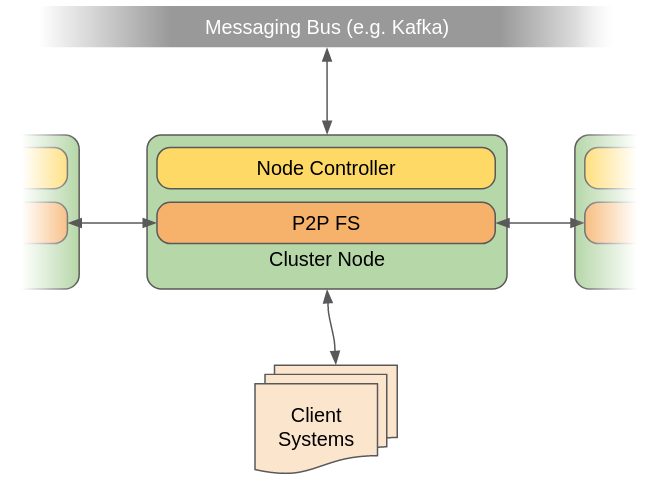
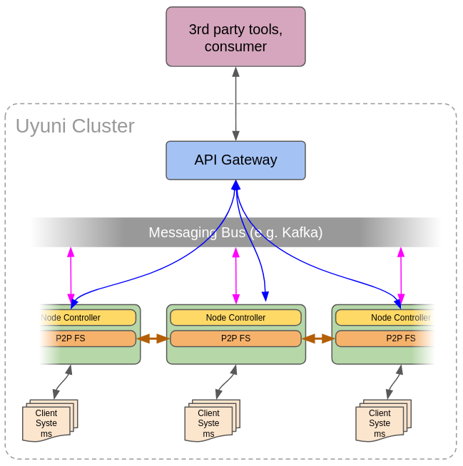
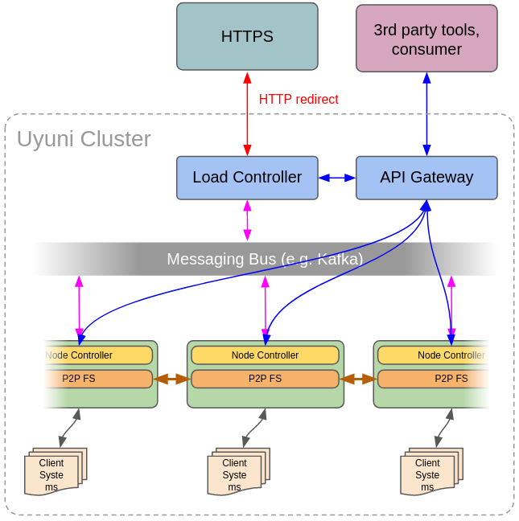
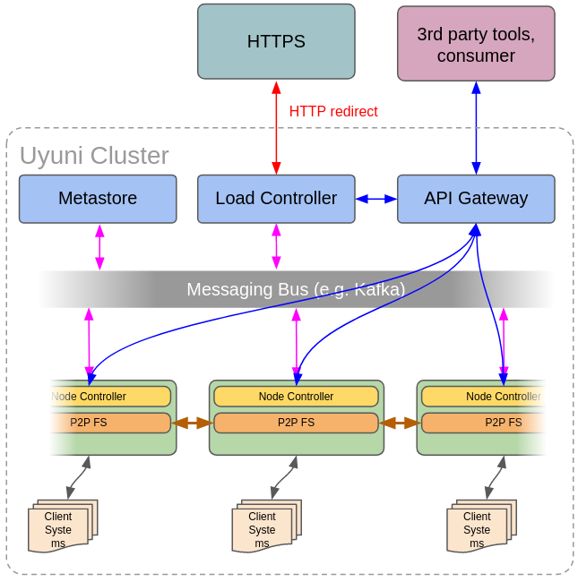

- Feature Name: Uyuni Cluster Extension
- Start Date: 2020-01-14
- RFC PR:

# Summary
[summary]: #summary

## Outline

This RFC is an architecture overview of Uyuni Cluster Extension. The Uyuni Cluster Extension is an external event-driven system which orchestrates an unlimited set of existing Uyuni Server into a single logical unit. The final result should be suitable to scale out for enterprise environment and/or retails in a matter of configuration and deployment type.

## Limitations

This proposal is meant to take Uyuni Server to the next level of performance and scalability, which is unusual for the existing, traditional monolithic Uyuni Server solution. Therefore this comes with a price of possible stripping down some features, known for traditional Uyuni Server, once it is running in a cluster mode. No features should be removed from an Uyuni Server, if it is not running in a mode of being a Cluster Node.

# Terminology

- **Uyuni Node**. A standalone, typical Uyuni Server (Uyuni Manager or Proxy) running as a member node of a cluster. It possibly has less functionality as standalone setup. The functionality is identical to a traditional setup with registered Client Systems machines. Cluster Node meant to run purely automatic and being remotely controlled.
- **Client System**. Any managed system in the Data Centre. Any supported physical or virtual machine or device that possibly can be managed by an **Uyuni Node**.
- **Node Controller**. Microservice, preinstalled on each **Uyuni Node**. It acts as a proxy between Uyuni Server components and the cluster and bi-directionally bridges Uyuni Server to the entire cluster via messaging bus.
- **Load Driver**. Cluster orchestration core. Highly available microservice, which keeps the topology of the entire cluster, orchestrates it and ensures the integrity of it.
- **Metastore**. Data storage for the Load Driver. It is a distributed key/value store to keep all Cluster Nodes metadata _about_ them. It also keeps metadata about particular Client Systems, such as channel assignments, keys, history, actions etc.
- **API Gateway**. Is a microservice, which provides API to the entire cluster over the REST or XML-RPC (should be deprecated) protocol and is 100% backward-compatible with an API, already available for a single traiditional Uyuni Server setup.

## What Uyuni Cluster Extension Is Not

- Although while it provides high availability feature in certain ways, Cluster extension **is not HA (High Availability) feature**. High Availability is **not** about horisontal scalability (scaling out), where scale of the appliance is based on the primary node and load is not distributed to the replica server, because it has only purpose of failover.
- **Cluster extension is not about Performance boost.** Although certain setup sometimes might help to speed up a performance abit for a specific Cluster Node by taking away load of it elsewhere, yet the solution is not about speeding up the performance, but scaling out traditional Uyuni Server and keeping it as a **single logical unit**.

# Motivation
[motivation]: #motivation

According to the existing released architecture as of today, the Uyuni Server:
- ...unable to scale-out with unlimited amount of client systems. Currently, a comfortable limit of registered systems are about 15.000 units with a push to 20.000 units maximum on a beefy hardware.
- ...is not cloud native solution. It cannot be deployed on Kubernetes platform or shipped in a container.

The primary goal of this proposal is to solve these unresolved problems.

# Scaling-out Uyuni (definitions)

The list of definitions that must be met if scaling out the Uyuni Server:

- Uyuni Cluster must be used and feel like a single logical unit, preserving administrative, functional, geographic and load scalabilities. It should not feel like a chain of various Uyuni Servers, each one is managed manually and separately on its own.
- Must provide 100% backward-compatible API, ensuring no existing 3rd party tools are broken or need a major rewrite.
  > **NOTE:** if there is inevitable incompatibility (e.g. some of XML-RPC API are no longer synchronous), there should be a clear migration roadmap.
- Once new nodes has been added to a cluster or removed from it, utilising their resources must be linear and fully automated. No extra manual work of re-registering Client Systems should ever be done other than the usual as of traditional setup of Uyuni Server.
- Must grow linerly to the infinite, unlimited nodes. Must have no "maximum expected number" limitations in the specifications.
  > **NOTE:** in reality "linear" is not always fully linear, however it should be at least with a very small deviations.
- Should not generate big amount of extra-work to manage the cluster nodes other, than it is usually needed to administer cluster machines. This especially important if the cluster grows excessively large. All nodes should be fully automated and no extra manual work needs to be performed in order to run them in a sync.
- Must meet RTO/RPO limits of an SLA during failures and/or maintenance operations.

## Requirements Summary

Some of [the general requirements](https://github.com/uyuni-project/uyuni-rfc/blob/master/accepted/00060-hub-general.md) as summarised:
- Cluster extension **should preserve compatibility** for all operating systems supported by Uyuni.
- Uyuni Cluster should be able to be **deployed in a containers**, e.g. in Kubernetes environment.
- Should fit to large Data Centre as well as large Retailer scenarios in a **matter of configuration**.

# DISCLAIMERS
[disclaimers]: #disclaimers

## Use Case Dependencies
[use-case-deps]: #use-case-dependencies
This architecture design, proposed in this very RFC **is not dependent** upon any specific use cases that would affect infrastructure layout.

## Main Requirements Changes
[main-req-changes]: #requirements-changes

Any currently known use cases, such as running one central console to keep overview of all registered  _Client Systems_ (e.g. Proxies for Retail), or running a general enterprise in a Data Centre where _Cluster Nodes_ are horisontally added to handle more _Client Systems_ — **none of [the main requirements](https://github.com/uyuni-project/uyuni-rfc/blob/master/accepted/00060-hub-general.md) should be reduced or in any way affected**.

Ideally, Uyuni Cluster should be able to deploy Cluster Nodes (single Uyuni Servers) on Kubernetes infrastructure.

# Main Cluster Components
[design]: #detailed-design

General description of Cluster components and are their roles in it.

## What is Uyuni Cluster Extension?
[what-is-uyuni-cluster-extension]: #what-is-uyuni-cluster-extension

In a nutshell, Uyuni Cluster Extension in principle can be thought as a separate independent event-driven external system, which integrates and manages traditional monolithic Uyuni Servers as Cluster Nodes, organising them into a single logical unit, that performs and feels like such.

## Overview
[overview]: #overview

Conceptually, Uyuni Cluster is a P2P layer "on top of" at least one traditional Uyuni Server where whole communication is based on events via messaging bus and various type of data is stored on a distributed storages. Therefore adding another Uyuni Server as Cluster Node would mean to add a full clone of the node, from which the new one is provisioned or joined, except without the registered Client Systems.

The entire Uyuni Cluster is master-less and doesn't have a special dedicated Uyuni Server which would be an etalon object in a system. Instead, cluster elects a **Leader Node**, which would affect all other cluster nodes. All Cluster Nodes in the system meant to be identical by sharing all the same information about channels, subscriptions, be equally sychronised (`reposync` etc), except the very data about registered Client Systems, which is always should be unique to each Uyuni Node.

Additionally, Uyuni Cluster has few more services, such as Node Controller, Load Driver and API Gateway. Each of those are performing on their own.

### Node Controller

Node Controller is a microservice, preinstalled on the same corresponding Uyuni Node, acting as a proxy between the traditional Uyuni Server and a message bus of the whole cluster. Its main function is to create a bridge between all Uyuni Servers events and notify the whole cluster about any changes on that Node, once they were made.

_Figure 1_

### API Gateway

Traditional Uyuni Server provides API over XML-RPC protocol. These APIs allows control Uyuni Server remotely. Uyuni Server also runs a Salt Master, which is involved to control remote Client Systems, assigned to that particular Uyuni Server.

The job of the API Gateway node is to join all Cluster Node APIs into one 100% compatible "bouquet" to all of them and provide an FQDN for 3rd party tools connectivity to remotely control the entire cluster as one single logical unit.

API Gateway should multiplex many inputs from many Cluster Nodes into one single-dimensional output and provide to the 3rd party components. It also should do the reverse: receive single input and demultiplex it back to many Cluster Nodes. In this way this provides 100% API backward compatibility **[1]** so peripheral components, such as `spacecmd` would just work as is without any modifications.

Additionally, it should provide REST gateway for XML-RPC API, so the same identical XML-RPC APIs can be accessed also through the REST protocol just under different namespace **[1]**. Also API Gateway should serve OpenAPI UI (also known as Swagger UI) for interactive API documentation **[1]**.

Another, new set of APIs should be added to the API Gateway, which breaks the design limitations in the original XML-RPC APIs: operate in millions of machines across the entire cluster over multiple Uyuni Nodes.

_Figure 2_

______________

> *[1] This was already demonstrated fully working during SUSE Manager Winter Summit 2020: `spacecmd` could fully run accessing multiple Uyuni Server nodes at once. The `spacecmd` utility was running over the REST protocol, thanks for drop-in `xmlrpclib` Python replacement, that kept the entire code intact. Additionally, fully working Swagger UI was generated for all existing XML-RPC APIs of Uyuni Server and all Salt's endpoints.*

### Load Driver

Load Driver is a core director of the Cluster. It is standalone, higly available and high load capable microservice. It runs on its own and communicates with the rest of the cluster via messaging bus **[1]**. Load Driver provides the following functionality:

- Keeps topology of the entire Cluster
- Keeps loading statistics of each Cluster Node
- Assigns Client Systems to the Cluster Nodes
- Elects Leader Node of the Cluster
- Provides API endpoints for all Client Systems for heartbit and orphaned machines management
- Provides REST API to search and perform certain operations on Cluster Nodes
- Provides main entry point to the whole Uyuni Cluster
- Provides authentication login screen and redirects user to the Cluster UI app on a Leader Node

Load Driver's API are running behind the API Gateway, so the 3rd party consumers are always accessing the same entry point, just with different namespaces.

_Figure 3_

---------

> [1] The messaging bus component can be any of typical MQ type. Recommended is scalable-out Apache Kafka with millions of messages per a second performance.

### Metastore

Last in the picture is the Metastore component. This component runs a distributed transactional key-value database and connects it to the rest of the Cluster over messaging bus. It has similar functionality as `etcd` in Kubernetes: to store all its data, like configuration, state, metadata etc. It also stores all the data about each Client System, so later Cluster is using this data to restore/remap that system elsewhere.

For scalability reasons, primary choice for distributed data storage component is [TiKV database](https://tikv.org), a member of [CNCF](https://landscape.cncf.io).

_Figure 4_

### Serving Metastore, Load Controller, API Gateway etc

Components, such as Metastore, Load Controller, API Gateway, Apache Kafka ZooKeeper etc, they are essential components to orchestrate the whole cluster and they typically require their own node[s]. All of the components may run on the same nodes, making a "control cluster inception" for mainly high availability and also horisontal scalability.

## Cluster Internals

Essentially, Cluster Node (a traditional Uyuni Server) contains a meta-data tracking about channels, packages, patches (errata), content management and systems, where and how they are connected, updated and their history. It is also a proxy-cache of the synchronised packages.

Therefore in terms of provisioning and "adding a new cluster node", there are two cathegories of a data, taken from the Leader Node:

- Internal, node-specific data (systems)
- Common data (everything else)

Because Cluster should literally resemble (or "inflate") Uyuni Server into one logical unit, in this Cluster design everything is treated as a common data and thus is a subject to be replicated/synchronised with all other nodes, so there should be no differences between the nodes in the content and synchronised packages. That said, each node should have identical:

- Synchronised packages in `/var/spacewalk/packages/...`
- Channels structure and content management
- Images etc.

The only node-specific data, which is **not** synchronised is all the information about specific Client System(s). So when the new Uyuni Node is joined the Cluster, it should have all the data and contain zero registered systems.

**Required change to the traditional Uyuni Server:**

- `reposync` should be able to fetch data from P2P distributed file systems, like [IPFS](https://ipfs.io) where file is not yet present on the node, unless demanded. This is easiest way, because it would still "download RPM" but not from the external URN, but from the P2P filesystem. The rest of the sync would be just identical. In case of SUSE Enterprise Storage (SES) is used, then `reposync` should be able to work in "refresh" mode, where it should be able to reconcile physical packages, which are not found to be linked in the local database (but they _are already available_ in the SES cluster, because once already sync'ed!).

Recommendation is to use P2P filesystem (e.g. [IPFS](https://ipfs.io) or [HDFS](https://hadoop.apache.org/docs/stable/hadoop-project-dist/hadoop-hdfs/HdfsDesign.html)) as they would be easier to integrate with the `reposync`.

SES cluster should be also an option to utilise.

### Integration

The essense of the Cluster Extension solution is event-driven Uyuni Server.

Uyuni Server should have implemented events emitter on whatever change action it does and receiver to act accordingly (partially it is already done using Salt event bus). These events will allow to unite all Cluster Nodes into one system, notifying each other of CRUD operations on certain data.

**Required change to the traditional Uyuni Server:**

- Add events emitter to the Uyuni Server core. One way of doing it, is to add a series of independent triggers for PostgreSQL, using `LISTEN` and `NOTIFY` commands ([detailed documentation](https://www.postgresql.org/docs/9.2/sql-notify.html)). Any changes to the specific areas would generate an event, which would be read by Node Controller and thus integrated with the rest of the cluster.

### Re-/registering Systems

Registering and distributing Client System is done by Load Driver, which keeps the entire topology of the cluster. Load Driver should have two modes:

1. Production distribution
2. Disaster recovery / upgrade

In "production distribution" mode, Load Driver is using distribution algorithm to equally load all Client Systems to all Cluster Nodes as they are added to the cluster. This may result to un-registering already registered Client Systems and moving them elsewhere to other Cluster Nodes, adding new Client Systems etc.

In "Disaster recovery / upgrade" mode, Load Driver is reusing map of the same Cluster Node, once it is restored or upgraded, readding orphaned systems to only that Cluster Node without "re-shuffling" the rest of the Client Systems.

Uyuni Cluster should be able to onboard systems just like normal, traditional Uyuni Server. But also Uyuni Cluster should be able automatically re-add once already registered systems in case one of the Uyuni Nodes (Uyuni Server as a node) experiences outage.

Essentially, when Client System is registered, all the data _about it_ is also duplicated to the distributed database across the entire cluster, making whole Cluster aware of that Client System, no matter to what Cluster Node it is registered. This includes keys and other metadata, such as actions history. This will allow Cluster UI to search for it and find out where exactly it is registered and forward user to that Uyuni Node UI for further work. Once Client System is marked as an **orphan** (see below), it returns back to the Cluster onboarding FQDN entry point, but automatically accepted, because keys to it already known. Then the rest of the meta-data is re-applied to that system (updated actions history, subscribed channels etc).

**Orphaned Client Systems**

An orphaned Client System is a Client System, which is registered and is known to the cluster, but temporarily is unattached to it due to multiple reasons (node upgrade, node outage, disaster recovery etc).

In principle, the Uyuni Cluster knows about orphaned system status and prepares a place for the reonboarding at unspecified time, but it is up to orphaned system to find its way back. And orphaned system can be also temporarily shut down on purpose. Uyuni Cluster should not drop offline Client Systems as permanently gone, unless they are manually unregistered.

Each Client System has a heartbit-emitting daemon to the Cluster via Load Driver, sending its key fingerprint once a while. Cluster responses to the system by fingerprint ID just its status of one byte payload integer answer:

- New
- Onboarded
- Orphan (onboarded, detached)
- Deleted (at this point daemon stops client services like Salt or OSAD etc and terminates the heartbit pulse)

Local UI or remote API may remove system (unregister) but that doesn't make it deleted, because the Cluster will be still aware about the accepted key, which puts the system to the status "orphan". At that point internal daemon of the Client System will keep "knocking" to the Cluster's onboarding FQDN to re-add it back. Systems should be only deleted (permanently banned) from the Cluster UI by key fingerprints.

Client daemon is also responsible to reconfigure local services against the particular Cluster Node. A typical onboarding process is as simple as following (Salt version):

- Client daemon is "knocking" to the main onboarding FQDN of the Cluster, e.g. `https://mycluster.local/system/status`, getting response as "new".
- Admin seeing that machine in a machine pool from the Cluster UI app.
- Admin accepts the key of the machine from the Cluster UI (not from the Uyuni Node!).
- Client daemon gets the response as "orphan", so immediately calls the onboarding FQDN API to ask Load Driver what real Cluster Node is the final place, e.g. `https://mycluster.local/system/orphan?fp=de:ad:be:ef....`
- Client daemon gets the response `node42.mycluster.local` of yet another Uyuni Server as its final destination.
- Client daemon resets `/etc/salt/...` configuration to `master=node42.mycluster.local` and re-/starts Salt Minion.
- Uyuni Node `node42` should automatically accept the system (the key was already confirmed by Cluster) and run typical Salt states on it as usual.

Client daemon re-adding orphaned machine in the following way:

- Calling API on `https://mycluster.local/system/status` by a fingerprint, responds e.g. `orphan`.
- Client daemon shuts down Salt Minion (there is no point of producing CPU heat).
- Client daemon calls `orphan` API (see above) with the fingerprint. At this point Cluster may delay the answer and respond with no FQDN. So client daemon should keep "knocking".
- Once a new space is ready, Cluster responses to the orphan node with a new Uyuni Node FQDN, e.g. `node66.mycluster.local`.
- Client daemon resets `/etc/salt/...` configuration to `master=node66.mycluster.local` and re-/starts Salt Minion.
- Uyuni Node `node66` should automatically accept the system (the key was already confirmed by Cluster) and run typical Salt states on it as usual.

The same "orphans process" is used to remap systems, once Cluster got a bigger space and decided to run the Client System on another Cluster Node for a better load balancing.

**IMPORTANT**: *Current Uyuni Node is not elected as a cluster Leader Node, if changes are only done to a Client System(s) e.g. package installations, channel subscription, general update, OS migration etc.*

**Required changes to the traditional Uyuni Server:**

- Implement Uyuni Server (Cluster Node) shutdown awareness. Cluster should know if it's Cluster Node experiences a disaster or is it a planned shut down. In case of a disaster, there should be a reasonable timeout, after which Load Driver service will force to remap all the registered Client Systems across the entire Cluster, removing them from the current Cluster Node and dropping that Cluster Node away as faulty from the Cluster topology. Even if the Node is back (e.g. it was a long time network problem), still that Node already was dropped as faulty. In this case it should just go through the typical "Node onboarding" process: flush all the local storage, get a dump of the PostgreSQL database from the nearby P2P node, remove all Client Systems and sync everything. This process will also notify the administrator of cluster change and let him decide if he further wants to rely on that Cluster Node or not.
- Cluster mode should disable Salt onboarding UI and auto-accept system, as long as the key is matching and Salt Master accepted it.

**Required changes to the onboarded system (Salt-driven and traditional):**

- Implement cluster-awareness daemon which controls the rest of the components (Salt and/or traditional client).

Figure 2

### Cluster UI

Cluster UI is a single-page app, summarising the entire overview of the Cluster in a whole and is accessible from the main FQDN entry of the Cluster, e.g. `https://mycluster.local/` but is available on _each cluster Node (!)_ as is. After a login on the main URL, user should be actually redirected to the elected Leader Node, e.g. `https://node42.mycluster.local/` but omitting traditional login screen (user was already authenticated), landing page on the single-page app in this case. In this way Leader Node is guaranteed elected before anything else had happened. This UI is a part of a standard Uyuni UI, but visible only in Cluster Node "mode".

Everyone else should use main FQDN of the Cluster, and thus will login to the same `node42`, unless it was already demoted from Leader Node status by Load Driver service.

An admin is free to change anything on the Uyuni Node by just switching to another tab as usually it is done. If it was just a regular system(s), then nothing else should happen. However, if anything else was changed from the common global data (e.g. another channel or product has been added), then returning to the Cluster UI, admin should be able to apply the state to the entire cluster.

#### What Cluster UI does differently?

The main difference between Cluster UI and traditional Uyuni Server UI is that Cluster UI is meant to show all the systems in the cluster, while traditioal Uyuni Server UI supposed to show only those systems that are actually registered against that particular Cluster Node. Since scaled-out system supposed to drive literally millions of systems (or whatever more), Cluster UI should be a sort of "local Google" to the systems, utilising typical FQDN matching for names or tags or any other system properties, e.g. `tag:db` or `tag:trading` or `tag:my-cloud` or `web*.acme.org` or `group:ubuntu-18-lts` or something similar to Salt's compound matching etc., and then return all the systems, that matches that. This UI should query the entire cluster across all the Uyuni Nodes at once via **API Gateway** service. Once machines or any other entities (like small clusters of storages or databases etc) are found, general operations should be possible to perform on them (via API Gateway). To view a particular machine, an admin should be able to select it in the Cluster UI and thus be forwarded to that particular Cluster Node on that system's landing page to view the details of it.

The Cluster UI should also display a pool of machines for onboarding, where that "tagging" or grouping actually should happen.

### Handling Concurrent Edits (collaborative mode)

Login to the cluster should be available only through the main entry point (central Cluster UI). Login to a separate internal Cluster Node directly should be forbidden, but actual access should be available only through forwarding from the main Cluster UI. That said, Leader Node is automatically elected by Load Driver node as long as **at least one session is active** (including live API sessions).

Since anyone else can login to the cluster and thus start modifying other node in a cluster, this will cause a major conflict, once changes are applied. Load Driver node is a cluster service that is meant to keep the topology of the entire cluster and elect Leader Node.

Due to the limitation of current Uyuni Server architecture, where all the changes are directly written to the Database, concurrent edits on different cluster nodes should be impossible to make, but should be done only on the same node.

That said, if another administrator logs in through the Cluster UI in order to add some channel or update Content Management, he should be redirected to the currently elected Leader Node, which is also in edit mode.

User Interface of the Uyuni Server should utilise internal messaging, notifying by pop-up at any point that someone else is also logged in for editing current node. Later on, since Uyuni Server should have internal events, on that might be implemented a history log on the UI side, streaming messages which user currently edited what part of the node.

The modified Uyuni Node considered a pattern, from which all other nodes will be updated. Applying cluster changes should be done in two ways:
- If there is only one user, he can click a button "Apply cluster update".
- If there is more than one user editing the Cluster Node which is Leader Node, the Cluster should require only one active admin session to avoid half-baked state to be applied everywhere.

Once state is put to cluster's queue for applying it across all the Cluster Nodes, the current Leader Node is demoted to a normal state by Load Driver.

**Required change to the traditional Uyuni Server:**
- Implement Single Sign On. Login by unique session ID in URL would be one of the way to do it. In "cluster mode" direct logins to the Cluster Nodes should be disabled and visiting login page of the Uyuni Server should result redirecting user to the login page of the main Cluster UI instead.
- Implement UI segregation. Parts of UI that do global changes (not Client System's related) should dynamically became unavailable, once Leader Node was elected elsewhere. This may happen when current admin is changing only Client System. In this case Cluster Node is **not** elected as a Leader Node, but admin is already logged in and still can try adding a new channel or a product etc. In case Leader Node is already elected elsewhere by someone else, this part of UI should be unavailable. The same applies if even Leader Node is elected, but other admins are still managing some systems elsewhere. In that case they should be able to see only Systems-related UI and that local Node-related UI.
- Implement "Cluster UI" tab, which essentially will do nother but forward browser to the central Cluster UI, from which currently elected Leader Node should be accessible.

## Cluster Management

One of the key from [earlier mentioned requirements](https://github.com/uyuni-project/uyuni-rfc/blob/master/accepted/00060-hub-general.md) is "administration of servers simplified", such as:

- automatic application of schema upgrades
- automatic creation of bootstrap repos
- database backups via Taskomatic (supposedly automatic)
- automated server configuration
- etc (automated)

Uyuni Cluster Extension is designed as P2P system without a special "master server" to provide **fully automated** Cluster Node management and is based on a principle "No upgrades". Every Cluster Node is upgraded via "disaster management": i.e. full re-provisioning.

### Entire Cluster Update

Any cluster update (and upgrade) to a newer versions isn't as same as upgrading a single standalone Uyuni Server. Each components of a cluster should be upgraded in a specific order, and at the end upgrading all Uyuni Server nodes.

As a main rule, because of Uyuni Cluster Extension is an external from Uyuni Server system, it should be always backwards-compatible to all supported Uyuni Server systems and be also upgraded first. The rest of the cluster should be upgraded from the Uyuni Cluster Extension. Upgrade should be proceeded in this order:

1. Load Driver
2. API Gateway
3. Client Systems cluster-awareness daemons (if needed)
4. Each Cluster Node

This process is also should be valid to a major version upgrade.

### Cluster Node Updates

Maintenance updates of a Cluster Node should be no different from the current process of a single Uyuni Server.

### Cluster Node Upgrade to a Major Version

Upgrade to a major version should be done isolated in parallel and not from upgrade, but through a fresh installation in the following order:

1. A fresh new virtual machine should be provided with basic OS
2. New major version of Uyuni Server should be installed and switched to a cluster mode (i.e. utilising P2P filesystem etc)
3. Common content should be exported from an existing elected Leader Node of older major version and replicated on the new fresh Cluster Node. This should end up with a new major version node, containing all the products and other properties, required in the current cluster.
4. An older Cluster Node should be turned off. Orphaned machines should be automatically re-registered to a new node. In this case Load Driver is using "Disaster recovery / upgrade" approach of remapping Cluster Nodes, so the rest of the cluster topology should be left intact.

Step 3 and 4 should be repeated on every Cluster Node. It depends on hardware capabilities how many new nodes at once can be re-provisioned.

### Disaster Recovery and SLA

ITSC of Uyuni Cluster is not relying on a single Uyuni Server of RTO and RPO measures. In contrast to a monolithic traditional designs, users might even not notice outage of certain Cluster Node, because the Client Systems might be already simply remapped elsewhere. Same should be valid (to an extent) for the data loss recovery, which blocks of it supposed to be replicated across the whole Cluster Zone (see below) at least several times.

The SLA would depend on a physical size of a cluster.

## Cluster Zoning

Cluster Zones comes handy when different scenarios are considered, such as "Enterprise Data Centre" or "Retails".

Essentially, "cluster zone" is just a logically segregated group of Cluster Nodes, where the common content data is not shared between the zones. The use within a large Enterprise Data Centre would mean one or few zones and many Cluster Nodes per a zone, while use withing a large Retail Stores would mean many zones and one or a few Cluster Nodes per a zone. The advantage of scaling out for Retail Stores is that cluster allows to add on demand more power per a retail Store, once it is required, and is not limited to just one Uyuni Server machine.

All the logic of zoning is covered by Load Driver, which is responsible for cluster topology. Load Driver should define segregation boundaries what Cluster Nodes belongs to what zone and how internal distributed storage is sharing what data.

## Content Lifecycle Management (CLM)

Lifecycle Management should be exportable/importable like a document with "Save As" fashion. Essentially, it should be made in a separate session and exported then into serialised form (XML, JSON etc) and then imported elsewhere.

> **NOTE**: Currently Uyuni Server cannot do this as the data is written directly to the database. However, it is not technically difficult to make it exportable/importable.

As long as Leader Node is elected, an admin should proceed with CLM as usual, but then export it and apply to a cluster zone. The flow should be as follows:

1. User should be able to create Content Lifecycle Project as usual on any Uyuni Server (Cluster Node)
2. After adding sources to the project and stages, Project is serialised into importable form (say, CLM Document) and is distributed across all Cluster Nodes within current zone. Each update ("Save" action) would just update that CLM Document.
3. Once CLM process is finished, it should be actually applied, where cluster will send a message event to all Uyuni Nodes to apply CLM Document on each Cluster Node.

In this way CLM process is also outage-proof, as long as edited Zone contains more than one Cluster Node.

## Integrity Handling

There are multitude of reasons why one or another Cluster Node goes off the sync from the rest of the cluster and behaves wrong. Most of the time this happens due to a bad administration practices where manual intervention is happening.

There is no a single way of resolving this. In some times a warning of faulty Cluster Node is enough (depending what part is out of sync) and a little fix would do. In other times more stricter actions needs to be taken. Fully automated reliable self-healing is the main idea of Cluster Extension. But it also comes with a much bigger cost. Essentially, restoring a Cluster Node would mean entirely killing it, orphaning all the registered Client Systems, and thus re-provision and re-sync it from scratch again. In most cases this is the only reliable way of self-healing it: resetting everything to a vendor-provided defaults.

In any case, Uyuni Cluster Extension makes automatic re-provisioning of a Cluster Node cheap (except the performance is expected to be reduced for a while). Unless traditional Uyuni Server alone has much cleaner internal codebase and more solid functionality, wiping everything and reinstalling from the beginning might be an ultimate way for now. Especially it makes sense if Cluster Node is deployed on Kubernetes platform. In this case rerunning container is the most reliable way.

# Testing

## Approach

Clusters aren't simple. They do depend on variety models and each setup may affect one of those by distance, density, distribution etc. Therefore testing would require some amount work and should satisfy at least a common acceptance denominator.

The main approach is to compare statictics of available variables and their sustainability.

## Cluster-specific Components

Without any load, Uyuni Cluster Extension already consists of several components that should be setup prior first Cluster Node is added to it. Each such component should have its own tests:

- Unit Tests
- Benchmark tests
- Throughput/load tests
- Integration tests

## 3rd Party Components

All tests on 3rd party components should be only integration tests. Such as if a distributed file system transfers data from one cluster node to another; if a distributed key/value store receives messages from certain components etc.

However, no testing should be performed over mere 3rd party components of the cluster, such as a distributed storage or a messaging bus. These components are meant to be tested separately on their own during their releases. The Uyuni Cluster Extension supposed to just utilise already released versions without any modifications to them and assume they are tested on their own elsewhere separately.

Therefore the following tests should not be performed on the 3rd party components alone, outside of the Cluster installation:

- Unit Tests
- Component own integration tests
- Any other tests, related to the mere releasing of the component

## Integrity Tests

At least one Uyuni Node should be deployed for integrity testing and chosen as a Leader Node. Another node should be added and then checked if it was identically replicated. All the testing should be performed over Cluster-provided APIs.

## Cluster UI Tests

The UI of the cluster overview should be able to be tested with the currently existing and used tooling (Selenium etc).

## Performance Tests

There are at least two areas where performance should be tested:

- Throughput of the Cluster components, such as Load Driver or Node Controller.
- The Uyuni Server itself.

The Cluster components are vital for the overall performance, and the right approach to ensure high availability and performance check is yet to be discussed with the QA experts. One of the way of doing it could be endpoint tests with fake cluster load over the networking. But since each cluster installation depends on multitude of other specifics, such as networking, routers, hardware etc., the results may be often different from setup to setup.

The Uyuni Server performance tests on its own should run outside of the Uyuni Cluster Extension test suite.

## Recovery and Distribution Tests

A set of tests over a chosen Client System should record the stats. Then the Cluster Node should be destroyed. After its recovery, the same test should be ran against previously chosen Client System and the results should not differ from each other.

## Appendix

Testing section describes only where to begin with, as a minimum set of tests required. All tests should be incrementally developed, improved, and a new ways should be added with a time.

# Development Summary

Required development summary or what needs to be done to implement this architecture.

> **NOTE:** Deployment process for another Cluster Node is not included. That could be Terraform or any other way of provision it. Ideally Kubernetes platform.

## On Uyuni Server (backend)

Goal: Turn monolithic traditional Uyuni Server into a Cluster Node, fully operated remotely.

Areas:
- Emitting events
- Accepting events (can be done by a Node Controller, emitting API calls to Uyuni Server)
- Single Sign On (needed anyway for both Cluster mode and traditional monolithic mode)
- Enhance `reposync` to download packages from the P2P distributed filesystem
- Content Management export/import.

Ideally remove Salt Minion from Cluster Node and run all Uyuni Server components in a docker (even if some stripped functionality is needed). Kubernetes environment would allow Load Driver from Cluster Extension reprovision Cluster Nodes in much faster and cheaper way by essentially re-running a container image (as well as updating it via new container image) and just sync'ing content by importing it.

## On Uyuni Server (frontend)

Goal: Restrict certain areas to guide user from accidental edit when Uyuni Server is running in a mode of Cluster Node.

- Existing UI segregation to disable/enable parts of it
- New UI for clustering mode as a single-page app, fully utilising API Gateway to query the entire cluster

## On Client Machine

Goal: Turn any machine to be cluster-aware, regardless of what configuration system or tooling it is using there.

- Client daemon, which [re]connects client to the Cluster according to the predefined rules. It should be a static, dependency-less binary with no additional runtime requirements, written in C, Rust or Go and be component independent.

## Cluster Components

Goal: Implement core components of cluster orchestration.

- Load Driver — essential core of the product, most complex part of the system.
- Controller Node
- Metastore
- API Gateway
  >**NOTE:** Working prototype, which solves the essential blocker for multiple Uyuni Servers was already demonstrated on SUMA Winter Summit 2020.

# Alternatives

There are no known alternative architecture proposed designs that would bring a solution to achieve fully scalable-out clustered version of the existing Uyuni Server.

# Unresolved questions
[unresolved]: #unresolved-questions

