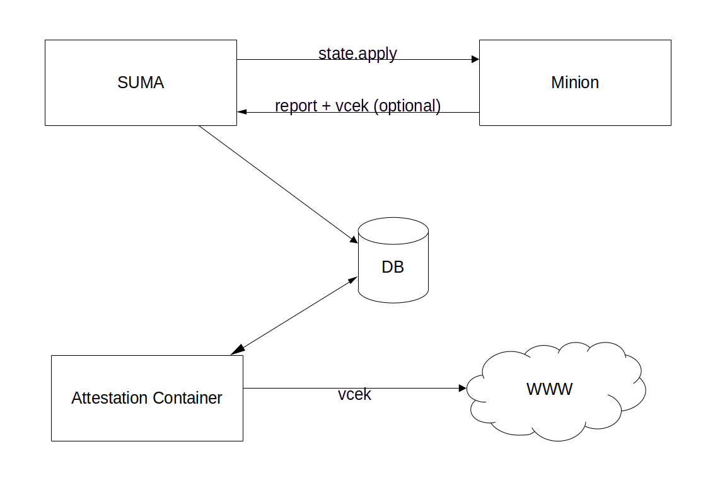

- Feature Name: Confidential Compute Attestation Report
- Start Date: 2024-01-16

# Summary
[summary]: #summary

SUSE Manager / Uyuni should help with Confidential Compute Attestation and being able to generate a report page for systems which should run in this mode.

# Motivation
[motivation]: #motivation

More and more systems run as virtual machines or (public) cloud instances.
Customers want to be sure that the data of these VMs, which is loaded in memory, cannot be read by administrators or the cloud provider.
Confidential Compute is the way to solve this problem.
But that a VM run in confidential mode needs to be attested and checked on regular base.

SUSE Manager should provide an attestation report for a system.
Also a history of the past checks should be kept and shown.

The attestation is a process of multiple checks which can also depend on the hardware and used environment.
SUSE Manager should provide a framework for executing such checks, store the results in the database and show the latest and historic results.
The number of checks should be easy extendable in future versions.


# Detailed design
[design]: #detailed-design

Confidential Compute Attestation cannot be performed on all systems.
It depends on the used hardware and environment where the instance is running on.
In most cases it is not possible to detect if an attestation can be performed or not.

This requires a per system configuration which should contain at least two configuration options:

- Enable/Disable Confidential Compute Attestation (Checkbox)
- Environment selection
  - KVM Guest Attestation on AMD EPYC Milan CPUs
  - KVM Guest Attestation on AMD EPYC Genoa CPUs
  - Azure Attestation
  - etc.

The information about the environment result in pillar data which help to select the matching states which should be executed on the minion for this task.

The attestation is a 2 step process.
First collect the data and second to verify them and write the result.

### Step One
The first step execute a state on the target system to collect the report data.
This is a state.apply on the target system. The selected environment information determine the state which is executed.

Before the state is executed, we create a placeholder entry in the report table.
We might need input data which should be added to the report table entry and
being made available as pillar data to the state.
The status in the report table can be:

- PENDING
- FAILED
- SUCCEEDED

The initial status is `PENDING` which indicate that the verification has not yet happen.

These collected data are stored into a report table in the output data field.
Writing the state result into the report table could be generalized by taking the state IDs as keys and the returned result as values.
Putting this into a map and store it as Json into a data column.

We also have a mapping between environment type and expected verification/results.
At the end of step one all the expected result checks are created in the result table with the status `PENDING`.

Environment Types and Result Types should be ENUM types in Java.
Also the expected mappings which environment type require which result type will life in Java.


### Step two
The second step is a process which run in a dedicated environment like a container which verify the result.

Such an attestation container is responsible for one or more result types.
The attestation container searches regularly for pending attestations of its result types.
It read the data from the associated column in the report table, performs the needed checks, update the result table with the outcome
and set the status to `SUCCEEDED` or `FAILED`.

The overall status of the report depends on the status of all required checks. A database trigger can fire on every change of
the status in the result table and calculate the overall status. When this is different to the stored status
in the report table, the trigger can update it and set it to `SUCCEEDED` of `FAILED`.

The results should later be made visible in a detailed report.


## Database Design

### Configuration Table

The table for the configuration should be a one-to-one relation to `rhnServer`.
It has a boolean for attestation is enabled and an env_type column for the environment type of that system.

```sql
CREATE TABLE suseServerCoCoAttestationConfig
(
        server_id NUMERIC NOT NULL
                    CONSTRAINT suse_srvcocoatt_cnf_sid_pk PRIMARY KEY,
        CONSTRAINT suse_srvcocoatt_cnf_sid_fk FOREIGN KEY (server_id) REFERENCES rhnServer (id),
        enabled   BOOLEAN NOT NULL DEFAULT FALSE,
        env_type  NUMERIC NULL
);
```

### Report Table

The table for the report should be a many-to-one relation to hold a history of the attestations.

We have 2 data columns. The `in_data` column is used for input data we need to provide via
state.apply to the VM. The input data should be added as pillar data for that minion.

The `out_data` column contains the results coming back from the state.apply.
These data columns are of type JSONB to hold any kind of data in machine readable form.
As different environment types perform different checks, multiple data structures are expected.

The status is calculated from the different results. It should be set to `SUCCEEDED` when all
results have the status `SUCCEEDED` as well. As soon as one result is set to `FAILED` the
overall status of the report should also show `FAILED`.

```sql
CREATE TABLE suseServerCoCoAttestationReport
(
        id          NUMERIC     NOT NULL
                      CONSTRAINT suse_srvcocoatt_rep_id_pk PRIMARY KEY,
        server_id   NUMERIC     NOT NULL
                      CONSTRAINT suse_srvcocoatt_rep_sid_fk REFERENCES rhnServer (id),
        action_id   NUMERIC     NOT NULL
                      CONSTRAINT suse_srvcocoatt_rep_aid_fk REFERENCES rhnAction (id),
        env_type    NUMERIC     NOT NULL,
        status      VARCHAR(32) NOT NULL
                      CONSTRAINT suse_srvcocoatt_rep_st_ck
                        CHECK(status IN ('PENDING', 'SUCCEEDED', 'FAILED')),
        in_data     JSONB NOT NULL, -- input data for the state.apply
        out_data    JSONB NOT NULL, -- output data from the state.apply
        created     TIMESTAMPTZ DEFAULT (current_timestamp) NOT NULL,
        modified    TIMESTAMPTZ DEFAULT (current_timestamp) NOT NULL
);

CREATE SEQUENCE suse_srvcocoatt_rep_id_seq;

CREATE INDEX suse_srvcocoatt_rep_sid_idx
  ON suseServerCoCoAttestationReport (server_id);

CREATE INDEX suse_srvcocoatt_rep_stenv_idx
  ON suseServerCoCoAttestationReport (status, env_type);
```

### Result Table

The result table has the result for every check performed on the report.
This is a many-to-one relation as many checks can be performed for one report.
Every result has a `result_type`, `status` and `description` which can be shown
in a user interface.
Optional it can have details if applicable.


```sql
CREATE TABLE suseCoCoAttestationResult
(
        id          NUMERIC NOT NULL
                      CONSTRAINT suse_cocoatt_res_id_pk PRIMARY KEY,
        report_id   NUMERIC NOT NULL
                      CONSTRAINT suse_cocoatt_res_rid_fk
                        REFERENCES suseServerCoCoAttestationReport (id),
        result_type NUMERIC     NOT NULL,
        status      VARCHAR(32) NOT NULL
                      CONSTRAINT suse_cocoatt_res_st_ck
                        CHECK(status IN ('PENDING', 'SUCCEEDED', 'FAILED')),
        description VARCHAR(256) NOT NULL,
        details     TEXT NULL,
        attested    TIMESTAMPTZ NULL
);

CREATE SEQUENCE suse_cocoatt_res_id_seq;

CREATE UNIQUE INDEX suse_cocoatt_res_rid_rt_uq
  ON suseCoCoAttestationResult (report_id, result_type);

CREATE INDEX suse_cocoatt_res_rt_st_idx
  ON suseCoCoAttestationResult (result_type, status);
```


## SNP Attestation of KVM instances

This attestation is using the tool `snpguest` which is provided in SUSE Linux Enterprise Server 15 SP6 and later.
It is made for AMD EPYC CPUs of type Milan and Genoa.
The host and the hypervisor must support Confidential VMs to perform a successful attestation.

The tool and the possible attestation workflows are described in the [README](https://github.com/virtee/snpguest/blob/main/README.md).

The proposed workflow for attestation using SUSE Manager is:



- Read the Configuration
- Create the placeholder entry in the report table with status `PENDING`
  - assign to a systemid and an execution date (create date of the report)
  - generate the input data (nonce) and store them in `in_data`
  - provide `in_data` as pillar data if needed
- Apply a salt state on the VM
  - request the attestation report
- Store the state.apply result data into the database
  - Store report data into `out_data`
  - check the expected validation results and add all the entries into the result table with status `PENDING`
- A Container is running which does the attestation
  - it search the DB for pending attestation of the container supported result types
  - it try to lock the row in the result table
  - request the vcek certificate (require internet access of the container)
  - verify the certificates and the signatures
  - verify the nonce is in the report
  - write the result into the DB
  - set the status of the result entry to `SUCCEEDED` or `FAILED`

Optionally the VCEK could be read from the extended memory if this is supported by the environment.
In this case the VCEK is send together with the attestation report and stored in the database.

Additionally it should be tested if secure boot is enabled. This should also fill in the result entry and set the status.

A trigger is setting the status of the Report Table. When all required check were successful, the status is set to `succeeded`.
If one required check is set to failed, the overall status is set to `failed` as well.
In case there are still pending checks, the status stay in `pending`.


### The Attestation Container for SEV-SNP attestation

An attestation container is responsible for 1 result type.
A container can be enhanced and act for more result types if no other tooling is needed and to build another container would be overkill.

Therefor the Container should contain the just the `snpguest` tool and the CA Certificates for the different Processor Models (ARK and ASK for Milan and Genoa).
In case the VCEK is available, the verification can directly start and the container only needs access to the database.
If the VCEK is not available, the container needs to fetch it from the AMD Key Distribution Center.
This require internet access for the attestation container.

The program which start the verification should regular check the DB for pending attestations.
It query entries with status `PENDING` in the result table.
For this the container must know for which result type it is responsible.
It should fork a process for a specific report result.
It can use DB locking mechanisms to exclusively work on a specific result entry.
The maximal number of parallel processes should be configurable for the container.

It should be possible to start multiple containers if this is needed.


### The Attestation Container for Secure Boot attestation

The container would simply check the result of the state apply. Maybe its not worth to have a dedicated container for it.


### Attestation in Azure Cloud

SNP Guest Attestation in Azure not possible with the tooling we currently have.
Microsoft provide an own client library to do this. We would need to build that library and integrate this in our workflow.

See also https://techcommunity.microsoft.com/t5/azure-confidential-computing/announcing-general-availability-of-guest-attestation-for/ba-p/3648228

An (untested) example build can be found via https://build.opensuse.org/search?search_text=cvm-guest-attestation


### Attestation in AWS Cloud

AWS state that by default everything is secure. Seems it is not possible to attest this as of now.
https://aws.amazon.com/blogs/security/confidential-computing-an-aws-perspective/


### Attestation in GCP Cloud

You can start a Confidential VM instance (currently no SNP available)
Attestation via Cloud Logging. 


## User Interface

### System => Audit => Confidential Compute Attestation

We need 2 areas.

1. Configuration

   This contain a checkbox to enable/disable the attestation of this system.
   Additionally we need a way to select the environment.
   Maybe more is needed in the future and for future checks.

2. A list of former attestations with its result and a link to a "detail view".

   The list should contain, the overall status, the execution timestamp and the attestation timestamp.


The "detail view" should show a checklist with all checks which were performed on that system
with its status. The text behind the checkbox should be the value of the `description` column of the result table.


### System Set Manager Configuration (SSM)

We should provide the configuration via SSM.

### Audit Summary

At the global Audit section we already have multiple UIs for CVE Audit and Openscap Scans.
We should add a user interface which show a list of all systems which performed a Confidential Compute Attestation.

That list has the same columns as for a single system, plus a column for the system name.

Search filter and sort columns should be available.

## Report Database

We have a Report Database in SUSE Manager / Uyuni.
We should add the available attestations also to it.

An example report for `spacewalk-report` should be made available as well.


## Possible extensions

### Disable some checks for a system

When an administrator select an environment type for a system, the number of checks to be performed on the result is known.
We could show this to the administrator in the configuration UI and let him decide to "disable" some of the checks.
When we evaluate the result of the state.apply, we would create the entries in the result table directly with a new status
`SKIPPED` or `DISABLED`. This prevent the container to perform the check.
The trigger would ignore entries with this status and the UI could do the same.


# Drawbacks
[drawbacks]: #drawbacks

Currently limited to KVM guests and only available as technical preview.
Attestation of Cloud Workloads is questionable as the cloud provider are writing their own attestation or do not event support it.


# Alternatives
[alternatives]: #alternatives

N/A

# Unresolved questions
[unresolved]: #unresolved-questions

- Q: will the tools be available for SLE 15 SP6?
  A: yes, SLE-Module-Server-Applications/15-SP6 has it

- Q: is there a better name for the `summary` column in `suseCoCoAttestationResult` ?
  A: we use `description` now

