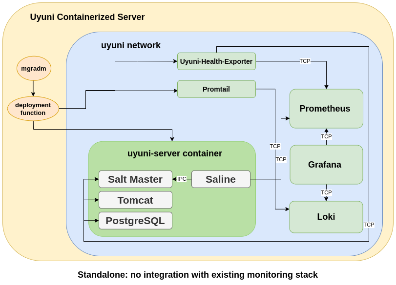
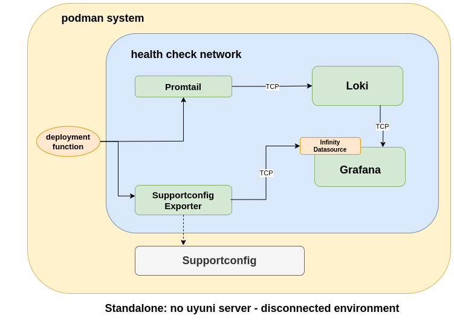

- Feature Name: A Health Check tool for Uyuni
- Start Date: 2024-11-03

# Summary

[summary]: #summary

The Uyuni Health Check Tool is conceived as a solution aimed at optimizing the management of Uyuni environments by providing timely insights. Its goal is to enhance the proactive maintenance capabilities of administrators, ensuring high performance and stability across the Uyuni infrastructure. Simultaneously, the tool facilitates a more efficient troubleshooting process for engineers and support teams, enabling them to address and resolve any issues. By integrating into the Uyuni ecosystem, this tool seeks to improve the overall health and reliability of the system.

# Motivation

[motivation]: #motivation

Developing a Health Check Tool for Uyuni is becoming more critical with each passing day. We have an increasing number of bug reports and a bug report usually takes a lot more time due to the extensive communication overhead involved. We need a tool that helps identify issues quickly and present the state of suse manager health to all the stakeholders on each level from users to support and engineering.

As the volume of bug reports rises and the time required to address each report is affected by the extensive communication overhead involved, developing a Health Check Tool for Uyuni is becoming more critical. A tool that pinpoints issues and clearly presents the health status of Uyuni to stakeholders at every level, from users to support and engineering, is essential.

## Use cases

**User Story 1**

As a system administrator using the Uyuni, I want a comprehensive health check tool that can efficiently assess the overall health and performance of the Uyuni infrastructure and its components. This tool should provide valuable insights into the system's status, detect potential issues, and offer recommendations for improvements, enabling me to proactively maintain and optimize the Uyuni environment.

**User story 2**

User Story: As an engineer responsible for maintaining the Uyuni codebase, I want to efficiently investigate and fix reported bugs or performance issues within the Uyuni infrastructure. To expedite the debugging process and ensure a stable codebase, I would like to leverage the capabilities of the integrated health check tool, which will help me identify any underlying health-related problems that could be contributing to the reported bug.

As an engineer, I get the supportconfig mostly so I need this tool to consume the provided supportconfig and help me identify any potential issues before I dive into the huge amount of logs.

## Expected outcome

* Proactive Monitoring and Maintenance: Enable system administrators to proactively monitor the health and performance of the Uyuni infrastructure. By providing comprehensive insights into the system's status, the tool aims to help administrators detect and resolve potential issues before they escalate into significant problems.

* Streamlined Debugging Process for engineers: Assist engineers and developers in quickly identifying and addressing bugs or performance issues within the Uyuni codebase.

# Detailed design

[design]: #detailed-design

## Component Overview

### Health-Check-Tool

* Loki/Promtail: These two components are for log aggregation, indexing and querying. Loki acts as the centralized logging system, storing and managing logs, while Promtail is deployed on the Uyuni server to collect logs and forward them to Loki.

* Grafana: Utilized for visualization, with dashboards displaying metrics, logs, and alerts, facilitating an integrated view of system health and performance.

* Uyuni-health-exporter: A custom exporter to gather specific metrics related to Uyuni server health, including database, service status, and resource usage.

* Alerting System: Leveraging Grafana's alerting mechanism, configured to monitor critical metrics and log patterns, triggering alerts based on predefined thresholds.

* LogCLI: A command-line interface tool provided by Grafana Loki, LogCLI enables direct querying of logs stored in Loki from the terminal. It supports running LogQL queries, live tailing of logs, and viewing logs in a flexible output format. This tool is particularly useful for administrators and developers who prefer to work within a CLI environment for quick log searches, debugging, and log analysis without the need for a graphical interface.

Proof-of-Concept: https://github.com/uyuni-project/poc-uyuni-health-check

### Saline

Saline is an addition for Salt used in SUSE Manager/Uyuni aimed to provide better control and visibility for states deployment in the large scale environments. It can provide metrics related to Salt events and "state.apply" process on the minions.

Proof-of-Concept: https://github.com/vzhestkov/saline

## Configuration and Deployment

This RFC proposes the following solutions:

### Integrated solution: extending existing monitoring stack.

* Monitoring Formula Integration: Loki/Promtail and `uyuni_health_exporter` configurations are managed via Uyuni's monitoring formula, ensuring seamless integration and ease of deployment. Making Saline and Health Check to part of the current Monitoring formulas.

* Additional Monitoring Formulas: Similar to the previous approach, integration with current Monitoring stack but using a separated formulas.

### Standalone solution: containerized deployment including Loki, Promtail and Grafana.

* Containerized Deployment: The Health-Check-Tool components, including Loki, Promtail, Grafana, and the Exporter, are deployed as containers sharing the same network, allowing TCP communication between containers. Running all containers within the same POD would be also possible but it would limits the deployment method on kubernetes to be running all at the same cluster node.

* Communication with Uyuni server: The approach to establishing communication with the Uyuni server lies in the underlying infrastructure setup. When deployed in a standalone environment, the system leverages Podman's networking capabilities to facilitate connectivity. This involves configuring Podman containers to ensure they can communicate effectively with the Uyuni server, using Podman's built-in networking features such as container-specific network configurations. Alternatively, in environments where Kubernetes is employed, communication with the Uyuni server is managed through Kubernetes networking principles.

* Storage and Persistence: Utilizing persistent storage solutions for logs and metrics data, ensuring data integrity and availability for historical analysis.

* Container Deployment Function: Design a generic container deployment function in Python that abstracts the container runtime interface. This function will initially support Podman but is designed to allow easy extension to other container orchestration platforms like Kubernetes. It should be standalone, allowing the tool to run disconnected environments but it will be also integrated into `mgradm`, keeping `mgradm` as the single entry point for the users to manage the containerized Uyuni server deployment.

### Disconnected solution: containerized deployment without access to an Uyuni server (via supportconfig)

No access to an Uyuni server or existing monitoring stack, only access to a supportconfig.

### Component 1: Exporter

Goal: Configure the Exporter to gather metrics from the Uyuni server and managed systems. The exporter uses Salt runners to gather metrics.

Steps:

  - Deploy the Exporter as a containerized application.
  - Ensure the exporter is accessible for Prometheus to scrape metrics.
  - Ensure the exporter can run Salt runner commands targeting the server.

### Component 2: Prometheus

Goal: Set up Prometheus to scrape metrics from the Uyuni-Health-Check exporter and evaluate alerting rules.

Steps:

  - Scrape Configuration: Add the Exporter endpoint to the Prometheus configuration.
  - Alerting Rules Definition: Create alerting rules to define conditions for triggering alerts based on metrics from the Exporter.
  - Alertmanager Configuration: Set up Alertmanager to handle alerts generated by Prometheus, including notifications.

### Component 3: Grafana

Goal: Use Grafana to visualize metrics and alerts from Prometheus.

Steps:

  - Add Prometheus as a data source in Grafana.
  - Create dashboards to visualize metrics from the Exporter.
  - Configure panels within dashboards to display alerts based on Prometheus data.

### Component 4: Loki and Promtail

**Loki setup**
Goal: Deploy and configure Loki to serve as the centralized log aggregation system for collecting, storing, and querying logs from the Uyuni environment.

Steps:

  - Deployment: Install Loki on the Uyuni infrastructure as a container that is part of the Uyuni-Health-Check Pod or sharing the same network than the "uyuni-server" container.
  - Configuration: Customize the Loki configuration to define storage locations for logs, retention policies, and other operational parameters.
  - Service Discovery: Configure Loki to discover targets for log collection, focusing on integration with the Exporter and Uyuni components.

**Promtail setup**
Goal: Configure Promtail to collect logs from Uyuni server and managed systems, forwarding them to Loki for aggregation and analysis.

Steps:

  - Deployment: Install Promtail on the Uyuni infrastructure as a container that is part of the Uyuni-Health-Check Pod.
  - Configuration:
    - Edit Promtail configuration to define the paths of log files to monitor. In the containerized Uyuni environment, the Promtail container must be configured to have read access to mapped volumes that correspond to the log locations of the Uyuni server container.
    - Configure Promtail to forward logs to your Loki instance.

### Component 5: LogCLI
Goal: Incorporate LogCLI to provide a command-line interface for querying logs stored in Loki, enhancing the toolset available for diagnostics, troubleshooting, and operational reporting.

### Component 6: Supportconfig metrics gatherer

Stakeholders: Engineers and Supporters

Goal: Extract relevant metrics from support config files.

Configuration: No extra configuration needed apart from the path to the supportconfig files.

### Component 7: Saline

Configuration: Deploy as a monitoring formula.

## Alerting and notifications

* Severity Levels: Alerts are categorized by severity levels (e.g., Critical, Warning, Info), allowing for prioritized response and management.

* Notification Channels: Configured within Grafana to support various notification mechanisms.

* Alerts and Recommendations via Loki:
    * Loki Querying: Utilize the Loki API to query log data for patterns indicative of issues or anomalies. This requires crafting LogQL queries tailored to the types of issues Uyuni Health-Check-Tool aims to detect.
    * Alert Generation: Employ the Loki Ruler component to define alerting rules. These rules can be dynamically generated or updated based on the Uyuni Health-Check-Tool configuration, allowing for customizable alert conditions.

* Implementing alerts and recommendations involves:
    * Defining LogQL Queries: Writing LogQL queries that match the relevant conditions.
    * Configuring Alert Rules: Using the Loki Ruler to define alert rules based on LogQL queries. These rules specify the conditions under which alerts should be triggered and the severity levels.
    * Setting Up Notification Channels: Configuring the notification channels to receive alerts.
    * Recommendation Logic: For recommendations, the alerting mechanism can be extended with additional logic to suggest actions.

## Metrics

* Server status and resource utilization

* Database health and integrity

* Status of relevant Uyuni services

## How is the exporter going to access to uyuni-server container? For example, to query the database.
As mentioned, the exporter needs to have access to Uyuni server container. It does need to query the DB and also execute some Salt runners jobs to gather metrics. If the "exporter" runs in a separated container than the Salt Master, then we can make the "exporter" container to run in the same network than the "uyuni-server", then TCP sockets are available to use.

There are some Salt runners jobs that requires access to Salt Master Event publisher, currently exposed via IPC socket. This makes it tricky access these sockets from a different container. Some metrics might not be available until we move to "TCP" sockets for the Salt Master Event publisher in this case.

Alternatively, we could make the "exporter" as part of the server-image, even if not running by default. Then it is up to the Health Check Tool or Monitoring formula to start it. This would solve the current issue of not having access to the IPC sockets.

## Saline vs Health Check Tool

We want to differentiate conceptually between "Saline" and the "Health Check Tool". In this regard, these are two different components with different purposes.

### Saline: Salt state application monitoring to be integrated to the product.
Saline exposes Salt state metrics to Prometheus. It is a tool meant to attach to Salt Master sockets and analyze and extract Salt state/jobs metrics from a live and running Uyuni server.

Saline setup is done is two steps, and should be also driven by `mgradm`:

1. Install `saline` RPM in the Uyuni server (pre-installed in the server image). This provides "setup" script and new "Formulas with Forms".
2. Run `saline-setup run` to configure and enable the `salined` service to attach to the Salt Master.
3. In the "Formulas with Forms" UI, new formulas will appear: "Saline Prometheus" and "Saline Grafana". These can be used to automatically configure your existing Prometheus and Grafana instances to get the metrics and dashboards from Saline.

Saline already provides an easy way to integrate with the current Monitoring Stack (Formulas with Forms).

The `salined` service must be able to attach to the Salt Master. At the moment this is done by connecting to Salt Master IPC sockets, which means `salined` needs to live in the same system/container than the Salt Master.

Saline should be configurable to use IPC or TCP sockets. Switching Salt Master to use TCP sockets would enable Saline to run on a different container than the Salt Master.

The Saline engine running on the Uyuni server, will provide data and metrics to feed Prometheus and Grafana instances and also a future UI with a live view of running actions. Eventually, this component should be integrated as part of the default Uyuni server stack.

For now Saline would be part of Uyuni server image.

### Health Check Tool: An standalone tool you can run on an running Uyuni server or use in a disconnected setup (via supportconfig)
In this case, this tool is mean not only to provide a picture of the current health status of a live running the Uyuni server, where the tool has access to it and can fetch data in real time, but it is meant to also help engineers and supporters to analyze and debug problems on disconnected setups, where the tool doesn't have access to an actual running Uyuni server, but only has a "supportconfig" as a source of data.

In this regard, on disconnected setups, the tool cannot rely on existing Uyuni server components, neither existing Prometheus and Grafana instances, but it should be able to deploy its own instances to visualize the data coming from a "supportconfig".

When the tool have access to an Uyuni server, then it can run "standalone" or via `mgradm`, allowing to reuse existing Prometheus and Grafana instances.

- The Health Check Tool is not installed or running by default in a Uyuni server.
- As multiple components (containers) are deployed, resources on a live Uyuni server might be affected.
- It should be able to reuse existing Prometheus and Grafana instances, allowing integration with existing Monitoring stack.

# Security considerations
In the current design, we are exposing metrics via Prometheus and making them available in Grafana, and more importantly we are exposing logs messages via Loki/LogCLI to CLI and Grafana users. It is important to notice that after running this tool, and until related containers are destroyed, the Grafana Dashboards (and other components like Prometheus and Loki/LogCLI) are exposing metrics and logs messages that may contain sensitive data and information to any non-root user in the system or to anyone that have access to this host in the network.

Promtail pipeline definition can be enhanced to use [replace](https://grafana.com/docs/loki/latest/send-data/promtail/stages/replace/) function, to hide sensitive data from logs. Users must have a configuration file to define the different filters to apply to the Promtail pipeline. Filters must be also configurable via Monitoring Formula.

TLS must be enabled for Promtail, Prometheus and Loki to ensure a secure transport.

Authentication backend for Prometheus and Loki is usually delegated to an authentication reverse proxy. This must be included in the documentation and probably be considered in the Formula.

# Learning Curve and Documentation
System administrators and developers may need to familiarize themselves with Loki/Promtail's log querying language (LogQL) and Grafana's alerting mechanisms. The learning curve associated with these tools could slow down initial adoption and efficiency gains.

In this sense, we must provide a good documentation with tutorials, use cases and examples to help the users to early and smoothly adopt the new monitoring capabilities.

# Implementation steps

### Phase 0 (before 5.0 GA):

#### Uyuni Health Check
- Create RPM packages in OBS/IBS.
- Use container images building on OBS/IBS for the different components.
- Provide an "standalone" version only (no integration with Monitoring stack). Via Uyuni server channel (or others so it is available for engineering or supporters).
- Flag this as a Tech Preview.

#### Saline
- Research about using TCP instead of IPC sockets for Salt Master internal sockets.
- Build Saline in OBS/IBS and make it part of the Uyuni Server image
- Saline runs inside "uyuni-server" container.

### Phase 1 (after 5.0 GA):

#### Uyuni Health Check

- Enhance metrics, dashboards and alerts.
- Allow users to enhance the Loki pipeline to add filters and/or replace patterns to be able to replace sensitive information.
- Integration with the Monitoring Stack. Enhance the monitoring formula to enable Health Check monitoring.
- Reuse configuration from "standalone" version.

#### Saline

- Provide "Saline" inside a separated container that attaches to Salt Master TCP sockets from the `uyuni-server` container.
- Alternatively, explore sharing Salt Master IPC sockets between containers.

# Drawbacks

[drawbacks]: #drawbacks

* Resource Usage: Running additional services for log aggregation, analysis, and enhanced alerting could increase the resource demands on the server, including CPU, memory, and storage. This might necessitate upgrades to existing hardware or reevaluation of resource allocation in cloud environments to ensure optimal performance.

* Security Considerations: With the introduction of new components for logging and alerting, there might be additional security considerations to address, including access controls, data encryption, and secure communication channels between services.

* Alert Noise: Fine-tuning alert rules to balance sensitivity and specificity is critical. Without careful configuration, there's a risk of alert fatigue due to a high volume of non-critical alerts, potentially causing important alerts to be overlooked.

# Alternatives

[alternatives]: #alternatives

### What other designs/options have been considered?

1. Running the Uyuni Health-Check-Tool along with the `uyuni-server` container on the same pod. This could lead to a resource problem on the node running the pod.
2. Integration with the current Monitoring stack. This has been considered in this RFC as an complementary integration for the standalone Health Check Tool.

### What is the impact of not doing this?

1. Not having a Health Check Tools to monitor health of an Uyuni server. Poor monitoring when it comes to internal metrics, overall Uyuni server health, and particularly around Salt jobs and actions.

# Unresolved questions

[unresolved]: #unresolved-questions

### What are the unknowns?

Has Saline to be part of the current Uyuni Monitoring stack? As mentioned above, it does make sense to integrate Saline in the current Monitoring stack, probably as an "opt-in".

### What can happen if Murphy's law holds true?

The tool will just not be able to provide insights.
Security issues.
The tool might also exhaust resources on the server (computing/memory/disk).
