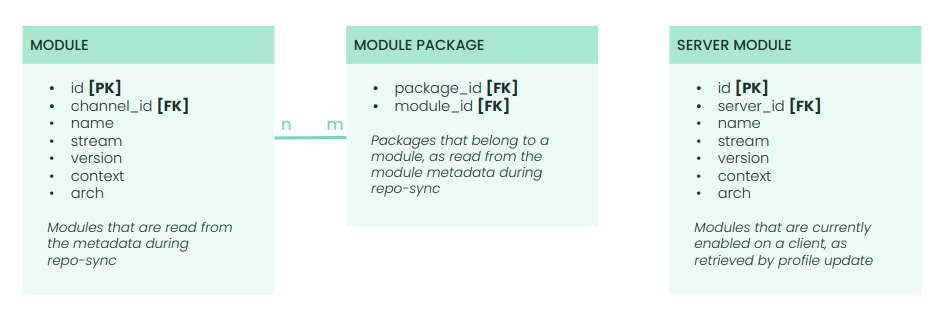
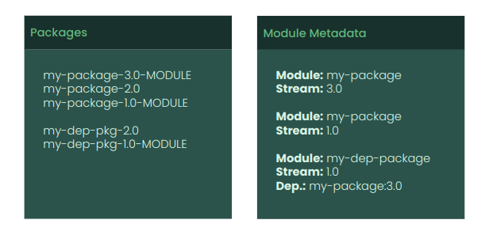

- Feature Name: Native AppStream support
- Start Date: 2024-02-19

# Summary
[summary]: #summary

This RFC proposes native support for AppStreams repositories in Uyuni.

# Motivation
[motivation]: #motivation

Following the integration of [modularity and modular repositories](https://docs.fedoraproject.org/en-US/modularity/) in RHEL and its derivatives, Uyuni initially implemented modularity through content lifecycle management and the [introduction of AppStream filters](https://github.com/uyuni-project/uyuni-rfc/blob/master/accepted/00064-modular-repos-with-clm.md). These filters effectively remove modularity features from a repository, enabling consumption through the Uyuni UI. However, this approach introduced complexity and limited functionality, prompting the need for a more comprehensive solution.

The goal is to seamlessly support modularity in its native form within uyuni, ensuring a user-friendly and intuitive experience across all workflows involving modular repositories.

# Detailed design
[design]: #detailed-design

## Overview

The design encompasses core functionality, new UI operations, modifications to the existing CLM feature, and testing infrastructure.

## The core design

The core design involves three key components for data collection and filtering of packages for client consuption:

1. **Repo-sync**: A standalone Python module that extracts module metadata from source channels using `dnf`'s `libmodulemd` library during repo-sync, serving as the source of truth for the module information. As the data gathered during this process is critical to the feature, it must be executed as a single unit with the repo-sync ([See the PoC](https://github.com/cbbayburt/uyuni/commit/ed9391e8c6e0a66d1dd7cb0f3501332b0884f2f3)).

2. **Package profile update**: A Salt state that retrieves current module information from clients, storing the data in the database. The state calls `dnf module` commands to retrieve the list of enabled module streams together with their *name*, *stream*, *version*, *context*, and *arch* values ([see the PoC](https://github.com/cbbayburt/uyuni/commit/2c788f3144f5bfe8ddd904045e0a757a7a432923)).

3. **Package cache**: Incorporates data from repo-sync and package profile update into existing queries, ensuring proper filtering of non-enabled modular packages. The existing tables, queries and stored procedures will be updated with additional joins and proper indexing to ensure minimum performance impact.

A prototype showcasing the core functionality can be found [here](https://github.com/cbbayburt/uyuni/tree/native_appstreams_poc).

### ER diagram

The following figure shows the proposed ER diagram for the core design.

## New UI operations

The proposed UI includes a new page under the `System > Software` tab, visible only for clients with modular channels assigned. It displays available modules and their streams, allowing users to select and apply module changes to clients.

The main workflow is as follows:

1. Select an assigned modular channel.
2. Select enabled modules and their streams.
3. *Optional:* Run `mgr-libmod` for dependency resolution with real-time feedback.
4. Schedule an Uyuni action to apply the selection on the client.
5. The action calls `dnf` with the selection of module streams on the client via Salt.
6. On job return, update the selection of modules in the database.

To allow working on multiple clients at once, SSM will be used. In the SSM, the clients in the set will be first grouped by the modular channels they are assigned to. Then the user will select a group and makes a selection of modules that applies to the whole group.

## Content lifecycle management

The current CLM approach will be replaced with regular *ALLOW/DENY* logic in AppStream filters. During build, module filters will be translated to package filters that apply to all packages of the module. A module will only be included in the target repository if all its packages are visible.

During repository metadata generation, `libmodulemd` will parse and index the modular metadata from the source channels and generate the modular metadata for the target repository following the rules enforced by the attached filters.

If all the modules are denied as a result of the enabled filters, no module metadata will be generated in the target repository.

## Testing

A "dummy" modular repository will be built in OBS for comprehensive testing in the CI environment.

Below is an example of a minimal test repository:

# Unresolved questions
[unresolved]: #unresolved-questions

- Final UI design considerations
- Whether the Salt module for profile update should be native or packaged with Uyuni
