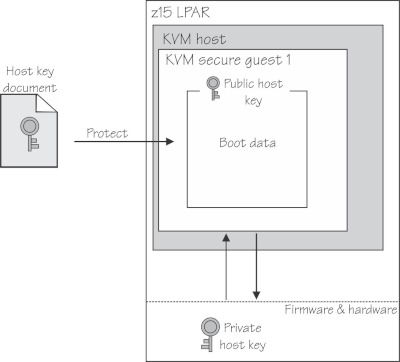
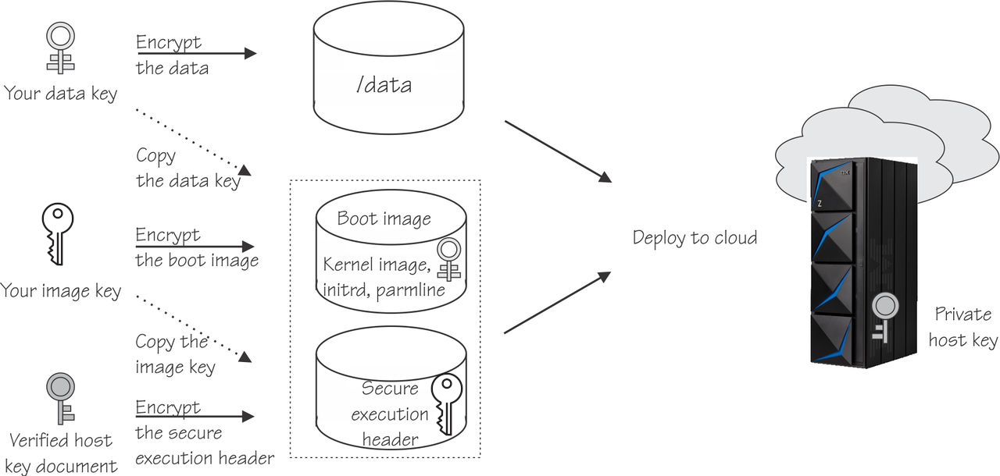
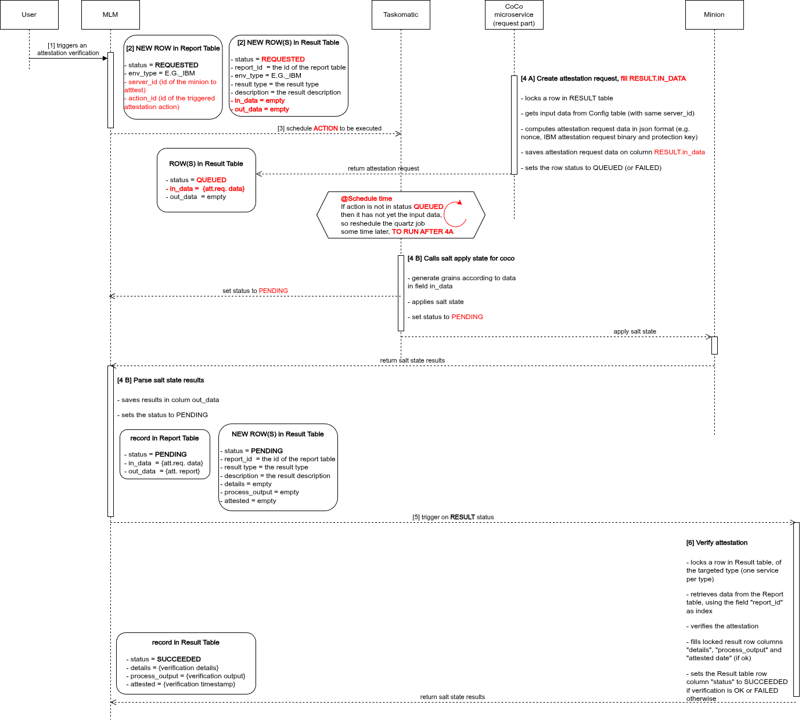

- Feature Name: Confidential Compute Attestation for IBM Z series
- Start Date: 2026-03-31

# Summary
[summary]: #summary

Extension of the Multi Linux Manager confidential computing attestation mechanism to secure KVM images
running on IBM Z series mainframes

# Motivation
[motivation]: #motivation

More and more systems run as virtual machines or (public) cloud instances. 
Customers want to be sure that the data of these VMs, which is loaded in memory, 
cannot be read by administrators or the cloud provider.
Confidential computing is the way to solve this problem. 

Multi Linux Manager already provides a confidential computing attestation mechanism for AMD processor families.
Now this attestation mechanism should be extended also to VMs running on IBM Z series machines.

With this change, we are moving from one-only kind of attestation environment (AMD) to (potentially) many ones, 
so some adaptations to the code are expected. A side effect outcome is that the next extension
will be probably simpler. 


# Detailed design
[design]: #detailed-design


## Key concepts about IBM attestation

### Host key document

Host key document is basically the public key associated to a specific server instance.  
Every IBM Z series server is equipped with a private host key that is specific to that particular server.
This private key is “buried” and protected by hardware and firmware, so that nobody can access or manipulate
the private host key.   
The host key document is necessary to build a secure VM image, to ensure that the created image can run
on that particular host. Therefore, the image creator can provide it.  
Any system administrator with a valid IBM account can download their host key documents at the web page
https://www.ibm.com/support/resourcelink/api/content/public/host-key-documents.html selecting the machine serial number
and the machine type.  
The host key document is **not** security sensitive, since it’s basically a public key of the host.



### Secure execution header

When building a secure VM image, the kernel, initial RAM file system, and parameter file are encrypted into
an integrity-protected file that contains all information required for booting.  
This file is called **Secure Execution Header**, and it is cryptographically signed with the aforementioned 
host key document.  

The secure execution header is also holding the information of all the hosts we want to run the VM image into
(if the image is meant to run on more than one host).

This file is an outcome of the process of building a secure VM image, therefore the image creator can provide it.  
The Secure Execution Header is **not** security-sensitive, because it is safeguarded such that only the Ultravisor
from a target host can verify its integrity and access the confidential data within the header itself.

In order to check the validity of a secure execution header (maybe a wrong user input), those checks can be made:
1. The first 8 bytes represent the 8-byte magic number 49 42 4D 53 65 63 45 78 ("IBMSecEx")
2. Bytes 12-15 contain the size of the header. The file should be at least this size.



---- 

## The pvattest tool script 

IBM provides a script named `pvattest` to perform all confidential computing operations needed.  
This command is an open source, MIT-licensed tool (https://github.com/ibm-s390-tools/s390-tools) that can be found 
inside the package `s390-tools` (https://github.com/ibm-s390-linux/s390-tools 
and https://build.opensuse.org/package/show/openSUSE:Factory/s390-tools).  

Be aware:  in order to run all the preparation and verification commands (`pvattest create`, `pvattest verify`)
the script `pvattest` must be installed.

When on the guest/minion, it is not necessary to check if the system is z16 or z17: if the confidential computing
attestation is not supported, the `pvattest` command will fail anyway.

**Important**: the package `s390-tools` is currently provided only on x86_64 and s390x platforms. 
and it is a suite of about 60 IBM utilities, with all you need to create a VM secure image on the IBM platform.
What we only need is the `pvattest` script.
The package is provided on GitHub (https://github.com/ibm-s390-tools/s390-tools) under MIT license, and it is built in
Rust.


## The attestation request

Unlikely the AMD case, where only some user-generated random nonce data is requested to run an attestation, 
the IBM `pvattest` tool requires to generate/create a binary file (attestation request), in order to
later perform an attestation execution measurement and verification. This step must be made on a "trusted" environment 
and leads to some considerations and architectural choices we want to consider, here below.


## Architectural choices on the IBM attestation request


### Architectural choice n. 1: How to compute the attestation request?
The command `pvattest create` can be run using the `--no-verify` flag, thus disabling the host-key document
verification, or alternatively not using it and providing the two certificates for host-key document verification. 

IBM recommends to use the `--no-verify` flag only for testing purposes, and to do the host key verification
every time.  
So we decide to adhere to IBM recommendations and stick with the verification.  
This way we avoid any responsibility we can have not to match IBM recommendations.


> **Architectural choice**:  
> do NOT use the --no-verify flag and provide the two certificates for host-key document verification.

In order to do the host-key document verification during `pvattest create`, we need the following:
- the root certificate for the validation chain (`DigiCertCA.crt`, valid until 2036)
- the IBM intermediate certificate for the validation chain (`ibm-z-host-key-signing.crt`, validity ~ 3 years)
- every certificate requires a list of revoked certificates (validity ~ 1 month).
The `pvattest create` command automatically downloads the certificate-revocation lists, unless the `--offline` flag
is used (in that case, one certificate-revocation list must be specified for every of the above certificates)

The two certificates and the relative certificate-revocation lists:
- have different time validities, so they cannot be embedded into the system (except for `DigiCertCA.crt`)
- the certificate-revocation lists are short-lived (about 1 month)
- the IBM intermediate certificate is different for z16 and z17 server series
- if we would ask the user to provide all the above certificates, we could end up with many items (at least 6)
that should be re-loaded quite often and should be stored in a single place system-wide

For the above reasons we also make another architectural choice:

> **Architectural choice**:  
> In order to perform confidential computing attestation for IBM, we need the system to be able to
> autonomously download the certificates and the certificate-revocation lists, hence the internet
> **MUST** be reachable, even behind an http proxy, at the following addresses 
> 1. https://www.ibm.com/support/resourcelink/api/content/public/*
> (this includes IBM certificates and IBM CRL distribution points)
> 2. http://crl3.digicert.com/ and http://crl4.digicert.com/
> (this includes CRL distribution points for DigiCertCA.crt, since all the chain must be checked for the CRLs)
> 
> Should any customer require the IBM confidential computing attestation in an air-gapped scenario, 
> or to manually provide the certificates, we will open a feature request and cope with this later on.  
> At the moment we'd like to keep the things as simple as possible.

As a reference, here are the URLs IBM makes available:

General:  
https://www.ibm.com/support/resourcelink/api/content/public/DigiCertCA.crt

z16:  
https://www.ibm.com/support/resourcelink/api/content/public/ibm-z-host-key-signing-gen2.crt   
https://www.ibm.com/support/resourcelink/api/content/public/ibm-z-host-key-gen2.crl   

z17:  
https://www.ibm.com/support/resourcelink/api/content/public/ibm-z-host-key-signing-gen3.crt   
https://www.ibm.com/support/resourcelink/api/content/public/ibm-z-host-key-gen3.crl   


### Architectural choice n. 2:  Where to compute the attestation request?
The `pvattest` tool must be installed in the place where the attestation request is computed.
The `pvattest create` command creates two files as outputs (the attestation request binary file and the protection key)
that must be stored in the MLM server to be used for the attestation.

- The attestation request could be computed on the minion guest/minion, since the s390-tools package dependency
is installed there anyway.  
However, we have to assume the guest/minion as “untrusted” (this is the whole point of the attestation), 
so it is not safe to compute the request on the guest/minion itself.  


- The attestation request could be computed directly on the MLM server: this is a simple solution,
since the outputs files can be computed on the fly when the attestation is requested,
and can be immediately stored in the database.  
However, this means that `s390-tools` package (with all the implied package dependencies) must be installed on MLM 
server even if no IBM minions are enrolled, leading to some package pollution. Also, do consider that the package
`s390-tools` is currently provided only on x86_64 and s390x platforms.  

The above two alternatives were considered and discarded, in order to come to our final architectural choice:


> **Architectural choice**:  
> We are going to compute the attestation request on the coco-attestation microservice.
> This way, we restrict the `s390-tools` package dependency to be installed only on that container 
> (must be installed anyway, to do the attestation verification of IBM Z series),
> therefore avoiding MLM package pollution.
> 
> Of course, if the microservice is not explicitly activated, the attestation request cannot be computed and therefore 
> not even the attestation measurement/execution can be done.


### Architectural choice n.3:  When to compute the attestation request?

Can we compute the attestation request once and reuse it, or do we have to compute a new attestation request
every time we want to run an attestation verification?

Computing it once and reusing it is a simpler solution, and we could use the generated random nonce data to protect us
from the reply attacks. We should consider that the validity of the attestation request is the shortest of the
chain of the certificates used to build it.   
However, even if IBM recognises that they never used this nonce data in this way (and that this solution is somehow
working), they recommend to re-create a new attestation request every time, in order to avoid reply attacks
(they don’t want to commit on our proposed solution).

As stated previously, we will stick to IBM recommendations, so that we avoid any responsibility we can have 
not to match them.

> **Architectural choice**:  
> We compute a new attestation request every time we want to run an attestation verification.
> The validity of the chain of certificates used when creating it, is evaluated every time
> (and newer certificates are obtained/downloaded if necessary)


---- 


## The attestation process for IBM Z series

The steps for the whole attestation process are the following:

- Step 1: Preparation of the attestation request (on a trusted environment)
- Step 2: Run the attestation measurement to get the attestation report (on the minion/secguest)
- Step 3: Verify the attestation report to get the attestation result (on a trusted environment)


## Step 1: Preparation of the attestation request
The tool `pvattest` requires to create a binary file as an attestation request document, in order to later perform
the attestation execution measurement.

**Where**: on the coco-attestation microservice

**Inputs**:
- **host key document**
- the certificates used to establish a chain of trust for the verification
of the host key document.
Two certificates are needed:
  - the **root CA** certificate
  - the **IBM Z host signing-key** certificate (different between z 16 and z 17 series)

the certificate-revocation lists are automatically retrieved (we are **NOT** using the `--offline` option)

**Outputs**:  
- **attestation_request.bin**: a binary file of the created attestation request
- **attestation_protection_key.key**: a randomly generated AES-256 key that protects the attestation request,
generated by the `pvattest` tool, and that will be used for the attestation verification  

**Command example**:
```
pvattest create -v
  -k input/host_key_document.crt
  -C input/DigiCertCA.crt
  -C input/ibm-z-host-key-signing-gen2.crt
  -o output/attestation_request.bin
  -a output/attestation_protection_key.key
  --add-data phkh-img
  --add-data phkh-att
```


## Step 2: Run the attestation measurement to get the attestation response
Once the attestation request has been created, an attestation measurement must be done on the minion to get an
attestation response.

**Where**: on the minion/secguest (this needs `/dev/uv`)  

**Inputs**:
- **attestation_request.bin** (the generated attestation measurement request)

**Outputs**:
- **attestation_response.bin** (response of running a measurement to the ultravisor)

**Command example**:
```
pvattest perform -v
   -i input/attestation_request.bin
   -o output/attestation_response.bin
```

#### Note a)
If the result of the `pvattest perform` command and the calculated results do match,
the command ends with exit code 0. This can be checked by displaying the `$?` variable with the echo command

#### Note b)
The presence of the device `/dev/uv` should be checked beforehand by a simple `ls` command
```
(minion)# ls /dev/uv
```
If the uv device is not available, use `modprobe` to load the uv device module.  
```
(minion)# modprobe --first-time uvdevice
```


## Step 3: Verify the attestation response to get the attestation result
When the attestation response is obtained by an attestation measurement, any third party can cryptographically 
have the proof that the confidential computing environment is genuine.

**Where**: on the coco-attestation microservice
(see https://github.com/uyuni-project/uyuni-rfc/blob/coco-attestation/accepted/00099-coco-attestation.md)

**Inputs**:
- **attestation_response.bin** (attestation response to be verified)
- **secure_extension_header.bin** (secure extension header of the guest image)
- **attestation_protection_key.key** (The generated AES-256 key that protects the attestation request/result)

**Outputs**:
- **attestation_result.yaml** (output for the verification result)

**Command example**:
```
pvattest verify -v
   -i input/attestation_response.bin
   --hdr input/secure_extension_header.bin
   --a input/attestation_request_protection_key.key
   -o output/attestation_result.yaml
```


# Implementation details  


# Summary of the involved database tables
**Config table**: `suseServerCoCoAttestationConfig`  
This is the table where the settings for each minion are stored 
- server_id (id of the minion)
- enabled (flag to enable attestation)
- env_type (enum: type of CPU)
- attest_on_boot (flag to enable attestation at every minion boot)
- **new: in_data (JSON attestation data for each minion**)

**Report table**: `suseServerCoCoAttestationReport`  
This is the table where the reports of each attestation measurement inputs and outputs are stored
- server_id (id of the minion to attest)
- action_id (id of the triggered attestation action)
- env_type (enum: type of CPU)
- (report) status (enum: status of the attestation process, one of PENDING, SUCCEEDED, FAILED)
- **new: config_in_data (json: copy of the configuration `in_data` field when the attestation is requested**)
- in_data (json: input data to be transferred to the minion as pillar data)
- out_data (json: result of the salt state of the attestation measurement)

**Result table**: `suseCoCoAttestationResult`  
This is the table where the results of each attestation verifications are stored
- report_id (id of the report where to get attestation data)
- result_type (enum: expressing attestation test result type: one of SEV_SNP, SECURE_BOOT, [**new: IBM_PVATTEST**])
- **new: env_type (enum: type of CPU, copy of the report table value, conveniently copied here)**
- (result) status (enum: status of the result processing, one of [**new: REQUESTED, QUEUED, SUBMITTED**],
PENDING, SUCCEEDED, FAILED)
- **new: in_data (json: attestation request computed input data, if any)**
- description (text)
- details (text)
- process_output (text)
- attested (timestamp when SUCCEEDED)

# Flow of the attestation  





0) [User] The user adds to the settings the secure extension header file and the host key document certificate  

>**Changes**:  
> - add a column in the Config table to store the settings as a JSON file.  
>   - **in_data jsonb NOT NULL**
> - modify the UI to gather/load the hostKeyDocument and secureExtensionHeader as shown in the image below
(the UI control can be reused from the one used to register a new peripheral server)
> - modify the backend to gather the two files and store them in the Config table `in_data` column as JSON
(base64 encoded for binary info)
> - let those two inputs to be visible only in case of IBM cpu. For all AMD environment types, the settings page
looks like the current one.


1) [User] The user triggers an attestation verification

Note: The attestation can take some time, both because it could be a lengthy process and because it could be scheduled 
at a future moment in time. The configuration input data (hostKeyDocument and secureExtensionHeader) could meanwhile 
change. For this reason, we keep a copy of the configuration data in the report, at the time the attestation
verification has been requested. 

2) [MLM] A new row in the Report table is created, and one or more in the Result table.  
The Report table record then looks like:
   - status = PENDING
   - in_data  = empty
   - out_data  = empty
   - config_in_data = copy of Config table `in_data` field at this moment in time

Then new rows in the Result table are created, one row in for each of the tests that will be performed in the
salt state apply  
Each new record in the Result table looks like:
- status = REQUESTED
- report_id  = the corresponding id of the Report table
- result type = the test result type
- description = the test result description
- in_data = empty

The Report row acts as a "collector" of a list of expected results. The `in_data` field is the concatenation of all the
input fields of the pertinent result rows. The `out_data` field will contain the result of the salt state apply for 
the attestation measurement, and hence the concatenation of all the output data of the pertinent result rows.

A copy of the `in_data` field of the Config table is necessary, to keep track of the configuration when the attestation
was requested. There can be a lengthy period of time from the attestation request to the actual verification, 
and meanwhile the configuration can be changed "on the fly" by the user. Hence, it is important we keep a copy of the
configuration at the time when the attestation measurement has been performed.

>**Changes in the Report table**:
> - the field `status` has now values which are different from the result status column, so the corresponding
class must be duplicated and kept independent (CoCoAttestationStatus must be split in CoCoReportStatus
and CoCoResultStatus classes)
> - add column field `config_in_data`, to get the Config table input data copy

>**Changes in the Result table**:
> - field `status` (new class CoCoResultStatus) slightly changes meaning: now it represents the status of the
attestation request and response.  
    Possible values are:
>    - **(new)**`REQUESTED`: an attestation has been requested, but the attestation request input is yet to be computed
>    - **(new)**`QUEUED`: the attestation request input has been computed, and the attestation measurement is ready
     to be performed
>    - **(new)**`SUMBITTED`: the attestation measurement is ongoing, waiting for the salt state answer from the minion
     to be performed
>    - `PENDING`: the attestation measurement has been done on the minion and results have been received
>    - `SUCCEEDED`: the attestation verification has been successfully completed and produced a valid attestation report
>    - `FAILED`: the attestation request computation or measurement or verification have failed
> - add trigger on field `status` to activate coco request microservice (see next step)
> - add column field `in_data` to host the computed input data for that test

3) [MLM] The attestation measurement action (CoCoAttestationAction) is scheduled as an action to be executed in the
minion, according to the schedule timer.  
**Important**: Please note that the action could strictly not be executed at this point in time, because the CoCo
attestation is still missing the attestation request input data (i.e. the status of the CoCo results is still
`REQUESTED`)


4) [IN PARALLEL: CoCo microservice and Taskomatic, see details here below]

Here, two things can happen in parallel:
- 4.A The CoCo microservice is triggered to generate the needed attestation request inputs
- 4.B Taskomatic schedules the aforementioned CoCoAttestation action  

-- If the sequence in time is 4A-then-4B, things are working smoothly: the CoCoAttestation action can be performed since
it has the necessary attestation request input data already computed. This is the case when 4B is scheduled in the
future, or with a sufficient "some seconds" delay, necessary for the microservice to pick up the request and compute the
input data.  

-- If the sequence in time is 4B-then-4A, there is a Taskomatic mechanism to reschedule forward in time the quartz event
that fired the action execution. This way the moment in which the action is executed is pushed a bit forward in time 
(with a retry mechanism), until the needed attestation input data is computed (i.e. the status field is `QUEUED`).


>**Change**: Implement the executor task mechanism to retry forward in future the action schedule, when the action
says it has not yet received the attestation input data computation.
----

4) A) [CoCo microservice] A new attestation request part in the CoCo microservice, targeted at generating
the attestation request inputs, gets awakened by a trigger on the `status` field of the Report table, 
when the status becomes `REQUESTED`
>**Changes**: the CoCo request microservice has to be completed, adding a part to compute the attestation request inputs

The attestation request is computed and stored. The microservice makes the following steps:
- locks a row in the Report table (with status `REQUESTED`)
- gets the settings input data from Config table, using the same `server_id` as in the locked row
- computes the attestation request, and converts the binary results in JSON format.  
The attestation request includes:
  - IBM attestation request binary and protection key, converted in base64 (IBM case)
  - user random nonce generation (AMD case)
- saves the attestation request data on the locked row, using the column `in_data`, as a map for the pillar data 
generation
- sets the locked row `status` to `QUEUED`, to signal that the request has been computed, and the attestation
measurement is ready to be performed.  
The Report table record then looks like:
    - status = QUEUED
    - in_data  = attestation request computed data (pillar data map)
    - out_data  = empty
 
>**Change**: the AMD case has to follow the same mechanism, so the user random nonce generation has to be removed
from MLM and be moved to the microservice

>**Change**: the column `in_data`, representing the pillar data, has to be different depending on the requested
test (IBM, AMD, etc.).  
A proposed implementation is the following:
> - Create a hierarchy of classes derived from `CoCoAttestationDataCreator`, one for each microservice test module
>   - `CoCoAmdSevSnpAttestationDataCreator` for AMD
>   - `CoCoIbmPvattestAttestationDataCreator` for IBM
>   - `CoCoSecureBootAttestationDataCreator` for the secure boot test
> - `CoCoAttestationDataCreator` object declares a method `buildAttestationInputData`,
    that returns a map of the pillars to be created
> - Once we got the right CoCoAttestationDataCreator object(s), calling method `buildAttestationInputData`
    gives us a map of pillar data to be generated, that get then stored in the column `in_data`


4) B) [Taskomatic/MLM] The attestation measurement is prepared and executed in the minion.
For each Report table row to process, this includes the following steps:
- Generate grains according to the attestation request data present in the field `in_data` of the previously generated
result input data rows.
- Call coco salt apply state for the minion
- Receive and parse the salt state from the minion, and put the results on the field `out_data`
- Set the Report table `status` field to `PENDING`, to signal that the attestation measurement has been completed
on the minion.  
  The Report table record then looks like:
    - status = PENDING
    - in_data  = attestation request computed data, in JSON format
    - out_data  = salt state return data

>**Change**: pillar data has been already generated by the CoCo microservice, hence it can be retrieved
in the column `in_data` of each of the result table rows connected to this report table row, and must be concatenated
together.

>**Change**: the salt state file has to run different states depending on the requested test (IBM, AMD, etc.).  
A proposed implementation is the following:
> - deploy a salt grain with the list of test types to be performed
> - maintain one coco attestation salt state file only (`requestdata.sls`)
> - create a different salt state file for each test, namely:
>   - `amd_epyc_snpguest_request.sls` for AMD
>   - `ibm_z_pvattest_request.sls` for IBM
>   - `secure_boot.sls` for the secure boot test
> - use the "include" mechanism in `requestdata.sls` (depending on the test types grain),
to apply all the necessary states

5) [CoCo attestation microservice] The existing CoCo attestation microservice, targeted at verifying
the attestations and produce the attestation results, gets awakened by a trigger on the `status` field of the 
Result table,when the value becomes `PENDING`.  
No changes are required.

6) [CoCo attestation microservice] The existing CoCo attestation microservice does the attestation 
verification:
- locks a row in Result table, of the targeted type (one service per type)
- retrieves the correspondent data from the Report table, using the field `report_id` as index
- verifies the attestation (depending on the type)
- fills locked result row columns `details`, `process_output` and `attested date` (if ok)
- sets the Result table row column `status` to `SUCCEEDED` (if the verification is ok, or `FAILED` otherwise)
  Each record in the Result table, then, looks like:
    - status = SUCCEEDED
    - details = {verification details}
    - process_output = {verification output}
    - attested = {verification timestamp}

No changes are required.


# Drawbacks
[drawbacks]: #drawbacks

Currently limited to KVM secure image guests.

# Alternatives
[alternatives]: #alternatives

N/A

# Unresolved questions
[unresolved]: #unresolved-questions

- none at the moment
