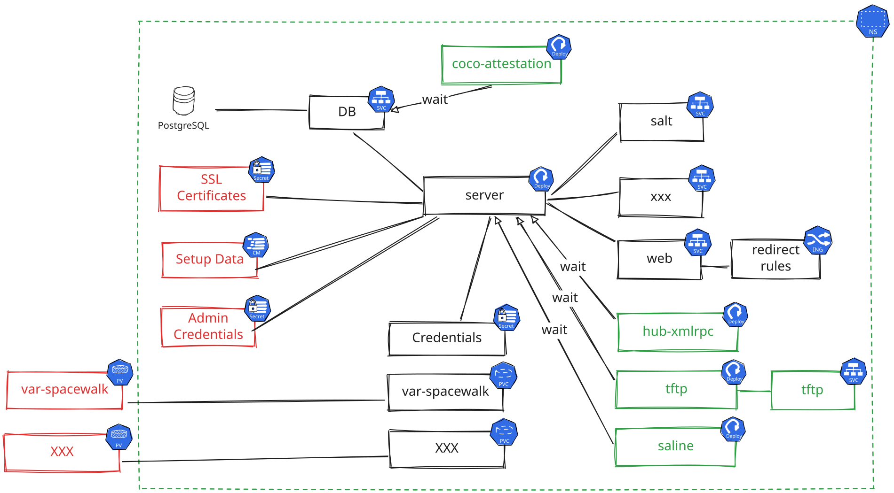
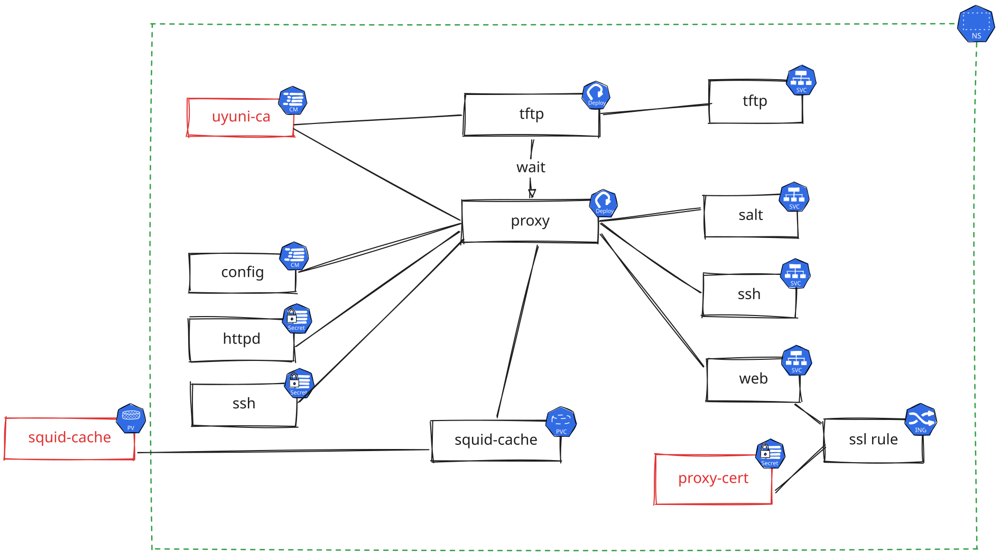

- Feature Name: server kubernetes deployment 
- Start Date: 2025-12-16 

# Summary
[summary]: #summary

This RFC proposes adopting [Helm](https://helm.sh/) charts as the only mechanism for deploying Uyuni on Kubernetes clusters.
This approach is intended to replace previous deployment attempts (like operators or using `mgradm` with the Kubernetes API).

For an easier start, [RKE2](https://docs.rke2.io/) will be used as the reference Kubernetes distribution to deploy on.
This doesn't mean that other distributions are excluded, but will receive less attention, at least in a first phase.

To keep things simple, only new deployments on Kubernetes will be taken into account: migration from existing Podman setups is not planned.
The Helm chart encapsulates the necessary Kubernetes objects (Deployment, Services, Ingress, Persistent Volume Claims) to run the server, facilitating easier deployment and management for users with Kubernetes expertise.

**This proposal does not imply that the installation using `podman` containers should be abandoned.**

# Motivation
[motivation]: #motivation

- Why are we doing this?

Moving to Kubernetes is necessary to support users with the internal requirement to run all container-based applications on Kubernetes or who operate in mixed environments.
As a bonus an Uyuni server deployed on a Kubernetes cluster, using network volumes would bring easy recovery.

With the current state of the server containers, scalability won't be a goal for the Kubernetes deployments.
However, this will make it easier after future refactorings.

- What use cases does it support?

The typical use case is where the user already has Kubernetes skills and needs to deploy Uyuni to manage servers for applications that are not yet cloud-native ready.
In most of the cases there will be a separate team administering the Kubernetes cluster and the Uyuni administrators would just be users on it.

- What is the expected outcome?

The expected outcome is a helm chart to deploy the Uyuni server and a set of documentation and examples to use it.
The rationale behind this is that it is impossible to craft one helm to rule all the possible components combinations.
The optional components could be deployed by a helm chart embedding the Uyuni one.
To make this easier and for documentation purpose too, a Git repository with example helm charts would be prepared.

# Detailed design
[design]: #detailed-design

## Global design

Here is a diagram showing what components would be deployed.

* The red items are expected to be deployed by the user and won't be created by the server helm chart.
* The database could optionally be deployed by the user outside the server namespace: the `db` service will need to be configured with appropriate IP or FQDN in such a case.
* The green items are optional and can be enabled using the helm chart values. The number of replicas to run will be set as a value.

The user needs to expose non-HTTP TCP and UDP ports for the server to be fully functional.
This can be done is several ways, and will not be handled by the server helm chart to leave full flexibility to the user.
Possible solutions are:

* Setup traefik or nginx to route those ports. *This requires a configuration file to be dropped on a cluster node.*
* Use metalLB to route those ports.
* Use a gateway API implementation routing those ports.

*Note that TFTP is hard to expose through the NAT networks like the Kubernetes ones and requires the port to be exposed on the host network.*

The setup and upgrade temporary containers used in the `podman` installations until now will be dropped and their features are merged within the main server container.
The container image will have a new entrypoint looping through idempotent scripts located in `/docker-entrypoint-init.d` and then hands over PID1 to `systemd`.
**Idempotency is crucial here as those scripts are executed at every start of the container, not just install and upgrades!**

## Making it easier

There can be multiple deployment possibilities and the idea is to not limit them.
In order to make it easier for the user to deploy the server helm chart, a Git repository of example helm charts using the server ones will be provided.
At least the following cases need to be addressed:

* Using [cert-manager](https://cert-manager.io/) to generate SSL certificates.
  Multiple setups can be considered: self-signed CA, CA from an [OpenBao](https://openbao.org/) vault or step-ca / ACME / let's encrypt.

* Hard-coded third-party SSL CA encrypted using [sealed-secrets](https://github.com/bitnami-labs/sealed-secrets) or at least documentation on how to do it.

Those cases would use the database container from the core server helm chart as in the podman setup.
Other database deployments may be added to that repository at a later stage.

An other step to make the installation easier would be to provide [UI configuration for rancher](https://ranchermanager.docs.rancher.com/how-to-guides/new-user-guides/helm-charts-in-rancher/create-apps).

## Migration

Migration from an existing server deployment is a complex topic and will not be tackled in a first iteration: only new deployments will be handled.

## Sharing scripts

All the setup scripts are currently generated by `mgradm` itself.
This would mean to duplicate those scripts in the helm chart and would be error prone.
In order to avoid such a situation, the scripts generated by `mgradm` will be moved into container images like the server one, or specific images if needed.

## Proxy SSL certificates

When creating a proxy configuration, the user needs to provide either the CA key, certificate and password or third-party certificate matching the proxy FQDN.
In the case of a Kubernetes deployment, only the later would be possible.
Even for podman deployments, the server container should not be the one responsible for certificates generation.

See [issue uyuni-project/uyuni-tools#419](https://github.com/uyuni-project/uyuni-tools/issues/419) for a solution to this problem for podman.

In the Kubernetes case, the proxy certificate generation will be left to the PKI tool: the secret would then be created directly on the proxy.
This could be handled with cert-manager on the proxy cluster using the same step-ca issuers than on the server, or getting the CA from a shared vault.

Here are the components of the proxy shown on a diagram to highlight what will be required.
Not that only the squid cache will be kept as the others can be easily recreated at each start.

## Test suite changes

Since the test matrix will blow up and the number of persons taking care of the CI won't increase accordingly, the test suite will need some changes to test Kubernetes deployments.
There is no need to run the full test suite on Kubernetes, just deploy a server, a proxy and a client and verify the connectivity and that all components are up and running.
Such a smoke test would run much faster and could be run an different setups more easily.

**The assumption here is that the features would be tested on a podman deployment and wouldn't differ on Kubernetes.**

Some benchmarks would also be needed to test and validate various storage or network back-ends more easily.
Those may or may not be included in the test suite, but still need to be provided for users to validate their back-end.

## Support tools

`supportconfig` won't be available for Kubernetes clusters.
The data need to be gathered with tools from the Kubernetes or Rancher ecosystem and extended to extract the data from the server.
May be some of the tools in Rancher's [support-tools](https://github.com/rancherlabs/support-tools) could help.

# Drawbacks
[drawbacks]: #drawbacks

The main drawback is the additional load for testers, release engineers, but also developers.
There are two reasons for this:

- this would be a second and different delivery mechanism.
- the test matrix of the Kubernetes components can explode very fast.
  Just for RKE2 there are four possible network stacks and several storage drivers.

Of course, a second deployment mechanism means more tests to perform, more possible CI failures to look into and more hardware needed.

Another important problem will be handling the bug reports: figuring out if the problem lies in Uyuni or in the Kubernetes setup will be tough.
This requires new tools to help diagnosing, but also that all developers and testers get up to speed with the Kubernetes concepts.

To simplify the problem, no conversion will be provided from podman to Kubernetes deployments.
This could refrain users from adopting this new way of deployment.

# Alternatives
[alternatives]: #alternatives

Other designs/options already tried and rejected:

- Custom operator: a proof of concept of custom Go operator has been developed [Repo](https://github.com/cbosdo/uyuni-operator).
  This approach is a huge task and requires a heavy maintenance.
  An other issue uncovered is that running such an operator would require a lot of privileges to set up everything.

- Helm Chart deployed by mgradm on a cluster node: this was the original attempt in the first containerized version of Uyuni.
  Running `mgradm` on a cluster node is not the way Kubernetes administration teams are working.
  The advantage of such a solution is that a lot of the Kubernetes complexity can be hidden in the tool, but this increases the complexity for developers.

- `mgradm` using the Kubernetes API: this is what is currently implemented in `mgradm`.
  This approach introduces a dependency on the Kubernetes API in `mgradm` and requires more synchronization with the latest Go version and Kubernetes API changes.

Not deploying the server on Kubernetes would not have any impact on current users since it only provides an alternative way to install Uyuni.
However this would rule out users who are already cloud-native.

# Unresolved questions
[unresolved]: #unresolved-questions

- How exactly to replace `supportconfig` on a Kubernetes cluster? This hasn't been researched yet.
- The server logs are not yet cloud native friendly: how should the monitoring stack look like? Do we need to first write all logs to the server container `stderr` or `stdout`?
  This question can be solved at a later time: it is still possible to exec in the container as on podman.
- Since the server runs a container with sysetemd, SELinux and AppArmor policies need te be added if not running as super privileged container.
  Should those be packaged or stay as documentation?
