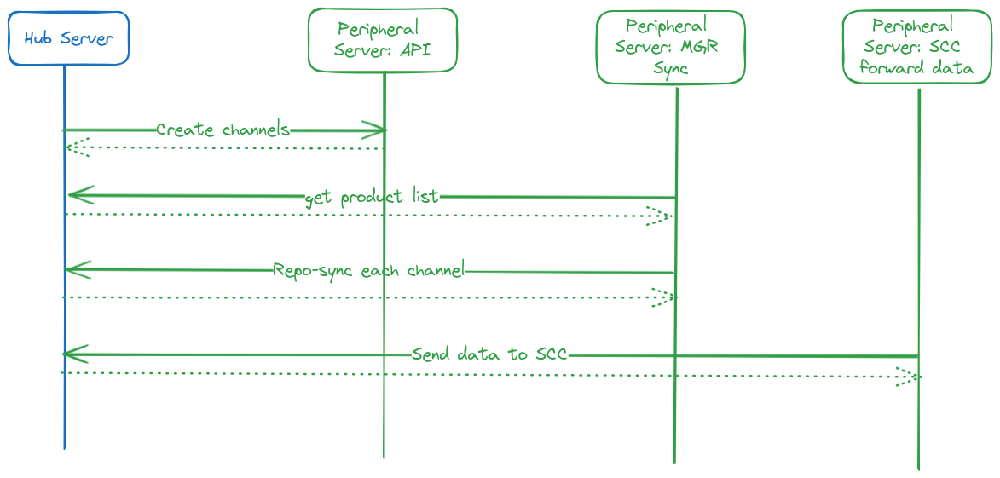

- Feature Name: Hub Online synchronization
- Start Date: (fill with today's date, YYYY-MM-DD)

# Summary
[summary]: #summary

A new online synchronization mechanism between SUSE Multi-Linux Manager HUB and peripheral servers which would be easier to use and provides automatic content synchronization by re-using existing stable mechanisms.

From the field we see that HUB deployments are made with connection between HUB and Peripheral servers, and a disconnected environment can be considered a different scope.

# Motivation
[motivation]: #motivation

With the Hub deployment architecture we provided a concept of centralized content management in SUSE Multi-Linux Manager server, which would then synchronize the data to the peripheral servers. To support it, a new inter-server-sync (ISSv2) tool was developed with the goal of replacing the existing mechanism.

The new ISSv2 was designed to allow the transfer of different data types, like software channels, configuration channels and images. The design makes it agnostic to database changes since it uses database metadata (if the new fields and tables follow the SUMA database conventions) and also gives support for fully disconnected environments.

ISSv2 has some constrains and limitation. This RFC proposes a different approach by re-using some existing features to provide a more complete solution, instead of trying to solve the issues with ISSv2.

## Existing Solutions

Let's make a more detailed analysis of each of the existing inter-server-sync solutions, with pros and cons.

### ISSv1

Based on an old code base, with declarative fields to be transferred (changes in database would mean changes in the transfer specification).

Cons:
- Only works with software channels
- Uses old synchronization protocol and metadata which needs extra maintenance
- Declarative fields to be transferred and serialized in XML.
- Changes in the database structure needs means adaptation in the field declaration
- Old code base

Pros:
- Simple usage, with initial configuration through the web-UI
  - Adding a channel needs to go through a command line tool
- Automatically channel + Products synchronization with mgr-sync Taskomatic job (delegates call to `mgr-inter-sync` cli tool)
- Cross organization synchronization

### ISSv2

Cons:
- Slow to export and import
   - Data transfer is not optimized: uses sql statements with a single transaction. The bigger the channel or more channels in one single export, the bigger the problem.
- If database schema doesn't follow the conventions, we need manual corrections
- A lot of manual steps to run and make it more efficient
- No UI support
- Hard to debug
- No good feedback during import
- No cross organization import (organizations needs to have the same name in source and target)
- Need to have all the cloned channels hierarchy to be able to use SP migration

Pros:
- Can transfer more than just software channels (images and configuration channels)
- Sync process is started from the server side
- Export once, import in parallel in all peripherals
- Support for fully disconnected environment

## Proposed solution

One of SUSE Multi-Linux Manager focus areas is synchronizing and managing content, especially RPM's. To do so, it synchronizes remote channels, apply filters to produce new channels (CLM) and makes these channels available to be consumed.

The overall idea of the Hub Online synchronization is to re-use the existing repo-sync mechanism and synchronize channels in the peripheral from the HUB published repositories (online connection between hub and peripherals servers).

In the first stage the focus will be synchronizing software channels, since it's the most problematic one in terms of performance and automation. However, we should be able to re-use the integration mechanism, since everything will be implemented through API.

We will need a mechanism to create the channels in the peripheral servers (vendor and customs ones) in the desired organization. Those channels need to have as content source the corresponding HUB server repository URL, with the correct authentication token. With this, repo-sync will take care of channel synchronization (proof of concept already tested).

Pros:
- Automatically update channel during the night with repo-sync/mgr-sync
- No need to have specific code adaptations in case of schema changes. It will be handled any way in repo-sync changes
- Rely on a stable specification: repositories metadata
- After initial configuration, all synchronization between hub and peripheral should be automatic and transparent
  - Only differences would be transferred
- Promote environments in CLM will automatically propagate changes to all connected peripherals
- Automatic creating of bootstrap repository done by repo-sync tool

Cons:
- All peripheral can start synchronizing at same time
  - Can be problematic if we have several peripherals performing full synchronization at same time. However we can configure the peripherals to run repo-sync in different hours and spread the load
  - This is only a problem in first sync, since subsequent sync only transfer differences

## Tools scope

With this solution we can change the scope of the existing tools. For ISSv1 this would be a full replacement, meaning this tool/feature can be removed in SUSE Multi-Linux Manager 5.1.

ISSv2 will continue to exist but with a change in its scope to be the tool to synchronize content between fully disconnected environments, and not to use in HUB set-ups. However, since this first implementation is not considering images and configuration channels synchronization, we still need to use it in HUB for these scenarios (should be temporary and replace with implementation in HUB Online Synchronization).

The new Hub synchronization would be focused on HUB online deployments to allow scale SUSE Multi-Linux Manager infrastructure. The only focus of this solution would be to work in scale and make it easier to use.

# Detailed design
[design]: #detailed-design

The solution focuses on re-using the repo-sync mechanism to synchronize channels from Hub server to peripheral servers. It will be described in several steps that aim to address how it will be used and how we can technically support it.

The main focus is to develop the integration between HUB server and peripherals through API only.
For the Hub/peripheral communication an new API might be useful to have a clear separation. This is needed when we want to make this API organization independent.
In the existing API the calling user is only allowed to operate on his own organization any maybe utilize "Vendor Channel" when he is a "SUSE Multi-Linux Manager Administrator".

Configuration should be pushed from the HUB to peripherals, to avoid the need of direct management of the peripherals.

For now this solution is focused on software channels only, but can be extended to synchronize more data types.

## Define connection between HUB and Peripherals

Each peripheral server can only have 1 Hub server (main). This will avoid dealing with problems like channel label conflicts between multiple main servers.
Configure a hub server on a peripheral server will block access to a set of menu items like: "Admin" -> "Setup wizard" -> "Organization Credentials" and "Products" and "PAYG Connection" (similar to what we already have for ISSv1).
We cannot add Hub connection if SCC credentials are defined, they should be mutually excluded.

### Option 1:

We follow a similar approach to what exists on ISSv1. On the hub side we can define multiple peripheral servers to connect to by providing the FQDN and an authentication token.
On the peripheral side we also need to define the Hub server FQDN and it would generate an Authentication token for he HUB.

To define this connection the API namespace `sync.hub` should be introduced which functions similar to the ISSv1 variants of `sync.master` and `sync.slave`.

### Option 2:

We need to establish a secure connection between Hub and Peripheral Server and automate the token exchange by using the XMLRPC API.
For this we create a Peripheral configuration on the Hub server.
It mainly defines the FQDN of the Peripheral and ask for username and password of a "SUSE Multi-Linux Manager Administrator" of the Peripheral Server.
In case the Root CA of the Peripheral Server differ from the one used on the Hub, the Root CA must be configured as well to allow a secure connection.

The XMLRPC API is used to create the hub configuration on the peripheral server and exchange the token.

### Finalize the Configuration

The authentication credentials works only for a special server-to-server API and is not connected to any user on the hub or peripheral server.
The new server-to-server API is required as the existing API is tied to the organization of the calling user. The new API should work organization independent.

After the peripheral server is connected and the Hub can connect via the server-to-server API, the final configuration can be triggered by the Hub.
This include:
   - Mirror credentials that the Peripheral Server can use to call the SCC endpoints on the Hub (See `Hub as a proxy for SCC data`). These credentials must be generated and set on Hub and Peripheral. This is required to authenticate and verify the authentication. Every Peripheral Server get a different credential.
   - The Mirror Credentials on the Peripheral Server is connected to the Hub Configuration. This is needed to tell the mgr-sync refresh process to connect to the Hub URL instead of SCC.
   - Create the Channels on the Peripheral Server which should be synchronized from the Hub.

More configurations might be needed at a later point when additional features will be added.

This should also be automated via taskomatic. Every change of the configuration can be deployed automatically every night to all peripheral servers.

#### The Peripheral Server system entry

Similar as in the Proxy case, we should have a "system" entry which represent the Peripheral Server.
This can be used to show special information or relations.

There are 2 different cases we need to consider.
   1. A host system exists with the same FQDN (podman running the container)
   2. No host system got registered (kubernetes case or podman where the host should not be registered at the Hub)

To handle these 2 cases, we should create a new base entitlement for "Container Workloads" (similar to Foreign Entitlement) and 2 add-on entitlements for Peripheral and Proxy Server.
In case we have a host system, we would not use the "Container Workload Entitlement" as base, but the "Salt Entitlement".
Only in case if no host is available, the "Container Workload Entitlement" would be used.

## Hub as a proxy for SCC data

The SUSE Multi-Linux Manager server needs a set of metadata to be able to operate. Currently that metadata is provided by SCC directly or, in the case of PAYG, provided by the cloud RMT infrastructure. We should also provide this data in SUSE Multi-Linux Manager HUB to be consumed by the peripheral servers.
The endpoints which are called are:
   - "/suma/product_tree.json"
   - "/connect/organizations/products/unscoped"
   - "/connect/organizations/repositories"
   - "/connect/organizations/subscriptions"
   - "/connect/organizations/orders"

The first two are required to provide full data. The URL in "/connect/organizations/products/unscoped" should be adapted to the URL pointing to the Hub Server.

The endpoint "/connect/organizations/repositories" should contain all repositories the asking peripheral server has access to. The URLs should point to the hub server and contain valid download tokens to access the hub.
We should also include custom channels in this repository list and implement the update of download URLs on the peripheral server for custom channels.

"subscriptions" and "orders" are not important for peripheral server and should just return an empty JSON list.

### Peripheral sending system data for SCC to the Hub

To be able to report all systems of a Hub scenario to SCC, we should also provide the endpoints for peripherals to send the system data needed by SCC (example of this is the minions registered and hardware information). Peripheral servers should send this data to the HUB instead of SCC, and the HUB server should consolidate it and send it to SCC.

These endpoints are:
   - DELETE /connect/organizations/systems/:id
   - PUT /connect/organizations/systems
   - PUT /connect/organizations/virtualization_hosts

This requires on the Hub enhancements to store the data from the different peripherals and send them together with its own data to SCC.

## Peripheral mapping organizations for software channels

On the hub side, for each peripheral we select channels to be synced (vendor or custom).
We allow freely to select from any hub organization.
Vendor Channels are created on the Peripheral side still as vendor channels.
For Custom Channels the target organization on the peripheral server can be freely selected.

A static organization mapping is not needed for software channels.

After the channels are defined it needs to be synchronized to Peripheral server.
The channel creation must use a mechanism to create them in the peripheral servers (vendor and CLM's) in the desired organization.
This should be implemented by using the server-to-server API which would automatically create the desired channels peripheral server.
Since we are making special channel creation (defined next), those API methods should be available to server-to-server communication only.

Steps needed to create the channels on peripheral:
   - In the peripheral create all needed channels (vendor and custom). Check how the product page is doing it. Make this mechanism also work for custom channels.
   - execute the refresh. The refresh connect to the SCC data endpoints on the Hub and populate all the data including the URLs with tokens for all the channels. These URLs will point to the Hub and have fresh tokens for authentication against the Hub. We need to enhance this mechanism, that also custom channels gets the URLs updated. The refresh does not include a repo-sync.

The full refresh and repo-sync can be triggered by an extra button.

Peripheral servers need to be configured with the flag `java.unify_custom_channel_management`, which will synchronize custom channels during the nightly mgr-sync process.

One important aspect is to recreate the "cloned from" connection between custom channels and vendor channels, so we can have SP migration and avoid the need to synchronize all channel clone chains (ISSv1 also does this implementation).

### API Integration

We will have 3 different API use cases for the channel creation and mapping.

1. **User API on HUB server:** Define channel mapping which content should be synchronized to each peripheral server.
2. **Hub-Peripheral data collector:** Hub needs to grab data from the peripheral, like organizations list. API methods already exists for this tasks.
3. **Hub-Peripheral channel creation:** Hub needs to call a peripheral API method to create channels in different organization.

For use case 1) we create a new XMLRPC API in `sync.hub` to support the channel mapping and define which channels should be synchronized per peripheral.

For use cases 2) and 3), we have a problem with API authentication and authorization.
Currently, each user is part of an organization, even if it has the role `sat_admin`. Since we need to make cross-organizations call we would need a new authentication/authorization mechanism or change the authorization for the existing API methods.

For this reason, the best approach would be develop a new API with a new authentication method to be used for server-to-server communication.
This API will contain all the needed API methods for hub content synchronization.
Some methods will be similar to other existing methods in the existing API, but with differences in authentication/authorization and maybe an extra parameter for the organization (since it would be extracted from the authenticated user).

The exact list of methods and parameters are seen as an implementation detail.
However for data creation (like create software channels, synchronize images, etc) we should have consider one single API method for each data type and be sure of is ACIDity.

What authentication should be used needs to be discussed. The goal is:
   - easy to setup
   - easy to exchange in case it got compromised
   - follow a good known standard

## Communication Workflow

## Integration with SUSE Manager 5.0

With SUSE Manager containerization we cannot register the peripheral servers as minions anymore. Several components were relying on having that.
In this section we will have a walk-through of those problems and how this solution can help solve them.

### HUB XML-RPC API

Component responsible for broadcasting API requests to peripheral servers. This component loads the peripheral servers that are registered on the HUB by looking at the minion entitlements.

With the proposed solution we can retrieve the list of the registered peripheral servers and avoid the peripheral server registration as minion.

### Inter-server-sync-v2

Will be replaced by this solution when fully implemented (including images and configuration channels). It will continue to exist but for disconnect set-ups only.

### Uyuni-config formula

This proposal doesn't address any of the issues with the configuration formula.

### HUB Report Federation

Reporting database information is collected using a salt state to get the report DB connection information.
With this solution we can replace the mechanism by an API call to the peripheral server which would return the needed information, and in this way remove the need to minion registration.

## Future Steps

This implementation sets the foundations to add more online content synchronization through the API, like configuration channels, images or activation keys.
this section will define a initial approach to make it possible. It's not as details as the proposed solution, since it's out of implementation scoped for this RFC and is described to give a full solution picture.

### Configuration channels

All data for configuration channel are save in the database and then materialized in disk to be used by salt. The source of true is the database information and the disk materialization is automatic if API methods are used.

In the HUB server we can collect which configuration channels that should be synchronized to each peripheral. Configuration channel are attached to a organization and they should be part of the organization mapping selection.
It's label behave in a different way when compared to software channels: we can have the same label in different organizations.

A new taskomatic Job can be created to synchronized data from HUB server to peripherals which should run automatically once per day during a low usage time.

The existing API methods under namespace `configchannel` cannot deal with cross organization mapping. To overcome it we have two options:
   - Develop a new endpoint to create and update channels with server-to-server authentication and the possibility to defined the target organization. Besides organization identifier, all business logic should be the same as the API namespace `configchannel`.
   - Collect organization admin credentials (user+password) on the HUB, and use the existing API. The downside is that it's more fields to be collected and managed.

### Images

For images metadata and pillar information are saved on the database. Images are store on disk but accessible through http(s). Images are associated to a Organization but it's IS is unique across installation.

To copy data from one SUSE Multi-Linux Manager server to another we would need to use several API calls and http(s) calls. Some data cannot be imported using the API, like package list information.

An implementation example is available from the community [link](https://github.com/uyuni-project/contrib/blob/main/os-image-tools/osimage-import-export.py).

Communication can be done from the HUB to the peripheral server to synchronize all the necessary data.

### Activation Keys

Activation keys are part of a organization and need to be mapped to peripherals at a organization mapping level. Similar to Configuration Channels we have API methods to create and update activation keys (namespace `activationkey`). However the API methods doesn't have the ability to do cross organization mapping.

The same two options are available: New API endpoints or collect organization administrator credentials.

### Special Requirements for the Hub/Peripheral relation

We have the use case that the operators of hub and peripheral server are not the same company. In this case the hub is only used to provide content to the peripheral and no data should be flowing in the other direction. This has several implications:

   - The Hub and the Peripheral Server may use different Root CAs. To establish trusted TLS connections, Root CAs must be exchanged during the on boarding process.
   - The report database synchronization must be optional and should be configurable
   - The peripheral server maybe not be managed by the Hub
   - sending SCC Data from the peripheral to the hub must be optional as well

## Synchronization failing scenarios

We will bi-directional communication between Hub server and peripheral servers:

1. **Peripheral to HUB:** Download packages when running `spacewalk-repo-sync`
2. **HUB to Peripheral:** API call(s) to create software channels structure and in the future synchronize configuration channels, images and activation keys.

Both synchronizations should happen automatically. For 1) it's already automated in taskomatic with `mgr-sync-refresh-default` task. for scenario 2) we would need to develop a new taskomatic task running on HUB server.

If a peripheral server is unreachable the new taskomatic task should retry to apply the desired configurations in the next execution.

In case HUB server is unreachable during repository sync, the next execution of the task should retry the synchronization and should be able to recover from the problem as soon HUB server gets available again.

# Drawbacks
[drawbacks]: #drawbacks

- Full synchronize a high number of peripherals at same time can overload the HUB server
  - After the first full synchronization it should not be a problem
  - One Peripheral can manage up to 10.000 minions. If we add 10 peripherals we would be able to manage 100.000 minions (more than our biggest customer)

# Alternatives
[alternatives]: #alternatives

- Create a new UI and use ISSv2 to synchronize data
- Solve the existing and known problems of ISSv2

# Unresolved questions
[unresolved]: #unresolved-questions

- Q: How to deal when channel mapping is  removed at hub configuration?

  A: Channel should stay in peripheral but will not get more updates.
- Q: How to deal with channel delete on HUB?

  A: Channel should stay in peripheral but will not get more updates.

