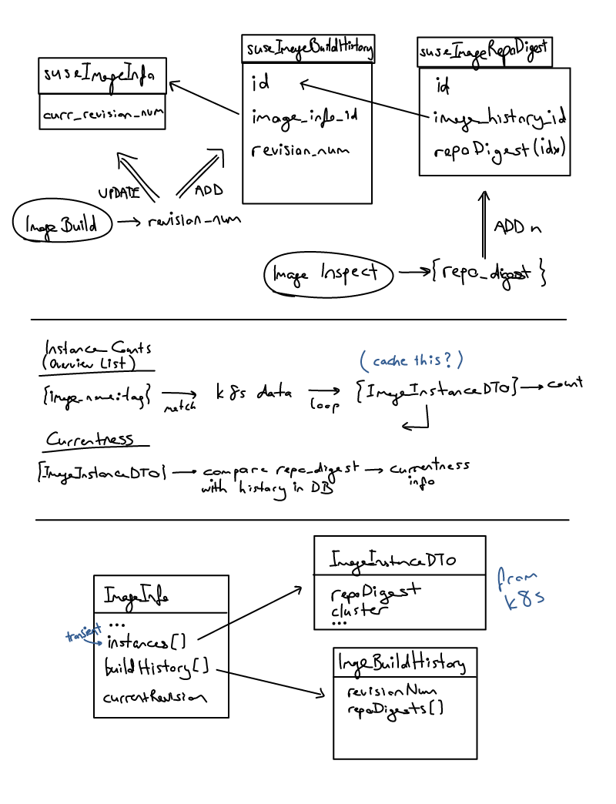

- Feature Name: Kubernetes integration
- Start Date: 2017-07-16
- RFC PR: (leave this empty)

# Summary
[summary]: #summary

This describes the initial implementation of retrieving image information from a Kubernetes cluster.
Initially we'll focus on CaaSP as a Kubernetes implementation.

# Motivation
[motivation]: #motivation

This is driven by the need to integrate with the new CaaSP product.

# Detailed design
[design]: #detailed-design

## Scope

This covers just the initial implementation of the Kubernetes integration. More specifically:
* store information about the Kubernetes endpoints and authentication information
* identify SUSE Manager built images that are running in the Kubernetes cluster
* retrieve information about the images running in the cluster and expose this information to the user

## Implementation

### Connection to Kubernetes

SUSE Manager will use the Kubernetes API and it will store authentication information. The authentication methods
supported initially are:

* client certificate
* user & password

The authentication information will be provided by the user by uploading a `kubeconfig` file.

### Matching Kubernetes containers with SUSE Manager built images

SUSE Manager must be able to match Manager built images to containers running a Kubernetes cluster.

This will be achieved by matching the `RepoDigests` of the Docker image to the `Image ID` of the
 Kubernetes container.

The `Image ID` must have the `docker-pullable://` prefix in order for the matching to work.

If the `docker://` prefix is present then the content of the `Image ID` will match the `Id` field of the Docker image.


```bash
docker inspect registry.example.com/kubernetes-test:latest
```
```json
[
    {
        "Id": "sha256:edde377d56efa538439845ee6cbcc02a3cc0db98994749886adace4f14a2b19e",
        "RepoTags": [
            "registry.example.com/kubernetes-test:latest"
        ],
        "RepoDigests": [
            "registry.example.com/kubernetes-test@sha256:ea40a5d3703a556f0be297cb87504b1ef51f011c5c433402da70563ae256235c"
        ]
        ...
    }
]

```

```bash
kubectl describe pod kubernetes-test-310237000-5wkb7
```
```
Name:           kubernetes-test-310237000-5wkb7
...
Containers:
  kubernetes-test:
    Container ID:       docker://fec1667e5fe3a777141dc321fd14262a24f5bf159a259c079b1b7908c558db47
    Image:              registry.example.com/kubernetes-test:latest
    Image ID:           docker-pullable://registry.example.com/matei-kubernetes-test@sha256:ea40a5d3703a556f0be297cb87504b1ef51f011c5c433402da70563ae256235c
...
```

### UI changes


### Virtual Host Gatherer extensions

We already have the Virtual Host Manager which provides a way to gather information from foreign virtual hosts.
This can be extended to do a similar job for a Kubernetes cluster.

An additional module will be implemented that collects information about the nodes of a Kubernetes cluster.


### Database changes



#### suseImageBuildHistory (new)

Historical information about each image build triggered from SUSE Manager.

* id
* image_id REFERENCES suseImageInfo (id)
* image_name
* build_host
* action_id REFERENCES rhnAction
* created
* modified

#### suseImageBuildDigests (new)

`RepoDigests` assigned to images by the Docker registry. These will be used for matching the images with the Kubernetes containers.

* id
* build_id REFERENCES suseImageBuildHistory (id)
* digest

#### suseImageInfo (existing)

New field to hold a revision number what will be incremented for each successful build:

* build_revision (new)

#### suseServerVirtualHostManager (existing)

* id (new)
* node_id REFERENCES suseVirtualHostManagerNodeInfo (id) (new)
* server_id (existing) will be changed to NULLABLE.

Restrictions:
server_id and node_id can't be both NULL at the same time

#### suseVirtualHostManagerNodeInfo (new)

Information about Kubernetes nodes. Will be filled with info provided by the Virtual Host Gatherer.

* id
* name
* arch
* cpu
* memory

# Drawbacks
[drawbacks]: #drawbacks

Why should we *not* do this?

# Alternatives
[alternatives]: #alternatives

What other designs have been considered? What is the impact of not doing this?

# Unresolved questions
[unresolved]: #unresolved-questions

Q: Where to store the kubeconfig file? Should we store it verbatim as uploaded by the user or only the selected context?
A: We will store the file as-is.

Q: Support all auth methods that the fabric8 library supports? Python virt host gatherer must support them as well.
A: python-kubernetes will be used in implementation.
